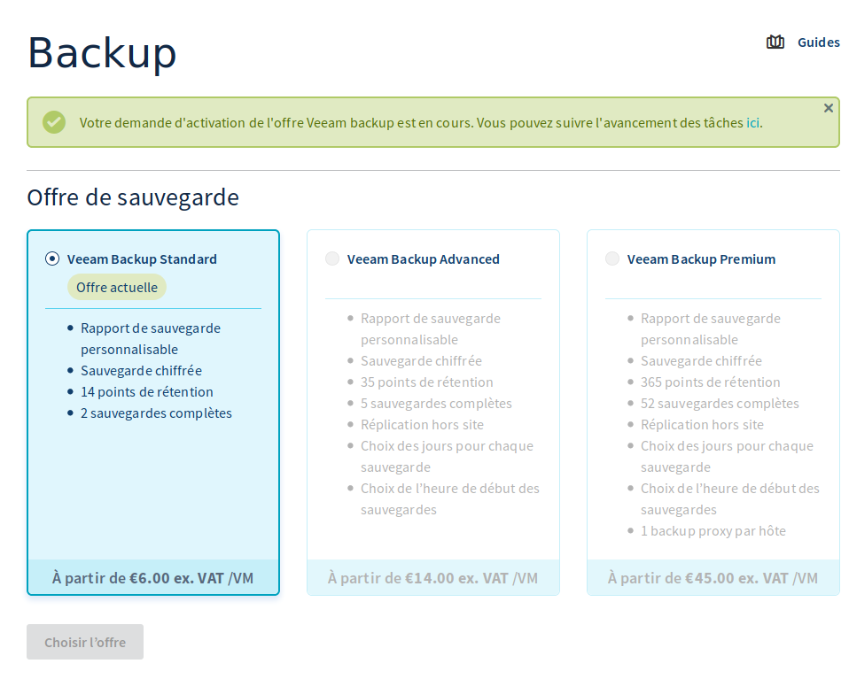
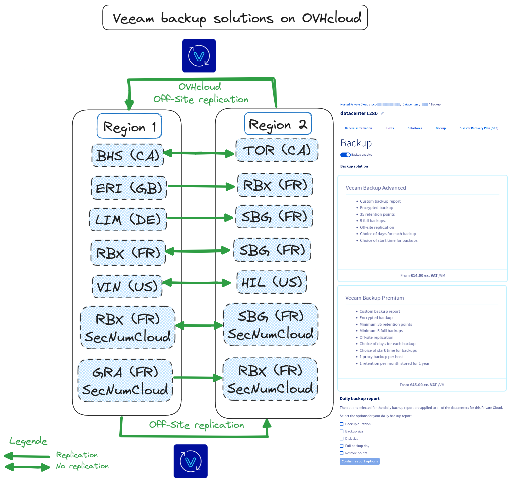
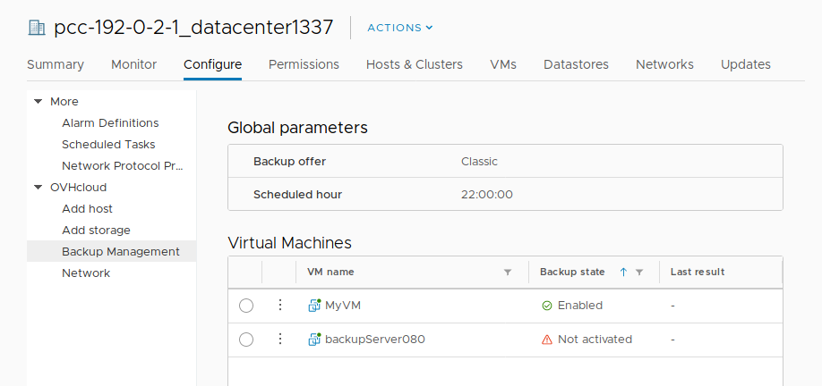
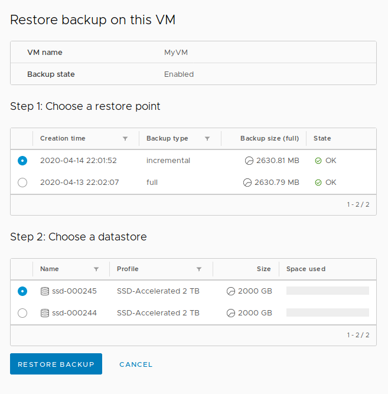
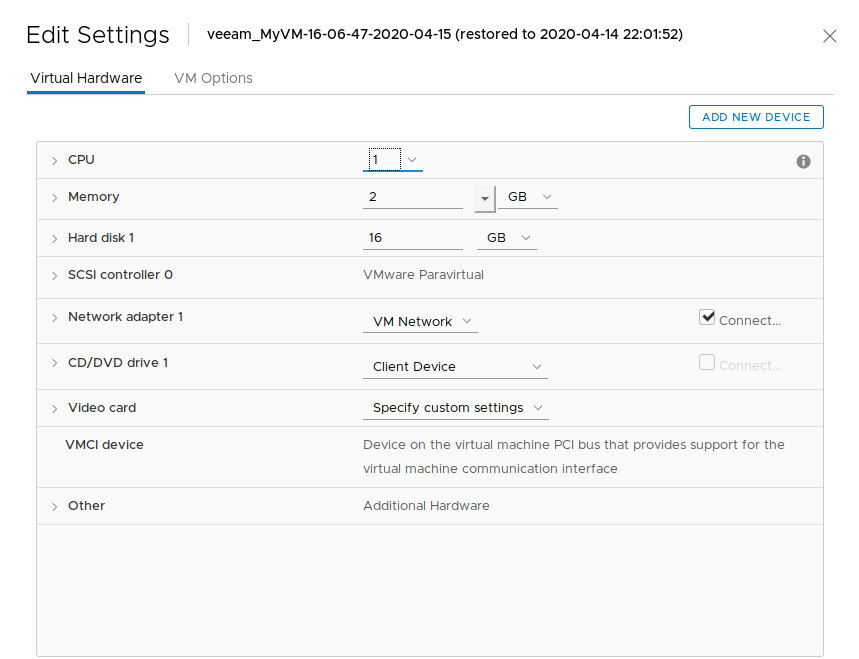
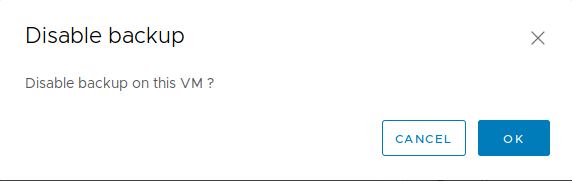

## Objectif

**L'objectif de ce guide est de vous expliquer comment déployer et utiliser l'option Veeam Managed Backup en quelques minutes.**

## Prérequis

* Posséder une offre [Hosted Private cloud](/links/hosted-private-cloud/hosted-private-cloud).
* [Donner le droit « Ajout de ressources »](/pages/hosted_private_cloud/hosted_private_cloud_powered_by_vmware/change_users_rights) pour le datacenter concerné à l'utilisateur depuis l'[espace client OVHcloud](/links/manager).
* Être connecté au client web vSphere managé.
* Avoir activé la [haute disponibilité (HA)](/pages/hosted_private_cloud/hosted_private_cloud_powered_by_vmware/vmware_ha_high_availability).
* Avoir activé le [Distributed Ressource Scheduler (DRS)](/pages/hosted_private_cloud/hosted_private_cloud_powered_by_vmware/vmware_drs_distributed_ressource_scheduler_new) sur le ou les clusters.
* Mettre en place la [gestion des licences Windows SPLA](/pages/account_and_service_management/managing_billing_payments_and_services/facturation_private_cloud#licences-windows)sur l'environnement VMware on OVHcloud.

## En pratique

Veeam est un éditeur de logiciel spécialisé dans les solutions de sauvegarde et de plan de reprise d'activité (PRA) dans des environnements virtualisés. L'offre Veeam Managed Backup s'appuie sur la brique logicielle Veeam Availability Suite pour vous fournir une solution de backup à la demande.

Les sauvegardes sont réalisées à l'aide d'une machine virtuelle (VM) située à l’intérieur même de votre infrastructure [Hosted Private cloud](/links/hosted-private-cloud/hosted-private-cloud). Les données sauvegardées sont, quant à elles, externalisées vers un espace de stockage indépendant, chez OVHcloud. Les sauvegardes s'effectuent la nuit, avec une durée de rétention en fonction du niveau d'offre choisi.

### Activer le service

La première étape consiste à activer le service depuis l'[espace client OVHcloud](https://www.ovh.com/auth/?action=gotomanager&from=https://www.ovh.com/fr/&ovhSubsidiary=fr). Pour cela, rendez-vous dans la partie `VMware`{.action} de l'onglet `Hosted Private Cloud`{.action}. Cliquez sur l'infrastructure VMware vSphere concernée, puis sur le datacenter souhaité. Choisissez l'onglet `Backup`{.action}.

{.thumbnail}

Choisissez le niveau de l'offre de sauvegarde puis continuez en cliquant sur `Choisir l'offre`{.action}.

Validez les contrats en cliquant sur `Activer le backup`{.action}.

Une notification vous confirme la demande d'activation :

{.thumbnail}

Une fois l'option installée, un e-mail de confirmation vous est envoyé et l'activation de la sauvegarde vous sera indiqué dans l'espace client, avec le rappel du niveau de l'offre choisi.

{.thumbnail}

Le service est dès lors utilisable directement depuis vSphere.

Vous verrez apparaître sur votre infrastructure vSphere une machine virtuelle correspondant au serveur de sauvegarde :

{.thumbnail}

### Activer la sauvegarde pour les machines virtuelles souhaitées

Maintenant que le service est en place, il suffit de réaliser les demandes de sauvegarde pour chaque machine virtuelle identifiée comme critique depuis le vSphere Web Client.

Sélectionnez le datacenter VMware, puis l'onglet `Configure`{.action} et choisissez `Backup Management`{.action} dans la section OVHCloud du menu.

{.thumbnail}

Dans la liste, sélectionnez la VM pour laquelle vous souhaitez activer la sauvegarde. Sur le panneau à droite, cliquez alors sur `Enable backup on this VM`{.action} pour lancer la demande d'activation.

{.thumbnail}

Une fenêtre de confirmation apparaît. Cliquez simplement sur `OK`{.action}.

{.thumbnail}

Veeam est informé de cette nouvelle demande et crée le travail de sauvegarde de la machine virtuelle. Chaque nuit, à partir de 22 heures (par défaut), une tâche de sauvegarde sera programmée selon le schéma de sauvegarde défini par l'offre.

Chaque jour, un e-mail contenant les statuts de l'ensemble des travaux effectués est envoyé à l'adresse du compte OVHcloud.

> [!warning]
>
> La suppression d'une machine virtuelle de votre inventaire ou d'un disque ne désactive pas le travail de sauvegarde relatif à cette machine. Celui-ci apparaîtra en erreur dans le rapport.
>  
> **Attention** : La limite sur les VMs doit être de 2 To pour pouvoir activer la sauvegarde.
> 
> Pour les offres **Advanced** et **Premium** la réplication entre régions de *Veeam Managed Backup* suit les schémas ci-dessous.
> 

Voici un schéma des régions vers lesquelles les régions de la `zone 1` sont répliquées ou non vers la `zone 2` :

{.thumbnail}

Vous avez ici la correspondance des zones répliquées dans ce tableau, avec des informations complémentaires :

| SecNumCloud  | Zone 1  | Zone 2  | Replication inter-sites |        Offres        | Comments                                                                                                                                                                       |
|:------------:|:-------:|:-------:|:---------------------------:|:--------------------:|:-------------------------------------------------------------------------------------------------------------------------------------------------------------------------------|
|      ❌       |  `BHS`  |  `TOR`  |             ✅️              | Advanced Premium | - Les régions de Montreal Beauharnois (BHS) et Toronto Cambridge (TOR) sont bien répliquées entre elles avec les offres Veeam Managed Backup Advanced et Premium.              |
|      ❌       |  `ERI`  |  `RBX`  |             ❌                | Advanced Premium | - Les régions de Londre Erith (ERI) et France Roubaix (RBX) ne sont pas répliquées entre elles avec les offres Veeam Managed Backup Advanced et Premium.                       |
|      ❌       |  `LIM`  |  `SBG`  |             ❌                | Advanced Premium | - Les régions d'Allemagne Limburg (LIM) et France Strasbourg (SBG) ne sont pas répliquées entre elles avec les offres Veeam Managed Backup Managed Backup Advanced et Premium. |
|      ❌       |  `RBX`  |  `SBG`  |             ✅️              | Advanced Premium | - Les régions de France Roubaix (RBX) et France Strasbourg (SBG) sont bien répliquées entre elles avec les offres Veeam Managed Backup Advanced et Premium.                    |
|              |         |         |                             |                      |                                                                                                                                                                                |
|      ✅️      |  `RBX`  |  `SBG`  |             ✅️              | Advanced Premium | - Les régions de France Roubaix (RBX) et France Strasbourg (SBG) sont bien répliquées entre elles avec les offres Veeam Managed Backup Advanced et Premium.                    |
|      ✅️      |  `GRA`  |  `RBX`  |            ❌                 | Advanced Premium | - Les régions de France Gravelines (RBX) et France Roubaix (RBX) ne se répliquent pas entre elles avec les offres Veeam Managed Backup Advanced et Premium.                    |
|              |         |         |                             |                      |                                                                                                                                                                                |
|      ❌       |  `VIN`  |  `HIL`  |             ✅️               | Advanced Premium | - Les régions USA de Washington DC Vint Hill (VIN) et Seattle Hillsboro Oregon (HIL) se répliquent bien entre elles avec les offres Veeam Managed Backup Advanced et Premium.  |

### Restaurer une sauvegarde

Sélectionner le datacenter VMware, puis l'onglet `Configure`{.action} et choisissez `Backup Management`{.action} dans la section OVHcloud du menu.

Dans la liste, sélectionnez la VM pour laquelle vous souhaitez restaurer une sauvegarde (celle-ci doit avoir un **backup state** à **Enabled**).

{.thumbnail}

Sur le panneau à droite, cliquez alors sur `Restore Backup`{.action} pour lancer la demande de restauration.

{.thumbnail}

Une nouvelle fenêtre s'ouvre alors pour créer le travail de restauration. Vérifiez bien le nom de la machine, sélectionnez la date de sauvegarde à restaurer et choisissez le datastore (espace de stockage utilisé comme cible de restauration). Cliquez sur `Restore Backup`{.action} pour lancer la restauration.

{.thumbnail}

Une fenêtre confirme alors que le serveur Veeam est informé de cette nouvelle demande et que la création du travail de restauration de la machine virtuelle a été effectuée.

{.thumbnail}

La machine est restaurée à côté de la machine source.

{.thumbnail}

> [!warning]
>
> Attention, la machine restaurée est connectée au réseau. Si vous démarrez celle-ci sans avoir désactivé la machine source, il risque d'y avoir un conflit d'adresse IP.
>

{.thumbnail}

Pour effectuer ces actions, vous pouvez sélectionner le datacenter dans votre inventaire, cliquer sur l'onglet `Configure`{.action}, puis choisir `OVH Backup Management`{.action}. Dans cette page, vous avez accès à la liste de vos travaux de sauvegarde, avec le nombre de backups et le dernier statut du travail.

### Désactiver la sauvegarde d'une machine virtuelle

Sélectionnez le datacenter VMware, puis l'onglet `Configure`{.action} et choisissez `Backup Management`{.action} dans la section OVHcloud du menu.

Dans la liste, sélectionnez la VM pour laquelle vous souhaitez désactiver la sauvegarde.

{.thumbnail}

Sur le panneau à droite, cliquez alors sur `Disable Backup on this VM`{.action} pour désactiver la sauvegarde.

{.thumbnail}

Confirmez ensuite la désactivation en cliquant sur `OK`{.action}.

{.thumbnail}

> [!warning]
>
> Il est possible de réactiver la sauvegarde à tout moment à partir du moment où la machine virtuelle est présente dans l'infrastructure.
>
> À noter que les sauvegardes effectuées restent disponibles pour la restauration jusqu'à l'expiration du délai de retention.
>

> [!primary]
>
> Suivez les mêmes instructions pour désactiver la sauvegarde d'une VM supprimée.
> Il est également possible de désactiver la sauvegarde temporairement et de la réactiver par la suite.
>

## Aller plus loin

Échangez avec notre [communauté d’utilisateurs](/links/community).
