## Objective

This guide explains how to configure encrypted backup jobs using the Veeam backup solution and the OVHcloud Key Management Service (OKMS).

## Requirements

- A [VMware on OVHcloud](/links/hosted-private-cloud/vmware) offer.
- Read the following guides:
    - [Integrating a KMS with VMware on OVHcloud](/pages/hosted_private_cloud/hosted_private_cloud_powered_by_vmware/vmware_overall_vm-encrypt).
    - [Getting started with OKMS](/pages/manage_and_operate/kms/quick-start).


## Instructions

### Step 1: Create a certificate in OKMS

You can create your access certificate in OKMS using either the [OVHcloud  API](/links/api) or the [OVHcloud Control Panel](/links/manager).

#### Option 1: Using the API

1. Generate the private key using the API (no CSR):

    > [!api]
    >
    > @api {v1} /okms POST / /okms/resource/{okmsId}/credential

2. Retrieve the certificate using a GET request:

    > [!api]
    >
    > @api {v1} /okms GET /okms/resource/{okmsId}/credential

    > [!primary]
    > This method is equivalent to selecting `I don't have a private key`{.action} in the [OVHcloud Control Panel](/links/manager) interface.
    > You may also submit a CSR if you already have your own private key.

3. Download the private key.

4. Download the certificate.

    > [!primary]
    > The downloaded private key is used to generate the `.pfx` file in the next step.
    > You don't need to import it manually into Veeam, but it is required to convert the certificate into a compatible format.
    > Make sure to store it securely.

#### Option 2: Using the [OVHcloud Control Panel](/links/manager)

1. In the [OVHcloud Control Panel](/links/manager), click `Hosted Private Cloud`{.action} then `Identity, Security & Operations`{.action} and finally `Key Management Service`{.action}. Select your KMS.

    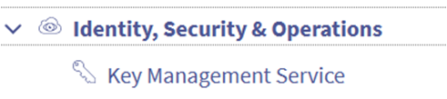{.thumbnail}

2. Select your KMS.

    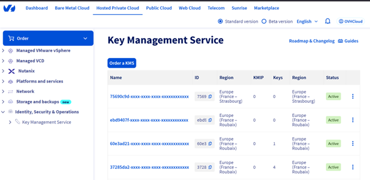{.thumbnail}

3. Open the `Access certificates`{.action} tab.

    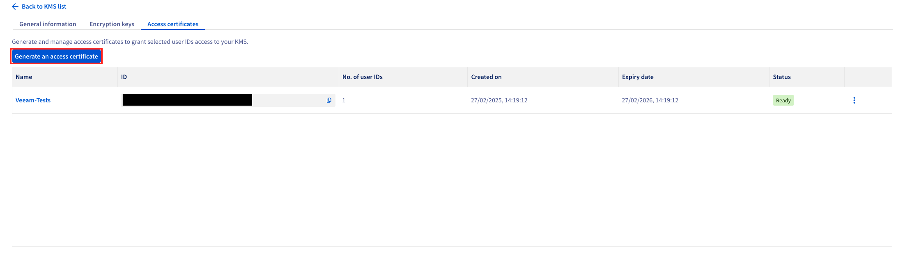{.thumbnail}

4. Click `Generate an access certificate`{.action}.

5. Fill in the required fields, then select `I don’t have a private key`{.action}.

    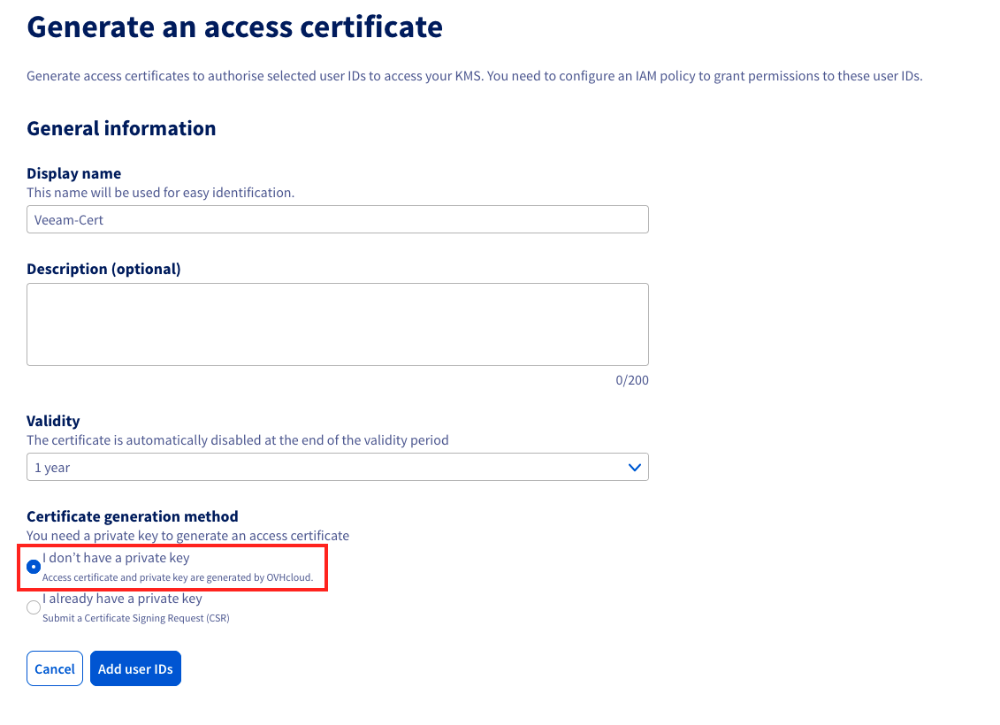{.thumbnail}

    > [!primary]
    > This is the same as generating a certificate without a CSR, like with the API.
    > You can also choose `I already have a private key` to generate a certificate using your own CSR.

6. Add user IDs to the certificate:
    - Click `Add user IDs`{.action}
    - Select the authorized users
    - Confirm to associate the certificate

    > [!primary]
    > This step is required for the certificate to work with Veeam.

7. Download the private key and the certificate.

    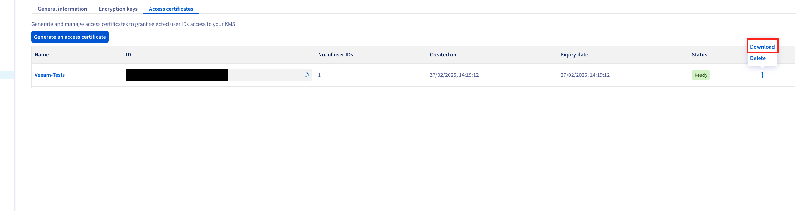{.thumbnail}

### Step 2: Convert the PEM certificate to PFX format

To import the certificate into Veeam, convert it to `.pfx` format using the command below:

```bash
openssl pkcs12 -export -out cert.pfx -inkey privatekey.pem -in certificate.pem
```

### Step 3: Import the certificate into the Veeam Windows Certificate Store

- Open the Windows Certificate Store on your Veeam server.
- Import the `.pfx` file generated in the previous step.
- Check the option to make the certificate exportable.

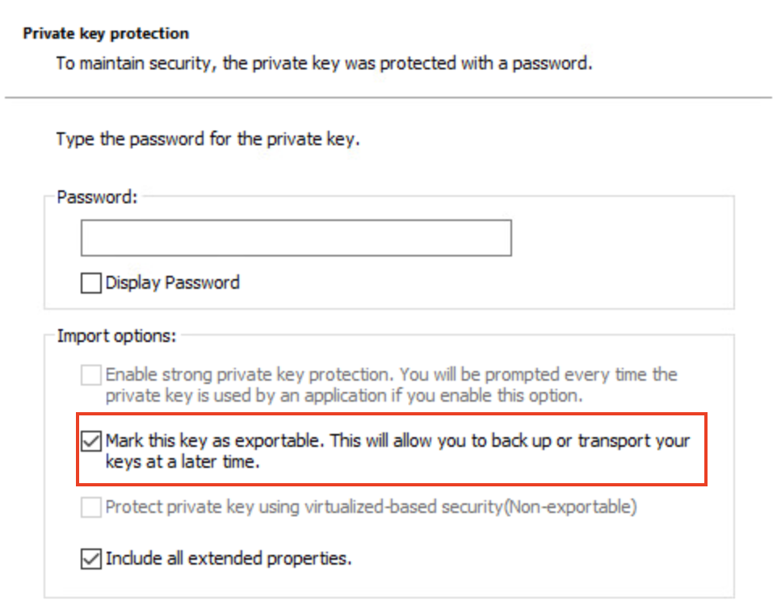{.thumbnail}

### Step 4: Register the KMS in Veeam

- Open Veeam Backup & Replication and go to `Credentials & Passwords`{.action}, then click `Key Management Servers`{.action}.

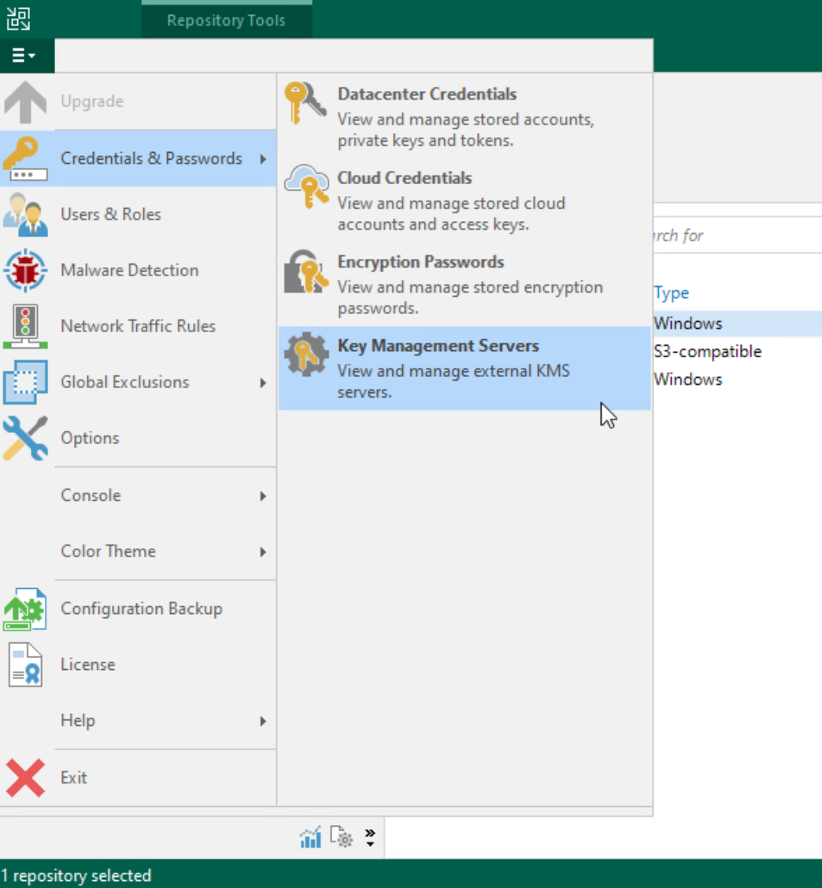{.thumbnail}

- Click `Add`{.action} to add a new KMS server.

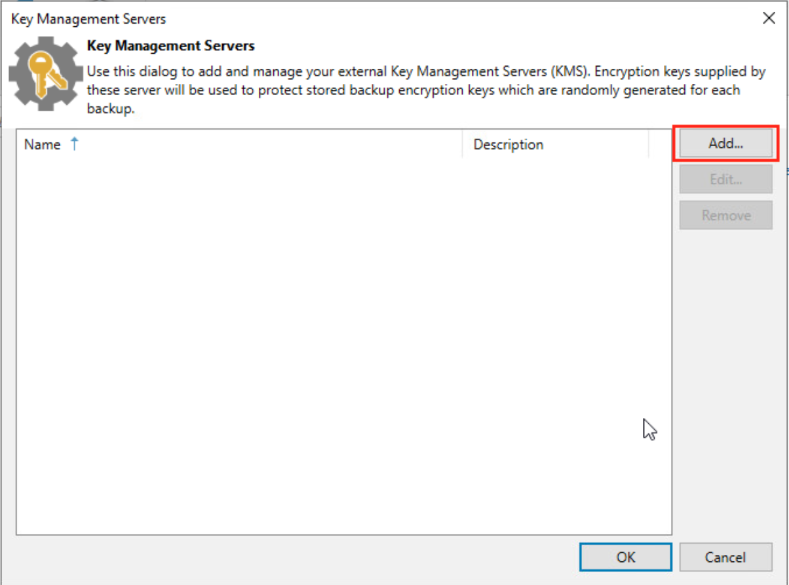{.thumbnail}

- Enter the following details:
    - Server address: `eu-west-rbx.okms.ovh.net`
    - Port: `5696`
    - Server certificate: `*.okms.ovh.net`
    - Client certificate: the `.pfx` file you just imported

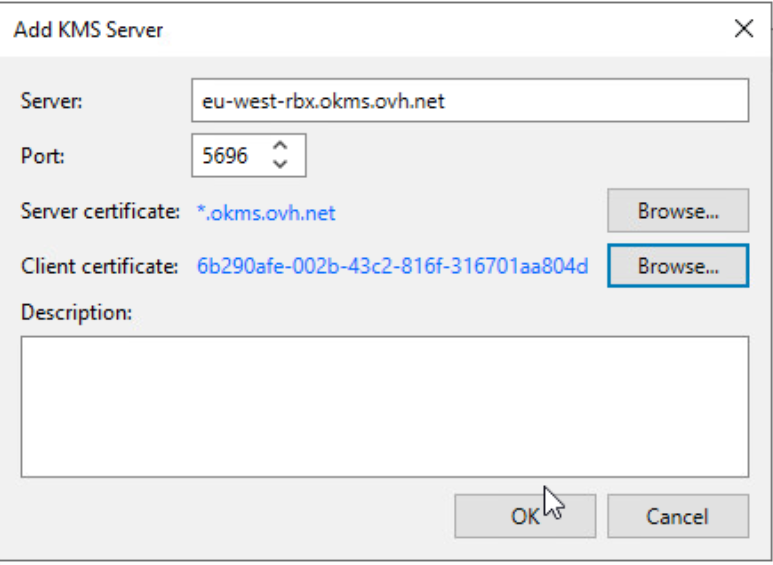{.thumbnail}

### Step 5: Retrieve the server certificate

To retrieve the server certificate from OKMS, run the following command:

```bash
openssl s_client -connect eu-west-rbx.okms.ovh.net:443 2>/dev/null </dev/null | sed -ne '/-BEGIN CERTIFICATE-/,/-END CERTIFICATE-/p'
```

### Step 6: Configure backup job encryption

- Register the KMS server in your Veeam Backup & Replication console.
- Select the desired backup job and enable encryption using the registered KMS.

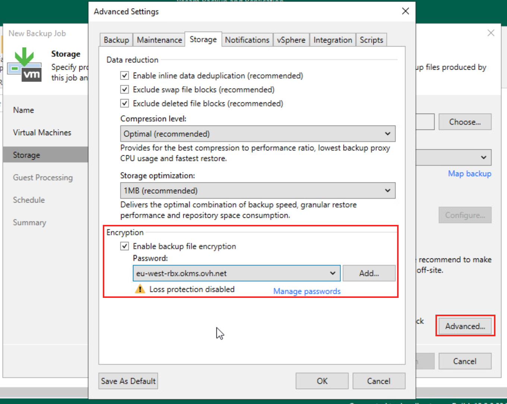{.thumbnail}

- Once the backup has run, a padlock icon appears next to its name.

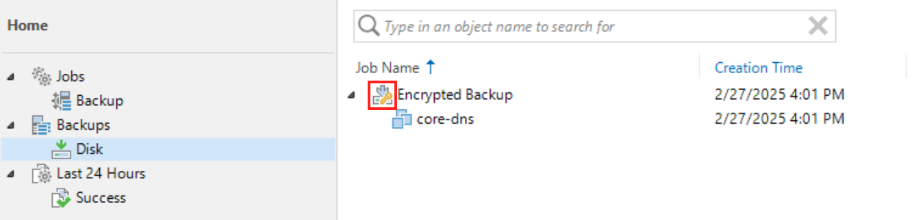{.thumbnail}

- If you encounter the error `Unsupported attribute: OPERATION_POLICY_NAME`, check the documentation or contact support.

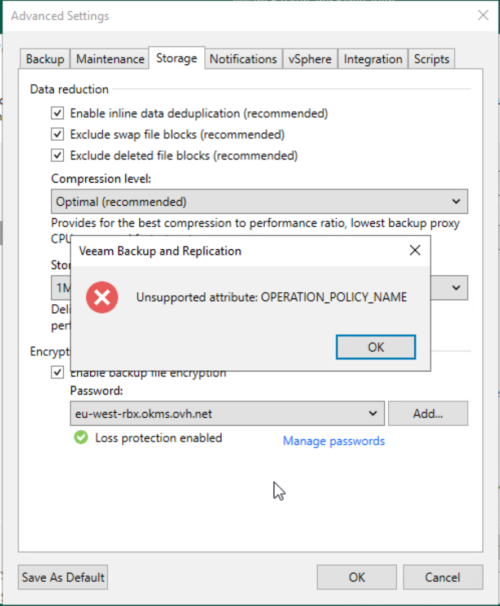{.thumbnail}

## Go further

If you need training or technical assistance to implement our solutions, contact your Technical Account Manager or click [this link](/links/professional-services) to request a quote and get personalized support from our Professional Services team.

Ask questions, share feedback, and interact directly with the Hosted Private Cloud team on our [Discord](https://discord.gg/ovhcloud) channel.

Join our [community of users](/links/community).
