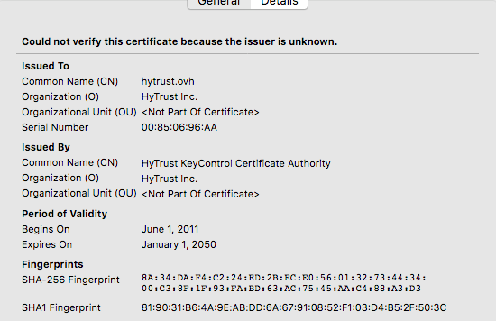
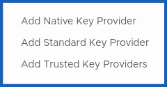
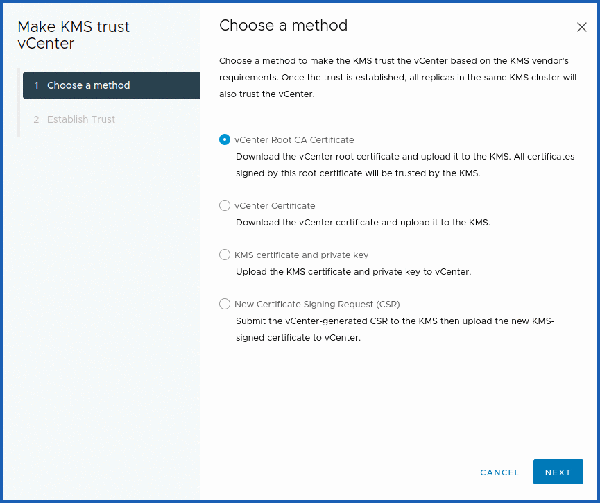
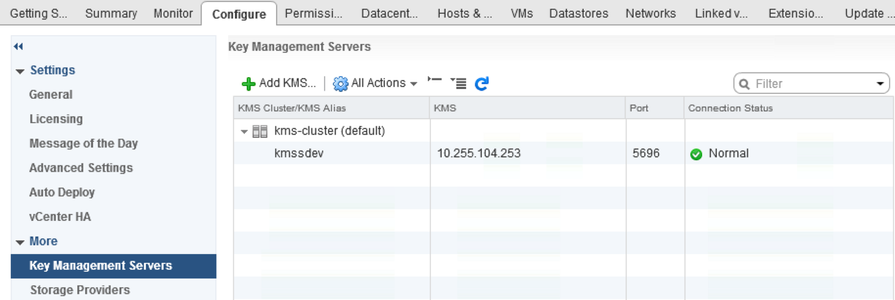
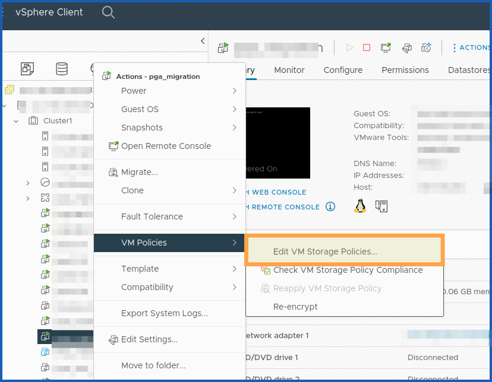
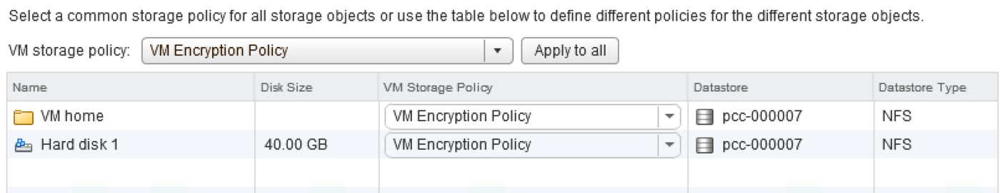
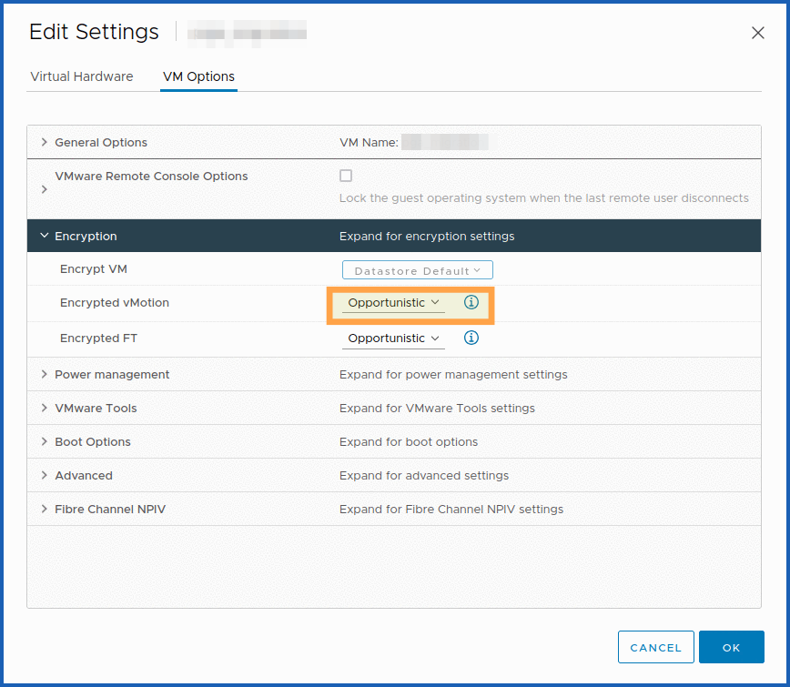
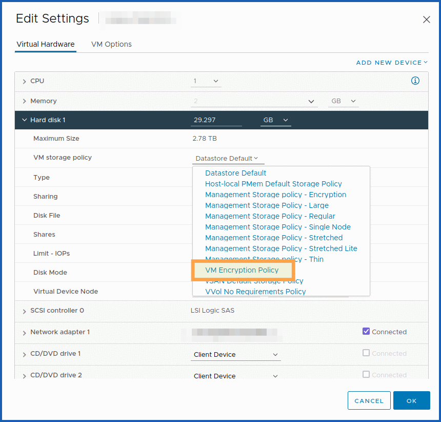
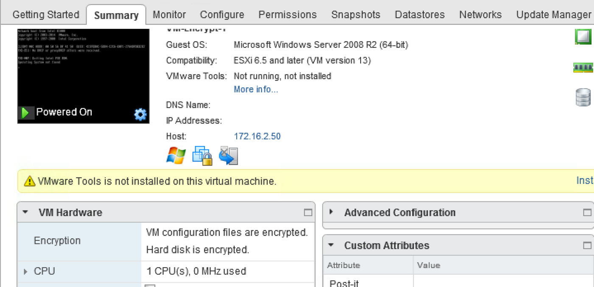

## Objective

**Find out how to implement encryption for your virtual machines with an external KMS.**

## Requirements

- You need to have signed up to a [Hosted Private Cloud](/links/hosted-private-cloud/vmware) offer.
- An external key server (KMS) compatible with **[KMIP](https://en.wikipedia.org/wiki/Key_Management_Interoperability_Protocol_(KMIP)) 1.1** and in the VMware [compatibility matrix](https://www.vmware.com/resources/compatibility/search.php?deviceCategory=kms&details=1&feature=293&page=1&display_interval=500&sortColumn=Partner&sortOrder=Asc).
- Access to the vSphere management interface.
- Virtual machines with a Hardware 13 version (minimum).

## Instructions

The purpose of this guide is to explain the details of implementing virtual machine encryption on the VMware on OVHcloud Hosted Private Cloud solution, using a storage strategy that uses a **Standard Key Provider** or external KMS.

### Retrieve Key Server Certificate Thumbprint (KMS)

Depending on your KMS, you can connect to the server using your browser. Then click `View Certificate`{.action} and `Thumbprint`{.action}.

{.thumbnail}

{.thumbnail}

Extract the value from the  `SHA1 Fingerprint` line.

Here is another method with OpenSSL:

```shell
openssl s_client -connect 192.0.2.1:5696 < /dev/null 2>/dev/null | openssl x509 -fingerprint -noout -in /dev/stdin
```

Here, it is the value to the right of the equal sign:

```shell
> SHA1 Fingerprint=7B:D9:46:BE:0C:1E:B0:27:CE:33:B5:2E:22:0F:00:84:F9:18:C6:61
```

### Register your key server (KMS)

#### Via the OVHcloud Control Panel

Log in to the [OVHcloud Control Panel](/links/manager) and go to the `Hosted Private Cloud`{.action} section.

Click `VMware`{.action} in the services bar on the left-hand side, then select the VMware service concerned.

From the main page of the service, click `Security`{.action}.

{.thumbnail}

Further down the page is the "**Virtual Machine Encryption Key Management Servers**" section. Click the `Add a new KMS server`{.action} button.

{.thumbnail}

In the new window that opens, enter the following information:

* The KMS IP address.
* The SSLThumbprint of the KMS Server you previously retrieved.

Confirm that you read this documentation, then confirm by clicking `Next`{.action}.

{.thumbnail}

A window displays the progress of the task.

#### With the OVHcloud API

Encryption features can be enabled [using the OVHcloud API](/pages/manage_and_operate/api/first-steps).

To retrieve your "serviceName", use the following API call:

> [!api]
>
> @api {v1} /dedicatedCloud GET /dedicatedCloud
>

To verify that encryption is not enabled yet, use this API call:

> [!api]
>
> @api {v1} /dedicatedCloud GET /dedicatedCloud/{serviceName}/vmEncryption
>

```json
>     "state": "disabled"
```

Then register the KMS:

> [!api]
>
> @api {v1} /dedicatedCloud POST /dedicatedCloud/{serviceName}/kms
>

To make this change, you need the following information:

* The serviceName previously retrieved.
* The external KMS IP address.
* The TLS fingerprint of the external KMS previously retrieved.

### Adding your key server (KMS) to the vCenter

#### About this part

**The vCenter Server creates a KMS cluster when you add your first KMS instance.**

- When you add the KMS, you are prompted to set this cluster as default. You can change this later.
- Once the vCenter has created the first cluster, you can add new KMS instances from the same provider to it.
- You can configure the cluster with at a minimum of one KMS instance.
- If your environment supports KMS solutions from different providers, you can add multiple KMS clusters.
- If your environment includes multiple KMS clusters and you remove the default cluster, you must define a different one. See "Setting the Default KMS Cluster".

#### Procedure

Initiate the manipulation by connecting to your Hosted Private Cloud with the vSphere web client.

Then browse your inventory list and select the vCenter concerned. Go to "Manage", then "Key Management Servers".

Click `Add > Add Standard Key Provider`{.action}.

{.thumbnail}

Then specify the KMS information in the configuration wizard that appears:

{.thumbnail}

Validate the certificate by clicking `Trust KMS`{.action}.

#### Importing KMS certificate

Most KMS providers require a certificate to [establish a secure connection](https://docs.vmware.com/en/VMware-vSphere/6.5/com.vmware.vsphere.security.doc/GUID-0212CEF2-7871-4E00-ADF2-0C71401D5E1A.html) with the vCenter.

From the vCenter on which you added the KMS server, select it. In "All options", click `Establish a trusted link with KMS`{.action}.

> [!warning]
>
> Ensure that the certificate is not encrypted with a password when you download it from the KMS. For example, if you create a user, create one without passwords and download the certificate for the KMS user.
>

{.thumbnail}

#### Check that the KMS is configured

Verify that the "**Connection Status**" corresponding to the KMS is in "Normal" mode.

{.thumbnail}

#### Modify the storage policy of "VM Encryption Storage"

Create a virtual machine. Once you have created it, right-click it. Click `VM Policies`{.action} then `Edit VM Storage Policies`{.action}.

{.thumbnail}

Select the virtual machine files and other hard drives that need to be encrypted.

{.thumbnail}

Ensure that the tasks were completed without errors.

> [!primary]
>
> If the KMS is not configured correctly and there are faults with the key exchange between vCenter and KMS, there will be a "RuntimeFault" error in the task with a "Cannot generate key" error message.
>

#### Encrypted vMotion

For vMotion, encryption works at the virtual machine level. For synchronization, 256-bit encryption keys are used.

vMotion traffic encryption works at the VM kernel level with the widely used AES-GCM (Advanced Encryption Standard-Galois Counter Mode) algorithm.

Then modify your virtual machine and click `VM Options`{.action}

You must select the options if your vMotion needs to be encrypted. There are three policies for encrypted vMotion:

|     Status      | Description                                                                                                                               |
|:---------------:|:------------------------------------------------------------------------------------------------------------------------------------------
|    Disabled     | - Off                                                                                                                                     |
| Opportunities  | - Encryption only if supported by the source host and ESXi target host. Otherwise, vMotion will not be encrypted                          |
|    Required     | - Encryption will be used                                                                                                                 |

{.thumbnail}

Moving machines between hosts is done by exchanging unique keys, which are generated and served by the vCenter server, rather than by KMS.

#### Configuration checks

Check that a small padlock is visible, and that the disk is correctly encrypted in your VM information.

Check your VM settings to ensure that your storage policy is the one that uses `VM encryption Policy`.

{.thumbnail}

{.thumbnail}

Finally, you can look at the tasks and events to get the final confirmation that the configuration worked.

## Go further

If you are having problems configuring your external KMS, please contact our [support teams](https://help.ovhcloud.com/csm?id=csm_get_help) or consider using an OVHcloud KMS (OKMS).

You can read the following guide, which details the procedure to follow: [KMS for VMware on OVHcloud - Solution and use cases for encrypting VMs](/pages/hosted_private_cloud/hosted_private_cloud_powered_by_vmware/vmware_overall_vm-encrypt).

Join our [community of users](/links/community).