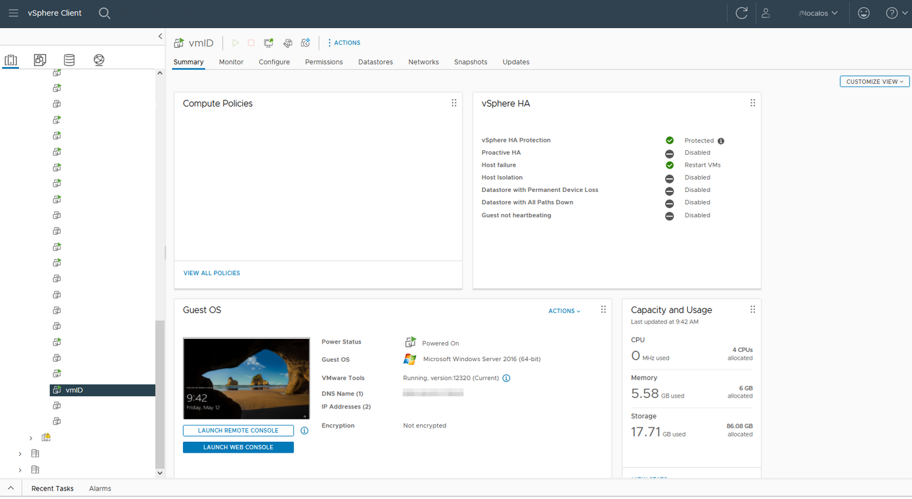
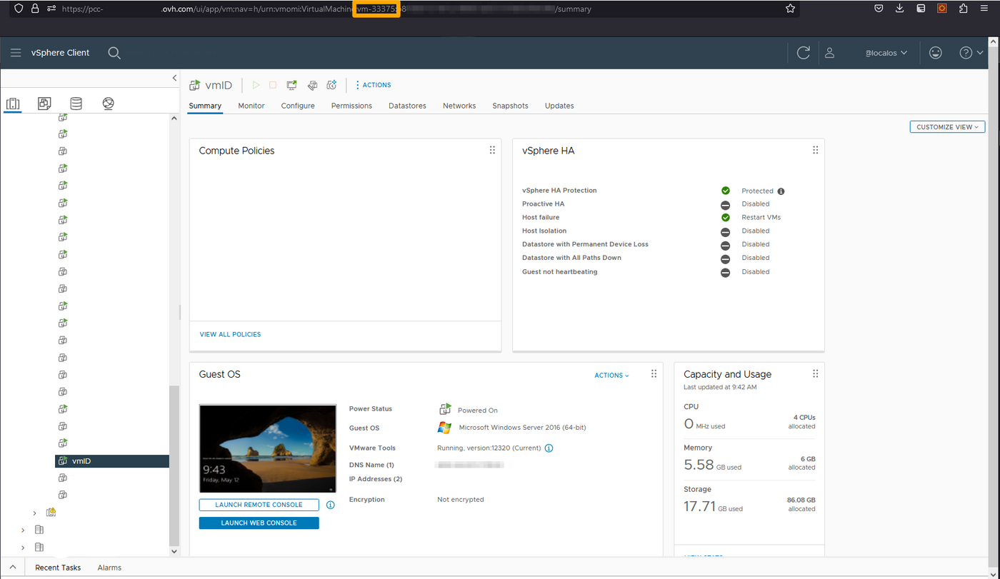
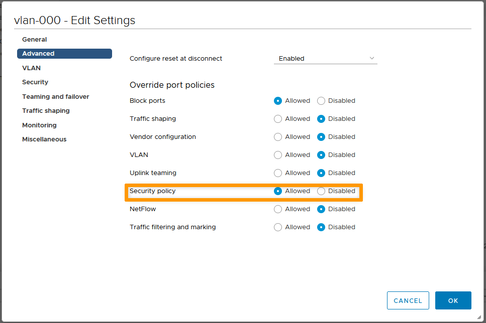
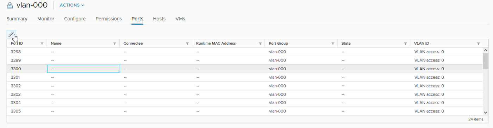

## Objective

Promiscuous mode removes any inbound filtering that the virtual machine network card can perform, so that the guest operating system receives all observed traffic on the network. By default, the virtual machine network card cannot operate in promiscuous mode.

It may be necessary in some cases to enable promiscuous mode for the proper operation of certain HA protocols such as Common Address Redundancy Protocol (CARP).

## Requirements

- a [Hosted Private Cloud infrastructure](https://www.ovhcloud.com/es-es/enterprise/products/hosted-private-cloud/)
- a user account with access to vSphere (created in the [OVHcloud Control Panel](https://www.ovh.com/auth/?action=gotomanager&from=https://www.ovh.es/&ovhSubsidiary=es))

## Instructions

A distinction should be made between two situations. Depending on the Distributed Virtual Switch (DVS) involved, the solutions will be different:

- dvs public (name: pcc-xxx-xx-xxx-xx_DCxxx-dvs, vmnetwork or vxlan)
- dvs vrack (name: pcc-xxx-xx-xxx-xx_DCxxx-vrack, vlan vrack)

### Public DVS

#### Retrieving information

Customers are now autonomous to perform this action through our API. The following API calls can be used.

First, retrieve the **vmId** and **datacenterId**. This information can also be obtained from vSphere.

**From the OVHcloud API:**

> [!api]
>
> @api {v1} /dedicatedCloud GET /dedicatedCloud/{serviceName}/datacenter
>

> [!api]
>
> @api {v1} /dedicatedCloud GET /dedicatedCloud/{serviceName}/datacenter/{datacenterId}/vm
>

**From vSphere:**

First, connect to your vsphere and select the VM from the list of VMs in the left tab:

{.thumbnail}

Once done, you can retrieve the **vmId** from the URL:

{.thumbnail}

#### Enabling promiscuous mode on a Virtual Machine

Use the following API call:

> [!api]
>
> @api {v1} /dedicatedCloud POST /dedicatedCloud/{serviceName}/datacenter/{datacenterId}/vm/{vmId}/enableCarp
>

Enter the following information:

- `serviceName`: name of your PCC
- `vmId`: vmID previously retrieved from vSphere or from the API
- `datacenterId`: previously retrieved from the API
- `macAddress`: the macAddress of the network interface of the VM where CARP needs to be enabled

#### Disabling promiscuous mode on a Virtual Machine

Use the following API call:

> [!api]
>
> @api {v1} /dedicatedCloud POST /dedicatedCloud/{serviceName}/datacenter/{datacenterId}/vm/{vmId}/disableCarp
>

#### Verifying if promiscuous mode has been activated on the Virtual Machine

Use the following API call:

> [!api]
>
> @api {v1} /dedicatedCloud POST /dedicatedCloud/{serviceName}/datacenter/{datacenterId}/vm/{vmId}
>

### vRack DVS

In this case, you can perform the manipulation directly from vSphere by following the procedure below.

#### Enabling promiscuous mode on a port in vSphere

To begin, you need to check that the DVS allows the possibility of having a different configuration on the port (by default the DVS one is applied).

To do this, right-click on the portgroup, click `Edit Settings`{.action}, then on `Advanced`{.action} and check that the `Security Policy` line is set to `Allowed`.

{.thumbnail}

You can then select the port where the VM is connected and click on the pencil icon at the top left.

{.thumbnail}

In the `Security` section, check `Replace` and change the security policy to `Accept` for all three options, if it is not already the case.

{.thumbnail}

#### Enabling promiscuous mode on an entire portgroup in vSphere

This manipulation should never be done on a public DVS, it is only possible on the vRack DVS.

It is possible to do the modification directly on the portgroup, this will have the advantage of applying the configuration to all ports (and thus avoid having to do it at VM creation/restoration).

However, this can be a security risk, as promiscuous adapters have access to packets, even if some of those packets are only received by a specific network adapter. This means that an administrator or root user in a virtual machine can potentially see traffic destined for other hosts or guest operating systems.

It is therefore important to do so with full knowledge of the circumstances.
In this case, simply right-click on the portgroup in question, then click on `Change settings`{.action}. Next, go to the `Security` section and change the security policy to `Accept` for all three options, if it is not already the case.

{.thumbnail}

## Go further

Join our community of users on <https://community.ovh.com/en/>.