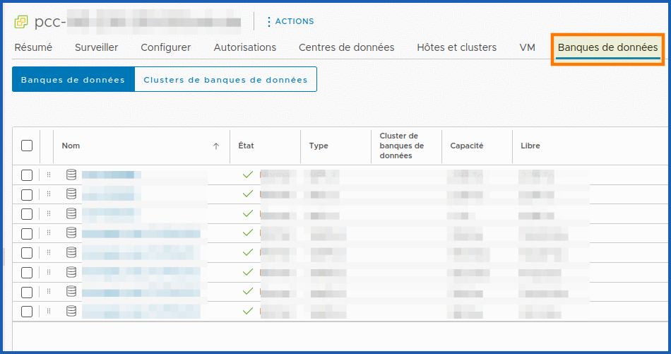
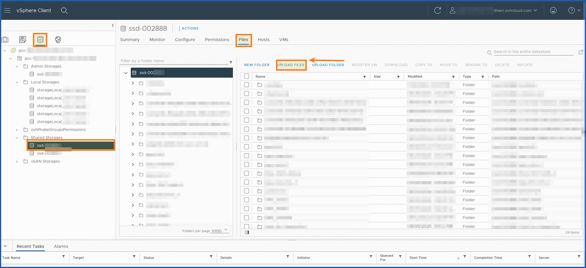

## Objectif

**L'objectif est d'uploader des fichiers (ISO, VMDK, OVA etc..) avec le client Web datastore vSphere managé.**

## Prérequis

- Être connecté à [l'espace client OVHcloud](/links/manager)
- Être administrateur technique de l'infrastructure [VMware on OVHcloud](https://www.ovhcloud.com/fr/enterprise/products/hosted-private-cloud/).

## En pratique

### Étape 1 - Comment accéder au repertoire de stockage

#### Via l'espace client

Suivez le guide suivant pour vous connecter l'interface web vSphere : [Se connecter à la console web vSphere](/pages/hosted_private_cloud/hosted_private_cloud_powered_by_vmware/vsphere_interface_connexion)

### Étape 2 - Upload d'un ISO dans le datastore

Cliquez sur `Stockage`{.action} dans l'inventaire VMware Host Client et cliquez sur `Banques de données`{.action}

{.thumbnail}

{.thumbnail}

Vous retrouverez l'ensemble de vos disques de stockages au sein de votre `Banque de données` et de votre `Clusters de banque de données`.

{.thumbnail}

Cliquez sur le disque sur lequel vous voulez importer des données, puis sur `Fichier`{.action} et `Explorateur de banque de données`{.action}

Sélectionnez la banque de données dans laquelle vous souhaitez stocker le fichier.

(Facultatif) Si vous n'avez pas de préférence, cliquez sur `NOUVEAU DOSSIER`{.action} pour créer un répertoire de banque de données où stocker vos fichiers depuis votre datastore `pcc-XXX-XXX-XXX-XXX`

Vous avez plusieurs choix :

- `Nouvel hôte et dossier de cluster`
- `Nouveau dossier réseau`
- `Nouveau dossier de stockage`
- `Nouvelle VM et dossiers de stockage`

Vous aussi la possibilité de les créer avec un clic droit `pcc-XXX-XXX-XXX-XXX_datastoreXXX > Clic Droit > Nouveau dossier`{.action} ou depuis la section `SSD-XXX > Banque de données > Fichiers > Nouveau dossier`{.action}.

Une fois votre arborescence créée, sélectionnez le répertoire cible et cliquez sur `TÉLÉCHARGER DES FICHIERS`{.action} ou `TÉLÉCHARGER DES DOSSIERS`{.action}

Vous devez disposer des droits suffisants pour effectuer d'autres actions, tel que `DÉPLACER VERS`{.action} ou `COPIER DANS`{.action} par exemple.

{.thumbnail}

Localisez l'élément à télécharger depuis votre ordinateur local (un fichier `XXX.iso`) et cliquez sur `Ouvrir`{.action}

Le fichier ISO se télécharge dans la banque de données sélectionnée.

(Facultatif) Actualisez l'explorateur de fichiers de la banque de données pour afficher le fichier téléchargé dans la liste.

Cliquez sur `Fermer`{.action} pour quitter le navigateur.

Vous pouvez ainsi lancer cette ISO depuis un périphérique CD/DVD au sein de vote VM et lancer l'installation de l'OS en suivant le processus d'installation. Il est cependant recommandé d'utiliser des modèles de déploiement OVHcloud ou des clones de VM templaté par vos soins.

## Aller plus loin

Si vous avez besoin d'une formation ou d'une assistance technique pour la mise en œuvre de nos solutions, contactez votre Technical Account Manager ou rendez-vous sur [cette page](/links/professional-services) pour obtenir un devis et demander une analyse personnalisée de votre projet à nos experts de l’équipe Professional Services.

Posez des questions, donnez votre avis et interagissez directement avec l’équipe qui construit nos services Hosted Private Cloud sur le [channel Discord dédié](<https://discord.gg/ovhcloud>).

Échangez avec notre [communauté d'utilisateurs OVHcloud](/links/community).
