## Objectif

**L'objectif est de manipuler des données dans un dossier de votre banque de données vSphere.**

## Prérequis

- Être connecté à [l'espace client OVHcloud](/links/manager).
- Être administrateur technique de l'infrastructure [VMware on OVHcloud](/links/hosted-private-cloud/vmware).
- Si vous utilisez IAM, vérifiez bien que vous disposez des droits, rôles et actions nécessaires pour téléverser des fichiers ou créer des répertoires dans le datastore. Pour plus d'informations, consultez le guide « [IAM pour VMware on OVHcloud - Présentation et FAQ](/pages/hosted_private_cloud/hosted_private_cloud_powered_by_vmware/vmware_iam_getting_started) ».

## En pratique

> [!primary]
> 
> Ce guide remplace la méthode SFTP, devenue obsolète : [Se connecter en SFTP](/pages/hosted_private_cloud/hosted_private_cloud_powered_by_vmware/sftp_connexion).
>

### Étape 1 - Téléverser avec le client HTML

#### Accéder au datastore

Connectez-vous à l'interface web vSphere, en vous aidant si besoin du guide « [Se connecter à la console Web vSphere on OVHcloud](/pages/hosted_private_cloud/hosted_private_cloud_powered_by_vmware/vsphere_interface_connexion) ».

Vous devez ensuite accéder aux repertoires sur lequel vous voulez stocker vos fichiers (ISO par exemple). L'objectif étant de créer une arborescence afin de retrouver facilement vos éléments au sein de votre vSphere managé.

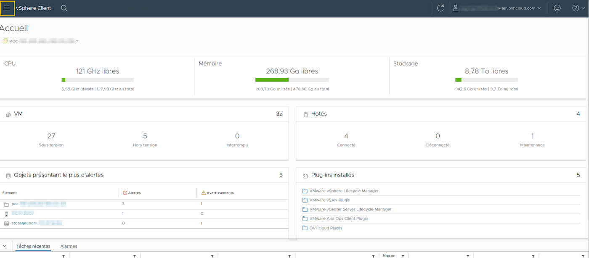{.thumbnail}

#### Téléverser des fichiers

Vous disposez de 2 façons d'y accéder, libre à vous de choisir celle qui vous convient le mieux :

**1\. Depuis le menu `Inventaire`{.action} :**

|                                        **Images**                                         | **Étapes**                                                                       |
|:-----------------------------------------------------------------------------------------:|:---------------------------------------------------------------------------------|
| 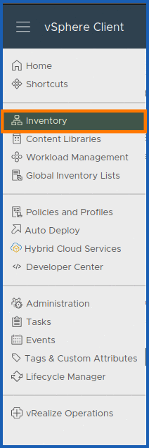{.thumbnail}      | - Cliquez sur `Inventaire`{.action}.                                         |
| 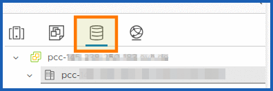{.thumbnail}<br/> 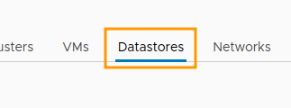{.thumbnail}| - Depuis `pcc-XXX-XXX-XXX-XXX.ovh.XX`, cliquez sur `Banques de données`{.action}. |

Vous retrouvez alors l'ensemble de vos banques de données (datastores) listées.

Cliquez sur votre banque de données pour voir apparaitre une section `Fichiers`{.action} dans laquelle s'ouvre votre fenêtre automatiquement.

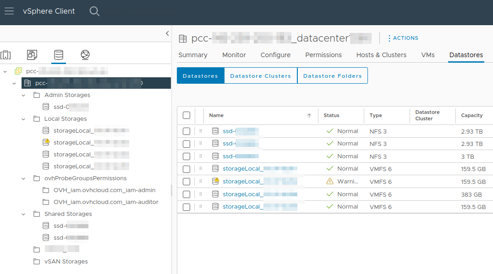{.thumbnail}

Depuis la section `Fichiers`{.action} de votre banque de données ouverte, cliquez sur `TÉLÉCHARGER DES FICHIERS`{.action}

Localisez l'élément à téléverser depuis votre ordinateur local (un fichier `XXX.iso` par exemple) et cliquez sur `Ouvrir`{.action} pour téléverser le fichier (ISO ou autre) depuis votre machine connectée au client HTML vSphere.

Le téléversement du fichier ISO commence automatiquement sans validation dans le dossier (s'il y en a un) de votre banque de données sélectionnée.

Vous pouvez actualiser l'explorateur de fichiers de la banque de données pour afficher le fichier téléversé dans la liste.

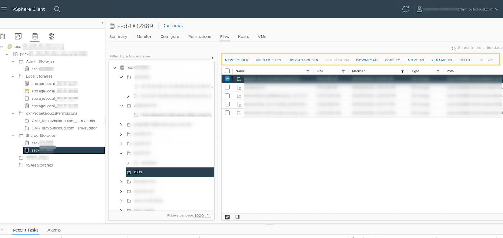{.thumbnail}

Vous pouvez ainsi lancer ce fichier ISO depuis un périphérique CD/DVD au sein de vote VM et lancer l'installation de l'OS en suivant le processus d'installation. Il est cependant recommandé d'utiliser des modèles de déploiement OVHcloud ou des clones de VM transformés en modèles (*templates*) par vos soins.

**2\. Depuis le menu `Listes d'inventaires globaux`**

Ce menu vous renvoie également à l'interface `Fichers`{.action} de téléversement :

|                                        **Images**                                         | **Étapes**                                                |
|:-----------------------------------------------------------------------------------------:|:----------------------------------------------------------|
| 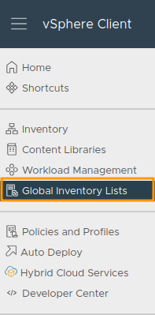{.thumbnail}      | - Cliquez sur `Listes d'inventaires globaux`{.action}. |
| 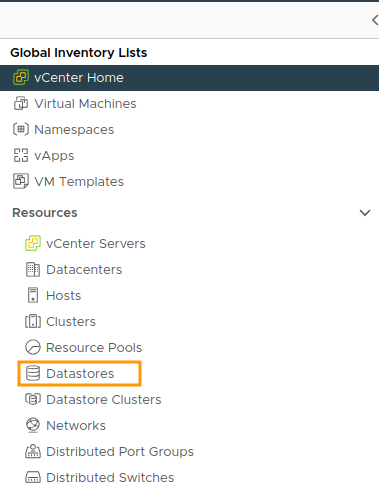{.thumbnail} | - Puis sur `Banques de données`{.action}.                  |

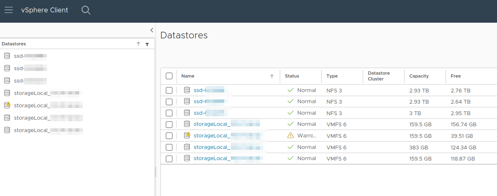{.thumbnail}

Cliquez sur le `Datastore` souhaité.

Vous allez vous retrouver dans la section `Fichiers`{.action} ou vous pourrez téléverser des données dans votre banque de données.

Cliquez ensuite sur `TÉLÉCHARGER DES FICHIERS`{.action} pour sélectionner le fichier (ISO ou autre) à téléverser depuis votre machine locale.

Localisez l'élément à téléverser depuis votre ordinateur local (un fichier `XXX.iso` par exemple) et cliquez sur `Ouvrir`{.action}

#### Téléverser des dossiers

Depuis votre banque de données, dans la section `Fichiers`{.action}, cliquez sur `TÉLÉCHARGER UN DOSSIER`{.action}.

Localisez l'élément à téléverser depuis votre machine connectée au client HTML vSphere et cliquez sur `Ouvrir`{.action}

Le téléversement ne commencera qu'après la confirmation validée : 

|                                       **Images**                                       | **Étapes**                                       |
|:--------------------------------------------------------------------------------------:|:-------------------------------------------------|
|        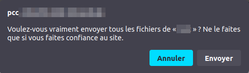{.thumbnail}        | - Pour confirmer, cliquez sur `Envoyer`{.action}. |

#### Déplacer/Copier des fichiers

Depuis votre banque de données, cliquez sur `DÉPLACER VERS`{.action} ou `COPIER DANS`{.action}.

{.thumbnail}

Localisez l'élément de destination à déplacer depuis la banque de données et cliquez sur `OK`{.action}.

{.thumbnail}

Vous devez disposer des droits suffisants pour effectuer ce type d'actions.

#### Renommer des fichiers

Depuis votre banque de données, cliquez sur `Remplacer le nom par`{.action}.

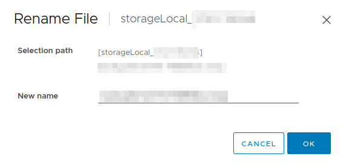{.thumbnail}

Renommez votre fichier puis cliquez sur `OK`{.action}.

#### Créer un dossier (facultatif)

Depuis la section `Fichiers`{.action} de votre banque de données, cliquez sur `NOUVEAU DOSSIER`{.action} pour créer un dossier où stocker vos fichiers.

Nommez votre dossier et cliquez sur `OK`{.action}.

{.thumbnail}

### Étape 2 - Téléverser avec Govc

Une bibliothèque Go pour interagir avec les API VMware vSphere (ESXi et/ou vCenter Server) est fournie par VMware. Vous pouvez consulter le `READ ME` du dépot GitHub à cette [adresse](https://github.com/vmware/govmomi?tab=readme-ov-file).

En plus du client API vSphere, ce dépôt comprend :

- [govc](https://github.com/vmware/govmomi/blob/main/govc/README.md) - vSphere CLI
- [vcsim](https://github.com/vmware/govmomi/blob/main/vcsim/README.md) - vSphere API mock framework
- [toolbox](https://github.com/vmware/govmomi/blob/main/toolbox/README.md) - Framework des outils invités des VM

Voici les variables d'environnement qui seront nécessaire pour la configuration de l'authentification de Govc avec l'api VMware :

|      **Variable d'environnement**      |                                   **Standard**                                    |                         **Advanced/Premium (NSX + vSAN)**                         | **Comments**                                                                                                                                                                                                                                                                                                                                                                                                                         | 
|:--------------------------------------:|:---------------------------------------------------------------------------------:|:---------------------------------------------------------------------------------:|:-------------------------------------------------------------------------------------------------------------------------------------------------------------------------------------------------------------------------------------------------------------------------------------------------------------------------------------------------------------------------------------------------------------------------------------|
|           `GOVC_DATACENTER`            |                         `pcc-XXX-XX-XX-XX_datacenterXXXX`                         |                         `pcc-XXX-XX-XX-XX_datacenterXXXX`                         | - Nom du datacenter par défaut au sens VMWare du terme.                                                                                                                                                                                                                                                                                                                                                                              | 
|            `GOVC_USERNAME`             |                                      `uname`                                      |                                      `uname`                                      | - L'utilisateur local de connexion VMware vSphere on OVHcloud. Vous pouvez vous passer de cette variable si vous spécifiez vos identifiants dans la variable `GOVC-URL`.                                                                                                                                                                                                                                                             |
|            `GOVC_PASSWORD`             |                                 `p4sswor_DXXXXXx`                                 |                                 `p4sswor_DXXXXXx`                                 | - Le mot de passe de connexion de l'utilisateur local VMware vSphere on OVHcloud. Vous pouvez vous passer de cette variable si vous spécifiez vos identifiants dans la variable `GOVC-URL`.                                                                                                                                                                                                                                          | 
|               `GOVC_URL`               | `user:pass@host`<br/>`vsphere.local`<br/>`vc.local`<br/>`pcc-XXX-XX-XX-XX.ovh.XX` | `user:pass@host`<br/>`vsphere.local`<br/>`vc.local`<br/>`pcc-XXX-XX-XX-XX.ovh.XX` | - L'IP ou hostname de l'hôte VMware vsphere on OVHcloud. Vous pouvez spécifier aussi l'identifiant utilisateur et le mot de passe, tel que `user:pass@host`. Et vous passer des variables `GOVC_USERNAME/PASSWORD`. Attention, le `host` definit bien l'IP de vos ESX et non le `pcc-XXX-XXX-XXX-XXX`. Si vous utilisez govc au sein d'une VM de votre environnement vous pouvez ajouter en `host` : `vsphere.local` ou `vc.local`. |
|            `GOVC_DATASTORE`            |                           `ssd-XXXXXX`<br/>`nfs-XXXXXX`                           |                 `ssd-XXXXXX`<br/>`nfs-XXXXXX`<br/>`vsanDatastore`                 | - Le Datastore utilisé par défaut au sens VMWare du terme.                                                                                                                                                                                                                                                                                                                                                                           |
|             `GOVC_NETWORK`             |                                  `172.XX.XX.XX`                                   |                                  `172.XX.XX.XX`                                   | - Le Network par défaut au sens VMWare du terme. Vous pouvez les retrouver dans votre inventaire global `Networks`.                                                                                                                                                                                                                                                                                                                 |
|              `GOVC_HOST`               |                                  `172.XX.XX.XX`                                   |                                  `172.XX.XX.XX`                                   | - L'hôte par défaut au sens VMWare du terme. Vous pouvez les retrouver dans votre inventaire global `Hosts`.                                                                                                                                                                                                                                                                                                                        |
|          `GOVC_RESOURCE_POOL`          |                                    `ovhServer`                                    |                                    `ovhServer`                                    | - Le pool de ressource par défaut au sens VMWare du terme. Vous pouvez les retrouver dans votre inventaire global `Ressource Pools`.                                                                                                                                                                                                                                                                                                |
|              `HTTP_PROXY`              |                            `http://XXX.XX.XX.XX:XXXXX`                            |                            `http://XXX.XX.XX.XX:XXXXX`                            | - L'url de votre server proxy sans https.                                                                                                                                                                                                                                                                                                                                                                                            |
|             `HTTPS_PROXY`              |                           `https://XXX.XX.XX.XX:XXXXX`                            |                           `https://XXX.XX.XX.XX:XXXXX`                            | - L'url de votre server proxy avec https.                                                                                                                                                                                                                                                                                                                                                                                            |

> [!tabs]
>
> **Linux**
>>
>> **Installation**
>>
>> Avec le binaire :
>>
>> Vous pouvez télécharger le binaire depuis les assets du dépôt officiel GitHub VMware : <https://github.com/vmware/govmomi/releases>
>>
>> Le Curl ci-dessous choisit automatiquement la bonne version nécessaire pour votre système d'exploitation (`uname`) et télécharge le binaire en version compressée `tar.gz`.
>>
>> Vous devez avoir accès à internet pour pouvoir le télécharger sinon le curl ne fonctionnera pas. Si vous ne disposez pas de `curl`, `tar` et `uname`, installez-les avant de lancer la commande en lançant cette commande :
>>
>> Selon le système d'exploitation : `Ubuntu/debian -> apt`, `Redhat/Centos -> yum/dnf`.
>>
>> Choisissez l'installateur que vous voulez.
>>
>> ```bash
>> sudo apt/dnf/yum install curl tar uname -y
>> ```
>>
>> Veillez à bien télécharger l'asset `Govc` qui dispose de la bonne version du système d'exploitation que vous utilisez (Windows/Linux, Debian/Freebsd, x64_86/arm, arm/arm64,  etc.).
>>
>>
>> ```bash
>> # extract govc binary to /usr/local/bin
>> # note: the "tar" command must run with root permissions
>> curl -L -o - "https://github.com/vmware/govmomi/releases/latest/download/govc_$(uname -s)_$(uname -m).tar.gz" | tar -C /usr/local/bin -xvzf - govc
>> ```
>>
>> Vérifiez également bien la somme du hash téléchargé.
>> 
>> ```bash
>> wget https://github.com/vmware/govmomi/releases/download/v0.43.0/checksums.txt
>> sha256sum govc_xxxx.tar.gz > checksums_govc_XX.txt
>> sha256sum -c checksums_govc_XX.txt 2>&1 | grep OK
>> cat checksums.txt
>> ```
>>
>> **Remarque** : Vous devez être root pour exécuter `tar` ou avoir les droits `sudo` suffisants. En fonction des droits de l'utilisateur utilisé sur votre système d'exploitation, vous devez aussi ajouter les droits d'exécution sur le binaire Govc par exemple.
>>
>> Avec go install :
>>
>> ```bash
>> go install github.com/vmware/govmomi/govc@latest
>> ```
>>
>> Avec Docker :
>>
>> Une image Docker peut être un bon moyen d'exécuter le binaire Govc de manière versionnée et isolée.
>>
>> [L'image Docker officielle VMware](https://hub.docker.com/r/vmware/govc) `govc` est construite depuis ce [Dockerfile](https://github.com/vmware/govmomi/blob/main/Dockerfile.govc).
>>
>> Exemple d'exécution de l'image Docker govc avec les variables d'environnement (voir les concepts dans la suite de la documentation) : 
>>
>> ```bash
>> docker run -e GOVC_USERNAME=XXXXX -e GOVC_PASSWORD=XXXXX -e GOVC_URL=https://pcc-XX-XX-XX-XX.ovh.de --rm -it vmware/govc /govc ls
>> or
>> docker run -e GOVC_URL=user:pass@host --rm -it vmware/govc /govc ls 
>> ```
>>
>> Pour les installations alternatives, consultez le dépôt GitHub `Govc` VMware officiel à [cette url](https://github.com/vmware/govmomi/blob/main/govc/README.md).
>>
>> **Configuration/Authentification**
>>
>> Le programme vous fournit un vaste choix d’arguments pour définir les conditions d’accès à l’API (par exemple son URL, l’utilisateur/mot de passe etc.). Mais nous vous conseillons d’utiliser des variables d’environnements pour gérer plus efficacement vos clusters, surtout si vous êtes amené à vous connecter à plusieurs APIs. Nous vous conseillons aussi de les placer dans un fichier pour une réutilisation ultérieure, lors d’une autre session par exemple.
>>
>> Voici un exemple de configuration pour un OS Linux. N'oubliez pas de créer votre fichier `govc.env` à la racine du dossier sur lequel vous lancez le binaire.
>>
>> ```bash
>> # govc.env
>> export GOVC_DATACENTER=<Nom du datacenter par défaut au sens VMWare du terme>
>> export GOVC_USERNAME=<Utilisateur local vmware>
>> export GOVC_PASSWORD=<Mot de passe de l'utilisateur local VMware>
>> export GOVC_URL=<IP ou hostname du vsphere>
>> export GOVC_DATASTORE=<Datastore par défaut>
>> 
>> # Si besoin d'utiliser un proxy réseau
>> # export HTTP_PROXY=http://XXX.XX.X.X:XXXXX
>> export HTTPS_PROXY=http://XXX.XX.X.X:XXXXX
>> ```
>>
>> Comme pour tout fichier contenant des variables, il suffit de le sourcer dans un terminal.
>>
>> ```bash
>> source govc.env
>> ```
>>
>> Au lancement de chaque commande, des options peuvent être modifiées à la volée pour surcharger les variables d’environnement, par exemple :
>>
>> ```bash
>> govc datastore.ls -dc=Datacenter2 -ds=Datastore1 -debug=true
>> ```
>>
>> À noter que si vous utilisez la commande debug (le `=true` est optionnel, s’agissant d’un flag Go), un dossier caché `.govmomi/debug` sera créé avec des logs vous permettant de tracer votre problème.
>>
>> **Usage**
>>
>> Nous allons vous exposer ici la commande de téléversement Govc `datastore.upload`.
>> 
>> Tout d’abord, il faut comprendre qu’au sein d’un datacenter les objets sont regroupés au sein d’un même type, sous `VM`, `Network`, `Host` et `Datastore`. Ainsi, il existe une seule méthode pour téléverser des fichiers avec la commande `govc datastore.upload`.
>>
>> ```bash
>> govc datastore.upload image.iso dossier-isos/image.iso
>> ```
>>
>> Téléchargement + Téléversement :
>>
>> Voici un exemple de téléversement d'une image iso avec `govc`. Attention à bien localiser le dossier sur lequel vous voulez importer votre iso, si vous en avez un :
>>
>> Télécharger un ISO avec curl avant de le téléverser à l'aide d'un tuyau (pipe) shell :
>>
>> ```bash
>> curl https://example.com/iso/image.iso | govc datastore.upload - dossier-iso/image.iso
>> ```
>> 
>> Govc dispose d'un grand nombre de commandes afin d'appeler l'API VMware pour gérer vos ressources managées. Nous vous invitons à voir la liste complète dans la documentation officielle.
>>
> **Windows**
>
>> **Installation**
>>
>> Depuis 2017 `Curl` et `bsdtar -> tar` sont installé par défaut, vous pouvez donc exécuter la commande ci-dessous avec `Powershell`, `CMD` ou le prompt que vous préférez.
>>
>> Avec Powershell :
>> 
>> Vous pouvez installer le binaire Govc avec Powershell en lançant la commande ci-dessous :
>>
>> ```powershell
>> curl -L -o - "https://github.com/vmware/govmomi/releases/latest/download/govc_$(uname -s)_$(uname -m).tar.gz" | tar -C /usr/local/bin -xvzf - govc
>> ```
>>
>> Si vous préférez, vous pouvez simplement lancer la decompression du `Zip` de l'asset `Govc` Windows suivant (x86_64.zip) après l'avoir téléchargé à l'url suivante : <https://github.com/vmware/govmomi/releases/download/v0.43.0/govc_Windows_x86_64.zip>
>>
>> Avec Chocolatey :
>> 
>> Vous pouvez utiliser le dépôt officiel Powershell Chocolatey, cependant nous vous recommandons la version la plus récente sur le dépôt GitHub VMware (ci-dessus).
>> 
>> ```powershell
>> Set-ExecutionPolicy Bypass -Scope Process -Force; iex ((New-Object System.Net.WebClient).DownloadString('https://chocolatey.org/install.ps1'))
>> choco install govc
>> choco install jq
>> ```
>>
>> `jq` permet de lister correctement dans Powershell les retours Govc.
>> 
>> **Configuration/Authentification**
>>
>> Avec Powershell :
>>
>> Il y a plusieurs façons de configurer des variables d'environnements avec Windows et Powershell. Voici quelques exemples (voir les commentaires pour chaque commande et variable powershell).
>>
>> ```powershell
>> # Set env variables with Set-item :
>> Set-Item -Path env:GOVC_URL -Value “https://pcc-XX-XX-XX-XX.ovh.xx"
>> 
>> # Set env variables for your vCenter, just push "Enter" :
>> $vcenter = "<your_vcenter_fqdn>"
>> $cred = get-credential
>> 
>> # Credentials configuration :
>> New-VICredentialStoreItem -Host $vcenter -User $cred.username -Password $cred.GetNetworkCredential().password
>> 
>> # Set env variables, just push "Enter" :
>> $env:GOVC_URL="https://"<pcc-XX-XX-XX-XX.ovh.xx>"
>> $env:GOVC_USERNAME="<uname>"
>> $env:GOVC_PASSWORD="<p4sswor_DXXXXXx>"
>> $env:GOVC_DATASTORE="<datastore_name>"
>> $env:GOVC_NETWORK="<portgroup_name>"
>> $env:GOVC_RESOURCE_POOL="<ovhServer>"
>> 
>> # Check GOVC variables :
>> ls env:GOVC*
>> 
>> # Check configuration from env vars setup :
>> Get-Item env:* | sort-object name
>> govc about
>> 
>> # With jq :
>> govc about -json | jq '.'
>> ```
>>
>> Il y a plusieurs façons de faire fonctionner Govc avec Windows, powershell étant la plus connue. Windows a mis en place WSL 2 (Windows subsystem for Linux) qui peut être une bonne alternative pour simplifier la configuration.
>>
>> **Usage**
>> 
>> Téléversement :
>>
>> Pour téléverser un iso avec powershell et Govc, lancez l'argument `Govc datastore.upload` :
>> 
>> ```powershell
>> govc datastore.upload - dossier-iso/image.iso
>> ```
>> 
>> Téléchargement + Téléversement :
>> 
>> ```powershell
>> curl https://example.com/iso/image.iso | govc datastore.upload - dossier-isos/image.iso
>> ```
>>
>> Govc dispose d'un grand nombre de commandes afin d'appeler l'API VMware pour gérer vos ressources managées. Nous vous invitons à voir la liste complète dans la documentation officielle.
>>

## Aller plus loin

- [IAM pour VMware on OVHcloud - Présentation et FAQ](/pages/hosted_private_cloud/hosted_private_cloud_powered_by_vmware/vmware_iam_getting_started)

Si vous avez besoin d'une formation ou d'une assistance technique pour la mise en œuvre de nos solutions, contactez votre Technical Account Manager ou rendez-vous sur [cette page](/links/professional-services) pour obtenir un devis et demander une analyse personnalisée de votre projet à nos experts de l’équipe Professional Services.

Posez des questions, donnez votre avis et interagissez directement avec l’équipe qui construit nos services Hosted Private Cloud sur le [channel Discord dédié](https://discord.gg/ovhcloud).

Échangez avec notre [communauté d'utilisateurs OVHcloud](/links/community).
