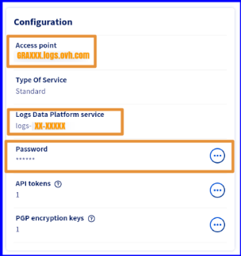
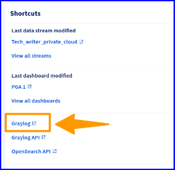

## Objectif

L'objectif de ce guide est de vous montrer comment activer le transfert de logs de votre PCC Private Cloud vers Logs Data Platform (LDP), une plateforme qui vous aide à stocker, archiver, interroger et visualiser vos logs.

Si vous souhaitez en savoir plus sur Logs Data Platform avant de lire ce guide, reportez-vous au guide suivant : ["Introduction à Logs Data Platform"](/pages/manage_and_operate/observability/logs_data_platform/getting_started_introduction_to_LDP).

## Prérequis
- Disposer d'un compte client OVHcloud.
- Disposer d'une ou plusieurs ressources Hosted Private Cloud (PCC).
- Avoir au moins un Stream actif configuré sur le compte LDP pour recevoir les logs.
- Les ressources PCC et LDP doivent appartenir au même compte OVHcloud.

## Concepts et limites

> [!warning]
> 
> A ce jour, les logs des listeners **UDP** ne sont pas transmis.
### Glossaire
- **Logs Data Platform :** Plateforme de gestion de logs entièrement gérée et sécurisée par OVHcloud. Pour plus d'informations, consultez la page de présentation de la solution [Logs Data Platform](https://www.ovhcloud.com/fr/logs-data-platform/).
- **Data Stream :** Partition logique de logs que vous créez dans un compte LDP et que vous utiliserez lors de l'ingestion, de la visualisation ou de l'interrogation de vos logs. Plusieurs sources peuvent être stockées dans le même flux de données, et c'est l'unité qui peut être utilisée pour définir un pipeline de logs (politique de rétention, archivage, streaming live, etc.), des droits d'accès et des politiques d'alertes.
- **Transfert de logs :** Fonctionnalité intégrée à un produit OVHcloud pour ingérer les logs de ses services dans un *Data Stream* d’un compte LDP dans le même compte OVHcloud. Cette fonctionnalité doit être activée par le client et par service.
- **Abonnement à la redirection de logs :** Lors de l'activation du transfert de logs pour un service OVHcloud donné vers un LDP *Data Stream* donné, un *abonnement* est créé et attaché au *Data Stream* pour une gestion ultérieure par le client.

### Les types de journaux

> [!primary]
> 
> Les PCC certifié (PCIDS, HDS, SNC, NSX-T) suivants peuvent faire transférer leurs journaux uniquement si le **syslogForwarder** est activé.
>
> Tous les journaux de VMware ne sont pas transférables pour des raisons de sécurité.
>

#### Kind

La première chose dont vous avez besoin est de créer un ou plusieurs types de logs. Un Kind est un « type » de logs que votre produit génère. Cela dépend vraiment de votre logique établit.

Pour un produit Hosted Private Cloud, il est possible d'imaginer 4 types de logs : 

1. Les logs Kernel.
2. Les logs Auth.
3. Les logs Cron.
4. Les logs Réseaux.

##### NSX-T

| Nom                 | Description          |
|---------------------|----------------------|
| auth.log            | Authorization log    |
| controller          |  Controller log      |
| controller-error    | Controller error log |
| http.log            | HTTP service log     |
| kern.log            | Kernel log           |
| manager.log         | Manager service log  |
| node-mgmt.log       | Node management log  |
| nsx-audit-write.log | NSX audit write log  |
| nsx-audit.l         | NSX audit log        |
| syslog              | System log           | 

##### ESXI

Emplacements du fichier des journaux ESXi :

| Composant                    | 	Endroit                                                                                                                                                                     | 	Objectif                                                                                                                                                             |
|------------------------------|------------------------------------------------------------------------------------------------------------------------------------------------------------------------------|-----------------------------------------------------------------------------------------------------------------------------------------------------------------------|
| Authentication               | 	/var/log/auth.log                                                                                                                                                           | 	Contient tous les événements liés à l'authentification pour le système local.                                                                                        |
| ESXi host agent log          | 	/var/log/hostd.log                                                                                                                                                          | 	Contient des informations sur l'agent qui gère et configure l'hôte ESXi et ses machines virtuelles.                                                                  |
| Shell log                    | 	/var/log/shell.log                                                                                                                                                          | 	Contient un enregistrement de toutes les commandes tapées dans l'environnement ESXi et les événements d'environnement (par exemple, lorsque l'environnement a été activé). |
| System messages              | 	/var/log/syslog.log                                                                                                                                                         | 	Contient tous les messages généraux du journal et peut être utilisé pour le dépannage. Ces informations se trouvaient auparavant dans le fichier journal des messages. |
| vCenter Server agent log     | 	/var/log/vpxa.log                                                                                                                                                           | 	Contient des informations sur l'agent qui communique avec vCenter Server (si l'hôte est géré par vCenter Server).                                                  |                                                     
| Virtual machines             | 	The same directory as the affected virtual machine's configuration files, named vmware.log and vmware*.log. For example, /vmfs/volumes/datastore/virtual machine/vmware.log | 	Contient les événements d'alimentation des machines virtuelles, les informations sur les pannes système, l'état et l'activité des outils, la synchronisation de l'heure, les modifications du matériel virtuel, les migrations vMotion, les clones de machines, etc. |
| VMkernel                     | 	/var/log/vmkernel.log                                                                                                                                                       | 	Enregistre les activités liées aux machines virtuelles et à ESXi.                                                                                                            |
| VMkernel summary             | 	/var/log/vmksummary.log                                                                                                                                                     | 	Permet de déterminer les statistiques de disponibilité et de temps de fonctionnement pour ESXi (séparées par des virgules).                                                                                  |
| VMkernel warnings            | 	/var/log/vmkwarning.log                                                                                                                                                     | 	Enregistre les activités liées aux machines virtuelles.                                                                                                                      | 
| Quick Boot                   | 	/var/log/loadESX.log                                                                                                                                                        | 	Contient tous les événements liés au redémarrage d'un hôte ESXi via le démarrage rapide.                                                                                        |
| Trusted infrastructure agent | /var/run/log/kmxa.log                                                                                                                                                        | 	Enregistre les activités liées au service client sur l'hôte de confiance ESXi.                                                                                           |
| Key Provider Service         | 	/var/run/log/kmxd.log                                                                                                                                                       | 	Enregistre les activités liées au service de fournisseur de clés vSphere Trust Authority.                                                                                      | 
| Attestation Service          | 	/var/run/log/attestd.log                                                                                                                                                    | 	Enregistre les activités liées au service d'attestation d'autorité de confiance vSphere.                                                                                       |
| ESX Token Service            | 	/var/run/log/esxtokend.log                                                                                                                                                  | 	Enregistre les activités liées au service de jeton ESX de l'autorité d'approbation vSphere.                                                                                      |
| ESX API Forwarder            | 	/var/run/log/esxapiadapter.log                                                                                                                                              | 	Enregistre les activités liées au redirecteur API vSphere Trust Authority.                                                                                             |

##### vCenter (VCSA)

Répertoires communs des journaux :

| Répertoire | 	Description                                                                         |
|------------------------|--------------------------------------------------------------------------------------|
| ../firstboot           | Stocke les premiers journaux de démarrage.                                           |
| applmgmt and applmgmt-audit | Stocke les journaux liés au service de gestion des appliances VMware.                |
| cloudvm                | 	Stocke les logs pour l'allocation et la distribution des ressources entre les services. |
| rhttpproxy             | 	      Stocke les logs du service VMware HTTP Reverse Proxy.                         |
| sca                    | 	Stocke les journaux du service VMware Service Control Agent.                        |
| vapi                   | Stocke les logs du service VMware vAPI Endpoint.                                     |
| vmafdd                 | Stocke les journaux pour le service VMware Authentication Framework - LDAP.          |              
| vmdird                 | 	Stocke les journaux du service d'annuaire VMware - service LDAP.                      |              
| vmon                   | Stocke les logs du service VMware Service Lifecycle Manager.                         

##### Journaux du noeud de Management

Journaux du répertoire :

| Log Directory   | Service                                        |
|-----------------|------------------------------------------------|
| rbd             | 	VMware vSphere Auto Deploy                    |
| content-library | 	VMware Content Library Service                |
| eam             | 	VMware ESX Agent Manager                      |
| netdumper       | 	VMware vSphere ESXi Dump Collector            |
| perfcharts      | 	VMware Performance Charts Service             |
| vmcam           | 	VMware vSphere Authentication Proxy           |
| vmdird          | 	VMware Directory Service - LDAP               |
| vmware-sps      | 	VMware vSphere Profile-Driven Storage Service |
| vpxd            | 	VMware vCenter Server                         |
| vpostgres       | 	VMware Postgres service                       |
| vcha            | 	VMware vCenter High Availability service      |

Sachez qu'il est tout à fait acceptable qu'un produit ne possède qu'une seule catégorie. 

Voici des exemples de labels "kind" représenté dans Hosted Private Cloud VMware on OVHcloud par Log Data Plateform :

- **esxi** : Référence de votre hôte ESX, peut filtré par application (journaux système : auth, kernel, cron)
- **nsxtEdge** : Référence de votre Edge, tout est redirigé (journaux system + réseaux : , auth, kernel, cron, ip, location, zone, etc..).
- **vcsa** : Référence de cluster vCenter, filtré par application (journaux clustering : en relation avec vCenter et vos hôtes ESX).
- **nsxt** : Référence NSX-T, tout est redirigé (journaux system + réseaux : , auth, kernel, cron, ip, location, zone, etc..)
- **nsxtManager** : Référence du manager NSX-T, tout est redirigé (journaux system + réseaux : , auth, kernel, cron, ip, location, zone, etc..)

Il est le type de journal que vous voulez transférer à votre stream LDP. Notez que la seule valeur actuellement prise en charge aujourd'hui pour Hosted Private Cloud est "esxi".

D'autres références seront disponible dans les versions futures.

Pour pouvoir consommer des logs, votre infrastructure PCC doit avoir l'option de sécurité **syslogForwarder** activée. 

- Tous les journaux VMware sont collectés et envoyés aux clusters Logs Data Plateform. 
- Tous les journaux des appliances VMware sont traités par les "Forwarder" Syslog et marqués par le filtre (Logstash) au niveau du cluster Log Data Plateform.

Nous mettons toutes les métadonnées pour l'identification de Hosted Private Cloud VMware on OVHcloud.

## En pratique
> [!primary]
> Prenez en compte que l'activation du **Log Forwarding** est gratuite, mais vous serez facturé pour l'utilisation du service Logs Data Platform selon le tarif standard. Pour la tarification du LDP, consultez cette [page](https://www.ovhcloud.com/fr/logs-data-platform/).

Logs Data Platform est une interface de collecte, d'indexation et d'analyse de logs. Quelque soit la provenance de vos logs, la plateforme vous permet de choisir différents points d'entrée en fonction du protocole, du niveau de sécurité et du format. L'analyse et l'exploitation des données peuvent se faire grâce à différentes API et interfaces web.

### Etape 1 - Audit Log Forwarding avec Hosted Private Cloud

> [!warning]
> Les ressources PCC et LDP doivent appartenir au même compte OVHcloud. Si ce n'est pas le cas, vous aurez ce message d'erreur : 
> {
> "message": "Client::ValidationError::SubscriptionDestinationClusterIsInternal ; {\"cluster_name\":\"XXX.logs.ovh.com\"} ; Subscription can't target non-public cluster 'XXXX.logs.ovh.com'"
> }
>

### Activation du Log Forwarder avec Hosted Private Cloud 

#### Via le control panel OVHcloud :

Cette fonctionnalité n'est pas encore disponible dans l'espace client.

#### Via l’API OVHcloud :

> [!primary]
>
>  Trouvez plus d'information sur les appels API OVHcloud : [Premiers pas avec l'API OVHcloud](/pages/manage_and_operate/api/first-steps).

> [!api]
> 
> @api {v1} /dedicatedCloud/{serviceName} POST /dedicatedCloud/{serviceName}/syslogForward/forwarder
>
>
> **Paramètres:**
>
> serviceName : La référence pour votre PCC : ***pcc-XXX-XXX-XXX-XXX***.
> ip: L'adresse Ip du service distant.
> logLevel : Le niveau de log minimum (alert, etc..).
> servicePort : Port distant (Syslog : 514, Syslog Manager : 6514).
> sourceType : Type de source de journal possible (Allowed : nsxtEdge).
> sslThumbprint : L'empreinte de votre Gateway SSL.
>

Exemple :

```shell
@api {v1} /dedicatedCloud/{serviceName} POST /dedicatedCloud/{serviceName}/syslogForward/forwarder
 
{
  "description": "string",
  "ip": "XXX.XXX.XXX.XXX",
  "logLevel": "alert┃critical┃emergency┃error┃info┃notice┃warning",
  "noSsl": false,
  "servicePort": 514,
  "sourceType": [
    "nsxtEdge"
  ],
  "sslThumbprint": "Null"
}
```

Exemple de retour:
```Shell
{
  "createdBy": "Null",
  "createdFrom": "Null",
  "datacenterId": 0,
  "description": "Null",
  "endDate": "2024-05-30T09:02:03.867Z",
  "executionDate": "2024-05-30T09:02:03.867Z",
  "filerId": 0,
  "hostId": 0,
  "lastModificationDate": "2024-05-30T09:02:03.867Z",
  "maintenanceDateFrom": "2024-05-30T09:02:03.867Z",
  "maintenanceDateTo": "2024-05-30T09:02:03.867Z",
  "name": "Null",
  "network": "Null",
  "networkAccessId": 0,
  "orderId": 0,
  "parentTaskId": 0,
  "progress": 0,
  "state": "canceled",
  "taskId": 0,
  "type": "Null",
  "userId": 0,
  "vlanId": 0
}
```

La requête GET permet de lister les Forwarder activés.

### Création de l'abonnement LDP pour votre Hosted Private Cloud

#### Via le control panel OVHcloud :

Cette fonctionnalité n'est pas encore disponible dans l'espace client.

#### Via l’API OVHcloud :

> [!api]
> @api {v1} /dedicatedCloud POST /dedicatedCloud/{serviceName}/log/subscription
>
>
> **Paramètres:**
>
> **kind** : "esxi".
> **streamId** : "ggb8d894-c491-433e-9c87-50a8bf6fe773".
>
> 

Exemple :

```shell
@api {v1} /dedicatedCloud POST /dedicatedCloud/{serviceName}/log/subscription

{
  "kind": "string", // Le label VMware, la seul valeur supporté actuellement est : 'esxi'.
  "streamId": "vf06a2f5-55a9-4434-a1fb-130809312dvf", // L'identifiant du flux (stream) LDP.
}
```

La requête GET permet de lister vos souscriptions.

### Verification si le forwarder Syslog est activé

#### Via le control panel OVHcloud :

Cette fonctionnalité n'est pas encore disponible dans l'espace client.

#### Via l’API OVHcloud :

> [!api]
> 
> @api {v1} /dedicatedCloud GET /dedicatedCloud/{serviceName}/syslogForward
>
>
>
> **Paramètres** :
>
> **serviceName** : La référence pour votre PCC : "pcc-XXX-XXX-XXX-XXX".
>

Exemple de retour :

```shell
{
  "state": "disabled/Enabled"
}
```

Si vous avez réussi l'appel API `POST /dedicatedCloud/{serviceName}/syslogForward/forwarder`{.action}, vous devez avoir l'option Activé.

### Lister les Syslog Forwarder

#### Via le control panel OVHcloud :

Cette fonctionnalité n'est pas encore disponible dans l'espace client.

#### Via l’API OVHcloud :

> [!api]
> 
> @api {v1} /dedicatedCloud GET  /dedicatedCloud/{serviceName}/syslogForward/forwarder
>
>
> **Paramètres:**
>
> **serviceName** : La référence pour votre PCC : ***pcc-XXX-XXX-XXX-XXX***.
>

### Mise à jour du Log Forwarder

#### Via le control panel OVHcloud :

Cette fonctionnalité n'est pas encore disponible dans l'espace client.

#### Via l’API OVHcloud :

> [!api]
> 
> @api {v1} /dedicatedCloud POST /dedicatedCloud/{serviceName}/syslogForward/forwarder/{logForwardId}/changeProperties
>
>
> **Paramètres** :
>
> **serviceName** : La référence pour votre PCC : ***pcc-XXX-XXX-XXX-XXX***.
> **logForwardId** : Identifiant du log forwarder.

### Manager vos flux (stream) LDP avec Hosted Private Cloud

#### Via l’API OVHcloud

Utilisez l'appel API suivant pour lister les stream data de votre compte LDP :

> [!api]
>
> @api {v1} /dedicatedCloud/ GET /dbaas/logs/{serviceName}/output/graylog/stream
>
>
> **Paramètres** :
>
> serviceName : La référence de votre PCC : ***pcc-XXX.XXX-XXX-XXX***.
>

Avoir les details des flux (stream) :

> [!api]
>
> @api {v1} /dedicatedCloud GET /dbaas/logs/{serviceName}/output/graylog/stream/{streamId}
>
>
> **Paramètres:**
>
> **serviceName** : La référence de votre PCC : ***pcc-XXX.XXX-XXX-XXX***.
> **streamId** : L'identifiant de votre stream LDP.

Vous obtiendrez en réponse un `operationId`{.action} :

```shell
{
  "operationId": "f330aa1c-89ab-4b1a-81ae-4ffr4959966f",
  "serviceName": "pcc-XXX-XXX-XXX-XXX"
}
```

Vous pouvez utiliser le `operationId`{.action} pour récupérer le `subscriptionId`{.action} à des fins de gestion ultérieure à l'aide de l'appel API suivant :

> [!api]
>
> @api {v1} /dbaas/logs GET /dbaas/logs/{serviceName}/operation/{operationId}
>
>
> **Paramètres** :
>
> **serviceName** : La référence de votre PCC : "pcc-XXX-XXX-XXX-XXX".
> **operationId** : La référence de votre identifiant d'opération DLP : "5a9x1x74-a1f2-4bb7-a41c-e8fd397ee1xx".

Une fois l'opération terminée, vous pouvez également récupérer les abonnements à l'aide de l'appel API suivant :

> [!api]
>
> @api {v1} /dedicatedCloud GET /dedicatedCloud/{serviceName}/log/subscription
>

> **Paramètres:**
>
> **serviceName** : La reference de votre PCC : "pcc-XXX-XXX-XXX-XXX".
>

Une fois en possession du `subscriptionId`{.action} , vous pouvez obtenir les détails via l'appel API suivant :

> [!api]
>
> @api {v1} /dedicatedCloud GET /dedicatedCloud/{serviceName}/log/subscription/{subscriptionId}
>
>
> **Paramètres:**
>
> serviceName : La reference de votre PCC, tel que `pcc-XXX-XXX-XXX-XXX`.
> subscriptionId : La reference de votre identifiant de subscription LDP, tel que : `18d60324-b260-4000-83db-b484f4db6e80`
>

Exemple de retour :

```shell
GET /dedicatedCloud/{serviceName}/log/subscription/{subscriptionId}

{
  "createdAt": "2024-04-26T22:27:57+02:00",
  "kind": "esxi",
  "resource": {
    "name": "Null",
    "type": "Null"
  },
  "serviceName": "Null",
  "streamId": "Null",
  "subscriptionId": "18a60324-b260-4000-83cb-h484f4db6i80",
  "updatedAt": "2024-01-31T15:45:25.286Z"
}
```

### Étape 2 - Récupération du Stream (ID) cible LDP

> [!primary]
> 
> Vous devez avoir préalablement créer un stream Logs Data Plateform.

#### Via le control panel OVHcloud :

Vous pouvez suivre le guide suivant pour récupérer le stream ID depuis le control panel OVHcloud : [](/pages/manage_and_operate/observability/logs_data_platform/getting_started_quick_start)

#### Via l’API OVHcloud :

Listez les flux de données de votre compte Logs Data Platform (renseignez votre identifiant LDP au format ldp-xx-xxxx dans le champ « serviceName ») :

> [!api]
>
> @api {v1} /dedicatedCloud/{serviceName}/logs GET /dedicatedCloud/{serviceName}/log/subscription
>
>
> Paramètres:
>
> **serviceName** : La référence de votre PCC : "pcc-XXX.XXX-XXX-XXX".
>

### Étape 3 - Obtenez les détails d'un flux de données PCC

#### Via le control panel OVHcloud :

Cette fonctionnalité n'est pas encore disponible dans l'espace client.

#### Via l’API OVHcloud :

> [!api]
>
> @api {v1} /dedicatedCloud/{serviceName}/logs GET /dedicatedCloud/{serviceName}/output/graylog/stream/{streamId}
>
> 
> **Paramètres** :
>
> **streamId** : La référence d'identification de votre stream LDP : "caX6a2f5-XXa9-4434-a1xx-XX0809312dca".
> **serviceName** : La référence de votre PCC : "pcc-XXX.XXX-XXX-XXX".
>

### Étape 3 - Accéder à l'interface Graylog

Utiliser les identifiants de votre compte LDP, lorsque que vous vous connectez la première fois définissez un mot de passe. 

Le login correspond au nom d'utilisateur Logs Data Plateform et non celui de votre stream (ldp-cg-XXX), voir exemple et capture ci-dessous :
- **Nom d'utilisateur** : `logs-dv-XXX`{.action} -> Correct.
- **Stream Name** : `ldp-cg-XXX`{.action} -> Non-correct.



Vous retrouvez plusieurs liens de connexions qui vous redirigent sur le bon lien Graylog dans le compte de votre espace LDP.



### Étape 4 - Gestion de l'abonnement Logs Data Plateform

À tout moment, vous pouvez récupérer les abonnements attachés à votre flux Logs Data Platform et choisir de désactiver la redirection en annulant votre abonnement sur votre flux, de sorte que votre flux Logs Data Platform ne reçoive plus vos journaux d'audit.

Notez que cela ne supprime pas les logs stockés avant l'annulation de l'abonnement, car les données stockées dans un flux de logs sont immuables, sauf si vous supprimez le flux entier.

Pour supprimer votre abonnement, vous pouvez utiliser l'appel API suivant :

> [!api]
>
> @api {v1} /dedicatedCloud DELETE /dedicatedCloud/{serviceName}/log/subscription/{subscriptionId}
>
>
> **Paramètres** :
>
> **subscriptionId** : La référence de souscription pour votre compte LDP, exemple : "18d30324-x260-5000-81db-a484f4db6y80".
> **serviceName** : La référence de votre PCC : "pcc-XXX-XXX-XXX-XXX".
>

Pour aller plus loins dans la gestion de votre abonnement, vous pouvez suivre le guide : ["Démarrage rapide Logs Data Plateform"](/pages/manage_and_operate/observability/logs_data_platform/getting_started_quick_start).

## Aller plus loin

Vous pouvez suivre ces guides qui vous explique comment configurer votre PCC pour faire suivre les logs dans LDP :
- [Logs Data Platform - Premiers pas.](https://help.ovhcloud.com/csm/fr-documentation-observability-logs-data-platform-getting-started?id=kb_browse_cat&kb_id=3d4a8129a884a950f07829d7d5c75243&kb_category=e3eec38c1977a5d0476b930e789695d0&spa=1){.external}
- [Visualiser vos logs dans un tableau de bord Grafana](/pages/manage_and_operate/observability/logs_data_platform/visualization_grafana).
- [Utiliser la Cli LDP Tail pour regarder en live vos logs Hosted Private Cloud](/pages/manage_and_operate/observability/logs_data_platform/cli_ldp_tail).
- [Génération des logs des comptes OVHcloud avec Logs Data Platform](/pages/manage_and_operate/iam/iam-logs-forwarding).
- [Pousser les logs depuis Apache vers LDP](/pages/manage_and_operate/observability/logs_data_platform/ingestion_apache).
- [Modèle de résponsabilité "RACI"](/pages/manage_and_operate/observability/logs_data_platform/getting_started_responsibility_model).

Si vous avez besoin d'une formation ou d'une assistance technique pour la mise en oeuvre de nos solutions, contactez votre commercial ou cliquez sur [ce lien](https://www.ovhcloud.com/fr/professional-services/) pour obtenir un devis et demander une analyse personnalisée de votre projet à nos experts de l’équipe Professional Services.

Échangez avec notre communauté d’utilisateurs sur <https://community.ovh.com/>.
