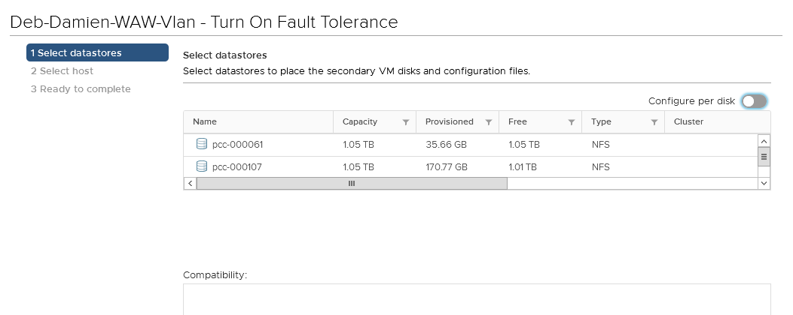

## Objetivo

A funcionalidade **Fault Tolerance** (FT) de VMware vSphere permite proteger uma máquina virtual das falhas de hardware, clonando a máquina em dois hosts diferentes.

{.thumbnail}

**Saiba como utilizar a funcionalidade Fault Tolerance na sua máquina virtual**

## Requisitos

- Ativar o vSphere HA.
- Ter à sua disposição uma quantidade reservada de recursos igual a 100% da memória.
- Ter instalado as VMware Tools.
- Processadores da mesma geração.
- Máximo de 4 vCPU.

## Instruções 

Para ativar a opção **Fault Tolerance**, clique com o botão direito do rato numa máquina virtual e clique sucessivamente em `Fault Tolerance` e `Turn On Fault Tolerance`.

{.thumbnail}

Aparecerá uma nova janela de configuração convidando-o a definir as suas escolhas para a máquina virtual secundária.

Datastore:

{.thumbnail}

Host: 

{.thumbnail}

Finalmente, aparecerá um resumo das suas escolhas. Valide para ativar a FT na sua máquina virtual:

{.thumbnail}

A sua máquina virtual está agora protegida pelo **Fault Tolerance**, o seu ícone é diferente e o seu nome mostra o estado “primary”.

{.thumbnail}

Estão disponíveis várias operações em função das suas necessidades.

{.thumbnail}

## Ações impossíveis e incompatibilidades

Numa máquina virtual com **Fault Tolerance** ativado, já não é possível efetuar certas ações, nem utilizar determinados periféricos.

Consulte a lista das ações impossíveis [nesta página](https://docs.vmware.com/en/VMware-vSphere/6.7/com.vmware.vsphere.avail.doc/GUID-F5264795-11DA-4242-B774-8C3450997033.html){.external-link} e a lista das incompatibilidades [aqui](https://docs.vmware.com/en/VMware-vSphere/6.7/com.vmware.vsphere.avail.doc/GUID-C1749AD4-70E2-406C-864C-719F54BF1BC1.html){.external-link}.

## Quer saber mais?

Fale com a nossa comunidade de utilizadores em <https://community.ovh.com/en/>.
