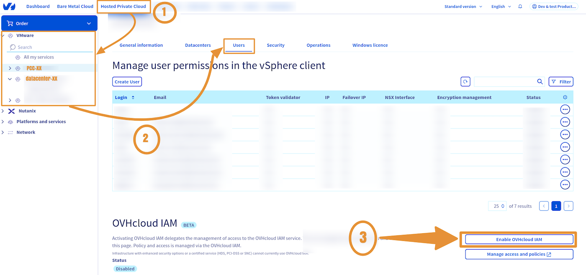
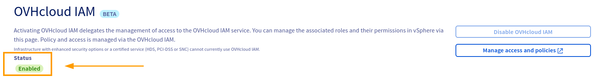

> [!warning]
> IAM for VMware on OVHcloud is currently in beta phase.
> This guide may be incomplete. Our team remains available on our dedicated Discord channel. Please feel free to join us and contact us: <https://discord.gg/ovhcloud>. Ask questions, give your feedback and interact directly with the team building our Hosted Private Cloud services.

## Objective

**This guide details how to enable IAM within your OVHcloud managed VMware vSphere.**

## Requirements

- An [OVHcloud account](/pages/account_and_service_management/account_information/ovhcloud-account-creation)
- One or more Hosted Private Cloud - VMware on OVHcloud products linked to this account (Hosted Private Cloud powered by VMware, VMware Service Pack).

## Instructions

### Enabling IAM

> [!primary]
> This may take up to 30 minutes.

### Via the OVHcloud Control Panel

Log in to your [OVHcloud Control Panel](/links/manager) and click on the `Hosted Private Cloud`{.action} tab.

Click on the `VMware`{.action} section, select your infrastructure, then go to the `Users`{.action} tab.

Under the `OVHcloud IAM`{.action} section, click `Enable OVHcloud IAM`{.action}.

{.thumbnail}

> [!success]
> Once IAM is enabled, its status will be `Enabled` and green.

{.thumbnail}

### Via the OVHcloud API

> [!success]
> Read the guide [Getting started with OVHcloud APIs](/pages/manage_and_operate/api/first-steps) to get familiar with using OVHcloud APIv6.

> [!warning]
> Make sure to replace the `serviceName` with the reference of your Hosted Private Cloud service, in the form `pcc-XXX-XXX-XXX-XXX`.

To enable the IAM option, execute the following API call:

> [!api]
>
> @api {v1} /dedicatedCloud POST /dedicatedCloud/{serviceName}/iam/enable
>

#### Checking that IAM is enabled

To control IAM activation, execute the following API call:

> [!api]
>
> @api {v1} /dedicatedCloud GET /dedicatedCloud/{serviceName}/iam
>

API return:

```shell
{
  "state": "enabled",
  "identityProviderId": 275
}
```

## Go further

You can now follow the guide [IAM for VMware on OVHcloud - How to create an IAM vSphere role](/pages/hosted_private_cloud/hosted_private_cloud_powered_by_vmware/vmware_iam_role).

**IAM for VMware on OVHcloud - Guide index:**

- Guide 1: [IAM for VMware on OVHcloud - Overview and FAQ](/pages/hosted_private_cloud/hosted_private_cloud_powered_by_vmware/vmware_iam_getting_started)
- Guide 2: IAM for VMware on OVHcloud - How to enable IAM
- Guide 3: [IAM for VMware on OVHcloud - How to create an IAM vSphere role](/pages/hosted_private_cloud/hosted_private_cloud_powered_by_vmware/vmware_iam_role)
- Guide 4: [IAM for VMware on OVHcloud - How to associate a vSphere role with an IAM policy](/pages/hosted_private_cloud/hosted_private_cloud_powered_by_vmware/vmware_iam_role_policy)
- Guide 5: [IAM for VMware on OVHcloud - How to associate a user with a global IAM policy](/pages/hosted_private_cloud/hosted_private_cloud_powered_by_vmware/vmware_iam_user_policy)

If you need training or technical assistance to implement our solutions, contact your sales representative or click on [this link](https://www.ovhcloud.com/en-gb/professional-services/) to get a quote and ask our Professional Services experts for a custom analysis of your project.

Join our [community of users](/links/community)