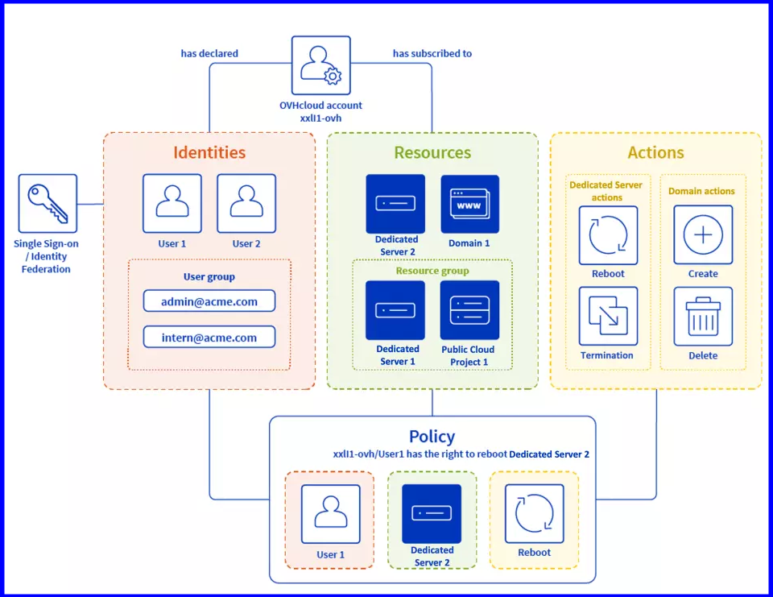
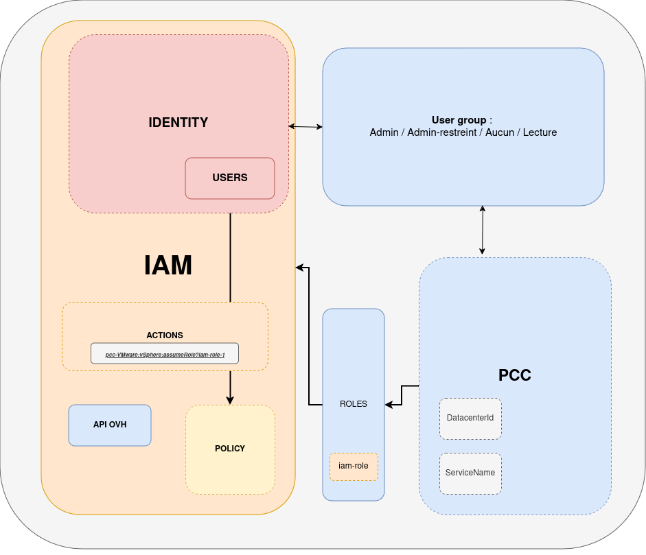

# Table des matières
1. [Objectif](#Objectif)
2. [Prérequis](#Prérequis)
3. [En pratique](#En pratique)
4. [Etape 1 : Activer IAM](#Etape 1)
5. [Aller plus loin](#Aller plus loin)

## Objectif
**Ce guide vous détaille comment activer IAM dans votre Cloud Privée VMware on OVHcloud**

Voici les liens des guides :

- Guide 1 : [Premiers pas avec l'utilisation d'IAM dans mon cloud privée VMware sur OVHcloud](/pages/hosted_private_cloud/hosted_private_cloud_powered_by_vmware/vmware_iam_enable#Objectif)
- Guide 2 : [FAQ](/pages/hosted_private_cloud/hosted_private_cloud_powered_by_vmware/vmware_iam_role)
- Guide 3 : [Comment activer IAM dans un cloud privé VMware managé par OVH](/pages/hosted_private_cloud/hosted_private_cloud_powered_by_vmware/vmware_iam_policy)
- Guide 4 : [Comment utiliser les rôles IAM dans un cloud privée VMware managé par OVH](/pages/hosted_private_cloud/hosted_private_cloud_powered_by_vmware/vmware_iam_role_policy)
- Guide 5 : [Comment ajouter un rôle IAM à une politique globale](/pages/hosted_private_cloud/hosted_private_cloud_powered_by_vmware/vmware_iam_actions)
- Guide 6 : [Comment associer un utilisateur à une politique IAM globale](/pages/hosted_private_cloud/hosted_private_cloud_powered_by_vmware/vmware_iam_actions...)

Le diagramme suivant présente une vue d'ensemble de la solution IAM ainsi que le fonctionnement de la gestion des **Ressources**, des **Droits** et **Actions** :

{.thumbnail}

{.thumbnail}

---
## Prérequis
Pour activer IAM, vous aurez besoin des éléments suivants :

- Avoir un compte OVHcloud (voir guide :[Comment créer un compte OVHcloud](https://help.ovhcloud.com/csm/fr-account-create-ovhcloud-account?id=kb_article_view&sysparm_article=KB0043023)).
- Disposer au préalable d'un ou plusieurs produits liés à ce compte OVHcloud (Hosted Private Cloud powered by VMware, Service Pack VMware etc..)
- Savoir ["Créer et gérer des utilisateurs locaux sur un compte OVHcloud"](https://help.ovhcloud.com/csm/fr-account-managing-users?id=kb_article_view&sysparm_article=KB0043058).
- Savoir ["Comment utiliser les politiques IAM depuis votre espace client"](https://help.ovhcloud.com/csm/fr-customer-iam-policies-ui?id=kb_article_view&sysparm_article=KB0058730).

---
## En pratique
La gestion des accès OVHcloud est basée sur un système de gestion des politiques. Il est possible d’écrire différentes politiques donnant accès aux utilisateurs à des fonctionnalités spécifiques sur les produits liés à un compte OVHcloud.

Pour comprendre un peu mieux les concepts IAM au sein de votre Hosted Private Cloud - VMware On OVHcloud (PCC), vous pouvez lire [Premiers pas avec IAM](lien vers doc getting started)

---
## Etape 1 - Activer IAM
> [!CAUTION]
> Cette opération pourra prendre jusqu’à 30 minutes.

### Pour activer IAM via l'espace client :

1. Accéder à la console OVHcloud, en suivant [le lien de l'espace client](https://www.ovh.com/manager) et Connectez vous avec vos identifiants.

2. Dans la section **Utilisateurs** de votre service > Accédez à **IAM OVHcloud beta** puis > Cliquez sur **Activer l'IAM OVHcloud**.

Si vous ne trouvez pas, utilisez cette "url" en la remplaçant par le nom de votre service privé + **/users** : 
- https://www.ovh.com/manager/#/dedicated/dedicated_cloud/... -> **pcc-X-X-X-X/users**

{.thumbnail }

{.thumbnail }

### Comment activer IAM dans un PCC depuis l'API OVHcloud ?

> [!CAUTION]
> Cette opération pourra prendre jusqu’à 30 minutes.

### Pour activer IAM via l'API :

1. Activer l'option IAM sur vôtre infrastructure depuis l'API OVHcloud en exécutant l'appel suivant :

**Attention** : Pensez bien à remplacez le **serviceName** par le vôtre.

> [!tabs]
> 1st tab title
>> > [!api]
>> >
>> > @api {v1} POST /dedicatedCloud/{serviceName}/iam/enable
>> >

---
## Aller plus loin

Pour aller plus loin avec IAM vous pouvez lire ces guides :

- [Comment utiliser les politiques IAM avec vSphere](https://help.ovhcloud.com/csm/fr-vmware-use-iam-vsphere?id=kb_article_view&sysparm_article=KB0059059)

- [Comment utiliser les politiques IAM depuis votre espace client](https://help.ovhcloud.com/csm/fr-customer-iam-policies-ui?id=kb_article_view&sysparm_article=KB0058730)

Échangez avec notre communauté d'utilisateurs sur <https://community.ovh.com>.

