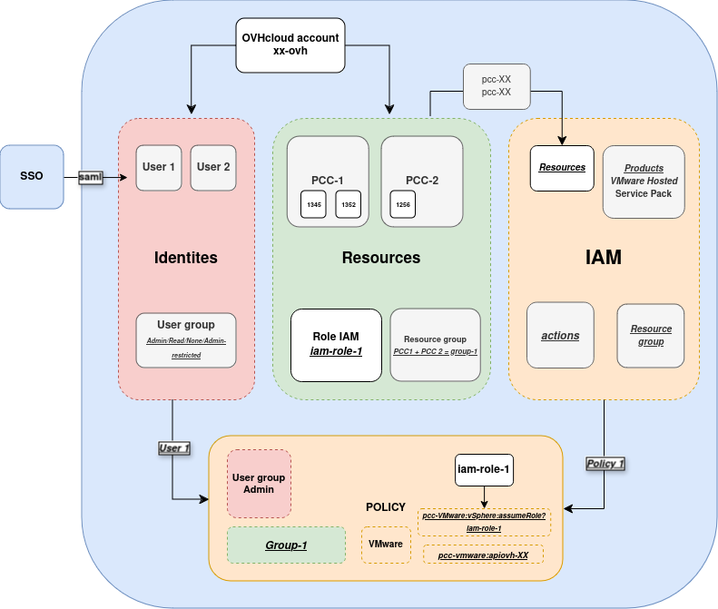

> [!warning]
> IAM for VMware on OVHcloud is currently in beta phase.
> This guide may be incomplete. Our team remains available on our dedicated Discord channel. Please feel free to join us and contact us: <https://discord.gg/ovhcloud>. Ask questions, give your feedback and interact directly with the team building our Hosted Private Cloud services.

## Objective

**This guide will explain how IAM works in your Hosted Private Cloud - VMware on OVHcloud**.

## Requirements

- An [OVHcloud account](/pages/account_and_service_management/account_information/ovhcloud-account-creation).
- Have access to the OVHcloud [control panel](/links/manager).
- One or more Hosted Private Cloud products - VMware on OVHcloud linked to this account (Hosted Private Cloud powered by VMware, VMware Service Pack).

## Instructions

### How does IAM and Hosted Private Cloud - VMware on OVHcloud work?

The activation of the OVHcloud IAM delegates the management of accesses to the OVHcloud IAM service. You can manage the associated roles and their permissions in vSphere via this page. Policy and access management is carried out from the OVHcloud IAM.

To simplify:

- An IAM role replaces a vSphere local user in the Hosted Private Cloud - VMware on OVHcloud.
- A policy allows you to associate your OVHcloud identity with this role.

Here are the elements required for IAM to work properly with Hosted Private Cloud - VMware on OVHcloud:

- Products: **vSphere/VMware (Hosted Private Cloud, service pack)**.
- Resources: **PCC-XXX**.
- Actions: **Managed or manual**.
- Users: **User 1/2/3**.

The diagram below shows how IAM works with all OVHcloud resources:

{.thumbnail}

The diagrams below are dedicated to usage of with Hosted Private Cloud - VMware on OVHcloud:

{.thumbnail}

{.thumbnail}

## FAQ

### What are the limitations of IAM with Hosted Private Cloud - VMware on OVHcloud?

IAM is currently in a BETA version on the OVHcloud platform. Infrastructures with enhanced security options or a certified service (Healthcare Data Hosting (HDS), Bank Data Hosting (PCI-DSS) or SecNumCloud (SNC)) cannot currently use OVHcloud IAM.

An IAM role can only be added through manual actions in a global policy (action: assumerole -> role_iam). For more information, see the guide "[How to create an IAM role in vSphere](/pages/hosted_private_cloud/hosted_private_cloud_powered_by_vmware/vmware_iam_role_policy)".

> [!primary]
>
> To date, a vSphere IAM role cannot be managed using managed permission groups.

### Can I activate IAM easily?

Yes, you can activate IAM via a single button in the OVHcloud Control Panel. For more information, see the guide “[How to enable IAM](/pages/hosted_private_cloud/hosted_private_cloud_powered_by_vmware/vmware_iam_activation)”.

### Can I choose between a local user and an IAM user when connecting to vSphere?

Yes, when IAM is enabled, you can choose between IAM and a Vphere local user, using the window that appears below:

{.thumbnail}

{.thumbnail}

### How do I access vSphere rights delegation with IAM?

**Associated identities**, **Resources**, **Resource groups** and their permissions in policies are managed from [the OVHcloud Control Panel](/links/manager). 
Click on your name in the top right-hand corner of the OVHcloud Control Panel, then click on your initials to go to the `My account`{.action} section. 
Under `My account`{.action}, click `Identities and access (IAM)`{.action].

You can manage IAM roles and local vSphere users in the `Hosted Private Cloud`{.action} section of the [OVHcloud Control Panel](/links/manager).
Click on the `VMware`{.action} section, select your infrastructure, then go to the `Users`{.action} tab.

### How many roles are available by default?

You have 2 active default roles when enabling IAM in your Hosted Private Cloud - VMware on OVHcloud.

### What is a vSphere IAM role linked to a policy?

Each IAM role in your Hosted Private Cloud - VMware on OVHcloud corresponds to an action written in the form `pccVMware:vSphere:assumeRole?role_name` in an IAM policy.

For example, for the **iam-admin** role of a Dedicated Cloud, the action is: `pccVMware:vSphere:assumeRole?iam-admin.`.

A role can be considered as a user template with which you define PCC (vSphere) rights, and you apply these rights (this role) to a user in your OVHcloud Control Panel (IAM, if you have linked your user to a policy).

## Go further

You can now follow the steps in the guide [IAM for VMware on OVHcloud - How to activate IAM](/pages/hosted_private_cloud/hosted_private_cloud_powered_by_vmware/vmware_iam_activation).

**IAM for VMware on OVHcloud - Guide index:**

- Guide 1: IAM for VMware on OVHcloud - Presentation and FAQ
- Guide 2: [IAM for VMware on OVHcloud - How to enable IAM](/pages/hosted_private_cloud/hosted_private_cloud_powered_by_vmware/vmware_iam_activation)
- Guide 3: [IAM for VMware on OVHcloud - How to create an IAM vSphere role](/pages/hosted_private_cloud/hosted_private_cloud_powered_by_vmware/vmware_iam_role)
- Guide 4: [IAM for VMware on OVHcloud - How to associate a vSphere role with an IAM policy](/pages/hosted_private_cloud/hosted_private_cloud_powered_by_vmware/vmware_iam_role_policy)
- Guide 5: [IAM for VMware on OVHcloud - How to associate a user with a global IAM policy](/pages/hosted_private_cloud/hosted_private_cloud_powered_by_vmware/vmware_iam_user_policy)

If you need training or technical assistance to implement our solutions, contact your sales representative or click on [this link](https://www.ovhcloud.com/en-gb/professional-services/) to get a quote and ask our Professional Services experts for a custom analysis of your project.

Join our community of users on <https://community.ovh.com/en/>.
