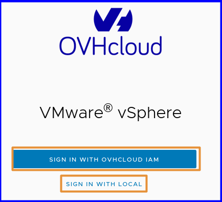
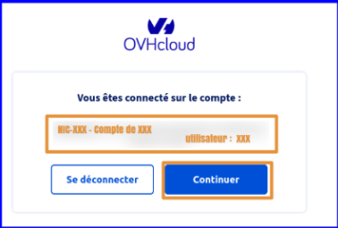

## Objectif

**Ce guide vous présente les principes de fonctionnement de IAM au sein de votre offre VMware on OVHcloud**.

## Prérequis

- Disposer d'un [compte OVHcloud](/pages/account_and_service_management/account_information/ovhcloud-account-creation).
- Avoir accès au [control panel](/links/manager) OVHcloud.
- Avoir un ou plusieurs produits Hosted Private Cloud - VMware on OVHcloud liés à ce compte (Hosted Private Cloud powered by VMware, Service Pack VMware).

## En pratique

### Comment fonctionne IAM et Hosted Private Cloud - VMware on OVHcloud ?

L'activation de l'IAM OVHcloud délègue la gestion des accès au service IAM OVHcloud. La gestion des rôles associés et leurs autorisations dans vSphere s'effectue depuis cette page. La gestion des politiques et accès s'effectue depuis l'IAM OVHcloud.

Pour simplifier :

- Un rôle IAM remplace ainsi un utilisateur local vSphere au sein du Hosted Private Cloud - VMware on OVHcloud.
- Une politique permet d'associer votre identité OVHcloud à ce rôle.
- Les rôles IAM fonctionne à l'aide des groupes VMware vSphere.

Voici les éléments nécessaires au bon fonctionnement d'IAM avec Hosted Private Cloud - VMware on OVHcloud :

- Produits : **vSphere / VMware (Hosted Private Cloud, service pack)**.
- Ressources : **PCC-XXX**.
- Actions : **Managées ou manuelles**.
- Utilisateurs : **Utilisateur 1/2/3**.

Le diagramme ci-dessous permet de comprendre comment fonctionne IAM avec l'ensemble des ressources OVHcloud :

{.thumbnail}

Les diagrammes ci-dessous sont dédiés à l'utilisation avec Hosted Private Cloud - VMware on OVHcloud : 

## FAQ

### Quelles sont les limitations de IAM avec Hosted Private Cloud - VMware on OVHcloud ?

> [!primary]
>
> À date, un rôle IAM vSphere ne peut pas être géré grâce aux groupes de permissions managées.
>
> Vous ne pourrez pas à ce jour bénéficier des fonctionnalités IAM sur notre plateforme Hosted Private Cloud VMware on OVHcloud PCIDSS, SNC, HDS). Il en est de même pour les PCC avec NSX activé.
>

IAM est actuellement dans une version BETA sur la plateforme OVHcloud. Les infrastructures bénéficiant des offres de sécurité réseau renforcée (NSX) ou d'un service certifié (Hébergement de Données de Santé (HDS), Hébergement de données bancaires (PCI-DSS) ou SecNumCloud (SNC)) ne peuvent actuellement pas utiliser l'IAM OVHcloud.

Un rôle IAM ne peut être ajouté que grâce aux actions manuelles dans une politique globale (action : assumerole -> role_iam). Pour plus d'informations, consultez le guide « [Comment créer un rôle IAM das Vsphere](/pages/hosted_private_cloud/hosted_private_cloud_powered_by_vmware/vmware_iam_role_policy) ».

### Est-ce que je peux activer IAM facilement ?

Oui, vous pouvez activer IAM via un seul bouton dans l'espace client OVHcloud. Pour plus d'informations, consultez le guide « [Comment activer IAM](/pages/hosted_private_cloud/hosted_private_cloud_powered_by_vmware/vmware_iam_activation) ».

### Est-ce que je peux choisir entre un utilisateur local et un utilisateur IAM lors de la connexion à vSphere ?

Oui, lorsque IAM est activé, vous avez la possibilité de choisir entre IAM et un utilisateur local Vphere, grâce à la fenêtre qui s'affiche ci-dessous :

{.thumbnail}

{.thumbnail}

### Comment est-ce que j'accède à la délégation des droits vSphere avec IAM ?

La gestion des **Identités associées**, des **Ressources**, **Groupes de ressources** et leurs autorisations dans les politiques s'effectue depuis [l'espace client OVHcloud](/links/manager). 
Cliquez sur votre nom en haut à droite de l'espace client puis cliquez sur vos initiales pour accéder à la rubrique `Mon compte`{.action}. 
Sous `Mon compte`{.action}, cliquez sur `Identités et accès (IAM)`{.action].

Quant à la gestion des rôles IAM et des utilisateurs vSphere locaux, elle s'effectue depuis la section `Hosted Private Cloud`{.action} de [l'espace client OVHcloud](/links/manager).
Cliquez sur la rubrique `VMware`{.action}, sélectionnez votre infrastructure puis rendez-vous dans l'onglet `Utilisateurs`{.action}.

### Combien de rôles sont disponibles par défaut ?

Vous disposez de 2 rôles par défaut actifs lors de l'activation d'IAM dans votre Hosted Private Cloud - VMware on OVHcloud.

### Que représente un rôle IAM vSphere lié à une politique ?

Chaque rôle IAM de votre Hosted Private Cloud - VMware on OVHcloud correspond à une action s'écrivant sous la forme `pccVMware:vSphere:assumeRole?nom_du_role` dans une politique IAM.

Par exemple, pour le rôle **iam-admin** d'un PCC, l'action est : `pccVMware:vSphere:assumeRole?iam-admin.`.

Un rôle peut être considéré comme un modèle (*template*) utilisateur avec lequel vous définissez des droits PCC (vSphere) et vous appliquez ces droits (ce rôle) sur un utilisateur de votre espace client OVHcloud (IAM, si vous avez lié votre utilisateur à une politique).

## Aller plus loin

Vous pouvez maintenant suivre les étapes du guide « [IAM pour VMware on OVHcloud - Comment activer IAM](/pages/hosted_private_cloud/hosted_private_cloud_powered_by_vmware/vmware_iam_activation) ».

**IAM pour VMware on OVHcloud - Index des guides :**

- Guide 1 : IAM pour VMware on OVHcloud - Présentation et FAQ
- Guide 2 : [IAM pour VMware on OVHcloud - Comment activer IAM](/pages/hosted_private_cloud/hosted_private_cloud_powered_by_vmware/vmware_iam_activation)
- Guide 3 : [IAM pour VMware on OVHcloud - Comment créer un rôle vSphere IAM](/pages/hosted_private_cloud/hosted_private_cloud_powered_by_vmware/vmware_iam_role)
- Guide 4 : [IAM pour VMware on OVHcloud - Comment associer un rôle vSphere à une politique IAM](/pages/hosted_private_cloud/hosted_private_cloud_powered_by_vmware/vmware_iam_role_policy)
- Guide 5 : [IAM pour VMware on OVHcloud - Comment associer un utilisateur à une politique IAM globale](/pages/hosted_private_cloud/hosted_private_cloud_powered_by_vmware/vmware_iam_user_policy)

Si vous avez besoin d'une formation ou d'une assistance technique pour la mise en oeuvre de nos solutions, contactez votre commercial ou cliquez sur [ce lien](https://www.ovhcloud.com/fr/professional-services/) pour obtenir un devis et demander une analyse personnalisée de votre projet à nos experts de l’équipe Professional Services.

Échangez avec notre communauté d'utilisateurs sur <https://community.ovh.com>.
