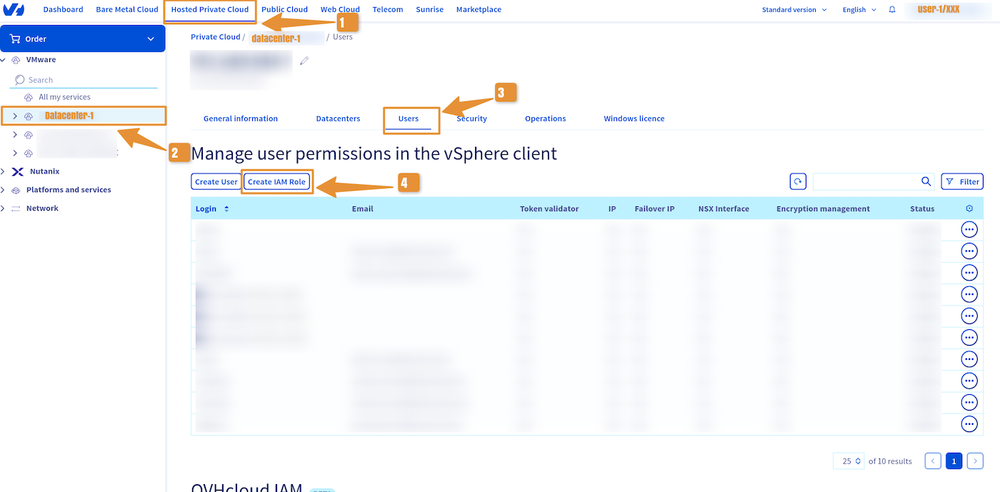
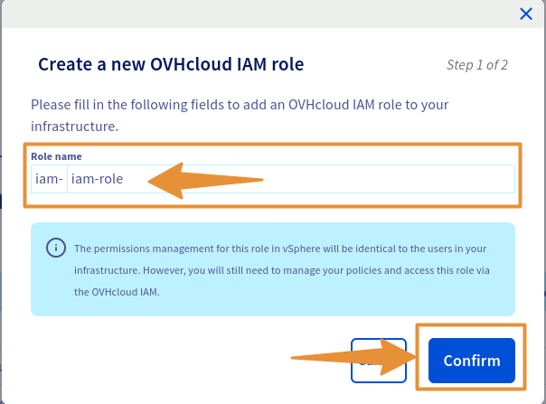

## Objectif

**Dans ce guide, nous allons vous expliquer comment créer un role IAM dans Hosted Private Cloud - VMware on OVHcloud**

## Prérequis

- Disposer d'un [compte OVHcloud](/pages/account_and_service_management/account_information/ovhcloud-account-creation)
- Avoir au préalable un ou plusieurs produits Hosted Private Cloud - VMware on OVHcloud liés à ce compte (Hosted Private Cloud powered by VMware, Service Pack VMware)

## En pratique

Vous disposez de 2 rôles IAM Vsphere par default, malgré ça nous allons vous expliquer comment créer un rôle.

### Comment créer un rôle IAM dans mon PCC ?

#### Via l'accès client :
> [!TIP]
> Les rôles IAM sont préfixés par : {{iam-}}

Accéder à la console OVHcloud, en suivant [le lien de l'espace client](/links/manager) et **Connectez-vous avec vos identifiants**.

Pour créer votre rôle IAM dans le PCC : 

1. Aller dans la section de votre cloud privée : `Hosted Private Cloud > PCC-XX > Utilisateurs`{.action}

2. Cliquer sur : `Créer un rôle IAM`{.action}
      
Ensuite quand la fenêtre s'affiche et Choisissez le nom de votre rôle puis,

3. Cliquer sur : `Confirmer`{.action}

Vous pouvez après éditer les droits du groupe de la même manière qu'avec un utilisateur local Vsphere. Vous pouvez aussi faire le choix d'être **Vsphere Admin** dans les permissions managées de la politique IAM.

{.thumbnail}

{.thumbnail}

#### Via l'API OVHcloud : 

> [!TIP]
> Les rôles IAM sont préfixés par "iam-"

> [!api]
>
> @api {v1} POST /dedicatedCloud/{serviceName}/iam/addRole
>

RETOUR:
```Shell
{
  "userId": null,
  "maintenanceDateTo": null,
  "parentTaskId": null,
  "datacenterId": null,
  "network": null,
  "createdBy": null,
  "state": "todo",
  "hostId": null,
  "endDate": null,
  "networkAccessId": null,
  "maintenanceDateFrom": null,
  "name": "addUser",
  "vlanId": null,
  "description": null,
  "filerId": null,
  "executionDate": "2024-05-15T14:21:17+02:00",
  "createdFrom": null,
  "taskId": 56446627,
  "orderId": null,
  "type": "generic",
  "progress": 0,
  "lastModificationDate": "2024-05-15T14:21:17+02:00"
}
```

## A suivre : Associer un utilisateur à une politique IAM globale

Vous pouvez maintenant suivre : [Comment associer un utilisateur à une politique IAM globale](/pages/hosted_private_cloud/hosted_private_cloud_powered_by_vmware/vmware_iam_user_policy)

## Aller plus loin

Échangez avec notre communauté d'utilisateurs sur <https://community.ovh.com>.

