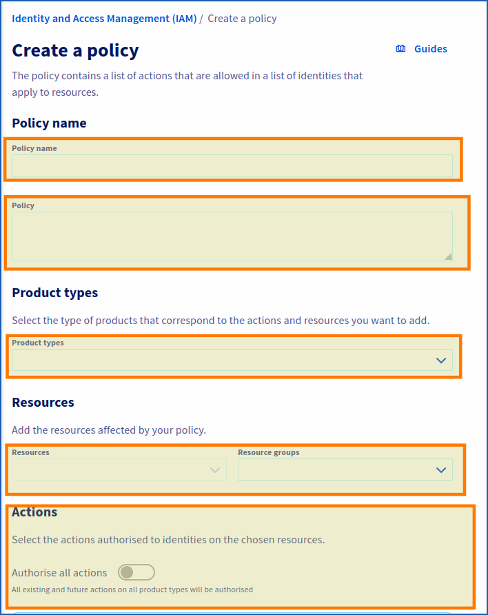
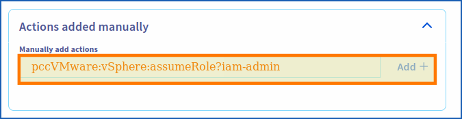

> [!primary]
> La fonctionnalité IAM pour VMware on OVHcloud est actuellement en phase bêta. Ce guide peut donc être mis à jour à l'avenir avec les avancées de nos équipes en charge de ce produit.
>

## Objectif

**Ce guide vous détaille comment créer ou modifier une politique IAM globale et lui ajouter un rôle Vsphere**.

## Prérequis

- Disposer d'un [compte OVHcloud](/pages/account_and_service_management/account_information/ovhcloud-account-creation)
- Avoir un ou plusieurs produits Hosted Private Cloud - VMware on OVHcloud liés à ce compte (Hosted Private Cloud powered by VMware, Service Pack VMware)
- Avoir activé IAM pour votre service Hosted Private Cloud - VMware on OVHcloud. Suivez les étapes du guide « [IAM pour VMware on OVHcloud - Comment activer IAM](/pages/hosted_private_cloud/hosted_private_cloud_powered_by_vmware/vmware_iam_activation) »

## En pratique

### Créer ou modifier une politique

<!-- CP-NAV-START:iam-policies -->
---

### Accès à l'espace client OVHcloud

- **Lien direct :** [Politiques IAM](/links/control-panel/iam-policies)
- **Pour accéder à vos services :** `Identity, Security & Operations`{.action} > `Politiques`{.action}

---
<!-- CP-NAV-END:iam-policies -->

Cliquez sur `Créer une politique`{.action}.<br>
Pour modifier une politique, cliquer sur le bouton `...`{.action} à droite de la politique concernée puis sur `Modifier la politique`{.action}.

{.thumbnail}

Renseignez les paramètres demandés :

- **Nom de la politique** : choisissez un nom.
- **Description** : renseignez une description pour votre politique.
- **Types de produit** : Hosted private cloud powered by VMware / Service Pack VMware.
- **Ressources** : ajoutez les ressources concernées par votre politique (**pcc-XX-XX-XX-XX/servicepack**, **pcc-XX-XX-XX-XX**, etc.)
- **Actions** : c'est ici que vous ajoutez votre rôle (voir ci-dessous).

#### Ajouter un rôle IAM à une politique globale

Lors de l'activation d'IAM dans vSphere, 2 rôles sont ajoutés par défaut (`iam-admin`, `iam-auditor`).

Copiez les rôles depuis la section de code ci-dessous, collez-les dans le champ intitulé « Ajouter manellement des actions » puis cliquez sur le bouton `Ajouter +`{.action}, sous la rubrique « Actions ».

```bash
pccVMware:vSphere:assumeRole?iam-admin
pccVMware:vSphere:assumeRole?iam-auditor
```

Si vous avez avez créé un rôle IAM supplémentaire (après avoir suivi les étapes du guide « [IAM pour VMware on OVHcloud - Comment créer un rôle vSphere IAM](/pages/hosted_private_cloud/hosted_private_cloud_powered_by_vmware/vmware_iam_role) »), vous pouvez également l'ajouter en copiant le code ci-dessous et en l'adaptant à votre rôle :

```bash
pccVMware:vSphere:assumeRole?{nom_du_rôle}
```

{.thumbnail}

Veillez à bien cliquer sur le bouton `Ajouter +`{.action} pour ajouter l'action.

Pour finir, cliquez sur `Créer une politique`{.action} (ou sur `Modifier la politique`{.action} le cas échéant).

## Aller plus loin

Vous pouvez maintenant suivre les étapes du guide « [IAM pour VMware on OVHcloud - Comment associer un utilisateur à une politique IAM globale](/pages/hosted_private_cloud/hosted_private_cloud_powered_by_vmware/vmware_iam_user_policy) ».

**IAM pour VMware on OVHcloud - Index des guides :**

- Guide 1 : [IAM pour VMware on OVHcloud - Présentation et FAQ](/pages/hosted_private_cloud/hosted_private_cloud_powered_by_vmware/vmware_iam_getting_started)
- Guide 2 : [IAM pour VMware on OVHcloud - Comment activer IAM](/pages/hosted_private_cloud/hosted_private_cloud_powered_by_vmware/vmware_iam_activation)
- Guide 3 : [IAM pour VMware on OVHcloud - Comment créer un rôle vSphere IAM](/pages/hosted_private_cloud/hosted_private_cloud_powered_by_vmware/vmware_iam_role)
- Guide 4 : IAM pour VMware on OVHcloud - Comment associer un rôle vSphere à une politique IAM
- Guide 5 : [IAM pour VMware on OVHcloud - Comment associer un utilisateur à une politique IAM globale](/pages/hosted_private_cloud/hosted_private_cloud_powered_by_vmware/vmware_iam_user_policy)

Si vous avez besoin d'une formation ou d'une assistance technique pour la mise en oeuvre de nos solutions, contactez votre commercial ou cliquez sur [ce lien](/links/professional-services) pour obtenir un devis et demander une analyse personnalisée de votre projet à nos experts de l’équipe Professional Services.

Échangez avec notre [communauté d'utilisateurs](/links/community).
