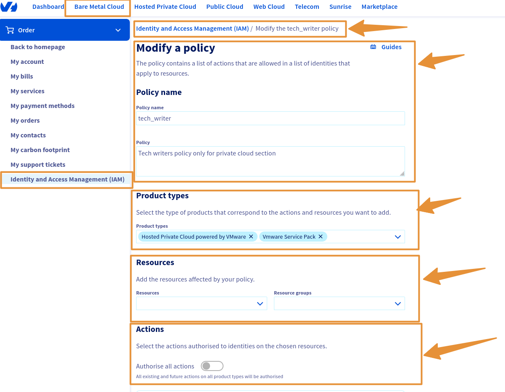
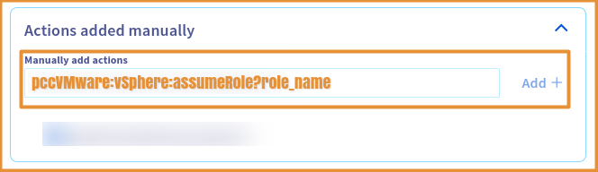

# Table des matières
1. [Objectif - Liens des guides IAM](#Objectif)
2. [Prérequis](#Prérequis)
3. [Instruction](#Instruction)
4. [A suivre](#A suivre)
5. [Fin - Aller plus loin](#Aller plus loin)

---
## Objectif

**Dans ce guide, nous allons vous expliquer comment associer un rôle IAM Vsphere à une politique globale**

## Prérequis

- Avoir un compte OVHcloud (voir guide :[Comment créer un compte OVHcloud](https://help.ovhcloud.com/csm/fr-account-create-ovhcloud-account?id=kb_article_view&sysparm_article=KB0043023)).
- Disposer au préalable d'un ou plusieurs produits liés à ce compte OVHcloud (Hosted Private Cloud powered by VMware, Service Pack VMware etc..)
- Savoir ["Créer et gérer des utilisateurs locaux sur un compte OVHcloud"](https://help.ovhcloud.com/csm/fr-account-managing-users?id=kb_article_view&sysparm_article=KB0043058).
- Avoir une politique IAM [Comment créer une politiques IAM"](https://help.ovhcloud.com/csm/fr-customer-iam-policies-ui?id=kb_article_view&sysparm_article=KB0058730).

## Instruction

## Etape 1 : Comment créer une politique ? (optionnel)

## Etape 2 : Comment associer un rôle IAM à une politique globale (policy) ?

### Dans la console OVHcloud :
1. Accéder à la console OVHcloud, en suivant [le lien de l'espace client](https://www.ovh.com/manager) et **connectez vous avec vos identifiants**.
2. Allez dans la section -> `IAM > Politiques`{.action},

Vous retrouverez vos politiques si vous en avez créés.

{.thumbnail}
{.thumbnail}
{.thumbnail}

### Dans les politiques :
Pour lier un rôle à une policy vous pouvez soit créer une politique ou alors modifiez en une. Si vous en créez une, plusieurs paramètres doivent être pris en compte :
1. Nom de la politique : Choisissez ce que vous voulez.
2. Description : Choisissez ce que vous voulez.
3. Ressources : Ajoutez les ressources concernées par votre politique **pcc-XX-XX-XX-XX/servicepack, pcc-XX-XX-XX-XX** etc..
4. Types de produit : **Hosted private cloud powered by VMware**.
5. Actions : C'est ici que vous ajoutez votre rôle :
   1. Dans la section `Action Ajouter Manuellement > Ajouter Manuellement Des Actions`{.action}.
   2. Copiez-collez ce paramètre avec le nom de votre rôle crée auparavant avec `pccVMware:vSphere:assumeRole?{{nom_du_rôle}}`{.action}

A Copiez-collez :
```Bash
pccVMware:vSphere:assumeRole?{{nom_du_rôle}}
```
{.thumbnail}

1. Cliquer sur -> `CREER ou MODIFIER`{.action}.

Si vous modifiez juste une politique :

1. Cliquez sur les `...` -> `MODIFIER`{.action} .

Vous retrouverez les mêmes paramètres à ajouter que lors d'une création.

## A suivre :

Je vous invite maintenant à associer un utilisateur OVHcloud à une politique IAM globale en suivant les instructions du tutoriel suivant : [Comment associer un utilisateur à une politique IAM globale](/pages/hosted_private_cloud/hosted_private_cloud_powered_by_vmware/vmware_iam_user_policy).

---
## Aller plus loin
Pour aller plus loin avec IAM, vous pouvez lire ces guides :

- [Comment utiliser les politiques IAM avec vSphere](https://help.ovhcloud.com/csm/fr-vmware-use-iam-vsphere?id=kb_article_view&sysparm_article=KB0059059){.external}
- [Liste des groupes de permissions OVHcloud](https://help.ovhcloud.com/csm/fr-customer-iam-permissionsgroup?id=kb_article_view&sysparm_article=KB0060254){.external}
- [Comment utiliser les politiques IAM depuis votre espace client](https://help.ovhcloud.com/csm/fr-customer-iam-policies-ui?id=kb_article_view&sysparm_article=KB0058730){.external}
- [Comment utiliser les politiques IAM via l’API OVHcloud](https://help.ovhcloud.com/csm/fr-customer-iam-policies-api?id=kb_article_view&sysparm_article=KB0056808){.external}
- [Gérer et exploiter - IAM](https://help.ovhcloud.com/csm/fr-documentation-manage-operate-iam?id=kb_browse_cat&kb_id=3d4a8129a884a950f07829d7d5c75243&kb_category=f9734072c014f990f0785f572a5744ed&spa=1){.external}
- [Comment analyser les résultats de politiques IAM](https://help.ovhcloud.com/csm/fr-iam-troubleshooting?id=kb_article_view&sysparm_article=KB0060455){.external}
  
Échangez avec notre communauté d'utilisateurs sur <https://community.ovh.com>.

