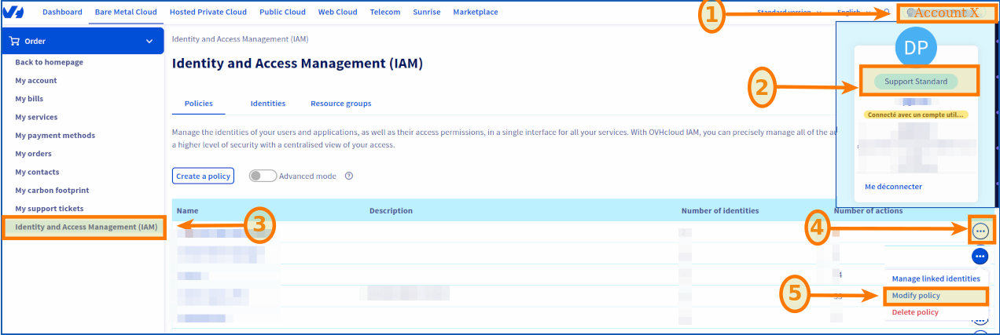

## Objectif
**Dans ce guide, nous allons vous expliquer comment créer ou modifier une politique IAM globale et lui ajouter un rôle Vsphere**.

## Prérequis
- Disposer d'un [compte OVHcloud](/pages/account_and_service_management/account_information/ovhcloud-account-creation)
- Avoir au préalable un ou plusieurs produits Hosted Private Cloud - VMware on OVHcloud liés à ce compte (Hosted Private Cloud powered by VMware, Service Pack VMware)
- Avoir IAM activé dans Hosted Private Cloud - VMware on OVHcloud : Guide 2 - [Comment activer IAM dans Hosted Private Cloud - VMware on OVHcloud](/pages/hosted_private_cloud/hosted_private_cloud_powered_by_vmware/vmware_iam_activation)

## En pratique

## Etape 1

### Créer une politique (optionnel)

Si vous avez une politique existante, cette étape est optionnel.

#### Accéder à IAM 

Accéder à la console OVHcloud, en suivant [le lien de l'espace client](/links/manager) et connecter vous avec vos identifiants.

Pour accéder au service IAM, cliquer sur le bouton en haut à droite de votre compte OVHcloud : `Support Standard > Identités et accès (IAM)`{.action}

{.thumbnail}

1. Ensuite, cliquer sur : `Créer une politique`{.action}.

{.thumbnail}

Vous retrouvez les mêmes paramètres à ajouter que lors d'une création :

- **Nom de la politique** : Choisissez ce que vous voulez.
- **Description** : Choisissez ce que vous voulez.
- **Ressources** : Ajoutez les ressources concernées par votre politique **pcc-XX-XX-XX-XX/servicepack, pcc-XX-XX-XX-XX** etc..
- **Types de produit** : Hosted private cloud powered by VMware, Service Pack.
- **Actions** : C'est ici que vous ajoutez votre rôle (voir étape 3).

2. Pour finir, cliquer sur `Créer une politique`{.action}

## Etape 2

### Modifier une politique

1. Accéder à la console OVHcloud, en suivant [le lien de l'espace client](/links/manager) et connecter vous avec vos identifiants.

Pour aller dans IAM, accéder depuis la console OVHcloud : `Support Standard > Identités et accès (IAM)`{.action}

Vous tomberez automatiquement dans la section : `Politiques`{.action}

{.thumbnail}

2. Pour modifier une politique, cliquer sur `...`{.action} > `Modifier la politique`{.action}

Vous retrouverez les mêmes paramètres à ajouter que lors d'une création :

- **Nom de la politique** : Choisissez ce que vous voulez.
- **Description** : Choisissez ce que vous voulez.
- **Ressources** : Ajoutez les ressources concernées par votre politique **pcc-XX-XX-XX-XX/servicepack, pcc-XX-XX-XX-XX** etc..
- **Types de produit** : Hosted private cloud powered by VMware, Service Pack.
- **Actions** : C'est ici que vous ajoutez votre rôle (voir étape 3).

3. Pour finir, Cliquer sur `Modifier la politique`{.action}

{.thumbnail}

## Etape 3

### Ajouter un rôle IAM à une politique globale

Lors de l'activation d'IAM dans Vsphere, 2 rôles sont ajoutés par défaut (iam-admin, iam-auditor). Ce sont ceux que nous allons ajouter ici.

#### Depuis l'espace client :

1. Accéder à la console OVHcloud, en suivant [le lien de l'espace client](/links/manager) et **connectez-vous avec vos identifiants**.

2. Aller dans la section : `Support Standard > Identités et accès (IAM) > Politiques`{.action}

{.thumbnail}

Vous retrouverez vos politiques si vous en avez créés.

Pour lier un rôle à une politique, aller dans **Actions**, puis **Action manuelles** :

1. Dans la section `Action`{.action} -> `Action ajouter manuellement`{.action}

2. Copier-coller l'action suivante : `pccVMware:vSphere:assumeRole?{{nom_du_rôle}}`{.action} dans **Ajouter manuellement des actions**

{thumbnail="h-300 .w-200"}

Vous pouvez ajouter les 2 rôles IAM crée par défaut lors de l'activation du service : `iam-admin, iam-auditor`{.action}

Vous retrouvez les 2 roles par défaut à copier-coller, ici :

```shell
pccVMware:vSphere:assumeRole?iam-admin
pccVMware:vSphere:assumeRole?iam-auditor
```
3. Cliquez sur `Ajouter`{.action}

4. Pour finir, cliquer sur `Créer la politique`{.action} ou `Modifier la politique`{.action} suivant le mode que vous avez choisie.

{.thumbnail}

{.thumbnail}

## A suivre

Vous pouvez maintenant suivre : [Comment associer un utilisateur à une politique IAM globale](/pages/hosted_private_cloud/hosted_private_cloud_powered_by_vmware/vmware_iam_user_policy).

## Aller plus loin

Échangez avec notre communauté d'utilisateurs sur <https://community.ovh.com>.

