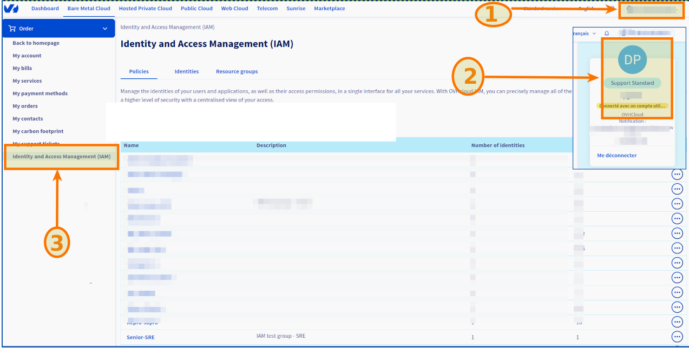
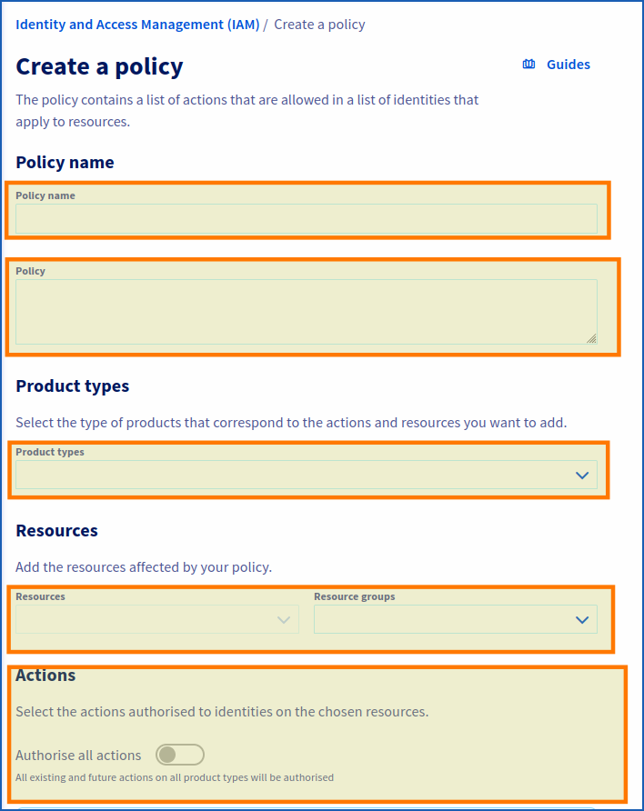
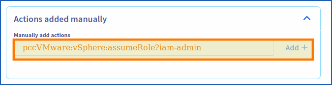

> [!warning]
> IAM for VMware on OVHcloud is currently in beta phase.
> This guide may be incomplete. Our team remains available on our dedicated Discord channel. Please feel free to join us and contact us: <https://discord.gg/ovhcloud>. Ask questions, give your feedback and interact directly with the team building our Hosted Private Cloud services.

## Objective

**This guide details how to create or modify a global IAM policy and add a vSphere role**.

## Requirements

- An [OVHcloud account](/pages/account_and_service_management/account_information/ovhcloud-account-creation).
- One or more Hosted Private Cloud products - VMware on OVHcloud linked to this account (Hosted Private Cloud powered by VMware, VMware Service Pack).
- IAM enabled for your Hosted Private Cloud service - VMware on OVHcloud. Follow the steps in the guide [IAM for VMware on OVHcloud - How to enable IAM](/pages/hosted_private_cloud/hosted_private_cloud_powered_by_vmware/vmware_iam_activation).

## Instructions

### Creating or editing a policy

Log in to your [OVHcloud Control Panel](/links/manager). Click on your name in the top right-hand corner of the OVHcloud Control Panel, then click on your initials to go to the `My account`{.action} section.<br>
Under `My account`{.action}, click `Identity and Access Management (IAM)`{.action].

{.thumbnail}

Click `Create a Policy`{.action}.<br>
To modify a policy, click the `...`{.action} button to the right of the policy concerned, then `Modify policy`{.action}.

{.thumbnail}

Enter the requested settings:

- **Policy name**: Choose a name.
- **Description**: Enter a description for your policy.
- **Product types**: Hosted private cloud powered by VMware / VMware Service Pack.
- **Resources**: Add the resources concerned by your policy (**pcc-XX-XX-XX-XX/servicepack**, **pcc-XX-XX-XX-XX**, etc.)
- **Actions**: This is where you add your role (see below).

#### Adding an IAM role to a global policy

When enabling IAM in vSphere, two roles are added by default (`iam-admin`, `iam-auditor`).

Copy the roles from the code section below, paste them into the field labeled "Actions added manually" under the “Actions” section, then click the `Add +`{.action} button.

```bash
pccVMware:vSphere:assumeRole?iam-admin
pccVMware:vSphere:assumeRole?iam-auditor
```

If you have created an additional IAM role (after following the steps in the guide “[IAM for VMware on OVHcloud - How to create an IAM vSphere role](/pages/hosted_private_cloud/hosted_private_cloud_powered_by_vmware/vmware_iam_role)”), you can also add it by copying the code below and adapting it to your role:

```bash
pccVMware:vSphere:assumeRole?{role_name}
```

{.thumbnail}

Be sure to click the `Add +`{.action} button to add the action.

Finally, click `Create policy`{.action} (or `Modify policy`{.action} if applicable).

## Go further

You can now follow the steps in the guide [IAM for VMware on OVHcloud - How to associate a user with a global IAM policy](/pages/hosted_private_cloud/hosted_private_cloud_powered_by_vmware/vmware_iam_user_policy).

**IAM for VMware on OVHcloud - Guide index:**

- Guide 1: [IAM for VMware on OVHcloud - Overview and FAQ](/pages/hosted_private_cloud/hosted_private_cloud_powered_by_vmware/vmware_iam_getting_started)
- Guide 2: [IAM for VMware on OVHcloud - How to enable IAM](/pages/hosted_private_cloud/hosted_private_cloud_powered_by_vmware/vmware_iam_activation)
- Guide 3: [IAM for VMware on OVHcloud - How to create an IAM vSphere role](/pages/hosted_private_cloud/hosted_private_cloud_powered_by_vmware/vmware_iam_role)
- Guide 4: IAM for VMware on OVHcloud - How to associate a vSphere role with an IAM policy
- Guide 5: [IAM for VMware on OVHcloud - How to associate a user with a global IAM policy](/pages/hosted_private_cloud/hosted_private_cloud_powered_by_vmware/vmware_iam_user_policy)

If you need training or technical assistance to implement our solutions, contact your sales representative or click on [this link](https://www.ovhcloud.com/it/professional-services/) to get a quote and ask our Professional Services experts for a custom analysis of your project.

Join our community of users on <https://community.ovh.com/en/>.
