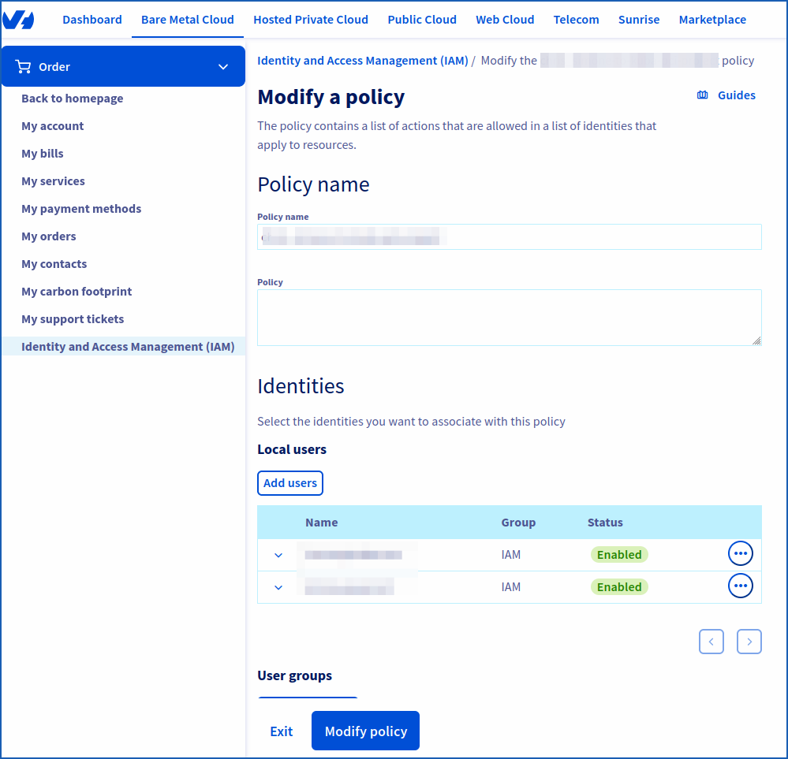

> [!warning]
> IAM for VMware on OVHcloud is currently in beta phase.
> This guide may be incomplete. Our team remains available on our dedicated Discord channel. Please feel free to join us and contact us: <https://discord.gg/ovhcloud>. Ask questions, give your feedback and interact directly with the team building our Hosted Private Cloud services.

## Objective

**This guide details how to associate an OVHcloud identity (a user) with a global IAM policy**.

## Requirements

- An [OVHcloud account](/pages/account_and_service_management/account_information/ovhcloud-account-creation).
- One or more Hosted Private Cloud products - VMware on OVHcloud linked to this account (Hosted Private Cloud powered by VMware, VMware Service Pack).
- IAM enabled for your Hosted Private Cloud service - VMware on OVHcloud. Follow the steps in the guide [IAM for VMware on OVHcloud - How to enable IAM](/pages/hosted_private_cloud/hosted_private_cloud_powered_by_vmware/vmware_iam_activation).

## Instructions

### How do I associate a user with a global IAM policy?

Log in to your [OVHcloud Control Panel](/links/manager). Click on your name in the top right-hand corner of the OVHcloud Control Panel, then click on your initials to go to the `My account`{.action} section. 
Under `My account`{.action}, click `Identity and Access Management (IAM)`{.action} and stay in the `Policies.`{.action} tab.

{.thumbnail}

You will find your policies if you have created some.

Click the `...`{.action} button to the right of the IAM policy concerned, then click `Manage linked identities`{.action}.

Then enter the identity you want. This can include users, a NIC handle, an email address, user groups.

Only IAM Groups (not vSphere IAM Groups) appear automatically, so be sure to copy and paste your choice without errors.

Confirm your choice by clicking `Add`{.action}.

{.thumbnail}

## Go further

**IAM for VMware on OVHcloud - Guide index:**

- Guide 1: [IAM for VMware on OVHcloud - Overview and FAQ](/pages/hosted_private_cloud/hosted_private_cloud_powered_by_vmware/vmware_iam_getting_started)
- Guide 2: [IAM for VMware on OVHcloud - How to enable IAM](/pages/hosted_private_cloud/hosted_private_cloud_powered_by_vmware/vmware_iam_activation)
- Guide 3: [IAM for VMware on OVHcloud - How to create an IAM vSphere role](/pages/hosted_private_cloud/hosted_private_cloud_powered_by_vmware/vmware_iam_role)
- Guide 4: [IAM for VMware on OVHcloud - How to associate a vSphere role with an IAM policy](/pages/hosted_private_cloud/hosted_private_cloud_powered_by_vmware/vmware_iam_role_policy)
- Guide 5: IAM for VMware on OVHcloud - How to associate a user with a global IAM policy

If you need training or technical assistance to implement our solutions, contact your sales representative or click on [this link](https://www.ovhcloud.com/es/professional-services/) to get a quote and ask our Professional Services experts for a custom analysis of your project.

Join our community of users on <https://community.ovh.com/en/>.
