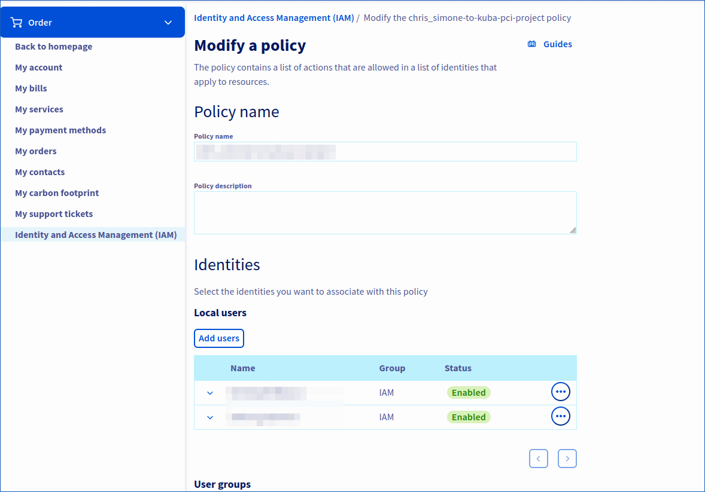
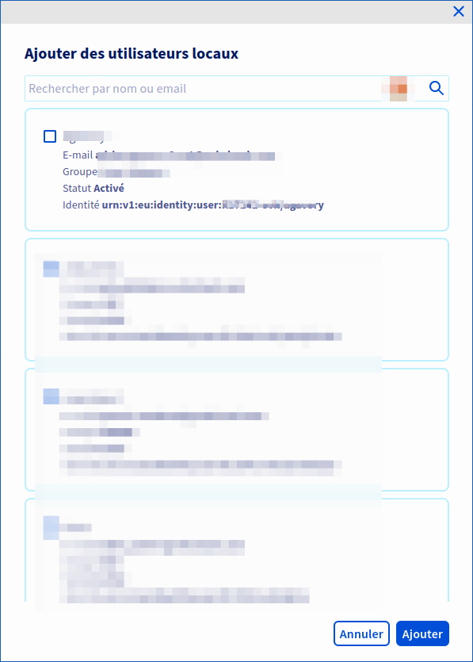

> [!warning]
> La fonctionnalité IAM pour VMware on OVHcloud est actuellement en phase bêta.
> Ce guide peut donc être incomplet. Notre équipe reste disponible sur notre canal Discord dédié. N’hésitez pas à nous rejoindre et à nous contacter : <https://discord.gg/ovhcloud>. Posez des questions, donnez votre avis et interagissez directement avec l’équipe qui construit nos services Hosted Private Cloud.

## Objectif

**Ce quide vous détaille comment associer une identité (un utilisateur) OVHcloud à une politique IAM globale**.

## Prérequis

- Disposer d'un [compte OVHcloud](/pages/account_and_service_management/account_information/ovhcloud-account-creation)
- Avoir un ou plusieurs produits Hosted Private Cloud - VMware on OVHcloud liés à ce compte (Hosted Private Cloud powered by VMware, Service Pack VMware)
- Avoir activé IAM pour votre service Hosted Private Cloud - VMware on OVHcloud. Suivez les étapes du guide « [IAM pour VMware on OVHcloud - Comment activer IAM](/pages/hosted_private_cloud/hosted_private_cloud_powered_by_vmware/vmware_iam_activation) »

## En pratique

### Comment associer un utilisateur à une politique IAM globale ?

Connectez-vous à votre [espace client OVHcloud](/links/manager). Cliquez sur votre nom en haut à droite de l'espace client puis cliquez sur vos initiales pour accéder à la rubrique `Mon compte`{.action}. 
Sous `Mon compte`{.action}, cliquez sur `Identités et accès (IAM)`{.action} et restez dans l'onglet `Politiques.`{.action}.

{.thumbnail}

Vous retrouverez vos politiques que vous avez déjà créés.

Cliquez sur votre politique `Ma politique`{.action} ou sur `Modifier ma politique`{.action}.

{.thumbnail}

Renseignez alors l'identité souhaitée dans les zones `Utilisateurs locaux` et `Groupes utilisateurs`.

En cliquant sur `Ajouter des utilisateurs`{.action} ou `Ajouter des groupes utilisateurs`{.action}.

{.thumbnail}

Uniquement les Groupes IAM (et non les groupes IAM vSphere) apparaissent automatiquement, attention à bien copier-coller votre choix sans fautes.

Validez l'ajout de votre utilisateur en cliquant sur `Ajouter`{.action}.

Puis pour terminer votre politique, cliquez sur `Modifier la politique`{.action}.

**Remarque** : Si votre identité n'est pas présente, vous devez l'ajouter à votre control panel OVHcloud auparavant.

## Aller plus loin

**IAM pour VMware on OVHcloud - Index des guides :**

- Guide 1 : [IAM pour VMware on OVHcloud - Présentation et FAQ](/pages/hosted_private_cloud/hosted_private_cloud_powered_by_vmware/vmware_iam_getting_started)
- Guide 2 : [IAM pour VMware on OVHcloud - Comment activer IAM](/pages/hosted_private_cloud/hosted_private_cloud_powered_by_vmware/vmware_iam_activation)
- Guide 3 : [IAM pour VMware on OVHcloud - Comment créer un rôle vSphere IAM](/pages/hosted_private_cloud/hosted_private_cloud_powered_by_vmware/vmware_iam_role)
- Guide 4 : [IAM pour VMware on OVHcloud - Comment associer un rôle vSphere à une politique IAM](/pages/hosted_private_cloud/hosted_private_cloud_powered_by_vmware/vmware_iam_role_policy)
- Guide 5 : IAM pour VMware on OVHcloud - Comment associer un utilisateur à une politique IAM globale

Si vous avez besoin d'une formation ou d'une assistance technique pour la mise en oeuvre de nos solutions, contactez votre commercial ou cliquez sur [ce lien](https://www.ovhcloud.com/fr/professional-services/) pour obtenir un devis et demander une analyse personnalisée de votre projet à nos experts de l’équipe Professional Services.

Échangez avec notre communauté d'utilisateurs sur <https://community.ovh.com>.
