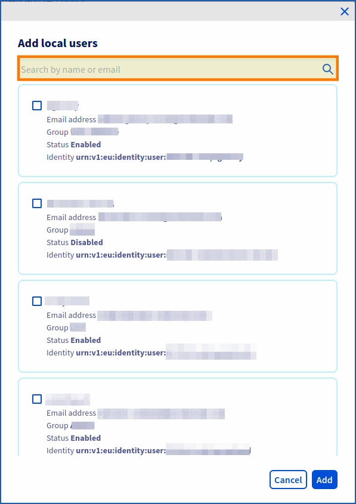
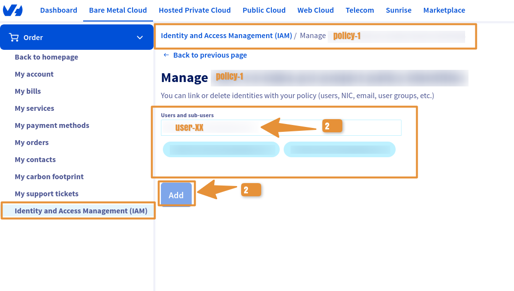

# Table des matières
1. [Objectif](#Objectif)
2. [Prérequis](#Prérequis)
3. [Instruction](#Instruction)
4. [A suivre](#Asuivre)
5. [Fin - Aller plus loin](#Aller plus loin)

---
## Objectif

**Ce quide vous explique comment associer un utilisateur OVHcloud à une politique IAM globale**

## Prérequis

- Avoir un compte OVHcloud, voir guide : [Comment créer un compte OVHcloud.](https://help.ovhcloud.com/csm/fr-account-create-ovhcloud-account?id=kb_article_view&sysparm_article=KB0043023){.external}.
- Disposer au préalable d'un ou plusieurs produits liés à ce compte OVHcloud de type : **Hosted Private Cloud powered by VMware / Service Pack VMware**.
- Savoir [comment utiliser les politiques IAM depuis votre espace client.](https://help.ovhcloud.com/csm/fr-customer-iam-policies-ui?id=kb_article_view&sysparm_article=KB0058730){.external}.

## Instruction

## Comment associer un utilisateur à une politique IAM globale ?

### Via l'espace client :

Accéder à la console OVHcloud, en suivant [le lien de l'espace client](https://www.ovh.com/manager) et **connectez vous avec vos identifiants**.

Ensuite allez dans la section  : 

1. `IAM` > `POLITIQUES.`{.action}

Vous retrouverez vos politiques si vous en avez.

2. Cliquez sur -> `...` > `GERER LES IDENTITES ASSOCIEES.`{.action}

Si vous n'avez pas de politique definis suivez ce guide pour en créer une : [Comment ajouter un rôle IAM à une politique globale](pages/hosted_private_cloud/hosted_private_cloud_powered_by_vmware/vmware_iam_role_policy)

{.thumbnail}

Il vous reste plus qu'à choisir l'identité : **utilisateurs, NIC, e-mail, groupes d'utilisateurs...** :

3. Cliquez dans le cadre -> `UTILISATEURS et SOUS-UTILISATEURS.`{.action} 

Les utilisateurs disponibles apparaitront et Choisissez -> **Utilisateur 1/2/3**

4. Validez votre choix en Cliquant sur `AJOUTER.`{.action}

{.thumbnail}

## FIN

Nous terminons cette première initiation avec IAM dans Hosted Private Cloud, si vous n'avez pas bien compris je vous invite à reprendre le listing des guides : 
- Guide 1 : [Premiers pas avec IAM et VMware sur OVHcloud](/pages/hosted_private_cloud/hosted_private_cloud_powered_by_vmware/vmware_iam_getting_started)
- Guide 2 : [Comment activer IAM dans un cloud privé VMware managé par OVH](/pages/hosted_private_cloud/hosted_private_cloud_powered_by_vmware/vmware_iam_activation)
- Guide 3 : [Comment créer un rôle IAM](/pages/hosted_private_cloud/hosted_private_cloud_powered_by_vmware/vmware_iam_role)
- Guide 4 : [Comment ajouter un rôle par defaut IAM manuellement à une politique globale](/pages/hosted_private_cloud/hosted_private_cloud_powered_by_vmware/vmware_iam_role_policy)
- Guide 5 : [Comment associer un utilisateur à une politique IAM globale](/pages/hosted_private_cloud/hosted_private_cloud_powered_by_vmware/vmware_iam_user_policy)

---
## Aller plus loin

Pour aller plus loin avec IAM, vous pouvez lire ces guides :

- [Comment utiliser les politiques IAM avec vSphere](https://help.ovhcloud.com/csm/fr-vmware-use-iam-vsphere?id=kb_article_view&sysparm_article=KB0059059){.external}
- [Liste des groupes de permissions OVHcloud](https://help.ovhcloud.com/csm/fr-customer-iam-permissionsgroup?id=kb_article_view&sysparm_article=KB0060254){.external}
- [Comment utiliser les politiques IAM depuis votre espace client](https://help.ovhcloud.com/csm/fr-customer-iam-policies-ui?id=kb_article_view&sysparm_article=KB0058730){.external}
- [Comment utiliser les politiques IAM via l’API OVHcloud](https://help.ovhcloud.com/csm/fr-customer-iam-policies-api?id=kb_article_view&sysparm_article=KB0056808){.external}
- [Gérer et exploiter - IAM](https://help.ovhcloud.com/csm/fr-documentation-manage-operate-iam?id=kb_browse_cat&kb_id=3d4a8129a884a950f07829d7d5c75243&kb_category=f9734072c014f990f0785f572a5744ed&spa=1){.external}
- [Comment analyser les résultats de politiques IAM](https://help.ovhcloud.com/csm/fr-iam-troubleshooting?id=kb_article_view&sysparm_article=KB0060455){.external}

Échangez avec notre communauté d'utilisateurs sur <https://community.ovh.com>.

