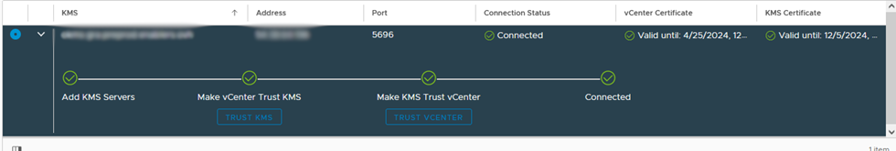

## Objectif

**Découvrez en détail comment configurer le chiffrement KMS (Key Management Service) sur vos machines virtuelles dans VMware vSphere**

## Prérequis

- Un serveur KMS
- Une clef de chiffrement RSA
- Un certificat SSL (PEM)

## En pratique

### Ouverture des flux

La première étape consiste à configurer le pare-feu pour autoriser les flux entre le serveur KMS et votre environnement vSphere.

Rendez-vous dans votre [espace client OVHcloud](https://www.ovh.com/auth/?action=gotomanager&from=https://www.ovh.com/fr/&ovhSubsidiary=fr). Dirigez-vous dans la section `Hosted Private Cloud` > `VMware` > `Votre PCC` > `Sécurité`.

Depuis la partie sécurité, rendez-vous dans la section `Virtual Machine Encryption Key Management Servers` (en bas de page), et ajouter un nouveau serveur KMS.

{.thumbnail}

{.thumbnail}

> [!primary]
> Pour récuperer votre empreintre SSL de votre serveur KMS suivez les instructions ci-dessous :
>

> [!tabs]
> **Windows**
>>
>> - Ouvrez votre navigateur web.
>> - Dans la barre d'adresse, entrez l'adresse IP de votre serveur précédée de https:// et suivi du port si nécessaire (par exemple: `https://192.0.2.1:443`).
>> - Lorsque la page est chargée, cliquez sur l'icône de cadenas situé à gauche de l'URL dans la barre d'adresse. Cela affichera des informations sur le certificat.
>> - Dans les informations du certificat, cherchez la section qui concerne l'empreinte digitale ou le fingerprint. Cette section peut être nommée différemment selon le navigateur que vous utilisez.<br>
>>
>> {.thumbnail}
>>
>> {.thumbnail}
>>
> **Linux / MacOs**
>>
>> Si vous être sur un hote linux ou MacOs il vous suffit d'executer la commande ci-dessous dans un terminal.<br>
>>
>> ```shell
>> openssl s_client -connect 54.38.64.196:5696 < /dev/null 2>/dev/null | openssl x509 -fingerprint -noout -in /dev/stdin
>> ```

### Ajouter le key provider dans vSphere

#### 1. Ajouter le Key Provider dans vSphere

Ouvrez votre navigateur web et rendez-vous à l'adresse fournie pour accéder à votre interface vSphere. Par exemple : `https://pcc-x.x.x.x.ovh.de/ui/`.
Une fois connecté, selectionnez l'onglet `Configure` de votre PCC, puis `Key Providers`. cliquez sur `Add a new Standard Key Provider`.

{.thumbnail}

Une fois que vous avez sélectionné l'option pour ajouter un Key Provider, une fenêtre ou un formulaire s'ouvrira pour saisir les détails du Key Provider que vous souhaitez ajouter. Cela peut inclure des informations telles que l'adresse IP ou le nom DNS du serveur KMS et le port utilisé.

{.thumbnail}

Attendez que vSphere établisse la connexion avec le Key Provider que vous avez ajouté. Vous devriez voir une indication ou un message confirmant que la connexion a été établie avec succès.

#### 2. Authentifier le Provider à vSphere

Selectionner votre Key Provider que vous venez de créer et cliquer sur le bouton `TRUST VCENTER`.

{.thumbnail}

Selectionnez `KMS Certificate and private key to vCenter.`. Puis renseignez votre certificat KMS et votre clef privée du serveur KMS.

{.thumbnail}

{.thumbnail}

Vous pouvez verifier que la connection à été établie en selectionnant votre Key Provider. L'option `Connected` doit être cochée.

{.thumbnail}

### Chiffrement d'une Machine Virtuelle

Localisez la machine virtuelle (VM) que vous souhaitez chiffrer. Faites un clic droit sur la machine virtuelle sélectionnée pour afficher le menu contextuel. Sélectionnez `VM Policies` puis choisissez `Edit VM Storage Policies`. Cela ouvrira une fenêtre ou un panneau où vous pourrez modifier les politiques de stockage de la VM sélectionnée.

{.thumbnail}

Recherchez les options de chiffrement ou de sécurité dans les politiques de stockage pour activer le chiffrement KMS pour cette VM.

{.thumbnail}

Après avoir apporté les modifications nécessaires, enregistrez les modifications et fermez la fenêtre.

Vous avez maintenant édité les politiques de stockage de la VM et activer le chiffrement KMS pour votre serveur. Un petit cadenas sur le résumé des informations de votre machine virtuelle le confirme.

{.thumbnail}

## Aller plus loin <a name="go-further"></a>

Échangez avec notre communauté d'utilisateurs sur <https://community.ovh.com>.
