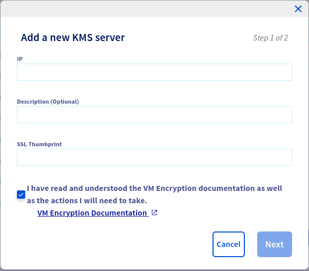
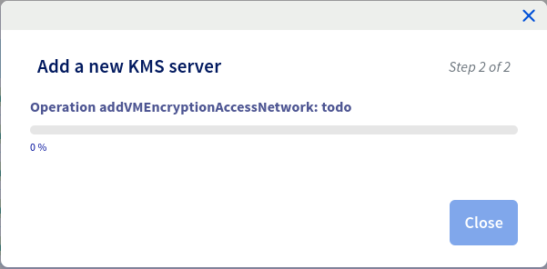
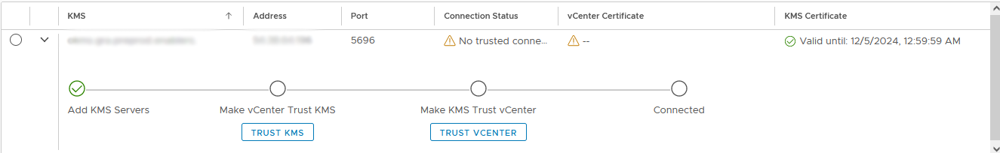

## Objective

**This guide explains in detail how to configure Key Management Service (KMS) encryption on your virtual machines in VMware vSphere.**

## Requirements

- A KMS server  
- An RSA encryption key
- SSL certificate (PEM)

## Instructions

### Open workflows

The first step is to configure the firewall to allow traffic between the KMS server and your vSphere environment.

To do this, log in to your [OVHcloud Control Panel](/links/manager). Go to `Hosted Private Cloud` > `VMware` > `Your Dedicated Cloud` > `Security`.

Once in the security section, go to the `Virtual Machine Encryption Key Management Servers` section (at the bottom of the page), and add a new KMS server.

{.thumbnail}

{.thumbnail}

> [!primary]
> To retrieve your SSL fingerprint from your KMS server, follow the instructions below by navigating through the tabs.
>

> [!tabs]
> **Windows**
>>
>> - Open your web browser.
>> - In the address bar, enter your server’s IP address preceded by `https://` and followed by the port if necessary (for example: `https://192.0.2.1:443`).
>> - When the page loads, click the padlock icon to the left of the URL in the address bar. This will display the certificate information.
>> - In the certificate information, look for the section that relates to the *fingerprint*. This section can be named differently depending on the browser you are using.<br>
>>
>> {.thumbnail}
>>
>> {.thumbnail}
>>
> **Linux/MacOS**
>>
>> If you are on a Linux or MacOS host, simply run the command below in a terminal.<br>
>>
>> ```shell
>> openssl s_client -connect 54.38.64.196:5696 < /dev/null 2>/dev/null | openssl x509 -fingerprint -noout -in /dev/stdin
>> ```

### Add the Key Provider in vSphere

#### 1. Add the Key Provider in vSphere

Open a web browser and go to the address provided to access your vSphere interface. For example: `https://pcc-x.x.x.x.ovh.de/ui/`.
Once logged in, select the `Configure` tab of your Dedicated Cloud then `Key Providers`. click `Add a new Standard Key Provider`.

{.thumbnail}

Once you have selected the option to add a Key Provider, a window or form will open where you will be asked to enter the details of the Key Provider you want to add. This may include information such as the IP address or DNS name of the KMS server and the port used.

{.thumbnail}

Wait for vSphere to establish the connection with the Key Provider you have added. You should see a hint or message confirming that the connection has been successfully established.

#### 2. Authenticate the Provider to vSphere

Select your Key Provider you have just created and click on the `TRUST VCENTER` button.

{.thumbnail}

In the context menu, select `KMS Certificate and private key to vCenter.`. Then enter your KMS certificate and your KMS server private key.

{.thumbnail}

{.thumbnail}

You can check that the connection has been established by selecting your Key Provider. The `Connected` option must be ticked.

{.thumbnail}

### Encryption of a Virtual Machine

Locate the virtual machine (VM) you want to encrypt. Right-click on the selected VM to display the shortcut menu. In the context menu, select `VM Policies` and then select `Edit VM Storage Policies`. This will open a window or panel where you can modify the storage policies of the VM selected.

{.thumbnail}

Search for encryption or security options in storage policies to enable KMS encryption for this VM.

{.thumbnail}

After making the necessary changes, save the changes and close the window.

You have now edited the VM storage policies and enabled KMS encryption for your server. A small padlock on your virtual machine’s summary information confirms this.

{.thumbnail}

## Go further <a name="go-further"></a>

Join our community of users on <https://community.ovh.com/en/>.