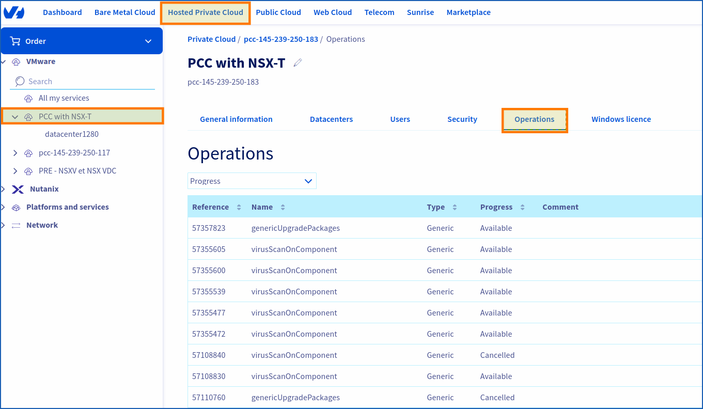
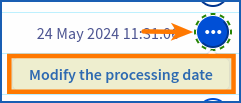
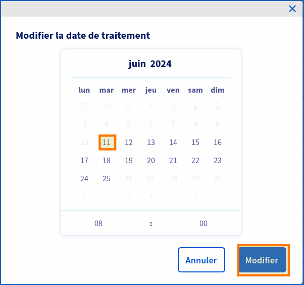

> [!warning]
> 
> Si vous avez besoin d'une formation ou d'une assistance technique pour la mise en œuvre de nos solutions, contactez votre Technical Account Manager ou allez sur [cette page](https://www.ovhcloud.com/fr/professional-services/) pour obtenir un devis et demander une analyse personnalisée de votre projet à nos experts de l’équipe Professional Services. 
>

## Objectif
 
**Ce guide vous offre des éclaircissements sur les opérations de maintenance effectuées par les équipes de OVHcloud.**

## En pratique

Les opérations de maintenance au sein d'OVHcloud témoignent d'un grand savoir-faire de la part des équipes internes. Celui-ci a été peaufiné et perfectionné au fil des années afin de garantir la fiabilité et la performance des équipements.

### Accéder aux opérations disponibles

#### Via le control panel OVHcloud

Pour accéder à vos opérations de maintenance depuis le [control panel OVHcloud](/links/manager), veuillez-vous référer au début du guide : [En pratique - Accéder aux opération d'une maintenance programmée sur votre Hosted Private Cloud](/pages/hosted_private_cloud/hosted_private_cloud_powered_by_vmware/maintenance-rescheduling).

{.thumbnail}

Pour connaitre les opérations en cours, vous pouvez mettre à jour cette section opération du control panel grâce au bouton `Rafraîchir`{.action} : {.thumbnail}

Il est possible de modifier la date de traitement d'une opération en cours en cliquant sur `...`{.action}, puis `Modifier la date de traitement`{.action}.

#### Via l'API OVHcloud

Consultez le guide [Premiers pas avec les API OVHcloud](/pages/manage_and_operate/api/first-steps) pour vous familiariser avec l'utilisation des APIv6 OVHcloud.

> [!api]
>
> @api {v1} /dedicatedCloud get /dedicatedCloud/{serviceName}/robot
>

> **Parameters:**
>
> serviceName: La reference de votre PCC, (pcc-XXX-XXX-XXX-XXX).
> 

Exemple, ce shéma de retour peut être long suivant la taille de votre infrastructure :

```Shell
...
  "updateUser",
  maintenanceLinkAlreadyOrderedCertsToObjects,
  maintenanceFixTransportMode,
  maintenanceUpdateAntivirusConfiguration,
...
```

Pour avoir le détail de chaque robot :

>
> @api {v1} /dedicatedCloud get /dedicatedCloud/{serviceName}/robot/{name}
>

> **Parameters:**
>
> serviceName : La reference de votre PCC, (pcc-XXX-XXX-XXX-XXX).
>
> name : Le nom du robot, (maintenanceUpdateAntivirusConfiguration).
> 

```Shell
{
  "type": "task",
  "enabled": true,
  "name": "maintenanceUpdateAntivirusConfiguration",
  "criticity": "normal",
  "description": ""
}
```

### Modifier la date de traitement d'une opération

{thumbnail}

Une fois que la fenêtre de modification de date s'affiche :

{thumbnail}

Vous pouvez choisir la date que vous souhaitez en cliquant dessus, exemple ici: `11`{.action}, puis sur `Modifier`{.action}

## Export d'une opération de maintenance

### Depuis le control panel OVHcloud :

La section opération de votre control panel OVHcloud dispose de 11 sections.

Exemple, ici d'un export des opérations du control panel Hosted Private Cloud VMware on OVHcloud :

| Référence | Nom               | Type      | Progression | Commentaire                                       | Services affectés | 	Créé de                 | Créé par                 | 	Traitement          | Fin                  | Mis à jour           |
|-----------|-------------------|-----------|---------|---------------------------------------------------|-------------------|--------------------------|--------------------------|----------------------|----------------------|----------------------|
| 44XXXXXX  | provisionVcsaSolo | Générique | Terminé | Provisions infrastructure management for customer | Tâche : 44XXXXXX  | Information indisponible | Information indisponible | XX mai 2023 18:37:51 | XX mai 2023 18:37:XX | XX mai 2023 18:37:58 |
| | | | | | | | | | | |

Un ID de référencement d'opération commençant par 44 est toujours ajouté sur chaque opération, ainsi qu'un nom, un type, une progression, un commentaire, un service affectés, et des dates de traitement.

Bien sûr, pour chaque service OVHcloud (Bare Metal Cloud, Public Cloud, etc..) ces noms et références peuvent changer.

## Details des opérations de maintenance

| Nom des maintenances | But                                                                                                                                                                                                                                                                                                                                            | Raison                                                              | Instructions préventives                                                                                                                                                                                                                                                                                                                                                                                                                                                                                                     | Impact                                                                                                                                                                                                                                                                    | Durée approximative                                                                                                     | Frequence                              | Peut être reprogrammé ? | Référence à une documentation technique |
|---|------------------------------------------------------------------------------------------------------------------------------------------------------------------------------------------------------------------------------------------------------------------------------------------------------------------------------------------------|---------------------------------------------------------------------|------------------------------------------------------------------------------------------------------------------------------------------------------------------------------------------------------------------------------------------------------------------------------------------------------------------------------------------------------------------------------------------------------------------------------------------------------------------------------------------------------------------------------|---------------------------------------------------------------------------------------------------------------------------------------------------------------------------------------------------------------------------------------------------------------------------|-------------------------------------------------------------------------------------------------------------------------|----------------------------------------|-------------------------|-----------------------------------------|
| windowsUpdateOnPcc | Mise à jours (update) Windows sur les machines virtuelles du control plane gérées par OVHcloud.                                                                                                                                                                                                                                                | Mise à jour de sécurité.                                            | Aucune                                                                                                                                                                                                                                                                                                                                                                                                                                                                                                                       | Maintenance effectué seulement si Veeam et/ou les options Zerto sont souscrites  <br><br> Control Plane indisponible durant la plage de maintenance.                                                                                                                      | 00H30 pour Veeam. <br><br> 00H30 pour Zerto.                                                                            | Mensuel.                               | Oui                     
| upgradeSwitch  | Mise à niveau logiciel- (upgrade) des switchs à la dernière version validée par le département réseau OVHcloud.                                                                                                                                                                                                                                | Cycle de vie OVHcloud Arista.  <br><br> Patchs de sécurité.         | Vérification de l'hôte en double attachement (dual-attached).                                                                                                                                                                                                                                                                                                                                                                                                                                                                | Basculement de tor (top of rack) A (swith A)vers tor (top of rack) B (switch B).                                                                                                                                                                                          | 01H30                                                                                                                   | Basé sur le cycle de vie de l'éditeur. | Oui                     |                                         |
| maintenanceGenericUpgradePackages | Mise à niveau (upgrade) du systèmes d'exploitation sur les machines virtuelles du control plane gérées par OVHcloud.                                                                                                                                                                                                                           | Cycle de vie OVHcloud   <br><br>  Patchs de sécurité.               | Aucune                                                                                                                                                                                                                                                                                                                                                                                                                                                                                                                       | Control plane indisponible* (management) durant le délais de maintenance.                                                                                                                                                                                                 | 02H00                                                                                                                   | Mensuel (standard).                    | Oui                     |                                         |
| maintenanceRenewAndDeploySslCertificate | Vérification, commande et renouvellement des certificats SSL sur les machines virtuelles du control plane gérées par OVHcloud.                                                                                                                                                                                                                 | Renouvellement des certificats SSL avant la date d'expiration.      | Aucune                                                                                                                                                                                                                                                                                                                                                                                                                                                                                                                       | Control plane indisponible* (management) durant le délais* de maintenance.                                                                                                                                                                                                | 01H00                                                                                                                   | Trimestriellement (standard).          | Oui                     |                                         |
| maintenanceUpgradeHosts | Mise à niveau logiciel (upgrade) d'ESXi à la dernière version proposée par OVHcloud. Cette maintenance peut installer des versions mineures ou majeures.                                                                                                                                                                                       | Cycle de vie OVHcloud.      <br><br>  Patchs de sécurité.           | Pendant cette maintenance, tous les hôtes peuvent être mis en mode maintenance et toutes les machines virtuelles peuvent être évacuées automatiquement.  <br><br> Le client doit s'assurer qu'aucune des configurations suivantes n'empêche cette action :  <br><br> Aucun media ISO ou périphérique monté  <br><br> Règles d'anti-affinité  <br><br> Tout autre élément susceptible d’empêcher le déplacement d’une machine virtuelle  <br><br> Les produits tiers sont conformes et compatible à la nouvelle version ESXi. | Une fois que les hotes sont en mode maintenance : toutes les machines virtuelles sont automatiquement évacuées avec vMotion <br><br> Les hôtes sont redémarrés <br><br>                                                                                                   | 00H30 par hote.                                                                                                         | Basé sur le cycle de vie de l'éditeur. | Oui                     |                                         |
| maintenanceUpgradeVcenter | Mise à niveau (upgrade) logiciel de vCenter Server Appliance à la dernière version proposée par OVHcloud. Cette maintenance peut installer des versions mineures ou majeures. Les mises à niveau (upgrade) des options peuvent également être déclenchées (Veeam Managed, zerto) pour s'assurer que la matrice de compatibilité est cohérente. | Cycle de vie OVHcloud.      <br><br>  Patchs de sécurité.           | Les logiciels tiers sont conforment à la nouvelle version de VCSA.                                                                                                                                                                                                                                                                                                                                                                                                                                                           | Control Plane indisponible* (management) durant le délais de maintenance.                                                                                                                                                                                                 | 02H00 <br><br> (Peut varier en fonction du nombre d'utilisateurs et du temps nécessaire à appliquer les autorisations). | Basé sur le cycle de vie de l'éditeur. | Oui                     |                                         |
| maintenanceUpgradeVrops | Mise à niveau (upgrade) des machines virtuelles Aria Operations (appelée vROps auparavant) vers la dernière version proposée par OVHcloud.                                                                                                                                                                                                     | Cycle de vie OVHcloud Arista.  <br><br> Patchs de sécurité.         | Aucune                                                                                                                                                                                                                                                                                                                                                                                                                                                                                                                       | vROps est indisponible pendant le délais* de maintenance.                                                                                                                                                                                                                 | 01H30                                                                                                                   | Basé sur le cycle de vie de l'éditeur. | Oui                     |                                         |
| maintenanceUpgradeNsxt | Mise à niveau (upgrade) de la version de NSX-T vers la dernière version proposée par OVHcloud.                                                                                                | Cycle de vie OVHcloud de VMware <br><br> Mise à niveau de sécurité. | Ressources suffisantes (calcul et stockage) disponibles sur l'infrastructure du client pour héberger Edge ([voir prérequis :](https://docs.vmware.com/en/VMware-NSX/4.1/installation/GUID-22F87CA8-01A9-4F2E-B7DB-9350CA60EA4E.html)). <br><br> La résilience est assurée sur l'infrastructure du client pour héberger les Edges NSX-T.                                                                                                                                                                                      | Le control plane NSX-T n'est pas disponible pendant l'opération de mise à niveau. <br><br> Le vMotion des Edges peut subir une légère perturbation des flux (reconnexion nécessaire pour les applications statefull).                                                     | 02H30                                                                                                                   | Basé sur le cycle de vie de l'éditeur. | Oui                     |                                         |
| maintenanceUpgradeVeeamManaged | Mise à niveau (upgrade) des machines virtuelles du control plane Veeam gérées par OVHcloud (serveur virtuelles de sauvegarde et de réplication, backup proxy) vers la dernière version proposée par OVHcloud.                                                                                                                                  | Cycle de vie OVHcloud de Veeam.                                     | Aucune                                                                                                                                                                                                                                                                                                                                                                                                                                                                                                                       | Les opérations de restauration et de sauvegarde ne peuvent pas être effectuées pendant la maintenance.                                                                                                                                                                    | 01H00                                                                                                                   | Basé sur le cycle de vie de l'éditeur. | Oui                     |                                         |
| maintenanceUpgradeZvm | Mise à jour (update) des machines virtuelles Zerto (Zerto Virual Manager, VRA) vers la dernière version proposée par OVHcloud.                                                                                                                                                                                                                 | Cycle de vie Zerto de OVHcloud.                                     | Aucune                                                                                                                                                                                                                                                                                                                                                                                                                                                                                                                       | La console Zerto n'est pas disponible pendant la maintenance, toutes les opérations zerto associées ne peuvent pas être effectuées (fail-over, gestion des VPG...) / VRA est redéployés de sorte que la réplication est interrompue et que le RPO augmente momentanément. | 01H30                                                                                                                   | Basé sur le cycle de vie de l'éditeur. | Oui                     |                                         |   |

## Glossaire

**Control Plane non disponible** : Signifie que le VCSA ne peut pas être contacté (ping). Par conséquent, tous les produits qui doivent atteindre VCSA ne fonctionneront pas. 

Cela représente les produits/options suivants dans Hosted Private Cloud :
- **NSX-T** interface
- **vROps** interface
- **Veeam** Managé (pas d'opération de sauvegarde/restauration)
- **Zerto** interface (replication en continu)
- **Tanzu** Kubernetes Grid

Tout autre produit de niveau que vous pouvez utiliser et qui nécessite **VCSA** sera également affecté.


## Le Control plane, c'est quoi ?

Le control plane (plan de control) désigne la partie du système responsable de la gestion et du contrôle des ressources dans un environnement virtualisé. Plus précisément, le plan de contrôle est la couche logicielle qui gère les opérations et les décisions liées à la configuration, à la gestion des ressources, au suivi et à l'orchestration des machines virtuelles et de l'infrastructure associée.

- **Gestion des ressources** : il prend en charge la configuration et la gestion des ressources physiques (serveurs, stockage, mise en réseau) et virtuelles (machines virtuelles).

- **Orchestration** : il coordonne les opérations entre les différents composants de l'infrastructure, facilitant le déploiement, la migration et la gestion des machines virtuelles.

- **Monitoring** : il collecte des données sur les performances, l’état de santé et l’utilisation des ressources à des fins de monitoring et de reporting en temps réel.

- **Sécurité** : il gère les politiques de sécurité, y compris l'authentification, l'autorisation et le contrôle d'accès, assurant ainsi la sécurité des ressources virtualisées.

- **Automatisation** : il prend en charge l'automatisation des tâches répétitives, permettant aux administrateurs de définir des workflows et des stratégies automatisées.

En résumé, le plan de contrôle est la couche logicielle qui assure la gestion, la coordination et le contrôle centralisés.

## Aller plus loin
 
Échangez avec notre communauté d'utilisateurs sur <https://community.ovh.com/>.


