<style>
details>summary {
color:rgb(33, 153, 232) !important;
cursor: point;
}
details>summary::before {
content:'\25B6';
padding-right:1ch;
}
details[open]>summary::before {
content:'\25BC';
}
</style>

> [!primary]
>
> This feature is available in beta version. This guide may be incomplete, and will be updated during this period.
>

## Objective

**Find out how to order, activate and configure an OVHcloud KMS (OKMS) within a VMware vSphere managed on OVHcloud to enable the encryption policy for your virtual machines.**

## Requirements

- You must be logged in to the [OVHcloud Control Panel](/links/manager).
- You must have an offer [Hosted Private Cloud VMware vSphere on OVHcloud](https://www.ovhcloud.com/en-gb/enterprise/products/hosted-private-cloud/).
- You must have the necessary rights to manage VMware HPC resources and OVHcloud KMS with IAM.
- You must have read the guides:
 - [KMS integration for VMware on OVHcloud](/pages/hosted_private_cloud/hosted_private_cloud_powered_by_vmware/kms_vmware_overall).
 - [Getting started with OKMS](/pages/manage_and_operate/kms/quick-start).
- The KMS public certificate (OKMS) (step [vCenter Trust KMS](#trust-okms)).
- A certificate signature request (CSR) generated by vSphere and signed by OKMS to trust the exchanges between the OVHcloud KMS and vCenter.

## In practice <a name="summary"></a>

**Summary of guide steps**:

- [Introduction - Lists of OVHcloud KMS endpoints](#introduction)
- [Step 1 - Order an OVHcloud KMS (mandatory)](#order-okms)
- [Step 2 - OVHcloud KMS activation (mandatory)](#activation-okms)
- [Step 3 - Create an IAM policy (required)](#iam-creation)
- [Step 4 - Configuring OKMS with vSphere (mandatory)](#add-okms)
- [Step 5 - Create a VM storage policy (mandatory)](#storage-policy)
- [Step 6 - Enabling encryption on a VM (mandatory)](#activation-encryption)
- [End - Useful information TLS OKMS](#useful-information)

### Introduction <a name="introduction"></a>

/// details | Introduction, list of available URLs and OKMS API calls.

For more information on the choices you can make with KMS and VMware on OVHcloud Hosted Private Cloud, please read our guide “[Introduction to solutions for encrypting VMs](/pages/hosted_private_cloud/hosted_private_cloud_powered_by_vmware/kms_vmware_overall)”.

#### URLs OKMS

> [!Primary]
>
> These links can be changed and updated.
>

| **Type**    | **URL**                         | **Region**          | **OKMS Enum Region** | **IP**         |
|-------------|---------------------------------|---------------------|----------------------|----------------|
| **KMIP**    | eu-west-rbx.okms.ovh.net        | France - Roubaix    | EU_WEST_RBX          | 91.134.128.102 |
| **KMIP**    | eu-west-rbx.okms.ovh.net        | France - Roubaix    | EU_WEST_RBX          | 91.134.128.102 |
| **REST**    | eu-west-rbx.okms.ovh.net        | France - Roubaix    | EU_WEST_RBX          | 91.134.128.102 |
| **Swagger** | swagger-eu-west-rbx.okms.ovh.net | France - Roubaix    | EU_WEST_RBX          | 91.134.128.102 |
| **KMIP**    | eu-west-sbg.okms.ovh.net        | France - Strasbourg | EU_WEST_SBG          | 137.74.127.152 |
| **KMIP**    | eu-west-sbg.okms.ovh.net        | France - Strasbourg | EU_WEST_SBG          | 137.74.127.152 |
| **REST**    | eu-west-sbg.okms.ovh.net        | France - Strasbourg | EU_WEST_SBG          | 137.74.127.152 |
| **Swagger** | swagger-eu-west-sbg.okms.ovh.net | France - Strasbourg | EU_WEST_SBG          | 137.74.127.152 |

#### List of API v1 and v2 KMS calls <a name="listing-api"></a>

> [!Primary]
>
> These API calls can be changed and updated.
>

| **Method**           | **API**   | **Path**                                                               | **Comments**                                                    |
|---------------------|-----------|-------------------------------------------------------------------------|-----------------------------------------------------------------|
|                       |           |                                                                        |                                                                 |
| **Credentials:**      |           |                                                                        |                                                                 |
| **GET**               | v2        | /okms/resource/{okmsId}/credential                                     | - List all access credentials.                                  |
| **POST**              | v2        | /okms/resource/{okmsId}/credential                                     | - Request a new access credential.                              |
| **GET**               | v2        | /okms/resource/{okmsId}/credential/{credentialId}                      | - Get an access credential.                                     |
| **DEL**               | v2        | /okms/resource/{okmsId}/credential/{credentialId}                      | - Revoke and delete an access credential.                       |
|                       |           |                                                                        |                                                                 |
| **Reference:**        |           |                                                                        |                                                                 |
| **GET**               | v2        | /okms/reference/serviceKey                                             | - Get service key type, size, curve and operations combination. |
|                       |           |                                                                        |                                                                 |
| **Resources:**        |           |                                                                        |                                                                 |
| **GET**               | v2        | /okms/resource                                                         | - List of OVHcloud KMS services.                                |
| **GET**               | v2        | /okms/resource/{okmsId}                                                | - Get an OVHcloud KMS service.                                  |
|                       |           |                                                                        |                                                                 |
| **Service Keys:**     |           |                                                                        |                                                                 |
| **GET**               | v2        | /okms/resource/{okmsId}/serviceKey                                     | - List all keys.                                                |
| **POST**              | v2        | /okms/resource/{okmsId}/serviceKey                                     | - Create or import a service key.                               |
| **GET**               | v2        | /okms/resource/{okmsId}/serviceKey/{keyId}                             | - Retrieve a key.                                               |
| **PUT**               | v2        | /okms/resource/{okmsId}/serviceKey/{keyId}                             | - Update a service key.                                         |
| **DEL**               | v2        | /okms/resource/{okmsId}/serviceKey/{keyId}                             | - Delete the given service key.                                 |
|                       |           |                                                                        |                                                                 |
| **Authentication:** |           |                                                                        |                                                                 |
| **GET**               | v1        | /dedicatedCloud/{serviceName}/vmEncryption/kms                         | - List virtual machine encryption KMS servers.                  |
| **POST**              | v1        | /dedicatedCloud/{serviceName}/vmEncryption/kms                         | - Create virtual machine encryption KMS server.                 |
| **GET**               | v1        | /dedicatedCloud/{serviceName}/vmEncryption/kms/{kmsId}                 | - Get virtual machine encryption KMS server.                    |
| **DEL**               | v1        | /dedicatedCloud/{serviceName}/vmEncryption/kms/{kmsId}                 | - Remove virtual machine encryption KMS server.                 |
| **POST**              | v1        | /dedicatedCloud/{serviceName}/vmEncryption/kms/{kmsId}/changeProperties | - Update virtual machine encryption KMS server.                 |

//

### Step 1 - Ordering an OVHcloud KMS (mandatory) <a name="command-okms"></a>

/// details | How do I order an OVHcloud KMS (OKMS) for HPC VMware on OVHcloud?

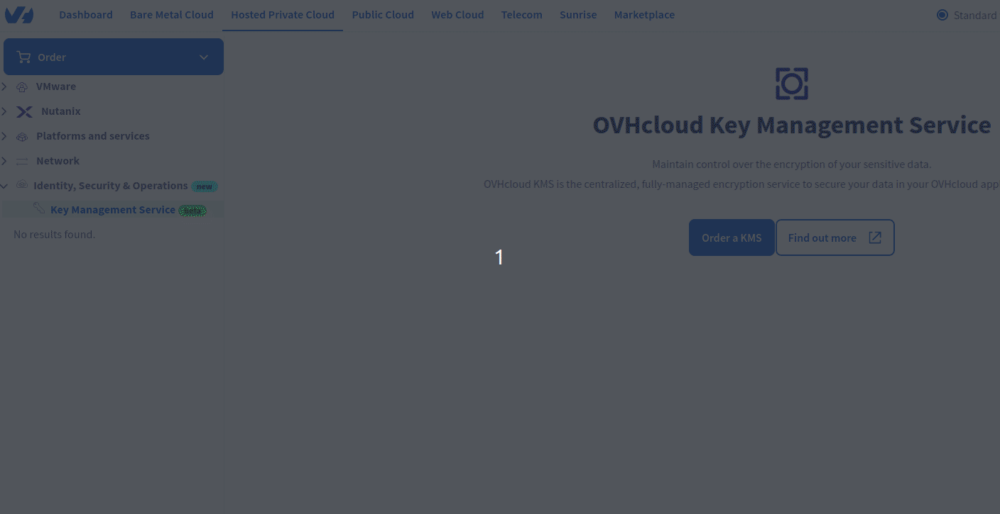{.thumbnail}.

#### Via the OVHcloud Control Panel

To access the OVHcloud KMS, log in to your [OVHcloud Control Panel](/links/manager), then go to the `Hosted Private Cloud`.{.action} section. In the left-hand column, click `Identity, Security & Operation`.{.action}, then `Key Management Service`.{.action}.

To order a new KMS server, click the `Order a KMS`{.action} button, then `Select a region`{.action} from the two currently available:

You currently have the following regions available:

- `Europe - France Roubaix`{.action}.
- `Europe - France Strasbourg`{.action}.

The encryption keys and access certificates for this KMS will be stored in the specified region. They can be used in any OVHcloud product, regardless of region.

Once you have made your choice, click the `Order`{.action} button.

> [!primary]
>
> If you were unable to complete the order, launch it manually by clicking on [this link](https://www.ovh.com/fr/order/express/#/express/review?products=~(~(productId~'okms~planCode~'okms~duration~'P1M~pricingMode~'default~configuration~(~(label~'region~value~'EU_WEST_RBX))))).
>

Finally, click `Finish`{.action} to finalize the order.

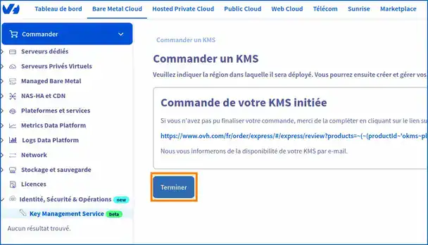{.thumbnail}

Once your order has been confirmed, your KMS will contain the **Name**, the **ID** and the **Region**.

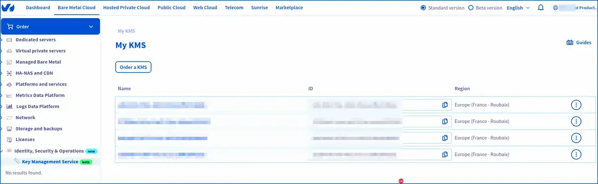{.thumbnail}

Copy your "**ID**" OKMS.

{.thumbnail}

The ID looks like a typical **UUID**. It will then be useful for:

- List your OVHcloud resources.
- List all access information (credentialId)
- Generate the "credentialId" with your CSR (the credentialId being the ID of the proof of signature of your CSR, your request for new access credentials).
- List all keys OKMS.

You can view [the table above](#listing-api).

> [!api]
>
> @api {v2} /okms POST /okms/resource/{okmsId}/credential
>
>
> **Settings**:
>
> - `okmsId`: Your OVHcloud KMS ID (OKMS).
>

In step 3, we will look at how to carry out these requests.

Here is a global view of your KMS order for your OVHcloud VMware vSphere managed HPC environment.

You can copy and paste all the information needed to launch the API calls (IP, URN, KMIP etc...).

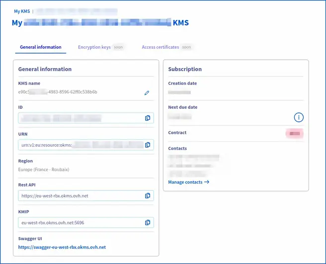{.thumbnail}

#### Via OVHcloud APIs

To list your OVHcloud KMS orders, use the following API call:

> [!api]
>
> @api {v2} /okms GET /okms/resource
>
>
> **Settings**:
>
> - `okmsId`: Your OVHcloud KMS ID (Okms).
>

Return example:

```Shell
[
  {
    "id": "Null",
    "region": "EU_WEST_RBX",
    "kmipEndpoint": "eu-west-rbx.okms.ovh.net:5696",
    "restEndpoint": "https://eu-west-rbx.okms.ovh.net",
    "swaggerEndpoint": "https://swagger-eu-west-rbx.okms.ovh.net",
    "iam": {
      "displayName": "Null",
      "id": "Null",
      "urn": "urn:v1:eu:resource:okms:Null"
    }
  }
]
```

You now have an OVHcloud KMS server to set up within your managed VMware on OVHcloud environment.

///

### Step 2 - Activate OVHcloud KMS (mandatory) <a name="activation-okms"></a>

/// details | How to activate the OVHcloud KMS (OKMS) by opening traffic flows within your HPC vSphere managed on OVHcloud?

To validate the OVHcloud KMS (OKMS) with Hosted Private Cloud VMware on OVHcloud, create an inbound flow opening rule (firewall) within your VMware vSphere on OVHcloud HPC gateway.

This step must be completed **immediately** after you have ordered your KMS (OVHcloud) **and before** the KMS has been added to the managed VMware vSphere web interface.

#### Via the OVHcloud Control Panel

**Open feeds (required)**:

To create or Import a KMS key management service, log in to your [OVHcloud Control Panel](/links/manager), then go to the `Hosted Private Cloud`.{.action} section. In the left-hand column, click on `VMware`.{.action}, then select the Dedicated Cloud concerned. On the page that pops up, click on the `Security` tab.{.action}.

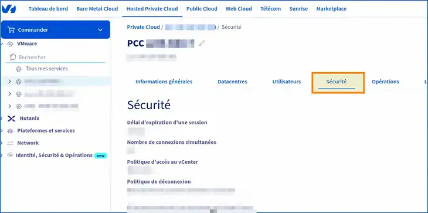{.thumbnail}

Then go further down in the `Virtual Machine Encryption Key Management Servers`{.action} section.

You will need to add your KMS via the [control panel](/links/manager) **immediately** after you have purchased and delivered your OVHcloud KMS. This is to allow flows within OVHcloud firewalls to be authorized.

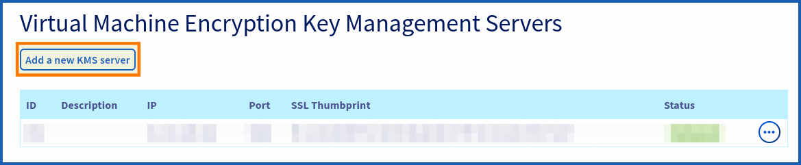{.thumbnail}

You can add your OKMS from the HPC control panel, by clicking `Add a new KMS server`{.action}

In the new window that pops up, fill out the following forms:

- **IP**: Please use the IP address, as the domain name cannot be added. For example, use the IP address `137.74.127.152` for the region of **Strasbourg** and the IP address `91.134.128.102` for the region of **Roubaix**.
- **Description**: Enter a description for your OKMS.
- **SSL Thumbprint**: Enter the SSL/TLS Thumbprint of your OKMS.

To retrieve the TLS fingerprint, launch the following OpenSSL command (adapt your OKMS endpoint to the right region (e.g. eu-west-rbx/sbg), which includes your OVHcloud KMS):

```Shell
openssl s_client -connect eu-west-rbx.okms.ovh.net:5696 < /dev/null 2>/dev/null | openssl x509 -fingerprint -noout -in /dev/stdin
---
Return:
SHA1 Fingerprint=FE:21:E2:DE:B7:51:34:E9:9A:AB:E0:27:FF:1E:42:3A:15:9C:76:47
```

To retrieve the public IP of the OVHcloud KMS server, launch a ping. For example:

```Shell
ping eu-west-rbx.okms.ovh.net
```

This is the IP of the Roubaix KMS and its TLS fingerprint. Adapt the command above to suit the region where your KMS is located (Strasbourg, for example).

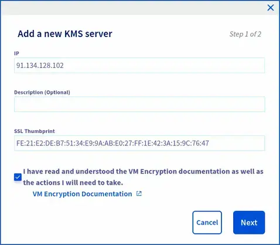{.thumbnail}

Please check that the read confirmation : **"I have read and understood the VM Encryption documentation and the actions I will need to carry out on my own"** is ticked before you continue.

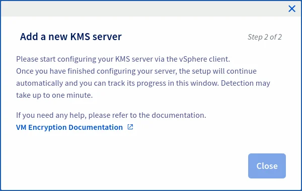{.thumbnail}

Wait for the streams to open and change the status to green `delivered`.

At the same time, check your rights within IAM. To use KMS, you will need additional rights.

To do this, go to the `Users`{.action} tab of your HPC managed vSphere. In the table that opens, click on the `...`{.action} button to the right of the user concerned, then on `Modify`{.action}.

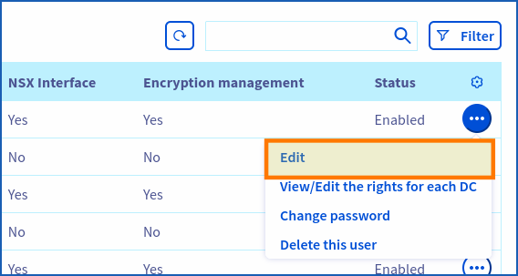{.thumbnail}

Verify that the `Encryption management`{.action} is enabled.

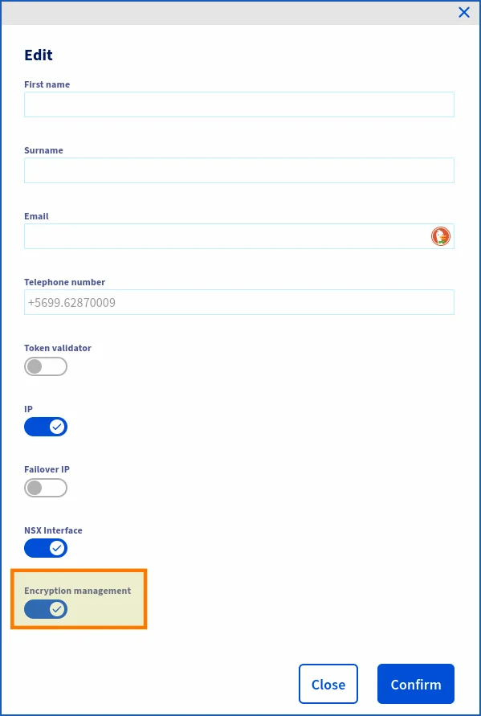{.thumbnail}

If you are using a particular IAM role with a global policy within your HPC managed vSphere, enable encryption management for that role. If this is the role created when IAM was enabled (iam-admin), the role has default encryption management.

With your policy, ensure that the users, resources, actions and product types of your HPC VMware vSphere managed on OVHcloud have been added.

IAM policy example:

- **Identity**: local user XX -> Local user OVHcloud.
- **User groups**: ADMIN, XXXX-XX-XX/user_iam.
- **Resources**: pcc-XXX-XXX-XXX-XXX (reference for your managed vSphere).
- **Product type**: iam_ressources_type_okms/kmip.
- **Actions**: vSphere Admin, pccVMware:apiovh:vmEncryption/kms/changeProperties, pccVMware:vSphere:assumeRole?iam-admin -> User vSphere iam-admin, okms:kmip:get, okms:apikms:serviceKey/create etc..

For your information, the **domain ID** corresponds to the URN of your OVHcloud KMS.

#### Via OVHcloud APIs (optional)

If you have already opened the streams from the [control panel](/links/manager), you can make the following API call (optional).

**Step of opening flows**:

> [!api]
>
> @api {v1} /dedicatedCloud POST /dedicatedCloud/{serviceName}/vmEncryption/kms
>
>
> **Settings**:
>
> - `serviceName`: Enter the reference of your managed vSphere. Example: **pcc-XX-XX-XX-XX**.
> - `description`: Enter the description of your OKMS.
> - `ip`: Enter the public IP address of your OKMS.
> - `sslThumbprint`: Enter the TLS fingerprint of your OKMS.
>

Copy and paste (with KMS settings):

```Shell
{
"description": "Okms demo",
"ip": "91.134.128.102",
"sslThumbprint": "FE:21:E2:DE:B7:51:34:E9:9A:AB:E0:27:FF:1E:42:3A:15:9C:76:47"
}
 ```

To retrieve the KMS TLS fingerprint, run the following command **OpenSSL**, adapting the command to the region where your KMS is located:

```Shell
openssl s_client -connect eu-west-rbx.okms.ovh.net:5696 < /dev/null 2>/dev/null | openssl x509 -fingerprint -noout -in /dev/stdin
---
Back:
SHA1 Fingerprint=FE:21:E2:DE:B7:51:34:E9:9A:AB:E0:27:FF:1E:42:3A:15:9C:76:47
```

To retrieve the public IP of the OVHcloud KMS, ping it by adapting the order to the region where your KMS is located:

```Shell
ping eu-west-rbx.okms.ovh.net
```

To update your KMS with an OVHcloud KMS:

> [!api]
>
> @api {v1} /dedicatedCloud POST /dedicatedCloud/{serviceName}/vmEncryption/kms/{kmsId}/changeProperties
>
>
> **Settings**:
>
> - `kmsId`: Enter the ID of your OKMS server. (Example: 350)
> - `serviceName`: Enter the name of your managed vSphere. Example: pcc-XX-XX-XX-XX.
>

Example:

```Shell
 {
"description": "description test",
"sslThumbprint": "FE:21:E2:DE:B7:51:34:E9:9A:AB:E0:27:FF:1E:42:3A:15:9C:76:47"
}
```

Return:

After running the API, you should see the following result in response:

```Shell
{
  "kmsId": XXX,
  "kmsTcpPort": 5696,
  "sslThumbprint": "Null",
  "description": "OKMS description",
  "state": "delivered",
  "ip": "Null"
}
```

Wait (status: updating) for the streams to open and for the status to change to the "delivered" state (optional).

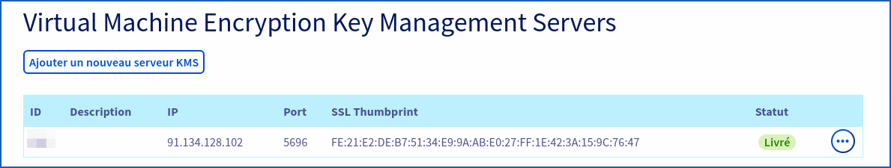{.thumbnail}

///

### Step 3 - Create an IAM policy <a name="iam-creation"></a>

/// details | How do I create an IAM policy to enable VM encryption?

To enable encryption within vSphere, you must have sufficient rights within your KMS resources and OVHcloud account.

If you do not already have an IAM policy created, we will create one to list the necessary steps.

You will need to log in to your [OVHcloud control panel](/links/manager).

Go to IAM by clicking on `My account > my user > IAM > Create a policy`{.action} in the top right-hand corner.

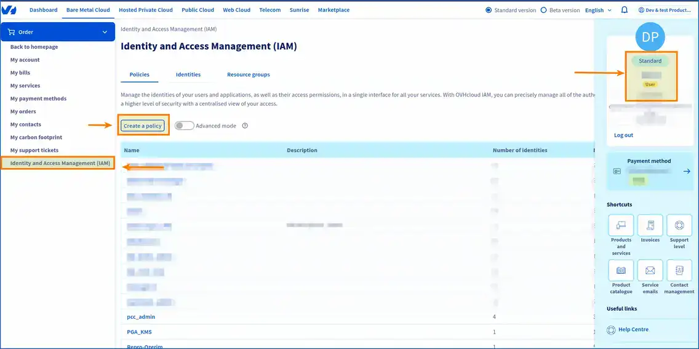{.thumbnail}

Add the name of your policy, otherwise you will not be able to create it at the end.

And an intelligent description of your IAM strategy.

In `Identities`{.action}, add your local OVHcloud user. The one with which you generated the CSR from the API. By clicking: `Add a user`{.action}.

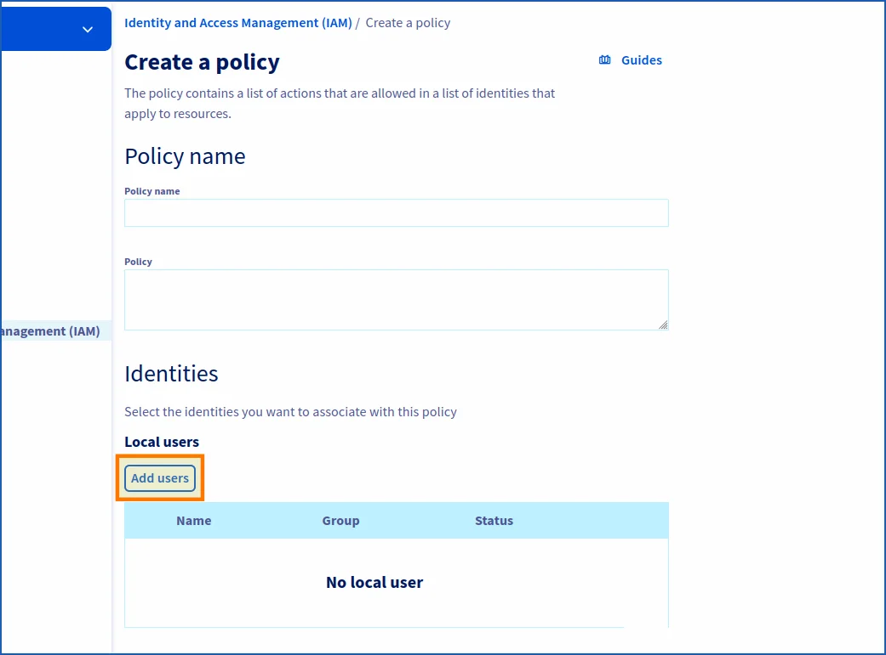{.thumbnail}

You then need to add the actions in order to generate the keys for your vSphere encryption policy.

Click in the Product type field, then add `iam_ressources_type_okms`{.action}

You can choose to add all actions or filter more finely according to your user needs.

{.thumbnail}

Finally, click `Create policy`{.action}.

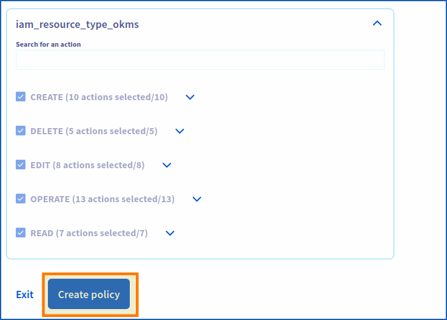{.thumbnail}

Your policy has been created. You can now enable encryption within PCC by changing the **"VM strategy"** of your virtual machines.

If you do not have a pre-established policy, I invite you to consult the API control panel and determine the IAM actions required for the policy. If you already have an IAM policy, you can modify it and add the necessary actions.

///

### Step 4 - Configuring OKMS with VMware vSphere HPC (mandatory) <a name="add-okms"></a>

/// details | How to add the OVHcloud KMS in your OVHcloud managed vSphere?

After ordering your OKMS, open the flows within your OVHcloud managed vSphere. All you need to do now is configure the import within vSphere and install the trust relationship between vCenter and OKMS.

> [!tabs]
>
> **Add KMS to vSphere**
> 
>>
>> To enable vCenter to test your OVHcloud KMS server, log in to your [control panel](/links/manager), then go to the `Hosted Private Cloud`{.action} section. In the left-hand column, click `VMware`{.action} and select the datacentre concerned.
>>
>> 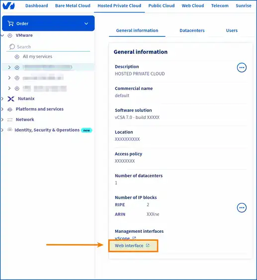{.thumbnail}
>>
>> On the page that pops up, in the `General information` box, scroll down to `Management interfaces`{.action}, then click `Web interface`{.action}.
>>
>> On the new page that pops up, click on the square labeled `vSphere HTML Client`{.action}.
>>
>> 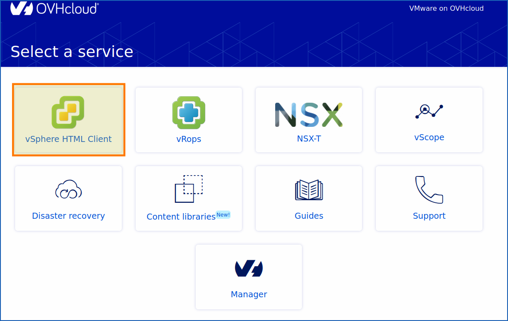{.thumbnail}
>>
>> You are now on the login or home page of your managed vSphere. The URL at the top of your browser should look like this:
>>
>> - `<https://pcc-x.x.x.x.ovh.de/ui/>`
>>
>> Log in with a **local user** or with **an IAM user**, depending on the permissions you have set up within your [control panel](/links/manager) and your HPC managed vSphere on OVHcloud.
>>
>> You are now logged in to your managed vSphere on OVHcloud.
>>
>> To access key provider management from vSphere, click: `Configure`{.action} from your **pcc-XXX-XXX-XXX-XXX**. Go to the `Security`{.action} section, then click `Key Providers`{.action}. On the page that appears, click the `Add`{.action} button, then `Add a standard key provider`{.action}.
>>
>> 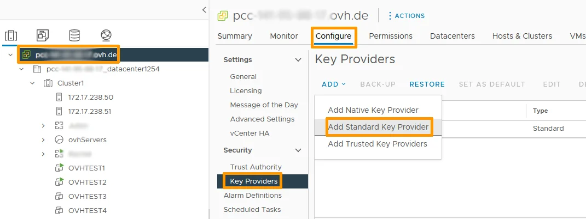{.thumbnail}
>>
>> Once you have selected the option to add a Key Provider, a window or form will open to enter the details of the **Key Provider** you wish to add. This may include information such as the IP address or domain name (DNS) of the OKMS server, but also the port used (5696).
>>
>> The domain names and the port (KMIP) do not change.
>>
>> 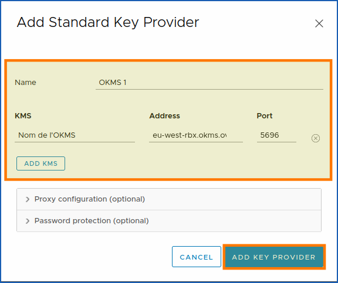{.thumbnail}
>>
>> You will find the following fields:
>>
>> | Field       | Input                                                   | Description                                                                      |
>> |-------------|---------------------------------------------------------|----------------------------------------------------------------------------------|
>> | **Name**    |                                                         | - Name your cluster within vCenter.                                              |
>> | **KMS**     |                                                         | - The name that will appear in vSphere for your OKMS.                            |
>> | **Address** | eu-west-rbx.okms.ovh.net <br/> eu-west-sbg.okms.ovh.net | - **Endpoint** of the OKMS server. Choose a domain name over an IP (in vSphere). |
>> | **Port**    | 5696                                                    | - Port used by KMIP (does not change).                                           |
>>
>> Wait for vSphere to establish the connection with the Key Provider you added. You should see a hint or message confirming that the connection has been successfully established.
>>
>> Wait for vSphere to establish a connection with the key provider you have just added. You should see a message confirming that the connection has been established successfully.
>>
>
> **vCenter Trust KMS** <a name="trust-kms"></a>
>
>>
>> > [!primary]
>> >
>> > Trust between vCenter and KMS can be conflicting, please wait a few minutes before starting over, or refresh your vSphere page with the circular arrow button at the top and slightly to the right.
>> > If it still doesn't work, do a manual upload (optional).
>> >
>>
>> Before generating your CSR and/or KMS Certificate, and then your private key, you must ensure that vCenter has downloaded the public certificate from the OVHcloud KMS server. Once your KMS has been imported into vSphere, you will need to validate the trust relationship between each element.
>>
>> {.thumbnail}
>>
>> Click on `Establish Trust > vCenter Trust Kms > Upload KMS Certificate`{.action}.
>>
>> 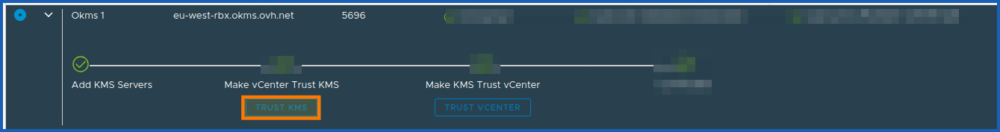{.thumbnail}
>>
>> 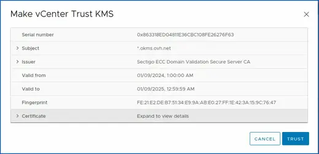{.thumbnail}
>>
>> Then click `TRUST`{.action}.
>>
>> Typically, vCenter automatically downloads the KMS public certificate. If it doesn't, do it manually.
>>
>> You can retrieve it from the endpoints provided with this snippet:
>>
>> ```Shell
>> openssl s_client -showcerts -connect eu-west-rbx.okms.ovh.net:443 </dev/null 2>/dev/null|openssl x509 -outform PEM | python3 -c "
>> import sys
>> import json
>> body = {}
>> body['cert'] = sys.stdin.read()
>> json.dump(body, sys.stdout)
>> " | python3 -c "
>> import sys
>> import json
>> body = json.load(sys.stdin)
>> print(body['cert'])
>> " | openssl x509 -text; echo $?
>> ```
>>
>> Copy the return from `-------BEGIN CERTIFICATE---- XXX -----END CERTIFICATE-----`{.action} into your managed vSphere web interface.
>>
>> Then click `Establish a trust relationship > Download the KMS certificate`{.action}.
>>
>> {.thumbnail}
>>
>> Finally, paste the public KMS certificate retrieved from the snippet.
>>
>> 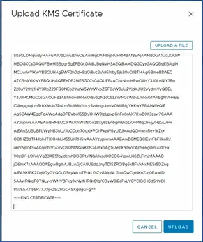{.thumbnail}
>>
>> Wait a little while and refresh the vSphere webpage as explained before.
>>
>
> **Make KMS Trust vCenter**
>
>>
>> Select your **Key Provider** KMS (OKMS) that you have just added, and click the `Approve vCenter Instance`{.action} button.
>>
>> 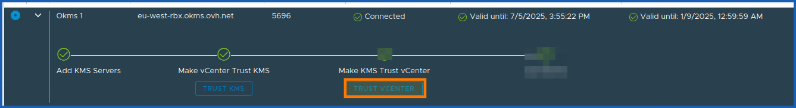{.thumbnail}
>>
>> We recommend the "With CSR" method (more secure) by clicking on `New Certificate Signing Request (CSR)`{.action). However, you are free to choose the one that suits you best and is compatible with your way of doing things.
>>
>> For more information on the advantages and disadvantages of using a CSR, read the [KMS](/pages/manage_and_operate/kms/quick-start) documentation.
>>
>> **With CSR (recommended)** :
>>
>> In order to communicate with your KMS, you need to create an access certificate signing (CSR) request. This will be used for all interactions with the OVHcloud KMS and vSphere, whether for creating encryption keys or performing operations with them.
>>
>> Each certificate contains a [OVHcloud identity](/pages/manage_and_operate/iam/identities-management) that can be used to calculate access rights via the [OVHcloud IAM](/pages/account_and_service_management/account_information/iam-policy-ui).
>>
>> This certificate can be generated by providing your own private security key ("credentialId") via a **"Certificate Signing Request (CSR)"**.
>>
>
> **New certificate signing request (with CSR)**
>
>>
>> Once your KMS is ordered and vCenter has approved the KMS. Launch the generation of the `CSR`{.action} in order for KMS to approve vCenter and sign the CSR.
>>
>> Click `Make KMS Trust vCenter`{.action}.
>>
>> Select `New Certificate Signing Request (CSR)`{.action}, then copy or download the CSR below. Make it available to the OVHcloud KMS via the API v2 /okms, and ask them to sign the certificate.
>>
>> 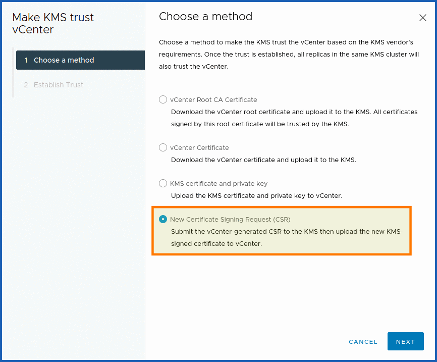{.thumbnail}
>>
>> 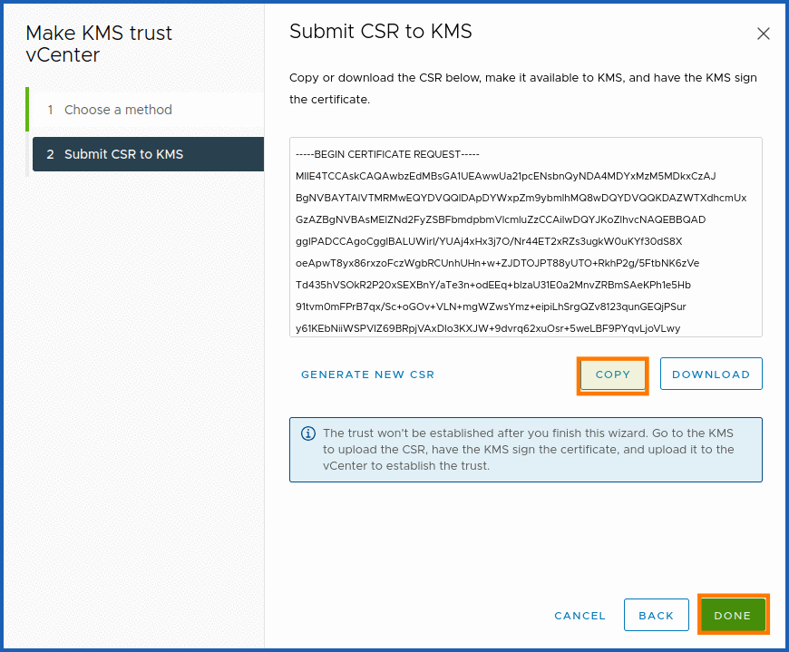{.thumbnail}
>>
>> Copy your CSR into a file `csr.pem`{.action} in order to have it signed by the OVHcloud KMS.
>>
>> To format the CSR in json to work in the OVHcloud API console, issue the **AWK** command below:
>>
>> ```Shell
>> awk '{printf "%s\\n", $0}' csr.pem
>> ```
>>
>> Paste the return of this command into the following API POST call, in the `"csr"` field, to have your CSR signed with the OVHcloud KMS.
>>
>> Be sure to fill in the rest of the fields (URN, DESCRIPTION, etc...) with the correct IAM permissions.
>>
>> > [!api]
>> >
>> > @api {v2} /okms POST /okms/resource/{okmsId}/credential
>> >
>> >
>> > **Settings**:
>> >
>> > - `okmsId`: ID of your OVHcloud KMS (OKMS).
>> > - `With CSR provided`: Trust chain between OKMS and VCenter with or without CSR.
>> >
>> > ```Shell
>> > {
>> > "csr": "------BEGIN CERTIFICATE REQUEST----\nMIICvDCCAaQCAQAwdzELMAkGA1UEBhMCVVMxDTALBgNVBAgMBFV0YWgxDzANBgNV\nBAcMBkxpbmRvbjEWMBQGA1UECgwNRGlnaUNQgSW5jERMA8GA1UECIRGIRGna\nlnlxGUNGMGBUb lnaWNlcnQuY29tMIIBIjANBgkqhkiG\n9w0BAQEFAAOCAQ8AMIIBCgKCAQEA8+To7d+2kPWeBv/orU3LVbJwDrSQbeKamCmo\nwp5bqDxIwV20zqRb7APUOKYoVEFFOEQs6T6gImnIolhbiH6m4zgZ/CPvWOBkcc2c\EmctttGb ldxRthNLOs1efOhdnWFuhI162qmcflgpiI\nWDuwq4C9f+YkeJhNn9dF5+owm8cOQmDrV8NNdiTqin8q3qYAHHJRW28glJUCZkTZ\nwIaSR6crBQ8TbYNE0dc+Caa3DOIkz1EOsHWTx+n0KfqbxXxXxXxDxDxDxDxBt4 yEp82G96/Ggcf7F33xMxe0yc+Xa6owIDAQABoAAwDQYJ\nKoZIhvcNAQEFBQADggEBAB0kcrFccSmFDmxox0Ne01UIqSsDqHgL+XmHTXJwre6D\nhJSZwbvEtOK0G3+dr4Fs11WuUNLsc5Lsx6a6a6a6a6a4aMMMGyMMMMMMGyXMYQmMMYQmM T3ZoCGpIXbw+iP3lmEEXgaQL0Tx5LFl/okKbKYwIqNiyKWOMj7ZR/wxWg/\nZDGRs55xuoeLDJ/ZRFf9bI+IaCUd1YrfYcHIl3G87Av+r49YVwqRDT0VDV7uLgqn\n29XI1VUNCPQGn/e7p6PyoXoXoeaRaaQo Uqy1hvJac9QFO2\n97Ob1alpHPoZ7mWiEuJwjBPii6a9M9G30nUo39lBi1w=\n------END CERTIFICATE REQUEST-------",
>> > "description": "My user reader credential",
>> > "identityURNs": [
>> > "urn:v1:eu:identity:user:<<PASTE_YOUR_NICHANDLE_HERE>>-ovh/user", // The user with whom you connect to your managed vSphere resources and with whom you have the rights to the products (HPC, OKMS) in question.
>> > "urn:v1:eu:identity:group:<<PASTE_YOUR_NICHANDLE_HERE>>-ovh/group" // If you use groups, you can add them here. The principle is the same as with a user within the OVHcloud ecosystem.
>> > ],
>> > "name": "user",
>> > "validity": 365
>> > }
>> > ```
>>
>> A signature ID ("credentialId") will be given to you. You need to retrieve it with the `okmsId` in order to launch the GET (see below) and retrieve the signed CSR. All you need to do now is upload it to vSphere.
>>
>> To sign the CSR, click `Establish Trusted Relationship`{.action}, then `Download Signed CSR Certificate - Upload Signed CSR Certificate`{.action}.
>>
>> Now copy the signed CSR of the following API call:
>>
>> > [!api]
>> >
>> > @api v2 /okms GET /okms/resource/{okmsId}/credential/{credentialId}
>> >
>> > **Settings**:
>> >
>> > - `credentialId`: ID generated during your API POST call /okms/resource/{okmsId}/credential with CSR ("fromCSR": true,)
>> > - `okmsId` : ID of your OVHcloud KMS.
>> >
>>
>> Copy the **"certificatePEM"** (signed CSR) from `------BEGIN CERTIFICATE------...XXX...-----END CERTIFICATE------`.
>>
>> Then run the **AWK** command below to format it for vSphere to read:
>>
>> ```Shell
>> awk '{gsub(/\\n/,"\n")}1' csr_signed.pem
>> ```
>>
>> Copy the command return and paste it into vSphere on OVHcloud.
>>
>> 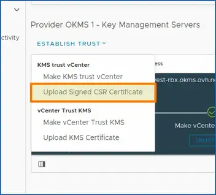{.thumbnail}
>>
>> 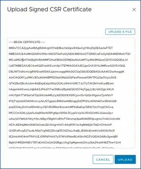{.thumbnail}
>>
>> Check that the connection has been established by selecting your OVHcloud KMS key provider.
>>
>> The `Connected` option must be confirmed with a green validation bracket (as in the screenshot below)
>>
>> {.thumbnail}
>>

///

## Step 5 - Create a VM storage policy (required) <a name="storage-policy"></a>

/// details | How do I create a VM storage policy to enable encryption in VMware vSphere?

In step 6, you will complete the encryption activation on a virtual machine with the OKMS using a **Storage Policy** that we will now create.

This storage policy uses host-based policies. You must have enabled `Host-based rules`{.action} , and then enabled the storage policy components.

To create a storage policy, you need to access your Dedicated Cloud vSphere. If you have followed the previous steps, you must already be logged in to the [control panel](/links/manager). After adding your OVHcloud KMS in [step 4](#add-okms).

You now need to go to `Policies and profiles > VM storage strategies`{.action}.

{.thumbnail}

Click `CREATE`{.action} in **VM Storage Policies**.

{.thumbnail}

The policy creation window will now open. You are in step 1 `Name and description`{.action}.

You need to determine your vCenter server, which is the Dedicated Cloud on which you want to create your storage strategy.

Once you have `PCC-XXX-XXX-XXX-XXX.ovh.XX`{.action} chosen, your `Name`{.action} and `Description`{.action}.

You can click `NEXT`{.action} to continue.

{.thumbnail}

This brings you to step 2, **Policy structure.**

Here, we will enable **host-based policy rules**. Select the `Enable host-based rules`{.action} checkbox.

To continue, click `NEXT`{.action}.

{.thumbnail}

For step 3, you must confirm the choices in the previous step by enabling validation of the storage policy component (encryption).

For the purposes of this guide, we will leave the default setting `Default encryption properties`{.action}.

You must click `Encryption`{.action}.

Then **use the storage policy component** `Default encryption properties`{.action}.

- **Storage policy component:** Default encryption properties.
- **Description**: Storage policy component for VM and virtual disk encryption.
- **Provider**: VMware encryption.
- **Allow I/O filters before encryption**: False.

For your information, these available data services may include encryption, I/O control, caching, and so on. Host-based services will be applied in addition to the data store-specific rules.

To complete step 3, click `NEXT`{.action}.

{.thumbnail}

For step 4, storage compatibility. You have the compatibility and incompatibility of your Hosted Private Cloud VMware on OVHcloud datacentre (Dedicated Cloud).

When you have finished checking the compatibility of your storage space, click `NEXT`{action}.

{.thumbnail}

And to finish the last step, step 5, click `FINISH`{.action}.

Once you have created your policy, you can now enable encryption on one of your virtual machines.

{.thumbnail}

///

### Step 6 - Enabling encryption on a VM (required) <a name="activation-encryption"></a>

/// details | How do I enable encryption in a VM with the storage policy?

Locate the virtual machine (VM) you want to encrypt. Turn it off if it is on (mandatory).

And right-click on the selected virtual machine to display the shortcut menu or click `ACTIONS`{.action}.

Then select `VM Policies`{.action}.

Next, choose `Modify VM storage strategies`{.action}.

This will open a window or panel where you can modify the storage policies of the VM selected.

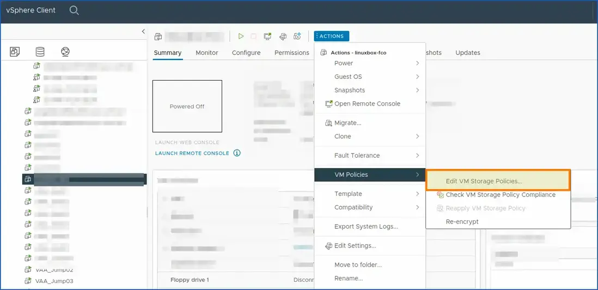{.thumbnail}

Search for encryption or security options in storage policies to enable KMS encryption for this VM.

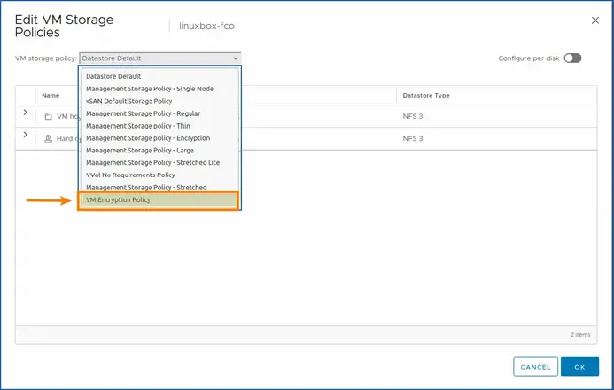{.thumbnail}

If you deploy a new VM from an OVHcloud template, you have several choices for encrypting your VM:
- **Thick Provision Lazy Zeroed.**
- **Thin Provision.**
- **Thick Provision Eager Zeroed.**

Choose the one that suits you best, if you have any doubts, you can go to the guide: [Which disk format to choose](/pages/bare_metal_cloud/managed_bare_metal/choosing-disk-type).

And tick the `Encrypt this VM`{.action} box.

Getting back to the case of an existing and turned off VM.

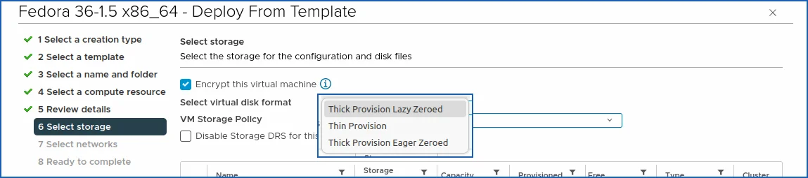{.thumbnail}

After making the necessary changes, save the changes and close the window.

You have now edited the VM storage policies and enabled KMS encryption for your server. A small padlock on your virtual machine’s summary information confirms this.

And you can clearly see a small padlock in the general view of your VM as well as in the description of the encryption.

This confirms that your policy works with the OKMS server and that encryption is **enabled**.

{.thumbnail}

///

### Useful information - TLS/KMS <a name="useful-information"></a>

/// details | Useful information for manipulating your TLS certificates with OpenSSL.

Warning: when you copy and paste your CSR, it must be formatted to work with json format.

**\n** must be added at each line break. To do this, you can launch this OpenSSL command in order to convert your certificate to pkcs12 format:

`openssl pkcs12 -export -inkey client.key -in client.crt -out cert_key.p12`{.action}.

**CSR decode**:

To decode your CSR, you can run this OpenSSL command with your CSR:

- `openssl req -in mycsr.csr -noout -text`{.action}.

Or use a more graphical web tool, such as: [sslshopper](https://www.sslshopper.com/csr-decoder.html).

**Certificate decode**:

- `openssl x509 -in certificate.crt -text -noout`{.action}.

**Certificate Key Matcher**:

To check if the CSR matches your certificate, you can do so with these OpenSSL commands:

```Shell
openssl pkey -in privateKey.key -pubout -outform pem | sha256sum
openssl x509 -in certificate.crt -pubkey -noout -outform pem | sha256sum
openssl req -in CSR.csr -pubkey -noout -outform pem | sha256sum
```

#### SSL Converter

**OpenSSL Convert PEM**:

- Convert PEM to DER: `openssl x509 -outform der -in certificate.pem -out certificate.der`{.action}.
- Convert PEM to P7B: `openssl crl2pkcs7 -nocrl -certfile certificate.cer -out certificate.p7b -certfile CACert.cer`{.action}.
- Convert PEM to PFX: `openssl pkcs12 -export -out certificate.pfx -inkey privateKey.key -in certificate.crt -certfile CACert.crt`{.action}.

**OpenSSL Convert DER**

Convert DER to PEM:

- `openssl x509 -inform der -in certificate.cer -out certificate.pem`{.action}.

**OpenSSL Convert P7B**:

- Convert P7B to PEM: `openssl pkcs7 -print_certs -in certificate.p7b -out certificate.cer`{.action}.

**Convert P7B to PFX**:

- `openssl pkcs7 -print_certs -in certificate.p7b -out certificate.cer`{.action}.
- `openssl pkcs12 -export -in certificate.cer -inkey privateKey.key -out certificate.pfx -certfile CACert.cer`{.action}.

**OpenSSL Convert PFX**:

- Convert PFX to PEM: `openssl pkcs12 -in certificate.pfx -out certificate.cer -nodes`{.action}.

#### Format CSRs for VMware

Adapt the command with your CSR file.

```Shell
# Format for the OVHcloud API:
awk '{printf "%s\\n", $0}' file

# Format for vSphere:
awk '{gsub(/\\n/,"\n")}1' file
```

#### Retrieve the OKMS public certificate manually (not mandatory)

If you encounter any difficulties during step 4 [Make vCenter trust KMS](#trust-okms), you can download it (upload manually: copy the snippet return from a shell and paste it into the vSphere web interface "Download the KMS certificate").

You can launch this snippet (you need to have Python and OpenSSL installed). It allows you to export and format the public OKMS certificate.

Change the OKMS input with the URL of the correct region. You must have Python and OpenSSL installed:

```Shell
openssl s_client -showcerts -connect eu-west-rbx.okms.ovh.net:443 </dev/null 2>/dev/null|openssl x509 -outform PEM | python3 -c "
import sys
import json
body = {}
body['cert'] = sys.stdin.read()
json.dump(body, sys.stdout)
" | python3 -c "
import sys
import json
body = json.load(sys.stdin)
print(body['cert'])
" | openssl x509 -text; echo $?
```

///

## Go further

Join our [community of users](/links/community).