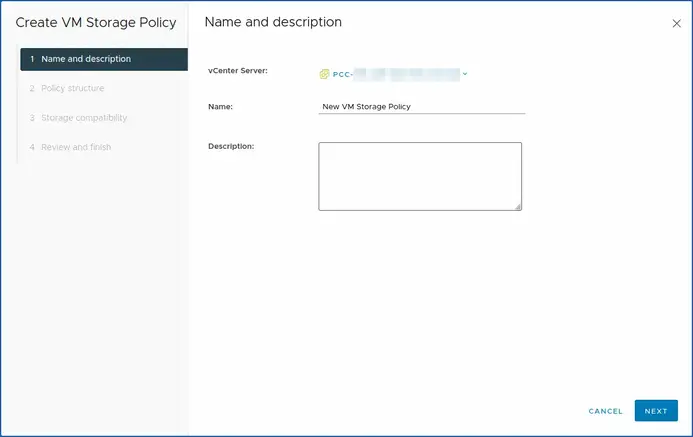
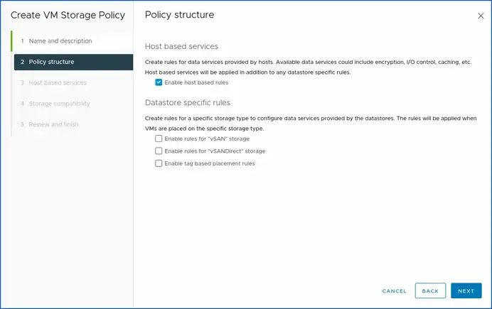
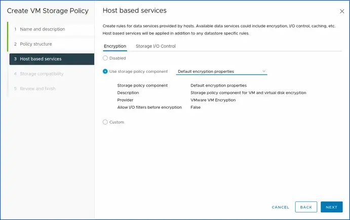
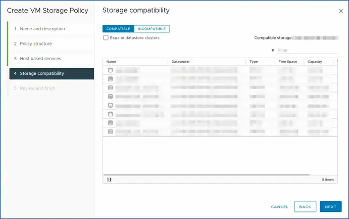

<style>
details>summary {
    color:rgb(33, 153, 232) !important;
    cursor: pointer;
}
details>summary::before {
    content:'\25B6';
    padding-right:1ch;
}
details[open]>summary::before {
    content:'\25BC';
}
</style>

> [!primary]
>
> Cette fonctionnalité est disponible en version bêta. Ce guide peut donc être incomplet et sera mis à jour pendant cette période.
> 

## Objectif

**Découvrez comment commander, activer et configurer un KMS OVHcloud (OKMS) au sein vSphere pour gérer la politique de chiffrement de vos VM.**

## Prérequis

- Être connecté à votre [espace client OVHcloud](/links/manager).
- Disposer d'une offre [VMware on OVHcloud](https://www.ovhcloud.com/fr/enterprise/products/hosted-private-cloud/).
- Avoir accès à l’interface de gestion vSphere de votre PCC (Hosted Private Cloud VMware on OVHcloud).
- Disposer des droits nécessaires pour manipuler vos ressources PCC et le KMS OVHcloud avec ou sans IAM (IAM with KMS: iam_resource_type_okms dans la policy IAM + ajouter l'id dans vos ressources de la policy IAM).
- Avoir lu les guides : 
  - [Intégration d'un KMS pour VMware on OVHcloud](/pages/hosted_private_cloud/hosted_private_cloud_powered_by_vmware/kms_vmware_overall).
  - [Premiers pas avec OVHcloud Key Management Service (KMS + IAM + vSphere)](/pages/manage_and_operate/kms/quick-start).
- Avoir une clef de chiffrement RSA ou ECDSA (sans CSR) et/ou un CSR (avec CSR).
- Certificat public du fournisseur de gestion clés OVHcloud (OKMS).
- Une demande de signature de certificat (CSR) généré par vSphere pour valider/truster l'import ainsi que les échanges entre le KMS OVHcloud et vCenter.

## En pratique <a name="sommaire"></a>

**Sommaire des étapes du guide** :

- [Introduction - Listes des endpoints KMS OVHcloud](#introduction)
- [Étape 1 - Commande d'un KMS OVHcloud (obligatoire)](#commande-okms)
- [Étape 2 - Activation du KMS OVHcloud (obligatoire)](#activation-okms)
- [Étape 3 - Configuration de OKMS avec vSphere (obligatoire)](#ajout-okms)
- [Étape 4 - Création d'une politique IAM (obligatoire)](#iam-creation)
- [Étape 5 - Création d'une stratégie de stockage VM (obligatoire)](#politique-stockage)
- [Étape 6 - Activation du chiffrement sur une VM (obligatoire)](#activation-chiffrement)
- [Fin - Informations utiles TLS OKMS]()

### Introduction <a name="introduction"></a>

/// details | Introduction, liste des URLs et des appels API OKMS disponibles.

Pour plus d'informations sur les choix qui s'offrent à vous avec KMS et Hosted Private Cloud VMware on OVHcloud, consultez le guide « [Intégration d'un KMS pour VMware on OVHcloud](/pages/hosted_private_cloud/hosted_private_cloud_powered_by_vmware/kms_vmware_overall) ».

OVHcloud KMS (OKMS) est un service centralisé de chiffrement entièrement managé pour sécuriser vos données dans vos applications et vos services OVHcloud.

#### URLs OKMS

> [!Warning]
>
> Ces éléments sont susceptibles d'évoluer dans le temps. Nous les énumérons ici afin de faciliter votre compréhension et de vous permettre d'avoir une vision globale des paramètres.
>

| **Type**    | **URL**                          | **Région**          | **OKMS Région enum** | **IP**         |
|-------------|----------------------------------|---------------------|----------------------|----------------|
| **KMIP**    | eu-west-rbx.okms.ovh.net         | France - Roubaix    | EU_WEST_RBX          | 91.134.128.102 |
| **KMIP**    | eu-west-rbx.okms.ovh.net         | France - Roubaix    | EU_WEST_RBX          | 91.134.128.102 |
| **REST**    | eu-west-rbx.okms.ovh.net         | France - Roubaix    | EU_WEST_RBX          | 91.134.128.102 |
| **Swagger** | swagger-eu-west-rbx.okms.ovh.net | France - Roubaix    | EU_WEST_RBX          | 91.134.128.102 |
| **KMIP**    | eu-west-sbg.okms.ovh.net         | France - Strasbourg | EU_WEST_SBG          | 137.74.127.152 |
| **KMIP**    | eu-west-sbg.okms.ovh.net         | France - Strasbourg | EU_WEST_SBG          | 137.74.127.152 |
| **REST**    | eu-west-sbg.okms.ovh.net         | France - Strasbourg | EU_WEST_SBG          | 137.74.127.152 |
| **Swagger** | swagger-eu-west-sbg.okms.ovh.net | France - Strasbourg | EU_WEST_SBG          | 137.74.127.152 |

#### Liste des appels API KMS HPC VMware on OVHcloud

> [!Warning]
>
> Ces éléments sont susceptibles d'évoluer dans le temps. Nous les énumérons ici afin de faciliter votre compréhension et de vous permettre d'avoir une vision globale des paramètres.
>

| **Methode**           | **API** | **Path**                                                                | **Commentaires**                                                |
|-----------------------|---------|-------------------------------------------------------------------------|-----------------------------------------------------------------|
|                       |         |                                                                         |                                                                 |
| **Credentials:**      |         |                                                                         |                                                                 |
| **GET**               | v2      | /okms/resource/{okmsId}/credential                                      | - List all access credentials.                                  |
| **POST**              | v2      | /okms/resource/{okmsId}/credential                                      | - Request a new access credential.                              |                                
| **GET**               | v2      | /okms/resource/{okmsId}/credential/{credentialId}                       | - Get an access credential.                                     |                                
| **DEL**               | v2      | /okms/resource/{okmsId}/credential/{credentialId}                       | - Revoke and delete an access credential.                       |
|                       |         |                                                                         |                                                                 |
| **Reference:**        |         |                                                                         |                                                                 |
| **GET**               | v2      |  /okms/reference/serviceKey                                             | - Get service key type, size, curve and operations combination. |                                                
|                       |         |                                                                         |                                                                 |
| **Resources:**        |         |                                                                         |                                                                 |
| **GET**               | v2      | /okms/resource                                                          | - List OVHcloud KMS services.                                   |                                                
| **GET**               | v2      | /okms/resource/{okmsId}                                                 | - Get an OVHcloud KMS service.                                  |                                                
|                       |         |                                                                         |                                                                 |
| **Service Keys:**     |         |                                                                         |                                                                 |                                           
| **GET**               | v2      | /okms/resource/{okmsId}/serviceKey                                      | - List all keys.                                                |
| **POST**              | v2      | /okms/resource/{okmsId}/serviceKey                                      | - Create or import a service key.                               |
| **GET**               | v2      | /okms/resource/{okmsId}/serviceKey/{keyId}                              | - Retrieve a key.                                               |
| **PUT**               | v2      | /okms/resource/{okmsId}/serviceKey/{keyId}                              | - Update a service key.                                         |                                                
| **DEL**               | v2      | /okms/resource/{okmsId}/serviceKey/{keyId}                              | - Delete the given service key.                                 |                                                
|                       |         |                                                                         |                                                                 |
| **Authentification:** |         |                                                                         |                                                                 |
| **GET**               | v1      | /dedicatedCloud/{serviceName}/vmEncryption/kms                          | - List virtual machine encryption KMS servers.                  |
| **POST**              | v1      | /dedicatedCloud/{serviceName}/vmEncryption/kms                          | - Create virtual machine encryption KMS server.                 |
| **GET**               | v1      | /dedicatedCloud/{serviceName}/vmEncryption/kms/{kmsId}                  | - Get virtual machine encryption KMS server.                    |
| **DEL**               | v1      | /dedicatedCloud/{serviceName}/vmEncryption/kms/{kmsId}                  | - Remove virtual machine encryption KMS server.                 |
| **POST**              | v1      | /dedicatedCloud/{serviceName}/vmEncryption/kms/{kmsId}/changeProperties | - Update virtual machine encryption KMS server.                 |

///

### Étape 1 - Commande d'un KMS OVHcloud (obligatoire) <a name="commande-okms"></a>

/// details | Comment commander un KMS OVHcloud (OKMS) pour HPC VMware on OVHcloud ?

{.thumbnail}.

#### Via l'espace client OVHcloud

Pour commander un fournisseur de clés KMS OVHcloud, connectez-vous à votre [espace client OVHcloud](/links/manager), puis rendez-vous dans la partie `Hosted Private Cloud`.{.action}. Dans la colonne de gauche, cliquez sur `Identité, Sécurité & Opération`.{.action}, puis sur `Key Management Service`.{.action}.

Vous devez vous connecter au [control panel OVHcloud](/links/manager).

Vous êtes invité à vous rendre dans le service KMS :

- `Hosted Private Cloud > Identité, Sécurité & Opérations > Key Management Service`.{.action}

Pour commander un nouveau serveur KMS, cliquez sur le bouton `Commander un KMS`{.action}, puis `Sélectionnez une région`{.action} parmi les deux disponibles actuellement :

Vous disposez des régions suivantes à ce jour disponible :

- `Europe - France Roubaix`{.action}.
- `Europe - France Strasbourg`{.action}.

Les clés de chiffrement et certificats d’accès de ce KMS seront stockées dans la région indiquée. Ils pourront être utilisés dans tous les produits OVHcloud sans distinction de région.

Une fois votre choix fait, cliquez sur le bouton `Commander`{.action}.

> [!primary]
> 
> Si vous n'avez pas réussi à completer la commande, lancez [ce lien](https://www.ovh.com/fr/order/express/#/express/review?products=~(~(productId~'okms~planCode~'okms~duration~'P1M~pricingMode~'default~configuration~(~(label~'region~value~'EU_WEST_RBX))))).
>

Enfin, cliquez sur `Terminer`{.action} pour finaliser la commande.

{.thumbnail}

Une fois votre commande validée, vous retrouverez avec votre KMS, le **Nom**, l'**ID** et la **Région**.

{.thumbnail}

Copiez votre "**ID**" OKMS.

{.thumbnail}

L'ID resemble à un **UUID** classique. Il sera utile par la suite pour :

- La demande de nouvelles informations d'identification d'accès avec ou sans CSR.
- Lister vos ressources OKMS.

> [!api]
> 
> @api {v2} /okms POST /okms/resource/{okmsId}/credential
>
>
> **Paramètres** :
>
> - `okmsId` : L'ID de votre KMS OVHcloud (OKMS). >
>

Nous verrons dans l'étape 3 comment effectuer cette requête. 

{.thumbnail}

#### Via les API OVHcloud

Pour lister vos commandes KMS OVHcloud, utilisez l'appel API suivant :

> [!api]
>
> @api {v2} /okms GET /okms/resource
>
>
> **Paramètres** :
>
> - `okmsId` : L'ID de votre KMS OVHcloud (Okms).
>

Exemple de retour :
```Shell
[
  {
    "id": "Null",
    "region": "EU_WEST_RBX",
    "kmipEndpoint": "eu-west-rbx.okms.ovh.net:5696",
    "restEndpoint": "https://eu-west-rbx.okms.ovh.net",
    "swaggerEndpoint": "https://swagger-eu-west-rbx.okms.ovh.net",
    "iam": {
      "displayName": "Null",
      "id": "Null",
      "urn": "urn:v1:eu:resource:okms:Null"
    }
  }
]
```
Vous disposez désormais d'un serveur KMS OVHcloud à mettre en place au sein de votre environnement HPC VMware on OVHcloud.

///

### Étape 2 - Activation du KMS OVHcloud (obligatoire) <a name="activation-okms"></a>

/// details | Comment activer le KMS OVHcloud (OKMS) en ouvrant les flux au sein de votre HPC vSphere managé on OVHcloud ?

Pour valider le KMS OVHcloud (OKMS) avec Hosted Private Cloud VMware on OVHcloud, créez une règle d'ouverture de flux entrant au sein de la gateway OVHcloud pour votre HPC VMware on OVHcloud.

Cette étape doit être réalisée **immédiatement** après commande de votre KMS (OVHcloud) **et avant** l'ajout du KMS à l'interface web vSphere managé.

#### Via l'espace client OVHcloud

**Ouverture des flux (obligatoire)** :

Pour créer ou Importer un service de gestion de clé KMS, connectez-vous à votre [espace client OVHcloud](/links/manager), puis rendez-vous dans la partie `Hosted Private Cloud`.{.action}. Dans la colonne de gauche, cliquez sur `VMware`.{.action}, puis puis sélectionnez votre PCC concerné. Sur la page qui s'affiche, cliquez sur l'onglet `Sécurité`.{.action}.

Vous devez vous connecter au [control panel OVHcloud](/links/manager).

- Puis aller dans la section **Sécurité** de votre vSphere managé HPC :

- - `Hosted Private Cloud > VMware > Votre Datacentre > Sécurité`{.action}.

{.thumbnail}

Dans l'onglet `Sécurité`{.action}, rendez-vous plus bas dans la section: `Virtual Machine Encryption Key Management Servers`{.action}.

L'ajout du KMS depuis l'[espace client OVHcloud](/links/manager) doit être réalisé en **immédiatement** après l'achat et la livraison de votre KMS OVHcloud. Ceci pour permettre l'autorisation des flux au sein des pare-feux OVHcloud.

{.thumbnail}

Vous pouvez ajouter votre OKMS depuis le control panel HPC, en cliquant sur :

- `Ajouter un nouveau serveur KMS`{.action}

Dans la nouvelle fenêtre qui s'affiche, remplissez les formulaires suivants :

- **IP** : Privilégiez l'adresse IP, car le nom de domaine ne peut pas être ajouté. Par exemple, utilisez l'adresse IP 137.74.127.152 pour la région de Strasbourg et l'adresse IP 91.134.128.102 pour la région de Roubaix.
- **Description** : Saisissez une description pour votre OKMS.
- **SSL Thumbprint** : Renseignez la Thumbprint SSL/TLS de votre KMS.

Pour récupérer l'empreinte TLS, Lancer la commande OpenSSL suivante (adapter votre endpoint OKMS avec la bonne région (par exemple : eu-west-rbx/sbg) dont fait partie votre KMS OVHcloud):

```Shell
openssl s_client -connect eu-west-rbx.okms.ovh.net:5696 < /dev/null 2>/dev/null | openssl x509 -fingerprint -noout -in /dev/stdin
---
Retour:
 SHA1 Fingerprint=FE:21:E2:DE:B7:51:34:E9:9A:AB:E0:27:FF:1E:42:3A:15:9C:76:47
```

Pour récupérer l'IP publique du serveur KMS OVHcloud, lancez un ping. Par exemple :

```Shell
ping eu-west-rbx.okms.ovh.net
```

Il s'agit ici de l'IP du KMS de Roubaix et de son empreinte TLS. Adaptez la commande ci-dessus en fonction de la région où se trouve votre KMS (Strasbourg par exemple).

{.thumbnail}

Vérifiez bien que la confirmation de lecture : **"J’ai lu et j’ai compris la documentation VM Encryption et les actions que je vais devoir effectuer de mon côté"** est bien cochée avant de poursuivre.

{.thumbnail}

Attendez que l'ouverture des flux s'effectue et passe en statut `livré`.

En parallèle de l'ouverture des flux, vérifiez vos droits au sein de IAM. En effet, pour manipuler KMS, vous aurez besoin de droits supplémentaires.

Pour cela, rendez_vous dans l'onglet `Utilisateurs`{.action} de votre vSphere managé HPC. Dans le tableau qui s'affiche, cliquez sur le bouton `...`{.action} à droite de l'utilisateur concerné, puis sur `Modifier`{.action}.

{.thumbnail}

Vérifiez que la `gestion du chiffrement`{.action} est activé.

{.thumbnail}

Si vous utilisez un rôle IAM en particulier avec une politique globale au sein de votre vSphere managé HPC, activez la gestion du chiffrement pour ce rôle. S'il s'agit du rôle créé lors de l'activation d'IAM (iam-admin), celui-ci dispose de la gestion du chiffrement par défaut.

Avec votre politique, vérifiez bien que les utilisateurs, ressources, actions et les types de produits de votre vSphere managé ont bien été ajoutés. 

Exemple de politique IAM :

- **Identité** : local user XX -> Utilisateur local OVHcloud.
- **User groups** : ADMIN, XXXX-XX-XX/user_iam.
- **Resources** : pcc-XXX-XXX-XXX-XXX (référence de votre vSphere managé).
- **Product type** : iam_ressource_type_okms/kmip.
- **Actions** : vSphere Admin, pccVMware:apiovh:vmEncryption/kms/changeProperties, pccVMware:vSphere:assumeRole?iam-admin -> User vSphere iam-admin, okms:kmip:get, okms:apikms:serviceKey/create etc..

À titre informatif, le **domain ID** correspond à l'URN de votre KMS OVHcloud.

#### Via les API OVHcloud (optionnel)

Si vous avez déjà réalisé l'ouverture des flux depuis l'[espace client OVHcloud](/links/manager), vous pouvez passer l'appel API suivant.

**Étape d'ouverture des flux depuis l'API:**

> [!api]
>
> @api {v1} /dedicatedCloud POST /dedicatedCloud/{serviceName}/vmEncryption/kms
>
>
> **Paramètres** :
> - `serviceName` : Saisissez la référence de votre vSphere managé. Exemple : **pcc-XX-XX-XX-XX**.
> - `description` : Renseignez la description de votre OKMS.
> - `ip` : Saisissez l'adresse IP publique de votre OKMS.
> - `sslThumbprint` : Renseignez l'empreinte TLS de votre OKMS.
> 
> Copier-coller (avec les paramètres KMS) :
>  
> ```Shell
> {
>  "description": "Okms demo",
>  "ip": "Null",
>  "sslThumbprint": "Null"
> }
> ```

Pour récupérer l'empreinte TLS du KMS, lancer la commande **OpenSSL** suivante en adaptant la commande à la région où se trouve votre KMS :

```Shell
openssl s_client -connect eu-west-rbx.okms.ovh.net:5696 < /dev/null 2>/dev/null | openssl x509 -fingerprint -noout -in /dev/stdin
---
Retour:
 SHA1 Fingerprint=FE:21:E2:DE:B7:51:34:E9:9A:AB:E0:27:FF:1E:42:3A:15:9C:76:47
```

Pour récupérer l'IP publique du KMS OVHcloud, effectuez un ping en adaptant la commande à la région où se trouve votre KMS :

```Shell
ping eu-west-rbx.okms.ovh.net
```

Pour mettre à jour votre KMS avec un KMS OVHcloud :

> [!api]
>
> @api {v1} /dedicatedcloud  POST /dedicatedCloud/{serviceName}/vmEncryption/kms/{kmsId}/changeProperties
>
>
> **Paramètres** :
>
> - `serviceName` : Renseignez le nom de votre vSphere managé. Exemple : pcc-XX-XX-XX-XX.
> - `kmsId` : Saisissez l'ID de votre serveur OKMS. (Exemple : 350)
>

Retour :

Après exécution de l'API, vous devriez retrouver en réponse le résultat suivant :

```Shell
{
  "kmsId": 350,
  "kmsTcpPort": 5696,
  "sslThumbprint": "Null",
  "description": "OKMS description",
  "state": "delivered",
  "ip": "Null"
}
```

Attendez (statut : updating) que l'ouverture des flux s'effectue et que le statut passe en état `livré` (optionnel).

{.thumbnail}

///

### Étape 3 - Configuration de OKMS avec vSphere (obligatoire) <a name="ajout-okms"></a>

/// details | Comment ajouter le KMS OVHcloud dans votre vSphere managé OVHcloud ?

Après avoir commandé votre OKMS, ouvert les flux au sein de votre vSphere managé OVHcloud. Il ne vous reste plus qu'à configurer l'import au sein de vSphere et installer la relation de confiance entre vCenter et OKMS.

> [!tabs]
>
> **Étape 1** 
>> 
>> **Ajout de OKMS à vSphere** :
>>
>> Pour que vCenter puisse truster votre serveur KMS OVHcloud, nous avons besoin d'accéder à l'interface web de votre vSphere managé HPC VMware on OVHcloud.
>>
>> Pour cela, connectez-vous à votre [espace client OVHcloud](/links/manager), puis rendez-vous dans la partie `Hosted Private Cloud`{.action}. Dans la colonne de gauche, cliquez sur `VMware`{.action} et sélectionnez le datacentre concerné.
>>
>> {.thumbnail}
>>
>> Sur la page qui s'affiche et dans l'encadré `Informations générales`, descendez jusqu'à retrouver la mention `Interfaces de gestion`{.action}, puis cliquez en dessous sur `Interface web`{.action}.
>> 
>> Sur la nouvelle page qui apparaît, cliquez sur le carré intitulé `vSphere HTML Client`{.action}.
>>
>> {.thumbnail}
>>
>> Vous êtes désormais sur la page de login ou d'accueil de votre vSphere managé. L'URL en haut de votre navigateur doit ressembler à ceci :
>>
>> - `<https://pcc-x.x.x.x.ovh.de/ui/>`
>> 
>> Connectez-vous avec un **utilisateur local** ou avec **un utilisateur IAM** selon les droits que vous avez mis en place au sein de votre [espace client OVHcloud](/links/manager) et de votre vSphere managé HPC on OVHcloud.
>>
>> Vous êtes maintenant connecté au sein de votre vSphere managé on OVHcloud.
>> 
>> Pour accéder à la gestion des fournisseurs de clés depuis vSphere, cliquez sur : `Configurer`{.action} depuis votre **pcc-XXX-XXX-XXX-XXX**. Rendez-vous dans la section `Sécurité`{.action}, puis cliquez sur `Fournisseurs de clés`{.action}. Sur la page qui apparaît, cliquez sur le bouton `Ajouter`{.action}, puis sur `Ajouter un fournisseur de clé standard`{.action}.
>> 
>> {.thumbnail}
>>
>> Une fois l'option sélectionnée pour ajouter un Key Provider, une fenêtre ou un formulaire s'ouvre pour saisir les détails du **Key Provider** que vous souhaitez ajouter. Cela peut inclure des informations telles que l'adresse IP ou le nom de domaine (DNS) du serveur OKMS, mais aussi le port utilisé (5696).
>> 
>> Les noms de domaine et le port (KMIP) ne changent pas.
>>
>> {.thumbnail}
>>
>> Vous y retrouvez les champs suivants :
>>
>> | Champ       | Input                                                   | Description                                                                                   |
>> |-------------|---------------------------------------------------------|-----------------------------------------------------------------------------------------------|
>> | **Name**    |                                                         | - Permet de nommer votre cluster au sein de vCenter.                                          |
>> | **KMS**     |                                                         | - Nom qui apparaitra au sein de Vsphere pour votre OKMS.                                      |
>> | **Address** | eu-west-rbx.okms.ovh.net <br/> eu-west-sbg.okms.ovh.net | - **Endpoint** du serveur OKMS. Privilégiez le nom de domaine plutôt que l'IP (dans vSphere). |
>> | **Port**    | 5696                                                    | - Port utilisé par KMIP (ne change pas).                                                      |
>>
>> Attendez que vSphere établisse la connexion avec le Key Provider que vous avez ajouté. Vous devriez voir une indication ou un message confirmant que la connexion a été établie avec succès.
>>
>> Patientez le temps que vSphere établisse la connexion avec le fournisseur de clés que vous venez d'ajouter. Vous devriez voir apparaitre un message confirmant que la connexion a été établie avec succès.
>>
> **Étape 2**
>>
>> **vCenter Trust KMS - Faire que vCenter approuve KMS**
>>
>> > [!primary]
>> >
>> > L'approbation entre vCenter et KMS peut être conflictuelle, patientez quelques minutes avant de recommencer ou rafraichissez votre page vSphere avec le bouton en forme de flèche circulaire situé en haut et légèrement à droite.
>> > Si ça ne fonctionne toujours pas faite un upload manuel (optionnel).
>>
>> Effectivement, avant de générer votre CSR et/ou votre Certificat KMS, puis votre clé privée, vous devez verifier que vCenter a bien téléchargé le certificat public du serveur KMS OVHcloud. Une fois votre KMS importé dans vSphere, vous devez valider la relation de confiance entre chaques éléments.
>>
>> {.thumbnail}
>>
>> Cliquez sur `Établir une relation de confiance > vCenter approuve Kms > Télécharger le vertificat KMS`{.action}.
>>
>> {.thumbnail}
>>
>> {.thumbnail}
>>
>> Cliquez ensuite sur `TRUST`{.action}.
>>
>> En principe, vCenter télécharge automatiquement le certificat public KMS. S'il ne le fait pas, faites-le manuellement.
>> 
>> Vous pouvez le récupérer depuis les endpoints fournis avec ce snippet :
>>
>> ```Shell
>> openssl s_client -showcerts -connect eu-west-rbx.okms.ovh.net:443 </dev/null 2>/dev/null|openssl x509 -outform PEM | python3 -c "
>> import sys
>> import json
>> body = {}
>> body['cert'] = sys.stdin.read()
>> json.dump(body, sys.stdout)
>> " | python3 -c "
>> import sys
>> import json
>> body = json.load(sys.stdin)
>> print(body['cert'])
>> " | openssl x509 -text; echo $?
>> ```
>>
>> Copiez le retour depuis `-----BEGIN CERTIFICATE----- XXX -----END CERTIFICATE-----`{.action} dans votre web interface vSphere managé.
>>
>> Puis cliquez sur `Établir une relation de confiance > Télécharger le certificat KMS`{.action}.
>>
>> {.thumbnail}
>>
>> Pour terminer, collez le certificat public KMS récupéré depuis le snippet.
>>
>> {.thumbnail}
>>
>> Attendez un petit moment et rafraichissez la page web vSphere comme expliqué auparavant. 
> 
> **Étape 3**
>
>> **KMS approuve vCenter - Make KMS Trust vCenter**
>>
>> Sélectionnez votre **Fournisseur de clés** KMS (OKMS) que vous venez d'ajouter et cliquez sur le bouton `Approuver l'instance de vCenter`{.action}.
>>
>> {.thumbnail}
>>
>> Nous recommandons la méthode "Avec CSR" (plus sécurisée) en cliquant sur `Nouvelle demande de signature de certificat (CSR)`{.action). Cependant, libre à vous de choisir celle qui vous convient le mieux et qui est compatible avec votre façon de faire.
>>
>> Pour plus d'information sur les avantages et inconvénients de l'utilisation d'un CSR, lisez la documentation [KMS](/pages/manage_and_operate/kms/quick-start).
>>
>> **Avec CSR (recommandé)** :
>>
>> Afin de communiquer avec votre KMS, vous devez créer une demande de signature de certificat d'accès (CSR). Celle-ci sera utilisé pour l'ensemble des interactions avec le KMS OVHcloud et vSphere, que ce soit pour créer des clés de chiffrement ou effectuer des opérations avec ceux-ci.
>>
>> Chaque certificat contient une [identité OVHcloud](/pages/manage_and_operate/iam/identities-management) permettant de calculer les droits d'accès via l'[IAM OVHcloud](/pages/account_and_service_management/account_information/iam-policy-ui).
>> 
>> Il est possible de générer ce certificat en laissant OVHcloud générer la clé privée, ou en fournissant votre propre clé de sécurité privée via une **"Demande de signature de certificat (CSR)"**.
>>
>> Suivez les mêmes étapes que sans CSR, mais avec le champ `Avec CSR fourni`{.action} de l'appel API suivant :
>>
>> **Nouvelle demande de signature de certificat (avec CSR)**
>>
>> Une fois que votre KMS est commandé et que vCenter approuve le KMS. Lancez la génération du `CSR`{.action} afin que KMS approuve vCenter et signe le CSR.
>>
>> Cliquez sur `Faire que KMS approuve vCenter`{.action}.
>>
>> Sélectionnez `Nouvelle demande de signature de certificat (CSR)`{.action}, puis copiez ou téléchargez le CSR ci-dessous. Mettez-le à disposition du KMS OVHcloud depuis l'API v2 /okms et demandez à ce dernier de signer le certificat.
>>
>> {.thumbnail}
>>
>> {.thumbnail}
>>
>> Copiez votre CSR dans un fichier `csr.pem`{.action} afin de pouvoir le faire signer par le KMS OVHcloud.
>>
>> Pour formater le CSR, lancer la commande awk ci-dessous :
>>
>> ```Shell
>> awk '{printf "%s\\n", $0}' csr.pem
>> ```
>>
>> Collez le retour de cette commande dans l'appel API plus bas, pour faire signer votre CSR auprès du KMS OVHcloud.
>>
>> La demande de signature du CSR ce fait avec l'appel API POST suivant :
>>
>> > [!api]
>> >
>> > @api {v2} /okms POST /okms/resource/{okmsId}/credential
>> >
>> >
>> > **Paramètres** :
>> >
>> > - `okmsId`: ID de votre KMS OVHcloud (OKMS).
>> > - `Avec CSR fourni` : Chaine de confiance entre OKMS et VCenter avec ou sans CSR.
>> >
>> > ```Shell
>> > {
>> > "csr": "-----BEGIN CERTIFICATE REQUEST-----\nMIICvDCCAaQCAQAwdzELMAkGA1UEBhMCVVMxDTALBgNVBAgMBFV0YWgxDzANBgNV\nBAcMBkxpbmRvbjEWMBQGA1UECgwNRGlnaUNlcnQgSW5jLjERMA8GA1UECwwIRGln\naUNlcnQxHTAbBgNVBAMMFGV4YW1wbGUuZGlnaWNlcnQuY29tMIIBIjANBgkqhkiG\n9w0BAQEFAAOCAQ8AMIIBCgKCAQEA8+To7d+2kPWeBv/orU3LVbJwDrSQbeKamCmo\nwp5bqDxIwV20zqRb7APUOKYoVEFFOEQs6T6gImnIolhbiH6m4zgZ/CPvWBOkZc+c\n1Po2EmvBz+AD5sBdT5kzGQA6NbWyZGldxRthNLOs1efOhdnWFuhI162qmcflgpiI\nWDuwq4C9f+YkeJhNn9dF5+owm8cOQmDrV8NNdiTqin8q3qYAHHJRW28glJUCZkTZ\nwIaSR6crBQ8TbYNE0dc+Caa3DOIkz1EOsHWzTx+n0zKfqcbgXi4DJx+C1bjptYPR\nBPZL8DAeWuA8ebudVT44yEp82G96/Ggcf7F33xMxe0yc+Xa6owIDAQABoAAwDQYJ\nKoZIhvcNAQEFBQADggEBAB0kcrFccSmFDmxox0Ne01UIqSsDqHgL+XmHTXJwre6D\nhJSZwbvEtOK0G3+dr4Fs11WuUNt5qcLsx5a8uk4G6AKHMzuhLsJ7XZjgmQXGECpY\nQ4mC3yT3ZoCGpIXbw+iP3lmEEXgaQL0Tx5LFl/okKbKYwIqNiyKWOMj7ZR/wxWg/\nZDGRs55xuoeLDJ/ZRFf9bI+IaCUd1YrfYcHIl3G87Av+r49YVwqRDT0VDV7uLgqn\n29XI1PpVUNCPQGn9p/eX6Qo7vpDaPybRtA2R7XLKjQaF9oXWeCUqy1hvJac9QFO2\n97Ob1alpHPoZ7mWiEuJwjBPii6a9M9G30nUo39lBi1w=\n-----END CERTIFICATE REQUEST-----",
>> > "description": "My user reader credential",
>> > "identityURNs": [
>> > "urn:v1:eu:identity:user:<<PASTE_YOUR_NICHANDLE_HERE>>-ovh/user",
>> > "urn:v1:eu:identity:group:<<PASTE_YOUR_NICHANDLE_HERE>>-ovh/group"
>> > ],
>> > "name": "user",
>> > "validity": 365
>> > } 
>> > ```
>>
>> Un identifiant ("credentialId") de signature vous sera donné. Il vous vos le récupérer avec le okmsId afin de lancer le GET (voir ci-dessous) et récupérer le CSR signé. Il ne vous restaera plus qu'a l'uploader dans vSphere.
>>
>> Pour signer le CSR, cliquez sur `Établir la relation de confiance`{.action}, puis sur `Télécharger le certificat CSR signé - Upload Signed CSR Certificate`{.action}.
>>
>> Copiez maintenant le CSR signé de l'appel API suivant :
>>
>> > [!api]
>> >
>> > @api v2 /okms GET /okms/resource/{okmsId}/credential/{credentialId}
>> >
>> > **Paramètres** :
>> >
>> > - `credentialId` : ID généré lors de votre appel API POST /okms/resource/{okmsId}/credential avec CSR ("fromCSR": true,)
>> > - `okmsId` : ID de votre KMS OVHcloud.
>> >
>>
>> Lancez ensuite la commande awk ci-dessous pour le formater afin que vSphere puisse le lire :
>>
>> ```Shell
>>  awk '{gsub(/\\n/,"\n")}1' csr_signé.pem
>> ```
>>
>> Copiez le retour de la commande et collez-le dans vSphere on OVHcloud.
>>
>> {.thumbnail}
>>
>> {.thumbnail}
>>
>> Vérifiez que la connexion a bien été établie en sélectionnant votre fournisseur de clé KMS OVHcloud.
>>
>> L'option `Connecté`{.action} doit être confirmé avec un crochet de validation vert (comme sur la capture ci-dessous)
>>
>> {.thumbnail}
>>

///

### Étape 4 - Création d'une politique IAM <a name="iam-creation"></a>

/// details | Comment créer une politique IAM pour activer le chiffrement d'une VM ?

Pour activer le chiffrement au sein de vSphere, vous devez disposer des droits suffisant au sein de vos ressources KMS et de votre compte OVHcloud.

Si vous n'avez pas déja de politique IAM crée, nous allons en créer une afin de lister les étapes nécessaires.

Il faut vous connecter à votre [OVHcloud control panel](/links/manager).

Aller dans IAM en cliquant en haut à droite sur `Mon compte > mon utilisateur > IAM > Créer une politique`{.action}.

{.thumbnail}

Ajoutez le nom de votre politique sinon vous ne pourrez pas la créer à la fin.

Ainsi qu'une description intelligente de votre stratégie IAM.

Dans `Identités`{.action}, ajoutez votre utilisateur local OVHcloud. Celui avec lequel vous avez généré le CSR depuis l'api. En cliquant sur: `Ajouter un utilisateur`{.action}.

{.thumbnail}

Vous devez ensuite, ajouter les actions afin de pouvoir générer les clés pour votre politique de chiffrement vSphere.

Cliquez dans le champ Type de produits, puis ajouter `iam_ressource_type_okms`{.action}

Vous pouvez choisir d'ajouter toutes les actions ou filtrer plus finement selon vos besoins utilisateurs.

{.thumbnail}

Pour terminer, cliquez sur `Créer la politique`{.action}.

{.thumbnail}

Votre politique est créée, vous pouvez maintenant activer le chiffrement au sein de PCC en changeant la **"stratégie VM"** de vos machines virtuelles.

Si vous ne disposez d'aucune stratégie préétablie, l'étape 5 vous indiquera comment en concevoir une. Dans le cas contraire, veuillez passer immédiatement à l'étape 6.

///

## Étape 5 - Création d'une stratégie de stockage VM (obligatoire) <a name="politique-stockage"></a>

/// details | Comment créer une stratégie de stockage VM pour activer le chiffrement dans vSphere ?

Nous allons dans l'étape 6 finaliser l'activation du KMS OVHcloud avec la mise en place du chiffrement sur une machine virtuelle gràce à une `Politique de stockage`{.action} précédemment créée.

Cette politique de stockage utilise des règles basées au niveau de l'hôte. Vous devez donc avoir bien créé cette politique, activé `Règles basées sur l'hôte`{.action} dans les services basés sur l'hôte puis avoir aussi activé les composants de stratégie de stockage. 

Si vous ne savez pas comment faire, nous allons ici detailer la création d'une politique ainsi que les éléments détaillés ci-dessus.

Vous devez comment aux étapes précédentes vous connecter à votre [OVHcloud control panel](/links/manager)

Puis à votre web interface pcc vSphere managé :

{.thumbnail}

Vous êtes maintenant sur l'url de votre pcc vSphere managé. Par exemple :

- `<https://pcc-x.x.x.x.ovh.xx/ui/>`

Connectez-vous avec un utilisateur local ou avec un utilisateur IAM selon les droits que vous avez mis en place au sein de votre compte OVHcloud et de votre PCC HPC.

Vous êtes maintenant logué au sein de votre Hosted Private Cloud vSphere on OVHcloud.

### Création d'une politique de stockage

Pour créer une politique de stockage afin de pouvoir activer le chiffrement au sein de vos machines virtuelles avec un KMS OVHcloud. Il vous faut accéder au vSphere de votre PCC. Si vous avez suivi les étapes précédentes, vous devez être deja connectez à vSphere. Après avoir ajouté votre KMS OVHcloud.

Vous devez maintenant, aller dans `Politiques et profiles > Stratégies de stockage VM`{.action}.

Vous devez maintenance créer une Stratégie.

Cliquez sur `CRÉER`{.action} dans **Stratégies de stockage VM**.

La fenêtre de création de stratégie s'ouvre maintenant, vous êtes à l'étape 1: `Nom et description`{.action}.

Vous devez determiner votre serveur vCenter, qui est votre PCC sur lequel vous voulez créer votre stratégie de stockage.

Une fois votre `PCC-XXX-XXX-XXX-XXX.ovh.XX`{.action} choisie, votre `Nom`{.action} et `Description`{.action}.

Vous pouvez cliquer sur `SUIVANT`{.action} pour continuer.

{.thumbnail}

Vous arrivez à l'étape 2, **Structure de la stratégie.**

Nous allons ici activer les **stratégies de règles basées sur l'hôte**. Cochez la case: `Activer les règles basées sur l'hôte`{.action}.

Pour continuer, cliquez sur `SUIVANT`{.action}.

{.thumbnail}

Pour l'étape 3, vous devez confirmer les choix de l'étape précédente en activant la validation du composant de stratégie de stockages (le chiffrement).

Nous allons pour les besoins de ce guide, laisser le réglage par défaut `Default encryption properties`{.action}.

Vous devez donc cliquer sur `Chiffrement`{.action}.

Puis **utiliser le composant de stratégie de stockage** `Default encryption properties`{.action}.

- **Composant de stratégie de stockage :** Default encryption properties.
- **Description** : Storage policy component for VM and virtual disk encryption.
- **Fournisseur** : Chiffrement de VM VMware.
- **Autoriser les filtres d'E/S avant le chiffrement** : False.

À titre informatif, ces services de données disponibles peuvent inclure le chiffrement, le contrôle d'E/S, la mise en cache, etc.. Les services basés sur l'hôte seront appliqués en complément des règles spécifiques aux banques de données.

Pour terminer l'étape 3, cliquez sur `SUIVANT`{.action}.

{.thumbnail}

Pour l'étape 4, compatibilité de stockage. Vous avez la compatibilité et l'incompatibilité de votre centre de données (PCC) Hosted Private Cloud VMware on OVHcloud.

Quand vous avez terminé de verifier les compatibilités de votre espace de stockage, cliquez sur `SUIVANT`{action}.

{.thumbnail}

Et pour terminer à la dernière étape, l'étape 5, cliquez sur `TERMINER`{.action}.

Votre stratégie étant créée, vous pouvez maintenance procéder à l'activation du chiffrement sur une de vos machines virtuelles.

{.thumbnail}

///

### Étape 6 - Activation du chiffrement sur une VM (obligatoire) <a name="activation-chiffrement"></a>

/// details | Comment activer le chiffrement dans une VM avec la politique de stockage ?

Localisez la machine virtuelle (VM) que vous souhaitez chiffrer. Éteignez là si elle est allumé (obligatoire).

Et faites un clic droit sur la machine virtuelle sélectionnée pour afficher le menu contextuel ou cliquez sur `ACTIONS`{.action}. 

Puis, sélectionnez `Stratégies de VM`{.action}.

À la suite de ça, choisissez `Modifier les stratégies de stockage VM`{.action}. 

Cela ouvrira une fenêtre ou un panneau où vous pourrez modifier les politiques de stockage de la VM sélectionnée.
 
{.thumbnail}

Recherchez les options de chiffrement ou de sécurité dans les politiques de stockage pour activer le chiffrement KMS pour cette VM.

{.thumbnail}

Si vous déployez une nouvelle VM depuis un template OVHcloud OVF, vous avez plusieurs choix pour chiffrer votre VM :
- **Thick Provision Lazy Zeroed.**
- **Thin Provision.**
- **Thick Provision Eager Zeroed.**

Choisissez celle qui vous convient le mieux, si vous avez un doute, vous pouvez aller voir le guide : [Quel format de disque choisir](/pages/bare_metal_cloud/managed_bare_metal/choosing-disk-type).

Et cocher la case `Chiffrer cette VM`{.action}.

Pour en revenir au cas d'une VM déja existante et éteinte.

{.thumbnail}

Après avoir apporté les modifications nécessaires, enregistrez les modifications et fermez la fenêtre.

Vous avez maintenant édité les politiques de stockage de la VM et activer le chiffrement KMS pour votre serveur. Un petit cadenas sur le résumé des informations de votre machine virtuelle le confirme.

Et vous constatez bien un petit cadenas dans la vue général de votre VM ainsi que dans la description du chiffrement.

Ceci confirme que votre politique fonctionne avec le serveur OKMS et que le chiffrement est **activé**.

{.thumbnail}

///

### Informations utiles - TLS/KMS <a name="informations-utiles"></a>

/// details | Informations utiles afin de manipuler vos certificats TLS avec OpenSSL.

Attention quand vous copiez-coller votre CSR, il doit être formaté pour fonctionner avec le format json.

Des **\n** doivent être ajoutés à chaque saut de ligne. Pour ça vous pouvez lancer cette commande OpenSSL afin de convertir votre certificat en format pkcs12 :

`openssl pkcs12 -export -inkey client.key -in client.crt -out cert_key.p12`{.action}.

**CSR decode** :

Pour décoder votre CSR, vous pouvez exécuter cette commande OpenSSL avec votre CSR:

- `openssl req -in mycsr.csr -noout -text`{.action}.

Ou alors utiliser un outil web plus graphique, tel que : [sslshopper](https://www.sslshopper.com/csr-decoder.html).

**Certificate decode** :

- `openssl x509 -in certificate.crt -text -noout`{.action}.

**Certificate Key Matcher** :

Afin de verifier si le CSR match votre certificat, vous pouvez le faire avec ces commandes OpenSSL :

```Shell
openssl pkey -in privateKey.key -pubout -outform pem | sha256sum
openssl x509 -in certificate.crt -pubkey -noout -outform pem | sha256sum
openssl req -in CSR.csr -pubkey -noout -outform pem | sha256sum 
```

#### SSL Converter

**OpenSSL Convert PEM** :

- Convert PEM to DER : `openssl x509 -outform der -in certificate.pem -out certificate.der`{.action}.
- Convert PEM to P7B : `openssl crl2pkcs7 -nocrl -certfile certificate.cer -out certificate.p7b -certfile CACert.cer`{.action}.
- Convert PEM to PFX : `openssl pkcs12 -export -out certificate.pfx -inkey privateKey.key -in certificate.crt -certfile CACert.crt`{.action}.

**OpenSSL Convert DER**

Convert DER to PEM :

- `openssl x509 -inform der -in certificate.cer -out certificate.pem`{.action}.

**OpenSSL Convert P7B** :

- Convert P7B to PEM : `openssl pkcs7 -print_certs -in certificate.p7b -out certificate.cer`{.action}.

**Convert P7B to PFX** :

- `openssl pkcs7 -print_certs -in certificate.p7b -out certificate.cer`{.action}.
- `openssl pkcs12 -export -in certificate.cer -inkey privateKey.key -out certificate.pfx -certfile CACert.cer`{.action}.

**OpenSSL Convert PFX** :

- Convert PFX to PEM : `openssl pkcs12 -in certificate.pfx -out certificate.cer -nodes`{.action}.

#### Formater les CSR pour VMware

Adaptez la commande avec votre fichier CSR.

```Shell
# Formater pour l'OVHcloud api :
awk '{printf "%s\\n", $0}' file

# Formater pour vSphere :
awk '{gsub(/\\n/,"\n")}1' file
```

#### Récupérer le certificat public OKMS manuellement (non-obligatoire)

Si vous rencontrez des difficultés lors de l'étape "Faire que vCenter fasse confiance à KMS - Make vCenter trust KMS", vous pouvez le télécharger manuellement en (upload : copier depuis un shell le retour snippet et le coller dans l'interface web vSphere "Upload KMS Certificate - Télécharger le certificat KMS").

Vous pouvez lancer ce snippet (il faut avoir python et OpenSSL d'installé). Il permet d'exporter et formater le certificat public OKMS.

Changez l'input OKMS avec l'url de la bone région. Vous devez avoir Python et OpenSSL installé :

```Shell
openssl s_client -showcerts -connect eu-west-rbx.okms.ovh.net:443 </dev/null 2>/dev/null|openssl x509 -outform PEM | python3 -c "
import sys
import json
body = {}
body['cert'] = sys.stdin.read()
json.dump(body, sys.stdout)
" | python3 -c "
import sys
import json
body = json.load(sys.stdin)
print(body['cert'])
" | openssl x509 -text; echo $?
```

///

## Allez plus loin

Échangez avec notre [communauté d'utilisateurs](/links/community).