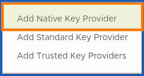

> [!primary]
>
> This feature is available in beta version.
>

## Objective

**This guide explains the options available for encrypting your VMs with or without KMS.**

## Requirements

- Access to the [OVHcloud Control Panel](/pages/account_and_service_management/account_information/ovhcloud-account-creation).
- A [Hosted Private Cloud VMware on OVHcloud](/links/hosted-private-cloud/vmware) offer.
- Access to the vSphere web interface of your Hosted Private Cloud VMware on OVHcloud.
- You must have sufficient IAM rights with your OVHcloud service account and Hosted Private Cloud KMS resources. See the following guides:
  - [IAM for VMware on OVHcloud - Overview and FAQ](/pages/hosted_private_cloud/hosted_private_cloud_powered_by_vmware/vmware_iam_getting_started).
  - [IAM for VMware on OVHcloud - How to enable IAM](/pages/hosted_private_cloud/hosted_private_cloud_powered_by_vmware/vmware_iam_activation).
  - [IAM for VMware on OVHcloud - How to create an IAM vSphere role](/pages/hosted_private_cloud/hosted_private_cloud_powered_by_vmware/vmware_iam_role).
  - [IAM for VMware on OVHcloud - How to associate a vSphere role and a user with an IAM policy](/pages/hosted_private_cloud/hosted_private_cloud_powered_by_vmware/vmware_iam_role_policy).

## Instructions

> [!primary]
>
> Please note that KMS activation is free, but you will be charged for using the OVHcloud KMS service at the standard rate.
>

### Step 1 - Introduction

**The advantages of VM encryption with OVHcloud KMS (OKMS).**

The OVHcloud KMS is a managed service designed to:

1. Protect your data within your OVHcloud services and applications using encryption techniques fully managed by OVHcloud. Securely generate and store your encryption keys. You can use them either for your OVHcloud services, or for your own applications without worrying about them being stolen, falsified or lost.
2. Ensure full reversibility of your services. The OVHcloud KMS provides a Key Management Interoperability Protocol (KMIP) API and a Test API. The KMIP API allows you to reuse OVHcloud KMS encryption keys across all non-OVHcloud services that support this protocol. Furthermore, you can seamlessly transfer your encryption keys to another KMIP-compatible KMS without disrupting your application integration.
3. Have a redundant and *serverless* managed service infrastructure.

Here, we will detail the steps you will need to follow to successfully configure KMS with your Hosted Private Cloud VMware on OVHcloud.

**Authentication**

To date, authentication is only possible within the OVHcloud KMS (OKMS), thanks to the **mtls** (mutual tls) method, the official tls protocol [rfc8705](https://www.rfc-editor.org/rfc/rfc8705.html) and KMIP for management (creation, deletion, etc.) within the VMware on OVHcloud environment.

**Use cases**

- Encryption and decryption of Hosted Private VMware on OVHcloud data (VM encryption strategies within vSphere, vApp, etc.).
- Generate KMS keys from vSphere with OVHcloud KMS.
- Storage of encryption keys with the OVHcloud KMS in a VMware on OVHcloud Hosted Private Cloud environment.
- Management of the lifecycle of your keys (use, rotation, revocation, etc...) within the OVHcloud ecosystem.
- Using IAM and OVHcloud KMS (OKMS) with your VMware on OVHcloud Hosted Private Cloud.
- Interconnection of OVHcloud services or not with the KMS.

**OVHcloud KMS benefits**

OVHcloud KMS allows you to take advantage of the benefits of a managed key management service (KMS as a service) within the VMware on OVHcloud Hosted Private Cloud universe.

For more information on the advantages of using the OVHcloud KMS, please read the guide:

- [Guide 3 - KMS - Architecture Overview](/pages/manage_and_operate/kms/architecture-overview).

This architecture is redundant and thus allows you to suffer breakdowns without them affecting your service.

#### KMIP

KMIP provides a service compatible with vCenter and host-based encryption within VMware vSphere on OVHcloud.

### Step 2 - Overview of the choices to encrypt virtual machines

> [!primary]
>
> From vSphere 7.0 Update 2, Encrypted VMs and Virtual TPMs can continue to operate even when the key server is temporarily offline or unavailable.
>
> Verify that the Key Server (KMS) is listed in the VMware Compatibility Guide for Key Management Servers (KMS) and is KMIP 1.1 compliant, and can be a symmetric key server and cast.
>

#### Option 1 - Without OKMS

/// details | With an external KMS (BYOK - not from OVHcloud)

> [!warning]
>
> Think carefully about the dependencies of your infrastructure on the key server. For more information, see [Guide 2 - HPC - Enable VM encryption with OKMS](/pages/hosted_private_cloud/hosted_private_cloud_powered_by_vmware/vmware_okms_vm-encrypt).
>
> Some KMS solutions are delivered as virtual images, creating a dependency loop or other availability issues with the wrong KMS appliance location - [KMS compatibility - Official documentation](https://www.vmware.com/resources/compatibility/search.php?deviceCategory=kms)
>

**How do I enable disk encryption on my VMs**?

You need to configure KMS on your Hosted Private Cloud VMware on OVHcloud, following the instructions of the following guide:

- [Guide 5 - HPC - Enabling VM encryption with an external KMS](/pages/hosted_private_cloud/hosted_private_cloud_powered_by_vmware/vm_encrypt)

Here, you can access the API calls required to check and enable encryption on your Hosted Private Cloud VMware on OVHcloud virtual machines.

As well as settings for adding an external KMS cluster:

- [Guide 2 - HPC - Enable VM encryption with OKMS](/pages/hosted_private_cloud/hosted_private_cloud_powered_by_vmware/vmware_okms_vm-encrypt)

- [KMS compatibility - Officiel documentation](https://www.vmware.com/resources/compatibility/search.php?deviceCategory=kms)

**BYOK** : Bring your owwn key.

///

#### Option 2 - With OKMS

/// details | With OVHcloud KMS

**How to activate the OVHcloud KMS with your Hosted Private Cloud VMware on OVHcloud**?

If you do not have an external KMS, and you want to use the one offered by OVHcloud (OKMS) to encrypt your VMs, you can follow the instructions from the guide below:

- [Guide 2 - HPC - Enable VM encryption with OKMS](/pages/hosted_private_cloud/hosted_private_cloud_powered_by_vmware/vmware_okms_vm-encrypt#activation-okms)

Once you have ordered and activated your KMS with your Hosted Private Cloud, you just need to synchronize with your VMware on OVHcloud environment to enable encryption. To do this, follow the instructions from the guide below:

- [Guide 2 - HPC - Enable VM encryption with OKMS](/pages/hosted_private_cloud/hosted_private_cloud_powered_by_vmware/vmware_okms_vm-encrypt#add-okms)

For this option, we will use a **Standard key provider**

{.thumbnail}

**How do I enable encryption with the OKMS**?

Once you have ordered the OVHcloud KMS, you can configure it to work with your Hosted Private Cloud VMware on OVHcloud.

For more information, follow our guide:

- [Guide 2 - HPC - Enable VM encryption with OKMS](/pages/hosted_private_cloud/hosted_private_cloud_powered_by_vmware/vmware_okms_vm-encrypt#activation-encryption)

If you have a few gray areas on all the steps to follow, from the order up to the activation of VM encryption, use the [guide 2 summary](/pages/hosted_private_cloud/hosted_private_cloud_powered_by_vmware/vmware_okms_vm-encrypt#summary)

For this option, we will use a **Standard key provider**

{.thumbnail}

///

#### Option 3 - Without KMS (vNKP)

/// details | With VMware Native Key Protocol

> [!primary]
>
> vNKP is not a KMS key management service (without KMS/OKMS).
>

This solution is convenient if you do not have an external KMS and you do not want to use the OVHcloud one (OKMS).

**How do I enable VM encryption with vNKP**?

If you don't want the advantages of OVHcloud KMS (OKMS) and you still want to enable VM encryption, you can do this by adding a **Native key provider**

{.thumbnail}

This guide will detail the steps you need to follow:

- [Guide 4 - HPC - Enabling VM encryption with a vNKP](/pages/hosted_private_cloud/hosted_private_cloud_powered_by_vmware/vm_encrypt-vnkp)

///

## Go further

KMS for Hosted Private Cloud VMware on OVHcloud - Guide index:

- [Guide 1 - KMS - First step](/pages/manage_and_operate/kms/quick-start)
- [Guide 2 - HPC - Enable VM encryption with OKMS](/pages/hosted_private_cloud/hosted_private_cloud_powered_by_vmware/vmware_okms_vm-encrypt)
- [Guide 3 - KMS - Architecture Overview](/pages/manage_and_operate/kms/architecture-overview)
- [Guide 4 - HPC - Enabling VM encryption with a vNKP](/pages/hosted_private_cloud/hosted_private_cloud_powered_by_vmware/vm_encrypt-vnkp)
- [Guide 5 - HPC - Enabling VM encryption with an external KMS](/pages/hosted_private_cloud/hosted_private_cloud_powered_by_vmware/vm_encrypt)

Official documentation:

- [Introducing VMware vSphere Native Key Provider](https://docs.vmware.com/gb/en/VMware-vSphere/7.0/com.vmware.vsphere.security.doc/GUID-54B9FBA2-FDB1-400B-A6AE-81BF3AC9DF97.html#GUID-54B9FBA2-FDB1-400B-A6AE-81BF3AC9DF97)
- [VMware documentation of the encryption process on vSphere](https://docs.vmware.com/gb/en/VMware-vSphere/7.0/com.vmware.vsphere.security.doc/GUID-4A8FA061-0F20-4338-914A-2B7A57051495.html#GUID-4A8FA061-0F20-4338-914A-2B7A57051495)

You can also follow the OVHcloud KMS labs: [OVHcloud KMS labs](https://labs.ovhcloud.com/en/key-management-service/).

If you require training or technical support to implement your migration with VCD, please contact your TAM or [click here](/links/professional-services) to get a quote and request a custom analysis of your project from our Professional Services team experts.

Join our [community of users](/links/community).