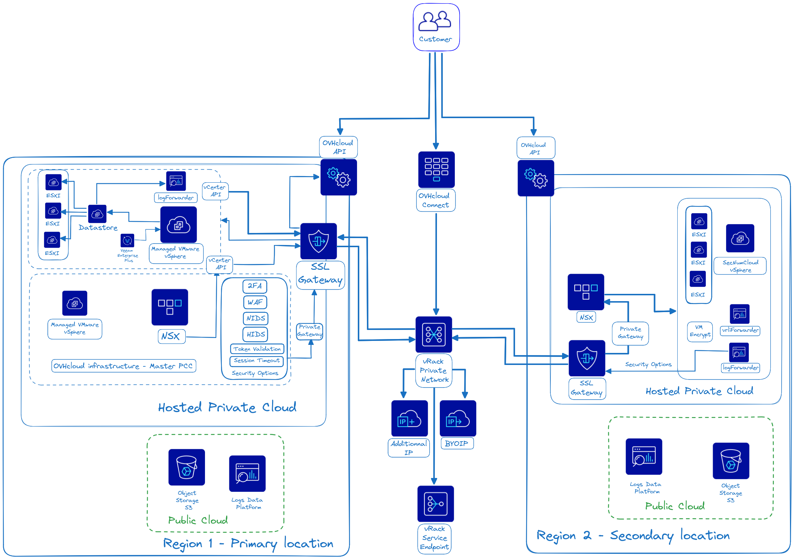
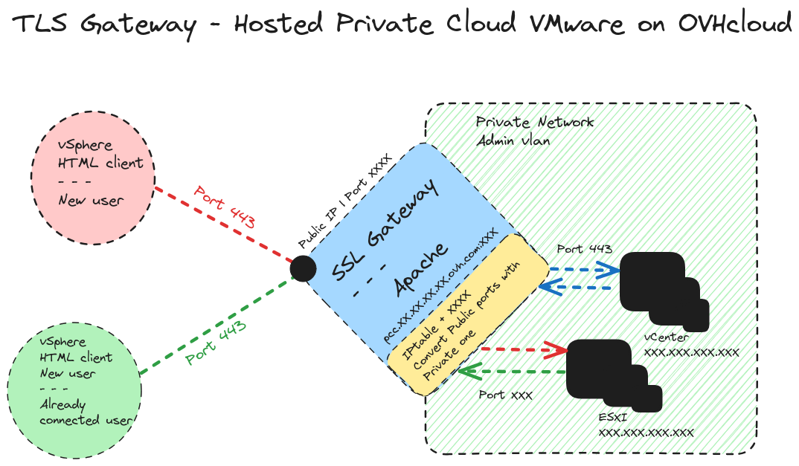

## Objectif

**Découvrir le fonctionnement de la passerelle tls dans un environnement managé Hosted Private Cloud - VMware on OVHcloud.**

## Prérequis

- Avoir souscrit à une offre managée [VMware vSphere on OVHcloud](/links/hosted-private-cloud/vmware).

## En pratique

OVHcloud s’efforce en permanence de fournir des instruments stables et sécurisés pour la gestion de votre infrastructure virtuelle. Pour atteindre cet objectif, nous visons à nous conformer aux normes établies de l'industrie, en particulier dans le contexte d'une communication de confiance.

Ce nouveau type d'architecture vous permet de construire un environnement Hosted Private CLoud sécurisé sur tous les points d'entrée à l'aide d'un certain nombre de fonctionnalités garanties.  

Ce point d'entrée étant maintenant cette **passerelle tls** pour l'ensemble de votre infrastructure managé VMware on OVHcloud. 

Voici un schéma d'exemple d'une architecture type 2 tiers (2 localisations) :

{.thumbnail}

Nous allons maintenant poursuivre avec une introduction, les fonctionnalités, les tarifs et ainsi que le fonctionnement interne de la passerelle tls.

### Étape 1 - Introduction

La mise en place de votre passerelle est automatique en fonction le l'offre choisie dans votre environnement Hosted Private Cloud - VMware on OVHcloud. Si vous avez souscrit à une offre standard, vous bénéficierez du pack de base (voir listing pack/option). Une majoration de votre abonnement est mise en place sur l'offre tls Gateway (passerelle tls) Avancée et Premium compris dans le prix total souscrit.

Vous n'avez pas besoin d'activer votre passerelle TLS. Cependant, vous pouvez contacter votre technical account manager ou le [support OVHcloud](/links/support) pour activer certaines options.

#### Tarifs

Le tarif pour une passerelle tls est inclus dans le prix de l'offre souscrite au sein de votre environnement Hosted Private Cloud - VMware on OVHcloud. Vous aurez une charge supplémentaire seulement si vous ne bénéficiez pas du pack ou options actuelles.

#### Fonctionnalités et dépendance

Un certain nombre de fonctionnalités sont disponibles suivant les packs de sécurités choisis, voici une matrice qui vous aidera à faire votre choix et avoir une idée d'une pricing mise en place :

| Options / Offers / Features                                          | Dependancy                                                                         |  Type  |                                      Pack Basic                                       |                             Pack Advanced Security                                                         | WAF | Comments                                                                                                                                                                                                                                                                                                                                         |
|:---------------------------------------------------------------------|:-----------------------------------------------------------------------------------|:------:|:-------------------------------------------------------------------------------------:|:----------------------------------------------------------------------------------------------------------:|----|:-------------------------------------------------------------------------------------------------------------------------------------------------------------------------------------------------------------------------------------------------------------------------------------------------------------------------------------------------|
| Default options                                                      |                                                                                    |  Pack  | - SFTP - Access Network - HIDS - Grsec Kernel - Log Insight Forwarder | - 2FA - Log Insight Forwarder - TLS 1.2 - Timeout on session - NIDS - Token validation |    |                                                                                                                                                                                                                                                                                                                                                  |
| SFTP (deprecated)                                                    |                                                                                    | Option |                                           ✅                                           |                                                     ✅                                                      |    | - Configure a sftp on the tls gateway to access to PCC's datastores with sftp. Replaced by [Uploading an ISO in a datastore](/pages/hosted_private_cloud/hosted_private_cloud_powered_by_vmware/vmware_datastore_upload).                                                                                                                        |
| Antivirus                                                            |                                                                                    |        |                                           ✅                                           |                                                     ✅                                                      |    | - Included in the basic and advanced security pack. Used on the tls gateway OS for the web entered flow.                                                                                                                                                                                                                                         |
| Token validation                                                     |                                                                                    | Option |                                           ✅                                           |                                                     ✅                                                      |    | - Each sensitive task run on the PCC require your validation. - [Using the secure interface](/pages/hosted_private_cloud/hosted_private_cloud_powered_by_vmware/interface-secure).                                                                                                                                                           |
| NIDS                                                                 |                                                                                    | Option |                                           ✅                                           |                                                     ✅                                                      |    | - Will configure a nids software on components with a dedicated access.                                                                                                                                                                                                                                                                          |
| HIDS                                                                 |                                                                                    | Option |                                           ✅                                           |                                                     ✅                                                      |    | - Will configure a hids software on pcc's components.                                                                                                                                                                                                                                                                                            |
| Private Gateway                                                      | - Private Customer Vlan                                                            | Option |                                           ✅                                           |                                                     ✅                                                      |    | - Deploy a private gateway in a hosted private cloud private vlan to be able to access to PCC's interfaces throw private vlan (no need public access). To enable the private gateway, check this guide [Enable the Private Gateway](/pages/hosted_private_cloud/hosted_private_cloud_powered_by_vmware/private_gateway).                         |
| vRops                                                                | - vRli Forwarder                                                                   |  Pack  |                                           ❌                                           |                                                     ✅                                                      |    | - Used with Log Forwarder. You can check this guide : [Introduction to vRealize Operations - vROPS](/pages/hosted_private_cloud/hosted_private_cloud_powered_by_vmware/vrops_introduction) and this one [Logs Data Platform - Collect VMware on OVHcloud logs](/pages/hosted_private_cloud/hosted_private_cloud_powered_by_vmware/vmware_ldp).   |
| WAF                                                                  |                                                                                    | Option |                                           ✅                                           |                                     ✅ (Avec SecNumCloud seulement)                                     | ✅  | - A configured WAF with a dedicated access.                                                                                                                                                                                                                                                                                                      |
| Grsec Kernel                                                         |                                                                                    | Option |                                           ❌                                           |                                                     ✅                                                      |    | - Use a secure kernel where the tls Gateway is running.                                                                                                                                                                                                                                                                                          |
| VM Encrypt                                                           | - SecNumCloud                                                                      |  Pack  |                                           ✅                                           |                                                     ✅                                                      |    | - Add VM encryption in your VMware on OVHcloud infrastructure. How to in guide [KMS for VMware on OVHcloud - VM encryption use case scenarios](/pages/hosted_private_cloud/hosted_private_cloud_powered_by_vmware/vmware_overall_vm-encrypt)                                                                                                     |
| Logstash                                                             |                                                                                    | Option |                                           ✅                                           |                                                     ✅                                                      |    | - Send VMware logs to managed Logstash. The use of a managed Logstash need to be added and configured manually from the OVHcloud control panel with the Log Forwarder feature. You can read the guide [Logs Data Platform - Collect VMware on OVHcloud logs](/pages/hosted_private_cloud/hosted_private_cloud_powered_by_vmware/vmware_ldp). |
| Log Insight Forwarder                                                |                                                                                    | Option |                                           ✅                                            |                                                    ✅                                                        |    | - Deploy a Log Insight Forwarder gathering all VMware components of the PCC and send logs to a syslog.                                                                                                                                                                                                                                           |
| Private Customer Vlan                                                |                                                                                    | Option |                        ✅ (seulement avec une Private gateway)                         |                                  ✅  (seulement avec une Private gateway)                                   |    | - Create a private vlan between the master pcc and your pcc to be able to deploy services. It require master pcc components.                                                                                                                                                                                                                     |
| Access Network Filtered                                              |                                                                                    | Option |                                           ✅                                           |                                                     ✅                                                      |    | - [Authorising IP addresses for vCenter access](/pages/hosted_private_cloud/hosted_private_cloud_powered_by_vmware/autoriser_des_ip_a_se_connecter_au_vcenter).                                                                                                                                                                                  |
| SPLA (licences windows)                                              |                                                                                    | Option |                                           ✅                                           |                                                     ✅                                                      |    | - [How to manage Windows licenses for virtual machines on your Hosted Private Cloud infrastructure](/pages/hosted_private_cloud/hosted_private_cloud_powered_by_vmware/spla_license_management).                                                                                                                                                 |
| Log Forwarder                                                        | - vRli Forwarder                                                                   | Option |                                           ✅                                           |                                                     ✅                                                      |    | - Deploy logs components to forward all VMware logs of a PCC. 2 features Log forwarder and Log to customer. - [Logs Data Platform - Collect VMware on OVHcloud logs](/pages/hosted_private_cloud/hosted_private_cloud_powered_by_vmware/vmware_ldp).                                                                                         |
| TLS 1.2 (vSphere v7)                                                 | - VMware vSphere v7                                                                | Option |                                           ❌                                           |                                                     ✅                                                      |    | - Force tls 1.2 on all PCC components.                                                                                                                                                                                                                                                                                                           |
| TLS 1.3 (vSphere v8)                                                 | - VMware vSphere v8                                                                | Option |                                           ❌                                           |                                                     ✅                                                      |    | - Force tls 1.3 on all PCC components.                                                                                                                                                                                                                                                                                                           |
| 2FA                                                                  |                                                                                    | Option |                                           ❌                                           |                                                     ✅                                                      |    | - [Using two-factor authentication (2FA) on your Private Cloud infrastructure](/pages/hosted_private_cloud/hosted_private_cloud_powered_by_vmware/utilisation_2FA).                                                                                                                                                                              |
| 2FA Fail to Ban                                                      | - 2FA                                                                              | Option |                                           ❌                                           |                                                     ✅                                                      |    | - Block too many try on your Hosted Private Cloud - VMware on OVHcloud HTML web client 2FA access.                                                                                                                                                                                                                                               |
| Time Out Session                                                     |                                                                                    | Option |                                           ❌                                           |                                                     ✅                                                      |    | - Will set a session timeout for your Hosted Private Cloud - VMware on OVHcloud HTML web client.                                                                                                                                                                                                                                                 |
| vRops                                                                | - vRli Forwarder                                                                   |  Pack  |                                           ❌                                           |                                                     ✅                                                      |    | - Used with Log Forwarder. You can check this guide : [Introduction to vRealize Operations - vROPS](/pages/hosted_private_cloud/hosted_private_cloud_powered_by_vmware/vrops_introduction) and this one [Logs Data Platform - Collect VMware on OVHcloud logs](/pages/hosted_private_cloud/hosted_private_cloud_powered_by_vmware/vmware_ldp).   |
| Log to Customer (coming soon)                                        | - Log Insight Forwarder - vRli Forwarder                                       | Option |                                           ❌                                           |                                                     ✅                                                      |    |                                                                                                                                                                                                                                                                                                                                                  |
| Beta SecNumCloud                                                     | - Pack Basic - Options avancées - Logstash                                 |  Pack  |                                           ✅                                           |                                                     ✅                                                      |  ❌  |                                                                                                                                                                                                                                                                                                                                                  |
| SecNumCloud                                                          | - Pack Basic - Options avancées - WAF - Logstash - Log to Customer |  Pack  |                                           ✅                                           |                                                     ✅                                                      | ✅  |                                                                                                                                                                                                                                                                                                                                                  |
| SecNumCloud - PCIDSS                                                 | - Pack Basic + Security Advanced - WAF - Logstash - Log to Customer    |  Pack  |                                           ✅                                           |                                                     ✅                                                      |  ✅  |                                                                                                                                                                                                                                                                                                                                                  |
| SecNumCloud - HDS                                                    | - Pack Basic + Security Advanced - WAF - Logstash - Log to Customer    |  Pack  |                                           ✅                                           |                                                     ✅                                                      | ✅   |                                                                                                                                                                                                                                                                                                                                                  |
| HDS                                                                  | - Pack Basic + Security Advanced - Send log to Customer                        |  Pack  |                                           ✅                                           |                                                     ✅                                                      |  ❌  | [Healthcare (HDS) or payment services (PCI DSS) compliance activation](/pages/hosted_private_cloud/hosted_private_cloud_powered_by_vmware/activer_l_option_hds_hipaa_ou_pci_dss).                                                                                                                                                                |
| PCIDSS                                                               | - Pack Basic + Security Advanced - Send log to Customer                        |  Pack  |                                           ✅                                           |                                                     ✅                                                      |  ❌  | [Healthcare (HDS) or payment services (PCI DSS) compliance activation](/pages/hosted_private_cloud/hosted_private_cloud_powered_by_vmware/activer_l_option_hds_hipaa_ou_pci_dss).                                                                                                                                                                |
| HIPAA                                                                | - Pack Basic + Security Advanced                                                   |  Pack  |                                           ✅                                           |                                                     ✅                                                      | ❌   |                                                                                                                                                                                                                                                                                                                                                  |
| [VMware vSphere Standard](/links/hosted-private-cloud/vmware)        | - Pack Basic                                                                       |  Pack  |                                           ✅                                           |                                                     ❌                                                      |  ❌  |                                                                                                                                                                                                                                                                                                                                                  |
| [VMware vSphere Avanced/Premium](/links/hosted-private-cloud/vmware) | - Pack Security Advanced                                                           |  Pack  |                                           ✅                                           |                                                     ✅                                                      |  ❌  |                                                                                                                                                                                                                                                                                                                                                  |

Comme évoqués, certaines options ne peuvent pas être activées dans le control panel ou dans l'api OVHcloud. Contactez votre référent Technical Account Manager ou sur le [support OVHcloud](https://help.ovhcloud.com/csm?id=csm_get_help) pour plus d'information.

### Étape 2 - Le fonctionnement interne de la gateway tls

**Qu'est-ce que cela veut dire** ?

N'ayant pas la possibilité de rentrer les details pour raison de sécurité, voici quelques informations utiles sur les principales fonctionnalités de la passerelle. Si vous avez besoin de plus d'information pour la mise en place de votre infrastructure ou de votre application (ports, IP, etc..), contactez votre référent OVHcloud ou le [support technique](https://help.ovhcloud.com/csm?id=csm_get_help).

- `Antivirus` : Un service d'antivirus est mis en place afin de sécuriser les flux entrants pour les attaques à l'aide de fichiers binaires par exemple (anti-malware). Des taches et mises à jour courantes sont éxécutés régulièrement.
- `Serveur Web` : Il permet la configuration des certificats TLS pour la mise en place du client HTML vSphere ainsi que pour les échanges sécurisés avec WSUS, Clamav, Veeam, Zerto, etc..). Et l'exécution de scripts internes et techniques pour d'autres fonctionnalités, tel que (2FA, MFA, etc..).
- `Monitoring` : Nous utilisons un ensemble d'outil interne pour gérer l'inventaire et la supervision du service managé. Ainsi que le monitoring de ces outils de sécurité.
- `Sécurité` : Tout le principe de l'utilisation d'une passerelle TLS est bien la sécurité. De sécurisé l'ensemble des points d'entrées de votre infrastructure managé.
- `Proxypass` : Proxypass est utilisé pour transférer les requêtes depuis la passerelle vers vCenter.
- `NAT` : Un des principaux avantage de ce service permet grâce à une unique IP publique de sécuriser les flux internes privée avec les flux externes publique (mises à jour, renouvellement de certificats, flux API OVHcloud, Veeam, Zerto) vers vos environnements privé interne VMware on OVHcloud.
- `Private Gateway` : L'activation d'une private gateway au sein de votre environnement privée vous permet de déployer une machine virtuelle et d'éffectuer la configuration réseau. Ce service est inclus avec l'activation de la passerelle TLS. Pour plus d'information, vous pouvez lire le guide [Activer la Private Gateway](/pages/hosted_private_cloud/hosted_private_cloud_powered_by_vmware/private_gateway).
- `2FA / MFA` : Elle permet la mise en place d'une double authentification sur le client HTML Web vSphere, exemple avec l'url suivante : <https://pcc-XXX-XXX-XXX-XXX.ovh.XX/ui/login>.
- `Fail to Ban` : Cette technologie permet d'éviter les bruteforce sur les urls sécurisés internes de votre environnement VMware on OVHcloud par exemple.
- `WAF` : **W**eb **A**pplication **F**irewall, qui se traduit par Pare-feu d'application Web. Permet de protéger une application web en filtrant et en surveillant le trafic HTTP entre une application web et Internet. Il protège généralement les applications web contre les attaques telles que la contrefaçon cross-site, le scripting cross-site (XSS), l’inclusion de fichiers et les injections SQL par exemple. La sécurisation étant un des principaux avantages du service,

Toutes ces fonctionnalités internes managées par OVHcloud fonctionne pleinement dans votre environnement managé VMware on OVHcloud.

**La connectivité réseau**

Pour accéder à votre client Web HTML de manière sécurisé, vCenter doit ouvrir une socket sur le bon port du vCenter d'administration. Sans passerelle tls, cela échouerait, car vSphere essaiera de se connecter sur l'IP du vCenter avec un port choisi, ce qui est impossible parce qu'il n'a pas accès à ce port pour raison de sécurité. Ainsi, elle fait suivre ce flux à travers la passerelle tls. Ainsi le client HTML vSphere pense qu'il se connecte directement au VCSA, mais il se connecte en faite juste à la passerelle tls avec un port spécial dédié, qui transmettra sa demande au vCenter.

{.thumbnail}

Pour plus d'information sur les connectivités réseaux au sein de votre Hosted Private Cloud - VMware on OVHcloud, consultez la page : <https://www.ovhcloud.com/fr/network/>.

**Les certificats utilisés** (exemple : `pcc-xxx-xxx-xxx-xxx.ovh.com|ca|pl...`)

La passerelle tls héberge les certificats sur un serveur Web classique. Cela permet d'avoir une connexion https sécurisée à votre client Web HTML vCenter. Le certificat est formaté tel que `pcc-xxx-xxx-xxx-xxx.ovh.(com|ca|pl ...)`, et est commandé par notre robot. Et poussé vers le vCenter et la passerelle tls. 

De nombreux certificats sont hébergés sur la tls Gateway. 

Tout ce dont vous avez besoin pour vos fonctionnalités vSphere managées et utilisées dans votre environnement (Zerto, NSX, vRops, plugins vSphere, etc..).

|   Service   |             Url              | Comments                                                                               |
|:-----------:|:----------------------------:|:---------------------------------------------------------------------------------------|
|  **Zerto**  | `zerto.pcc-x-x-x-x.ovh.com`  | - Certificat utilisé pour les échanges avec l'API Zerto et votre environnement managé. |
| **Plugin**  | `plugin.pcc-x-x-x-x.ovh.com` | - Certificat utilisé pour intégrer les plugins VMware (Veeam, VCD, KMS, etc..).        |
| **vSphere** |    `pcc-x-x-x-x.ovh.com`     | - Certificat utilisé pour accéder à votre client HTML vSphere.                         |
|   **NSX**   |  `nsx.pcc-x-x-x-x.ovh.com`   | - Certificat utilisé pour accéder au client HTML NSX.                                  |
|  **NSX-T**  |  `nsxt.pcc-x-x-x-x.ovh.com`  | - Certificat utilisé pour accéder au client HTML NSX-T.                                |
|  **vRops**  | `vrops.pcc-x-x-x-x.ovh.com`  | - Certificat utilisé pour accéder au client HTML vRops.                                |

**WAF (Web application firewall)**

Un certain nombre d'options sont disponibles avec les packs d'options de sécurités de vos environnements VMware managé on OVHcloud. L'option **W**eb **A**pplication **F**irewall (WAF) est disponible (voir matrice features/offres ci-dessus) et vous permet en plus de sécuriser vos applications. Cette option est disponible par défaut pour tous les environnements qualifiés SecNumCloud et certifié PCIDSS, HDS.

Le pack WAF OVHcloud inclut dans la passerelle tls est uniquement possible dans l'offre basique avec une private gateway activé. 

Vous pouvez voir dans ce guide [Activer la Private Gateway](/pages/hosted_private_cloud/hosted_private_cloud_powered_by_vmware/private_gateway) comment activer une private gateway. Et dans le pack avancé seulement pour les environnements qualifié SecNumCloud.

**Remarque** : Cette option est activé par défaut pour les offres qualifié SecNumCloud et certifié **HDS** et **PCIDSS**. Ainsi que pour tous les environnements des offres managées VMware vSphere standard et avancées, mais avec un pack d'option qui peut évoluer (voir le listing packs ci-dessous).

**Private gateway**

Les notions de la passerelle tls et de la private gateway sont 2 choses différentes, attention à ne pas confondre ces 2 éléments (voir dépendances de chaque features et options). En effet, certaines options sont uniquement disponibles dans votre environnement avec une private gateway activé.

Si vous avez besoin de plus d'information sur la private gateway, suivez le guide suivant : [Activer la Private Gateway](/pages/hosted_private_cloud/hosted_private_cloud_powered_by_vmware/private_gateway).

### Étape 3 - Transition vers TLS 1.3

À partir des prochaines mise à jour de VMware vSphere 7 vers VMware vSphere 8 on OVHcloud, nous recommanderons le protocole **T**ransport **L**ayer **S**ecurity version 1.3, plutôt que l'ancienne version tls 1.2, qui est mise en place par défaut au sein des environnements managés VMware vSphere 7 on OVHcloud.

Dans la prochaine version majeure, tls 1.2 et tls 1.3 coexisteront et la configuration vCenter par défaut prendra en charge les deux versions du protocole.

Notre intention est de déprécier tls 1.2 et de cesser de le prendre en charge à partir de la version majeure suivante.

Nous recommandons fortement à nos clients d'envisager de migrer vers vSphere 8 afin de prendre en charge tls 1.3 dans leurs produits afin que ces solutions fonctionnent avec une meilleure sécurité dans toutes les configurations vCenter.

## Aller plus loin

Si vous avez besoin d'une formation ou d'une assistance technique pour la mise en œuvre de nos solutions, contactez votre Technical Account Manager ou rendez-vous sur [cette page](/links/professional-services) pour obtenir un devis et demander une analyse personnalisée de votre projet à nos experts de l’équipe Professional Services.

Posez des questions, donnez votre avis et interagissez directement avec l’équipe qui construit nos services Hosted Private Cloud sur le [channel Discord dédié](https://discord.gg/ovhcloud).

Rejoindre et échangez avec notre [communauté d'utilisateurs OVHcloud](/links/community).
