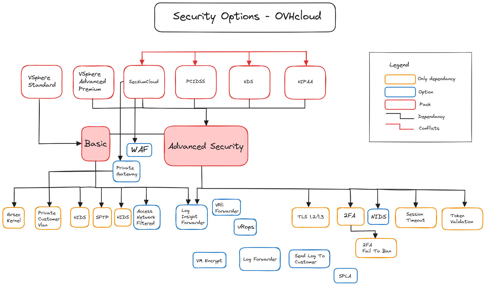

## Objectif

**Découvrir le fonctionnement de la passerelle tls dans un environnement managé Hosted Private Cloud - VMware on OVHcloud.**

## Prérequis

- Avoir souscrit à une offre managée [VMware vSphere on OVHcloud](/links/hosted-private-cloud/vmware).

## En pratique

OVHcloud s’efforce en permanence de fournir des instruments stables et sécurisés pour la gestion de votre infrastructure virtuelle. Pour atteindre cet objectif, nous visons à nous conformer aux normes établies de l'industrie, en particulier dans le contexte d'une communication de confiance.

Ce nouveau type d'architecture vous permet de construire un environnement **Hosted Private Cloud - VMware on OVHcloud** sécurisé sur tous les points d'entrée à l'aide d'un certain nombre de fonctionnalités garanties.  

Ce point d'entrée étant maintenant cette **passerelle tls** pour l'ensemble de votre infrastructure managé.

Voici un schéma d'exemple d'une architecture type 2 tiers (avec 2 localisations) :

{.thumbnail}

Nous allons maintenant poursuivre d'abord avec une introduction et les fonctionnalités. Puis les tarifs, mais aussi avec le fonctionnement interne de la passerelle.

### Étape 1 - Introduction

La mise en place de votre passerelle est automatique en fonction le l'offre choisie dans votre environnement Hosted Private Cloud - VMware on OVHcloud. Si vous avez souscrit à une offre standard, vous bénéficierez du pack de base (voir listing pack/option). Une majoration de votre abonnement est mise en place sur l'offre tls Gateway (passerelle tls) Avancée et Premium compris dans le prix total souscrit (passerelle tls = environ 10% du prix total souscrit). 

Vous n'avez pas besoin d'activer quoi que ce soit pour bénéficier de votre passerelle TLS. Cependant, pour l'activation de certaines options/packs payantes en plus, vous devez faire appel à votre technical account manager ou au [support OVHcloud](https://help.ovhcloud.com/csm?id=csm_get_help).

Nous allons vous expliquer dans la suite de ce guide, comment procéder.

#### Tarifs

Le tarif pour une passerelle tls est inclus dans le prix de l'offre souscrite au sein de votre environnement Hosted Private Cloud - VMware on OVHcloud. Vous aurez une charge supplémentaire seulement si vous ne bénéficiez pas du pack ou des options mises en place au sein de votre environnement managé.

#### Fonctionnalités et dépendance

{.thumbnail}

Un certain nombre de fonctionnalités sont disponibles suivant les packs de sécurités choisis, voici une matrice qui vous aidera à faire votre choix et avoir une idée du pricing mise en place.

| Options / Offers / Features                                           | Dependency                                                                                                      |   Available zones   |  Type  | Certs |                                       Pack Basic                                       |                                                   Pack Advanced Security                                                    | WAF | Comments                                                                                                                                                                                                                                                                                                                                                                       |
|:----------------------------------------------------------------------|:----------------------------------------------------------------------------------------------------------------|:-------------------:|:------:|:-----:|:--------------------------------------------------------------------------------------:|:---------------------------------------------------------------------------------------------------------------------------:|---|:-------------------------------------------------------------------------------------------------------------------------------------------------------------------------------------------------------------------------------------------------------------------------------------------------------------------------------------------------------------------------------|
| Default Options (tls gateway)                                         |                                                                                                                 |         All         |  Pack  |       | - SFTP<br/>- Access Network<br/>- HIDS<br/>- Grsec Kernel<br/>- Log Insight Forwarder  | - Pack Basic<br/>- 2FA<br/>- Log Insight Forwarder<br/>- TLS 1.2<br/>- Timeout on session<br/>- NIDS<br/>- Token validation |   |                                                                                                                                                                                                                                                                                                                                                                                |
| [VMware vSphere Standard](/links/hosted-private-cloud/vmware)         | - Pack Basic                                                                                                    |                     |  Pack  |   ❌   |                                           ✅                                            |                                                              ❌                                                              | ❌ |                                                                                                                                                                                                                                                                                                                                                                                |
| [VMware vSphere Advanced/Premium](/links/hosted-private-cloud/vmware) | - Pack Security Advanced                                                                                        |                     |  Pack  |   ❌   |                                           ✅                                            |                                                              ✅                                                              | ❌ |                                                                                                                                                                                                                                                                                                                                                                                |
|                                                                       |                                                                                                                 |                     |        |       |                                                                                        |                                                                                                                             |   |                                                                                                                                                                                                                                                                                                                                                                                |
| SFTP (deprecated)                                                     |                                                                                                                 |         All         | Option |   ❌   |                                           ✅                                            |                                                              ✅                                                              |   | - Configure a sftp on the tls gateway to access to PCC's datastores with sftp. Replaced by [Uploading an ISO in a datastore](/pages/hosted_private_cloud/hosted_private_cloud_powered_by_vmware/vmware_datastore_upload).                                                                                                                                                      |
| Antivirus                                                             |                                                                                                                 |         All         |        |   ❌   |                                           ✅                                            |                                                              ✅                                                              |   | - Included in the basic and advanced security pack. Used on the tls gateway OS for the web entered flow.                                                                                                                                                                                                                                                                       |
| Token validation                                                      |                                                                                                                 |         All         | Option |   ❌   |                                           ✅                                            |                                                              ✅                                                              |   | - Each sensitive task run on the PCC require your validation.<br/>- [Using the secure interface](/pages/hosted_private_cloud/hosted_private_cloud_powered_by_vmware/interface-secure).                                                                                                                                                                                         |
| NIDS (SIEM)                                                           |                                                                                                                 |         All         | Option |   ❌   |                                           ✅                                            |                                                              ✅                                                              |   | - Will configure a nids software on components with a dedicated access.                                                                                                                                                                                                                                                                                                        |
| HIDS (SIEM)                                                           |                                                                                                                 |         All         | Option |   ❌   |                                           ✅                                            |                                                              ✅                                                              |   | - Will configure a hids software on pcc's components.                                                                                                                                                                                                                                                                                                                          |
| Private Gateway                                                       | - Private Customer Vlan                                                                                         |         All         | Option |   ❌   |                                           ✅                                            |                                                              ✅                                                              |   | - Deploy a private gateway in a hosted private cloud private vlan to be able to access to PCC's interfaces throw private vlan (no need public access). To enable the private gateway, check this guide [Enable the Private Gateway](/pages/hosted_private_cloud/hosted_private_cloud_powered_by_vmware/private_gateway).                                                       |
| WAF                                                                   | - SecNumcloud (only with Pack Advanced Security)                                                                |         All         | Option |   ❌   |                                           ❌                                            |                                                ✅<br/>(only with SecNumCloud)                                                | ✅ | - A configured WAF with a dedicated access.                                                                                                                                                                                                                                                                                                                                    |
| Grsec Kernel                                                          |                                                                                                                 |         All         | Option |   ❌   |                                           ❌                                            |                                                              ✅                                                              |   | - Use a secure kernel where the tls Gateway is running.                                                                                                                                                                                                                                                                                                                        |
| VM Encrypt                                                            | - SecNumCloud                                                                                                   |         All         |  Pack  |   ❌   |                                           ✅                                            |                                                              ✅                                                              |   | - Add VM encryption in your VMware on OVHcloud infrastructure. How to in guide [KMS for VMware on OVHcloud - VM encryption use case scenarios](/pages/hosted_private_cloud/hosted_private_cloud_powered_by_vmware/vmware_overall_vm-encrypt)                                                                                                                                   |
| Logstash managed by OVHcloud                                          | - vRealize Log Insight Log Forwarder (vrli Forwarder)                                                           |         All         | Option |   ❌   |                                           ✅                                            |                                                              ✅                                                              |   | - Send VMware logs to managed Logstash. The use of a managed Logstash need to be added and configured manually from the OVHcloud control panel with the Log Forwarder feature. You can read the guide [Logs Data Platform - Collect VMware on OVHcloud logs](/pages/hosted_private_cloud/hosted_private_cloud_powered_by_vmware/vmware_ldp), a PCC LDP souscription is needed. |
| Log Insight Forwarder (vrliForwarder)                                 |                                                                                                                 |         All         | Option |   ❌   |                                           ✅                                            |                                                              ✅                                                              |   | - Deploy a Log Insight Forwarder gathering all VMware components of a PCC and send logs to a syslog.                                                                                                                                                                                                                                                                           |
| Log Forwarder (logForwarder)                                          |                                                                                                                 |         All         | Option |  ❌      |                                           ❌                                            |                                                               ❌                                                             |   | - Deploy Syslog on a PCC environnement to forward VMware (esxi, nsxtEdge, vcsa, NsxtManager) logs. Check guide [Logs Data Platform - Collect VMware on OVHcloud logs](/pages/hosted_private_cloud/hosted_private_cloud_powered_by_vmware/vmware_ldp). A LDP PCC souscription is needed.                                                                                        |
| Private Customer Vlan                                                 |                                                                                                                 |         All         | Option |   ❌   |                            ✅ (only with a Private Gateway)                             |                                              ✅  (only with a Private Gateway)                                               |   | - Create a private vlan between the master pcc and your pcc to be able to deploy services. It require master pcc components.                                                                                                                                                                                                                                                   |
| Access Network Filtered                                               |                                                                                                                 |         All         | Option |   ❌   |                                           ✅                                            |                                                              ✅                                                              |   | - [Authorising IP addresses for vCenter access](/pages/hosted_private_cloud/hosted_private_cloud_powered_by_vmware/autoriser_des_ip_a_se_connecter_au_vcenter).                                                                                                                                                                                                                |
| SPLA                                                                  |                                                                                                                 |         All         | Option |   ❌   |                                           ✅                                            |                                                              ✅                                                              |   | - SPLA can be enforced on both security packs but is not included by default. For more information check the guide : [How to manage Windows licenses for virtual machines on your Hosted Private Cloud infrastructure](/pages/hosted_private_cloud/hosted_private_cloud_powered_by_vmware/spla_license_management).                                                            |
| TLS 1.2 (vSphere v7)                                                  | - VMware vSphere v7                                                                                             |         All         | Option |   ❌   |                                           ❌                                            |                                                              ✅                                                              |   | - Enforce tls 1.2 on all PCC components, check last guide step for the tls 1.3 transition informations with vSphere 8.                                                                                                                                                                                                                                                         |
| TLS 1.3 (vSphere v8)                                                  | - VMware vSphere v8                                                                                             |         All         | Option |   ❌   |                                           ❌                                            |                                                              ✅                                                              |   | - Enforce tls 1.3 on all PCC components, check last guide step for the tls transition informations.                                                                                                                                                                                                                                                                            |
| 2FA                                                                   |                                                                                                                 |         All         | Option |   ❌   |                                           ❌                                            |                                                              ✅                                                              |   | - [Using two-factor authentication (2FA) on your Private Cloud infrastructure](/pages/hosted_private_cloud/hosted_private_cloud_powered_by_vmware/utilisation_2FA).                                                                                                                                                                                                            |
| 2FA Fail To Ban                                                       | - 2FA                                                                                                           |         All         | Option |   ❌   |                                           ❌                                            |                                                              ✅                                                              |   | - Block too many try on your Hosted Private Cloud - VMware on OVHcloud HTML web client 2FA access.                                                                                                                                                                                                                                                                             |
| Time Out Session                                                      |                                                                                                                 |         All         | Option |   ❌   |                                           ❌                                            |                                                              ✅                                                              |   | - Will set a session timeout for your Hosted Private Cloud - VMware on OVHcloud HTML web client.                                                                                                                                                                                                                                                                               |
| VMware Aria Operations (vRops)                                        | - vRealize Log Insight Log Forwarder (vrli Forwarder)                                                           |         All         |  Pack  |   ❌   |                                           ❌                                            |                                                              ✅                                                              |   | - Used with Log Forwarder. You can check this guide : [Introduction to vRealize Operations - vROPS](/pages/hosted_private_cloud/hosted_private_cloud_powered_by_vmware/vrops_introduction) and this one [Logs Data Platform - Collect VMware on OVHcloud logs](/pages/hosted_private_cloud/hosted_private_cloud_powered_by_vmware/vmware_ldp).                                 |
| Send Log To Customer (coming soon)                                    | - vRealize Log Insight Log Forwarder (vrli Forwarder)                                                           |         All         | Option |   ❌   |                                           ❌                                            |                                                              ✅                                                              |   |                                                                                                                                                                                                                                                                                                                                                                                |
|                                                                       |                                                                                                                 |                     |        |       |                                                                                        |                                                                                                                             |   |                                                                                                                                                                                                                                                                                                                                                                                |
| Beta SecNumCloud                                                      | - Pack Basic + Pack Security Advanced<br/>- Logstash                                                            |                     |  Pack  |   ❌   |                                           ✅                                            |                                                              ✅                                                              | ❌ |                                                                                                                                                                                                                                                                                                                                                                                |
| SecNumCloud                                                           | - Pack Basic + Pack Security Advanced<br/>- Private Gateway<br/>- WAF<br/>- Logstash<br/>- Send Log To Customer | `sbg2a`<br/>`rbx1a` |  Pack  |   ✅   |                                           ✅                                            |                                                              ✅                                                              | ✅ |                                                                                                                                                                                                                                                                                                                                                                                |
| SecNumCloud - PCIDSS                                                  | - Pack Basic + Pack Security Advanced<br/>- Private Gateway<br/>- WAF<br/>- Logstash<br/>- Send Log To Customer |         All         |  Pack  |   ✅   |                                           ✅                                            |                                                              ✅                                                              | ✅ |                                                                                                                                                                                                                                                                                                                                                                                |
| SecNumCloud - HDS                                                     | - Pack Basic + Pack Security Advanced<br/>- Private Gateway<br/>- WAF<br/>- Logstash<br/>- Send Log To Customer |         All         |  Pack  |   ✅   |                                           ✅                                            |                                                              ✅                                                              | ✅ |                                                                                                                                                                                                                                                                                                                                                                                |
| HDS                                                                   | - Pack Basic + Pack Security Advanced<br/>- Send Log To Customer                                                |         All         |  Pack  |   ✅   |                                           ✅                                            |                                                              ✅                                                              | ❌ | [Healthcare (HDS) or payment services (PCI DSS) compliance activation](/pages/hosted_private_cloud/hosted_private_cloud_powered_by_vmware/activer_l_option_hds_hipaa_ou_pci_dss).                                                                                                                                                                                              |
| PCIDSS                                                                | - Pack Basic + Pack Security Advanced<br/>- Send Log To Customer                                                |         All         |  Pack  |   ✅   |                                           ✅                                            |                                                              ✅                                                              | ❌ | [Healthcare (HDS) or payment services (PCI DSS) compliance activation](/pages/hosted_private_cloud/hosted_private_cloud_powered_by_vmware/activer_l_option_hds_hipaa_ou_pci_dss).                                                                                                                                                                                              |
| HIPAA                                                                 | - Pack Basic + Pack Security Advanced                                                                           | `vin1c`<br/>`hil1c` |  Pack  |   ✅   |                                           ✅                                            |                                                              ✅                                                              | ❌ |                                                                                                                                                                                                                                                                                                                                                                                |

Comme évoqués, certaines options ne peuvent pas être activées dans le control panel ou dans l'api OVHcloud. Contactez votre référent Technical Account Manager ou sur le [support OVHcloud](https://help.ovhcloud.com/csm?id=csm_get_help) pour plus d'information.

### Étape 2 - Le fonctionnement interne de la gateway tls

**Qu'est-ce que cela veut dire** ?

N'ayant pas la possibilité de rentrer les details pour raison de sécurité, voici quelques informations utiles sur les principales fonctionnalités de la passerelle. Si vous avez besoin de plus d'information pour la mise en place de votre infrastructure ou de votre application (ports, IP, etc..), contactez votre référent OVHcloud ou le [support technique](https://help.ovhcloud.com/csm?id=csm_get_help).

- `Antivirus` : Un service d'antivirus est mis en place afin de sécuriser les flux entrants pour les attaques à l'aide de fichiers binaires par exemple (anti-malware). Des taches et mises à jour courantes sont éxécutés régulièrement.
- `Serveur Web` : Il permet la configuration des certificats TLS pour la mise en place du client HTML vSphere ainsi que pour les échanges sécurisés avec WSUS, Clamav, Veeam, Zerto, etc..). Et l'exécution de scripts internes et techniques pour d'autres fonctionnalités, tel que (2FA, MFA, etc..).
- `Monitoring` : Nous utilisons un ensemble d'outil interne pour gérer l'inventaire et la supervision du service managé. Ainsi que le monitoring de ces outils de sécurité.
- `Sécurité` : Tout le principe de l'utilisation d'une passerelle TLS est bien la sécurité. De sécurisé l'ensemble des points d'entrées de votre infrastructure managé.
- `Proxypass` : Proxypass est utilisé pour transférer les requêtes depuis la passerelle vers vCenter.
- `NAT` : Un des principaux avantage de ce service permet grâce à une unique IP publique de sécuriser les flux internes privée avec les flux externes publique (mises à jour, renouvellement de certificats, flux API OVHcloud, Veeam, Zerto) vers vos environnements privé interne VMware on OVHcloud.
- `Private Gateway` : L'activation d'une private gateway au sein de votre environnement privée vous permet de déployer une machine virtuelle et d'éffectuer la configuration réseau. Ce service est inclus avec l'activation de la passerelle TLS. Pour plus d'information, vous pouvez lire le guide [Activer la Private Gateway](/pages/hosted_private_cloud/hosted_private_cloud_powered_by_vmware/private_gateway).
- `2FA / MFA` : Elle permet la mise en place d'une double authentification sur le client HTML Web vSphere, exemple avec l'url suivante : <https://pcc-XXX-XXX-XXX-XXX.ovh.XX/ui/login>.
- `Fail to Ban` : Cette technologie permet d'éviter les bruteforce sur les urls sécurisés internes de votre environnement VMware on OVHcloud par exemple.
- `WAF` : **W**eb **A**pplication **F**irewall, qui se traduit par Pare-feu d'application Web. Permet de protéger une application web en filtrant et en surveillant le trafic HTTP entre une application web et Internet. Il protège généralement les applications web contre les attaques telles que la contrefaçon cross-site, le scripting cross-site (XSS), l’inclusion de fichiers et les injections SQL par exemple. La sécurisation étant un des principaux avantages du service,

Toutes ces fonctionnalités internes managées par OVHcloud fonctionne pleinement dans votre environnement managé VMware on OVHcloud.

**La connectivité réseau**

Pour accéder à votre client Web HTML de manière sécurisé, vCenter doit ouvrir une socket sur le bon port du vCenter d'administration. Sans passerelle tls, cela échouerait, car vSphere essaiera de se connecter sur l'IP du vCenter avec un port choisi, ce qui est impossible parce qu'il n'a pas accès à ce port pour raison de sécurité. Ainsi, la passerelle fait suivre ces flux à travers elle. Ainsi le client web HTML vSphere pense qu'il se connecte directement au vCenter (VCSA), mais en faite, il se connecte juste à la passerelle tls avec un port spécial dédié, qui transmettra sa demande au vCenter.

Voici un petit résumé du fonctionnement interne pour la connexion à l'interface web vSphere.

{.thumbnail}

Pour plus d'information sur les connectivités réseaux au sein de votre Hosted Private Cloud - VMware on OVHcloud, consultez la page : <https://www.ovhcloud.com/fr/network/>.

**Les certificats utilisés** (exemple : `pcc-xxx-xxx-xxx-xxx.ovh.com|ca|pl...`)

La passerelle tls héberge aussi les certificats, sur un serveur Web classique. Cela permet d'avoir une connexion https sécurisée à votre client Web HTML vCenter. Le certificat est formaté sous la forme, tel que `pcc-xxx-xxx-xxx-xxx.ovh.(com|ca|pl ...)`. Et est commandé par notre robot, et poussé vers le vCenter et la passerelle tls. 

De nombreux certificats sont hébergés, voici les principaux.

|   Service   |             Url             | Comments                                                                                        |
|:-----------:|:---------------------------:|:------------------------------------------------------------------------------------------------|
|  **Zerto**  | `zerto.pcc-x-x-x-x.ovh.xx`  | - Certificat utilisé pour les échanges avec les api Zerto et votre environnement managé VMware. |
| **Plugin**  | `plugin.pcc-x-x-x-x.ovh.xx` | - Certificat utilisé pour intégrer les plugins VMware (Veeam, VCD, KMS, etc..).                 |
| **vSphere** |    `pcc-x-x-x-x.ovh.xx`     | - Certificat utilisé pour accéder à votre client HTML vSphere.                                  |
|   **NSX**   |  `nsx.pcc-x-x-x-x.ovh.xx`   | - Certificat utilisé pour accéder au client HTML NSX.                                           |
|  **NSX-T**  |  `nsxt.pcc-x-x-x-x.ovh.xx`  | - Certificat utilisé pour accéder au client HTML NSX-T.                                         |
|  **vRops**  | `vrops.pcc-x-x-x-x.ovh.xx`  | - Certificat utilisé pour accéder au client HTML vRops.                                         |

**WAF (Web application firewall)**

Un certain nombre d'options sont disponibles avec les packs d'options de sécurités de vos environnements VMware managé on OVHcloud. L'option **W**eb **A**pplication **F**irewall (WAF) est disponible (voir matrice features/offres ci-dessus) et vous permet en plus de sécuriser vos applications. Cette option est disponible par défaut pour tous les environnements qualifiés SecNumCloud et certifié PCIDSS, HDS.

Le pack WAF OVHcloud inclut dans la passerelle tls est uniquement possible dans l'offre basique avec une private gateway activé. 

Vous pouvez voir dans ce guide [Activer la Private Gateway](/pages/hosted_private_cloud/hosted_private_cloud_powered_by_vmware/private_gateway) comment activer une private gateway. Et dans le pack avancé seulement pour les environnements qualifié SecNumCloud.

**Remarque** : Cette option est activé par défaut pour les offres qualifié SecNumCloud et certifié **HDS** et **PCIDSS**. Ainsi que pour tous les environnements des offres managées VMware vSphere standard et avancées, mais avec un pack d'option qui peut évoluer (voir le listing packs ci-dessous).

**Private gateway**

Les notions de la passerelle tls et de la private gateway sont 2 choses différentes, attention à ne pas confondre ces 2 éléments (voir dépendances de chaque features et options). En effet, certaines options sont uniquement disponibles dans votre environnement avec une private gateway activé.

Si vous avez besoin de plus d'information sur la private gateway, suivez le guide suivant : [Activer la Private Gateway](/pages/hosted_private_cloud/hosted_private_cloud_powered_by_vmware/private_gateway).

### Étape 3 - Options de sécurité avec l'API

> [!primary]
>
> Retrouvez plus d'informations sur l'API OVHcloud dans notre guide [Premiers pas avec l'API OVHcloud](/pages/manage_and_operation/api/first-steps).

Pour verifier vos options de sécurités actuelles et les compatibilités avec vos environnements, vous pouvez utiliser les appels api suivants :

> [!api]
> 
> @api {v1} /dedicatedCloud GET /dedicatedCloud/{serviceName}/securityOptions/dependenciesTree
> 
> **Paramètres** :
> 
> - `ServiceName` : Votre pcc sous la forme, ("pcc-XXX-XX-XX-XX").
> - `option` : Option sécurité cible, exemple : (Allowed: accessNetworkFiltered ┃ advancedSecurity ┃ base ┃ contentLibrary ┃ grsecKernel ┃ hds ┃ hids ┃ hipaa ┃ logForwarder ┃ nids ┃ pcidss ┃ privateCustomerVlan ┃ privateGw ┃ sendLogToCustomer ┃ sessionTimeout ┃ sftp ┃ snc ┃ spla ┃ sslV3 ┃ tls1.2 ┃ tokenValidation ┃ twoFa ┃ twoFaFail2ban ┃ vrliForwarder ┃ waf). 
>

/// details | Retour API pour l'option `advancedSecurity`, sur un pcc avec NSX-T activé par exemple :

```json
{
  "depends": [
    "sftp",
    "hids",
    "grsecKernel",
    "accessNetworkFiltered",
    "tls1.2",
    "twoFaFail2ban",
    "base",
    "twoFa",
    "logForwarder",
    "tls1.2",
    "sessionTimeout",
    "nids",
    "tokenValidation",
    "accessNetworkFiltered"
  ],
  "requires": [],
  "conflicts": [
    "sslV3",
    "sslV3"
  ]
}
```
///

/// details | Retour API pour l'option `base`, sur un pcc sans NSX-T activé par exemple :

```json
{
  "conflicts": [
    "sslV3"
  ],
  "requires": [],
  "depends": [
    "sftp",
    "hids",
    "grsecKernel",
    "accessNetworkFiltered",
    "tls1.2"
  ]
}
```
///

/// details | Retour API pour l'option `sendLogToCustomer`, sur un pcc avec NSX-T activé par exemple :

```json
{
  "conflicts": [],
  "depends": [],
  "requires": [
    "vrliForwarder"
  ]
}
```
///

/// details | Pour verifier les compatibilités avec les options de sécurité et votre environnement, utiliser l'appel API suivant.

Sur un pcc avec NSX-T activé, par exemple :

> [!api]
>
> @api {v1} /dedicatedCloud GET /dedicatedCloud/{serviceName}/securityOptions/compatibilityMatrix
>
> **Paramètres** :
>
> - `ServiceName` : Votre pcc sous la forme, ("pcc-XXX-XX-XX-XX").
>

```json
[
  {
    "description": "Deploy a LogInsight forwarder to gather all VMware logs of a Private Cloud",
    "enabled": false,
    "name": "vrliForwarder",
    "reason": null,
    "compatible": true,
    "state": "disabled"
  },
  {
    "state": "disabled",
    "compatible": true,
    "reason": null,
    "name": "privateGw",
    "enabled": false,
    "description": "Deploy a gateway in private VLAN to allow access to Private Cloud through private network instead of public network"
  },
  {
    "description": "Force TLSv1.2+ protocol on a Private Cloud",
    "enabled": true,
    "name": "tls1.2",
    "reason": null,
    "compatible": true,
    "state": "delivered"
  },
  {
    "compatible": false,
    "reason": {
      "code": "BAD_ZONE",
      "message": "This option can only be enabled on the following zones : sbg2a, rbx1a, gra2a"
    },
    "state": "disabled",
    "enabled": false,
    "description": "SNC certification pack",
    "name": "snc"
  },
  {
    "state": "delivered",
    "reason": null,
    "compatible": true,
    "name": "hids",
    "description": "Configure HIDS software on a Private Cloud",
    "enabled": true
  },
  {
    "state": "disabled",
    "compatible": false,
    "reason": {
      "code": "GENERIC_ERROR",
      "message": "This option is incompatible with OVHcloud IAM option"
    },
    "name": "advancedSecurity",
    "enabled": false,
    "description": "Advanced security features pack"
  },
  {
    "enabled": true,
    "description": "Allow access to Private Cloud datastores through gateway SSL with SFTP",
    "name": "sftp",
    "compatible": true,
    "reason": null,
    "state": "delivered"
  },
  {
    "name": "grsecKernel",
    "description": "Use grsec kernel",
    "enabled": true,
    "state": "delivered",
    "reason": null,
    "compatible": true
  },
  {
    "description": "Deploy a syslog forwarder to gather all VMware logs of a Private Cloud",
    "enabled": true,
    "name": "logForwarder",
    "reason": null,
    "compatible": true,
    "state": "delivered"
  },
  {
    "description": "Configure a WAF on gateway SSL",
    "enabled": false,
    "name": "waf",
    "reason": null,
    "compatible": true,
    "state": "disabled"
  },
  {
    "description": "HIPAA certification pack",
    "enabled": false,
    "name": "hipaa",
    "reason": {
      "message": "This option can only be enabled on the following zones : vin1c, hil1c",
      "code": "BAD_ZONE"
    },
    "compatible": false,
    "state": "disabled"
  },
  {
    "name": "sendLogToCustomer",
    "enabled": false,
    "description": "Deploy a logstash instance to forward Private Cloud logs to customer",
    "state": "disabled",
    "compatible": false,
    "reason": {
      "code": "MISSING_REQUIREMENTS_OPTIONS",
      "message": "This option cannot be enabled because the following options are required but not enabled : vrliForwarder"
    }
  },
  {
    "name": "spla",
    "enabled": true,
    "description": "Allow Windows deploiements from template factory",
    "state": "delivered",
    "compatible": true,
    "reason": null
  },
  {
    "reason": null,
    "compatible": true,
    "state": "delivered",
    "description": "Default pack",
    "enabled": true,
    "name": "base"
  },
  {
    "state": "disabled",
    "reason": null,
    "compatible": true,
    "name": "nids",
    "description": "Configure NIDS software on a Private Cloud",
    "enabled": false
  },
  {
    "state": "disabled",
    "compatible": false,
    "reason": {
      "message": "This option cannot be enabled anymore",
      "code": "ACTION_IMPOSSIBLE"
    },
    "name": "sslV3",
    "enabled": false,
    "description": "Allow SSLv3 on gateway SSL"
  },
  {
    "compatible": false,
    "reason": {
      "message": "This option is incompatible with OVHcloud IAM option",
      "code": "GENERIC_ERROR"
    },
    "state": "disabled",
    "enabled": false,
    "description": "HDS certification pack",
    "name": "hds"
  },
  {
    "state": "delivered",
    "compatible": true,
    "reason": null,
    "name": "contentLibrary",
    "enabled": true,
    "description": "Access to OVHcloud content libraries"
  },
  {
    "compatible": true,
    "reason": null,
    "state": "delivered",
    "enabled": true,
    "description": "Filter network access on gateway SSL",
    "name": "accessNetworkFiltered"
  },
  {
    "name": "pcidss",
    "description": "PCIDSS certification pack",
    "enabled": false,
    "state": "disabled",
    "reason": {
      "message": "This option is incompatible with OVHcloud IAM option",
      "code": "GENERIC_ERROR"
    },
    "compatible": false
  },
  {
    "state": "disabled",
    "compatible": true,
    "reason": null,
    "name": "sessionTimeout",
    "enabled": false,
    "description": "Configure session timeout"
  }
]
```
///

Comme indiqué précédemment, si vous rencontrez des difficultés pour activer une option ou si vous avez des questions, contactez votre réferent technical account manager ou le [support](https://help.ovhcloud.com/csm?id=csm_get_help) OVHcloud.

### Étape 4 - Transition vers TLS 1.3

À partir des prochaines mise à jour de VMware vSphere 7 vers VMware vSphere 8 on OVHcloud, nous recommanderons le protocole **T**ransport **L**ayer **S**ecurity version 1.3, plutôt que l'ancienne version tls 1.2, qui est mise en place par défaut au sein des environnements managés VMware vSphere 7 on OVHcloud.

Dans la prochaine version majeure, tls 1.2 et tls 1.3 coexisteront et la configuration vCenter par défaut prendra en charge les deux versions du protocole.

Notre intention est de déprécier tls 1.2 et de cesser de le prendre en charge à partir de la version majeure suivante.

Nous recommandons fortement à nos clients d'envisager de migrer vers vSphere 8 afin de prendre en charge tls 1.3 dans leurs produits afin que ces solutions fonctionnent avec une meilleure sécurité dans toutes les configurations vCenter.

## Aller plus loin

Si vous avez besoin d'une formation ou d'une assistance technique pour la mise en œuvre de nos solutions, contactez votre Technical Account Manager ou rendez-vous sur [cette page](/links/professional-services) pour obtenir un devis et demander une analyse personnalisée de votre projet à nos experts de l’équipe Professional Services.

Posez des questions, donnez votre avis et interagissez directement avec l’équipe qui construit nos services Hosted Private Cloud sur le channel [Discord](https://discord.gg/ovhcloud) dédié.

Rejoindre et échangez avec notre [communauté d'utilisateurs OVHcloud](/links/community).
