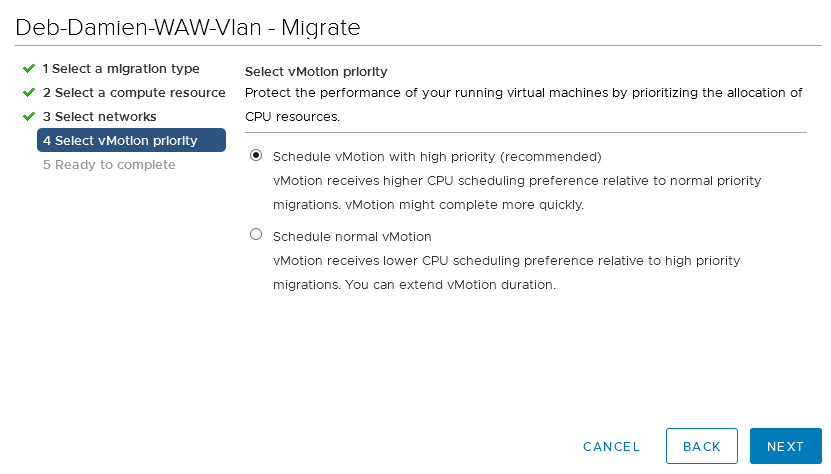
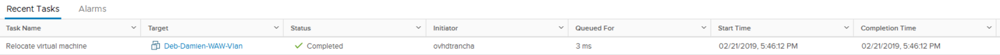

## Objetivo

La operación **vMotion** consiste migrar **en caliente** una máquina virtual (en ejecución) desde un host hacia otro host, un pool de recursos o una vApp, dentro de un mismo **cluster**.

**Esta guía explica cómo realizar esta operación.**

## Procedimiento

### Migrar una máquina virtual

Para migrar una máquina virtual hacia otro recurso, solo tendrá que hacer clic derecho en la máquina virtual encendida y seleccionar la opción `Migrate...`{.action}.

{.thumbnail}

## Selección del tipo de vMotion

Existen diferentes opciones de vMotion. En nuestro ejemplo, como solo queremos migrar la máquina virtual hacia otro host, seleccionaremos la opción «Change compute resource only».

La opción «Change storage only» permite migrar la máquina virtual hacia otro banco de datos. Para más información sobre la operación **Storage vMotion**, consulte nuestra [guía](/pages/hosted_private_cloud/hosted_private_cloud_powered_by_vmware/vmware_storage_vmotion).

{.thumbnail}

### Selección del recurso

Seleccione hacia qué recurso desea migrar la máquina virtual: un host, un cluster, un pool de recursos o una vApp.

En nuestro ejemplo, migraremos la máquina virtual hacia el host .50.

{.thumbnail}

### Selección de la red

En este paso podrá elegir la red asignada a la máquina virtual. En nuestro ejemplo, dejaremos la máquina virtual en la VLAN de origen.

{.thumbnail}

### Selección de la prioridad

Le recomendamos que realice la migración con prioridad alta. Para ello, seleccione la opción «Schedule vMotion with high priority».

{.thumbnail}

### Completar la operación vMotion

Haga clic en `Finish`{.action} para lanzar la migración.

{.thumbnail}

## Monitorizar la operación vMotion

Puede consultar el estado de la migración en su lista de tareas recientes. La duración de esta operación dependerá de la RAM asignada, la carga en la máquina virtual y el ancho de banda utilizado.

{.thumbnail}

## Más información

Interactúe con nuestra comunidad de usuarios en <https://community.ovh.com/en/>.
