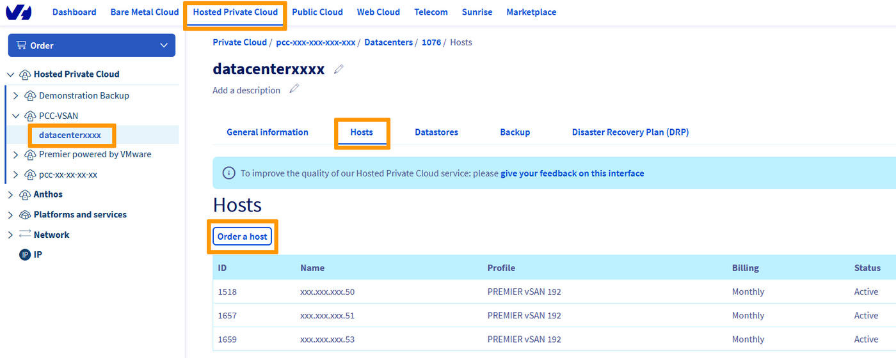
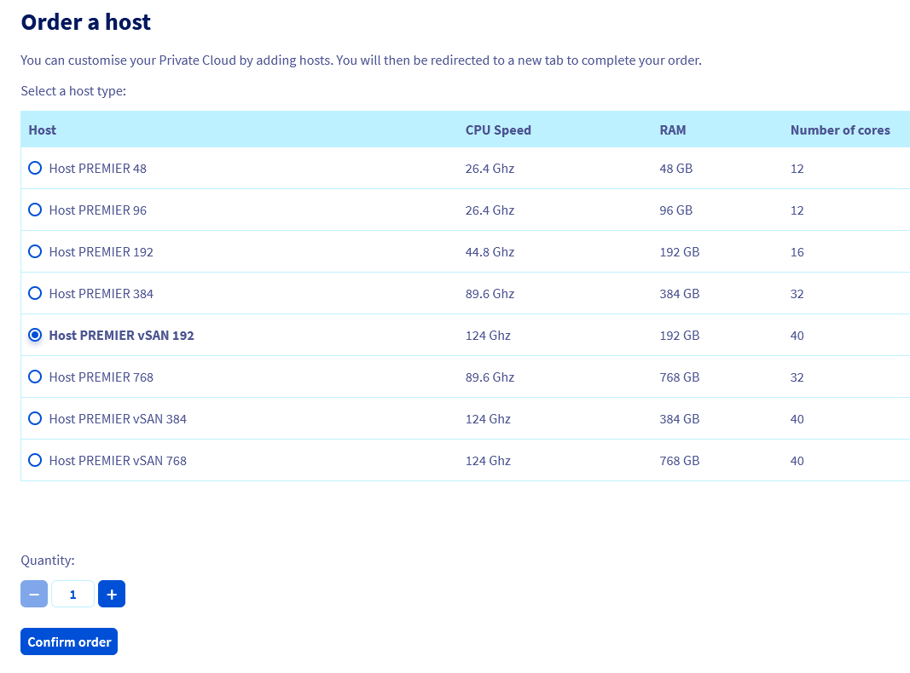
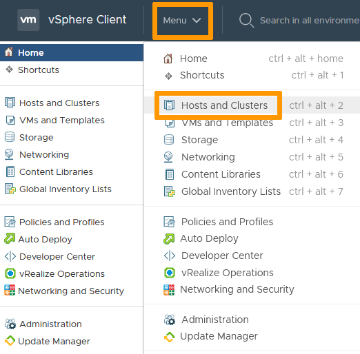
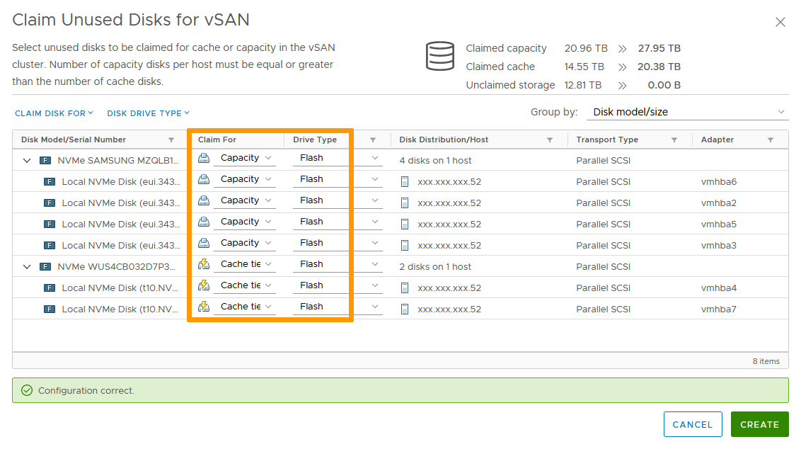
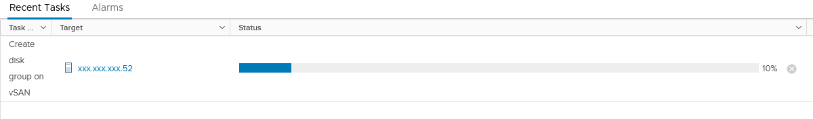

## Objectif

Ce guide explique comment ajouter le stockage d'un nouveau serveur ESXi dans un cluster vSAN existant.

## Prérequis

- Être contact administrateur de l'infrastructure [Hosted Private Cloud](https://www.ovhcloud.com/fr/enterprise/products/hosted-private-cloud/), afin de recevoir les identifiants de connexion.
- Avoir un identifiant utilisateur actif avec les droits spécifiques pour NSX (créé dans l'[espace client OVHcloud](https://www.ovh.com/auth/?action=gotomanager&from=https://www.ovh.com/fr/&ovhSubsidiary=fr))
- Avoir déployé un [datastore vSan](/pages/hosted_private_cloud/hosted_private_cloud_powered_by_vmware/vmware_vsan)

## En pratique

### Commander un nouvel hôte vSan

Connectez-vous à l'[espace client OVHcloud](https://www.ovh.com/auth/?action=gotomanager&from=https://www.ovh.com/fr/&ovhSubsidiary=fr) avec un compte administrateur.

Dans la section `Hosted Private Cloud`{.action}, sélectionnez votre datacentre et allez dans l'onglet `Hosts`{.action}. 
Cliquez le bouton `Commander un Host`{.action}.

{.thumbnail}

Choisissez l'hôte vSAN qui vous convient puis cliquez sur `Confirmer la commande`{.action}

{.thumbnail}

Verifiez le récapitulatif avant de cliquer `Suivant`{.action}

Cochez les cases pour accepter les termes et conditions et payez le bon de commande via le moyen de paiement de votre choix.

Vous obtiendrez une confirmation de commande et un numéro de commande.

Le nouvel hôte sera intégré automatiquement à votre infrastructure. Vous recevrez un email de confirmation quand il sera prêt à l'usage dans vSphere.

### Ajouter l'espace de stockage du nouvel hôte vSAN au datastore

Dans l'interface vSphere, allez dans le Tableau de bord `Hôtes et clusters`{.action}.

{.thumbnail}

Le nouvel hôte est visible dans le cluster. 
Sur la gauche de l'écran, sélectionnez le cluster, allez dans l'onglet `Configurer`{.action} puis `vSAN`{.action} / `Gestion de disques`{.action}. 
Cliquez sur `Réclamer des disques inutilisés`{.action}.

{.thumbnail}

Les disques disponibles sont attribués automatiquement au cache ou au stockage (voir la [page officielle VMware VSAN](https://docs.vmware.com/fr/VMware-vSphere/6.7/com.vmware.vsphere.vsan-planning.doc/GUID-18F531E9-FF08-49F5-9879-8E46583D4C70.html){.external} pour plus de détails) en fonction de leur type et de leur taille. Vous pouvez personnaliser les paramètres.

Cliquez sur `Créer`{.action}.

{.thumbnail}

Le nouveau groupe de disques prend un peu de temps pour être créé et ajouté au datastore vSAN.

{.thumbnail}

Le datastore est ensuite prêt à être utilisé avec l'espace de stockage supplémentaire.

## Aller plus loin

Échangez avec notre communauté d’utilisateurs sur <https://community.ovh.com/>.
