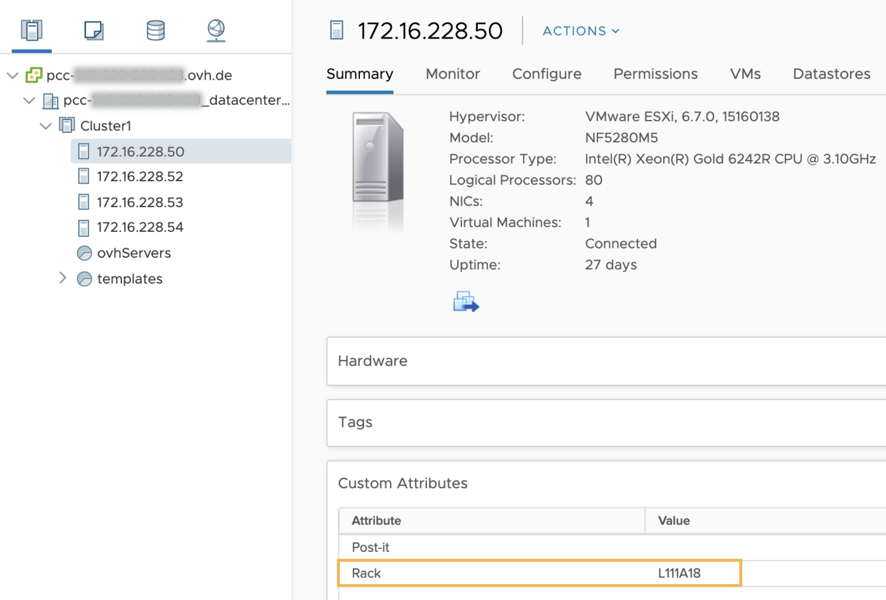
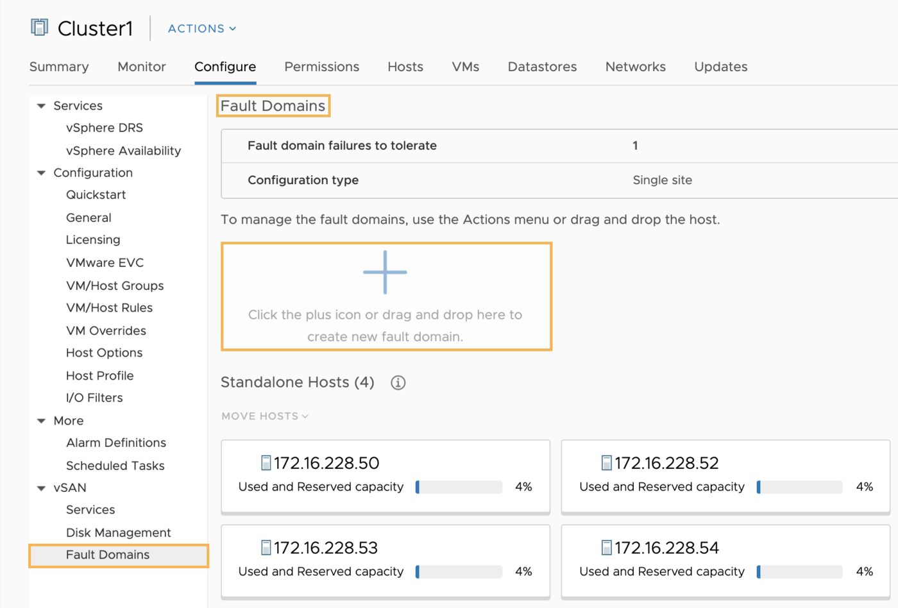
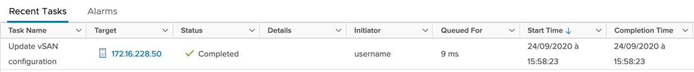

> [!primary]
> Diese Übersetzung wurde durch unseren Partner SYSTRAN automatisch erstellt. In manchen Fällen können ungenaue Formulierungen verwendet worden sein, z.B. bei der Beschriftung von Schaltflächen oder technischen Details. Bitte ziehen Sie im Zweifelsfall die englische oder französische Fassung der Anleitung zu Rate. Möchten Sie mithelfen, diese Übersetzung zu verbessern? Dann nutzen Sie dazu bitte den Button "Beitragen" auf dieser Seite.
>

## Ziel

Diese Anleitung erklärt Funktionsweise und Einsatz von vSAN Fault Domains.

## Voraussetzungen

- Sie sind Administrator-Kontakt für die Infrastruktur [Hosted Private Cloud](https://www.ovhcloud.com/de/enterprise/products/hosted-private-cloud/), um die Login-Daten zu erhalten.
- Sie haben eine aktive Benutzerkennung mit spezifischen Rechten für NSX [erstellt im OVHcloud Kundencenter](https://www.ovh.com/auth/?action=gotomanager&from=https://www.ovh.de/&ovhSubsidiary=de))
- Sie haben einen [vSAN Datastore](/pages/hosted_private_cloud/hosted_private_cloud_powered_by_vmware/vmware_vsan)

## In der praktischen Anwendung

### Funktionsweise

Ein Fehlerbereich (Fault Domain) bezieht sich auf eine Reihe von Servern, Speichergeräten oder Netzwerkkomponenten, die innerhalb eines physischen Standorts des Rechenzentrums zusammengefasst sind und bei einem Ausfall kollektiv zugeordnet werden können.

Mit vSAN können die Server unter Berücksichtigung ihres physischen Standorts zu vSAN Fault Domains zusammengefasst werden. 
Der Vorteil besteht darin, dass Sie über mehrere Fault Domains verfügen, sodass Sie von der Ausfallsicherheit von vSAN profitieren können. Auf diese Weise können Sie die Objekte der VMs über diese Servergruppen hinweg replizieren. Weitere Details finden Sie in [dieser Anleitung](https://core.vmware.com/resource/vmware-vsan-design-guide#sec8-sub3).

Die Ihnen zur Verfügung gestellten OVHcloud Server werden in verschiedenen Racks verteilt. So können abhängig von diesen Zuordnungen vSAN Fault Domains erstellt werden.

So erfordert die vSAN-Default-Strategie (Toleranzniveau FTT=1 bei RAID1 (Mirorring)) mindestens 3 Fault Domains (bei 2 Replicas + 1 'Witness'-Objekt).

### Implementierung

Es wird empfohlen, dieses Verfahren anzuwenden, wenn sich mehrere Server auf demselben Rack befinden. Bevorzugen Sie auch die gleiche Anzahl an Servern pro vSAN Fault Domains. Dadurch werden die Daten besser verteilt und im Falle einer Störung eines Fehlerbereichs besser geschützt.

Jeder OVHcloud Server verfügt über die Informationen des Racks, in dem er gehostet ist.

Gehen Sie in das Menü `Hosts and Clusters`{.action}, klicken Sie auf den betreffenden Server und dann auf den Tab `Summary`{.action}. Die Informationen finden sich auf der Ebene "Custom Attributes", in der Attribute-Zeile **Rack**.

{.thumbnail}

Wählen Sie im Menü `Hosts and Clusters`{.action} den betreffenden Cluster aus und klicken Sie dann auf den Tab `Configure`{.action}. Wählen Sie das Menü `vSAN`{.action} und dann `Fault Domains`{.action} aus.

Ziehen Sie hier den Server in die Box im mittleren Bereich.

{.thumbnail}

Benennen Sie die Fault Domain (zum Beispiel mit dem Array-Namen) im Feld "Fault domain name" und bestätigen Sie mit einem Klick auf `CREATE`{.action}.

Sie können den Fortschritt des Erstellungstasks im Fenster `Recent Tasks`{.action} verfolgen.

{.thumbnail}

Wiederholen Sie diese Operation für jedes Array.

{.thumbnail}

Fügen Sie bei Bedarf einen Server in einer bestehenden Fault Domain hinzu, indem Sie ihn verschieben, und bestätigen Sie mit einem Klick auf `MOVE`{.action}.

Informationen zum verwendeten, verfügbaren und absoluten Speicherplatz werden über der Fault Domain angezeigt.

Der vSAN-Cluster verfügt nun über Datenresilienz mittels Fault Domains.

## Weiterführende Informationen

Für den Austausch mit unserer User Community gehen Sie auf <https://community.ovh.com/en/>.
