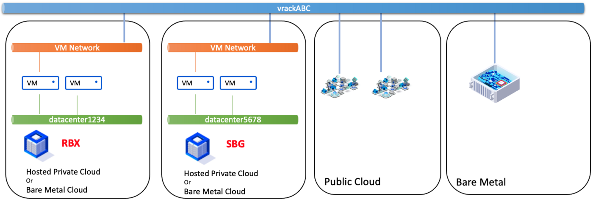
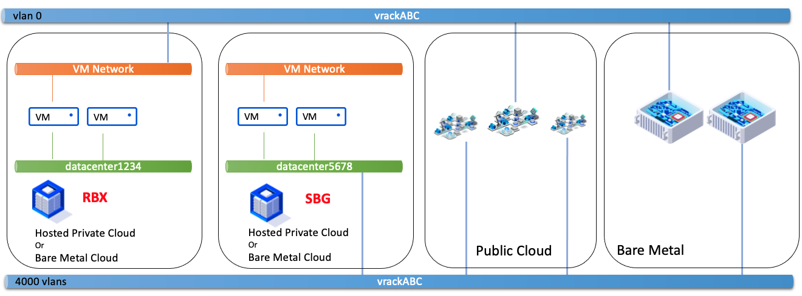
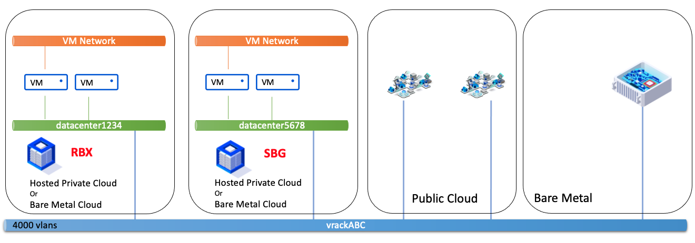
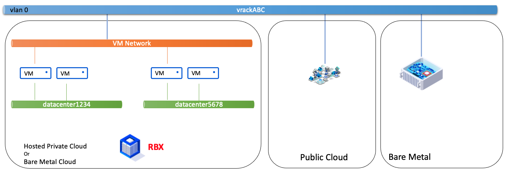
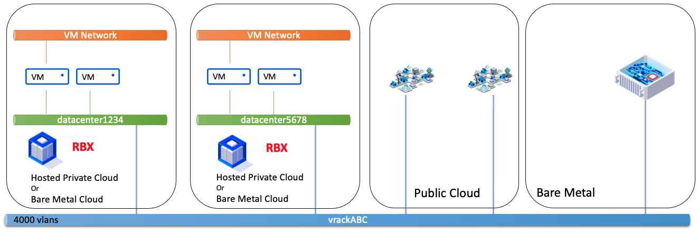

**Dernière mise à jour le 31/12/2021**

## Objectif

Le produit [vRack](https://www.ovh.com/ca/fr/solutions/vrack/){.external} permet d'interconnecter plusieurs produits OVHcloud et de les faire communiquer entre eux via 1 ou plusieurs vlan. Certaines configurations ne sont pas compatibles avec la solution Hosted Private Cloud.

**Ce guide explique les compatibilités de Hosted Private Cloud avec le produit vRack.**

## Prérequis

- Être contact administrateur de l'infrastructure [Hosted Private Cloud](https://www.ovhcloud.com/fr-ca/enterprise/products/hosted-private-cloud/), pour recevoir des identifiants de connexion.
- Avoir un identifiant utilisateur actif (créé dans l'[espace client OVHcloud](https://ca.ovh.com/auth/?action=gotomanager&from=https://www.ovh.com/ca/fr/&ovhSubsidiary=qc))

## Contexte technique

Dans le produit Hosted Private Cloud, il existe 2 types de vRack :

- « VM Network », qui est un vRack sur un vlan unique, le vlan natif du vlan public de Hosted Private Cloud. Ce vlan est utilisé dans Hosted Private Cloud pour router les IP Publiques. On le retrouve dans l'inventaire du vSphere en tant que PortGroup, dans la catégorie « Réseau », nommé « VM Network ». Ce vRack est donc attaché au switch virtuel entièrement géré par OVHcloud.

- « Datacenter vRack », ou « vRack vDC », ou « dvs-vrack », est le vRack qui permet d'avoir 4000 vlans. Ce vRack est attaché au switch virtuel géré par le client, avec ses propres cartes réseaux dédiées.

Il est important de noter que certaines gammes commerciales, comme les gammes à base de Hosts AMD n'ont pas de switch virtuel géré par le client. Seul le vRack de type « VM Network » est donc disponible.

Voici pour imager le contexte :

{.thumbnail}

## En pratique

### Ce que l'on peut faire

**Relier 2 vRack VM Network entre eux, dans des zone géographiques différentes, dans différents Hosted Private Cloud.**

{.thumbnail}

**Relier 1 vRack VM Network et 1 vRack vDC, dans des zone géographiques différentes, dans différents Hosted Private Cloud.**

{.thumbnail}

> [!primary]
>
> Pour que les VMs du vRack VM Network et les VMs du vRack vDC communiquent entre elles, les VMs du vRack vDC doivent être sur le vlan natif.
> 

**Relier 1 vRack vDC et 1 vRack vDC, dans des zone géographiques différentes, dans différents Hosted Private Cloud.**

{.thumbnail}

**Relier 1 vRack vDC et 1 vRack vDC, dans un même Hosted Private Cloud.**

{.thumbnail}

**Tous les vDC d'un même Hosted Private Cloud partagent le même vRack VM Network.**

{.thumbnail}

**Relier 1 vRack vDC et 1 vRack vDC, dans une même zone géographique, dans différents Hosted Private Cloud.**

{.thumbnail}

### Ce que l'on ne peut pas faire

**Relier 1 vRack VM Network et 1 vRack VM Network, dans une même zone géographique, dans différents Hosted Private Cloud.**

{.thumbnail}

**Relier 1 vRack VM Network et 1 vRack vDC, dans une même zone géographique, dans différents Hosted Private Cloud.**

{.thumbnail}

**Relier 1 vRack VM Network et 1 vRack vDC, dans une même zone géographique, dans le même Hosted Private Cloud.**

{.thumbnail}

## Aller plus loin

Échangez avec notre communauté d'utilisateurs sur <https://community.ovh.com>.
