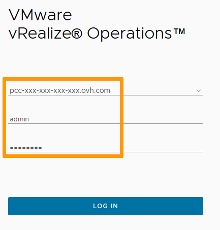
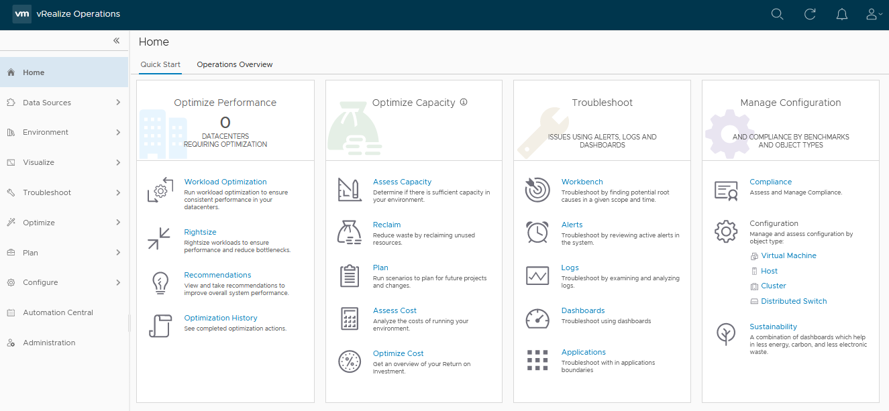
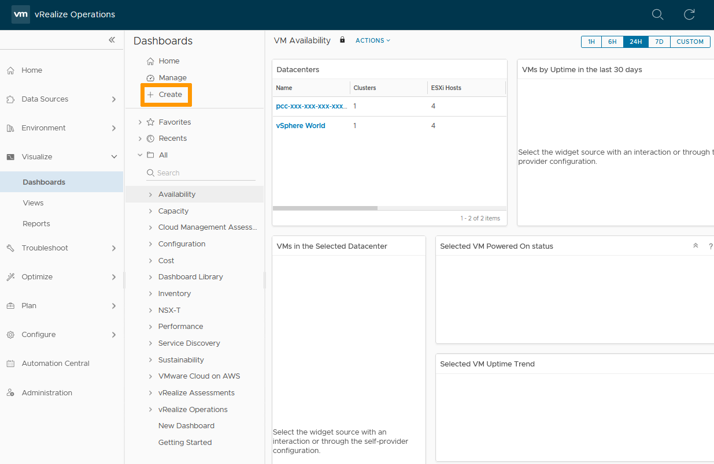
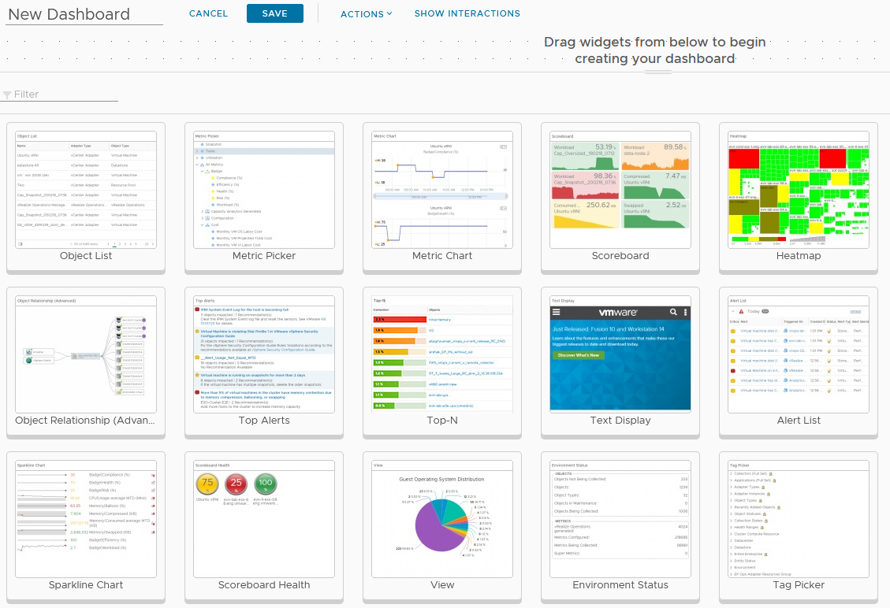
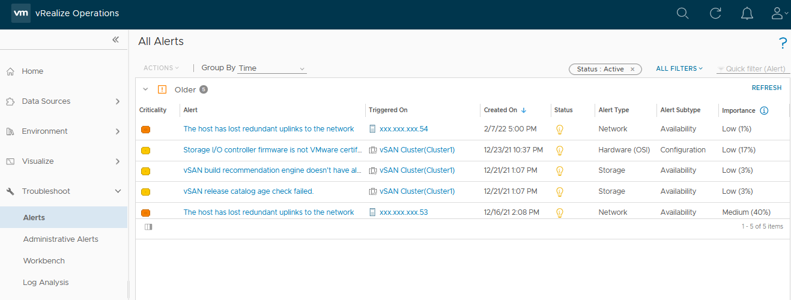
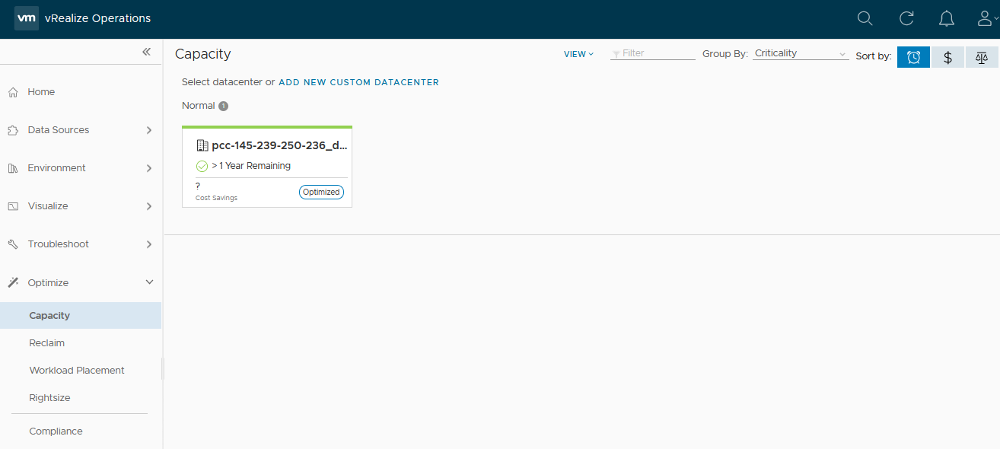
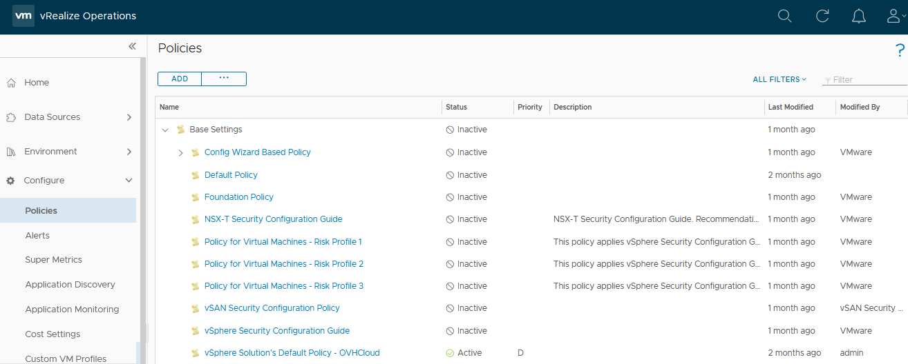
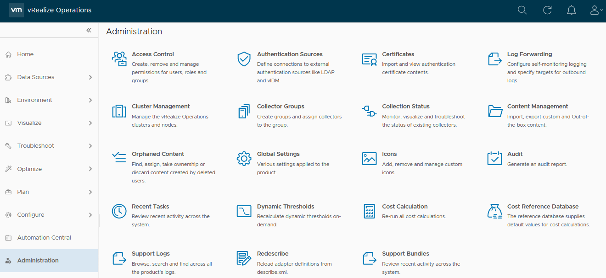

**Last updated 23rd February 2022**

## Objective

vRealize Operations is an operations management tool that monitors physical, virtual, and cloud infrastructures and allows automation of maintenance tasks.

**This guide offers an introduction to the vROPS interface.**

## Requirements

- Being an administrative contact of your [Hosted Private Cloud infrastructure](https://www.ovhcloud.com/it/enterprise/products/hosted-private-cloud/) to receive login credentials.
- A user account with access to vSphere and vROPS (created in the [OVHcloud Control Panel](https://www.ovh.com/auth/?action=gotomanager&from=https://www.ovh.it/&ovhSubsidiary=it))

## Instructions

### Interface access

To access vROPS, type in your hosted private cloud address in a browser. 
Click on the vROPS icon. 

{.thumbnail}

Use your vSphere login or the vROPS local user that you own.

{.thumbnail}

You are now on the vROPS Home page with access to all its functionalities.

{.thumbnail}

### Data Sources

The Data Sources section lists the different spaces monitored by vROPS. By default, your OVHcloud infrastructure is added.

{.thumbnail}

Clicking on `ADD ACCOUNT`{.action} gives you the ability to centralize multiple Private Clouds.

### Environments

The Environments section inventories your infrastructure and gives you access to monitoring of all your objects. Objects can be Hosts, Network devices, VMs, Applications... 

{.thumbnail}

### Visualize

The Visualize section holds dashboards and reports. There are plenty of premade dashboards that will give you quick views on your Infrastructure's health.

{.thumbnail}

You can still `+ Create`{.action} your own Dashboard to get a more specific view that will cater to your specific needs. 
You can pick and choose a widget to be displayed.

{.thumbnail}

### Troubleshoot

The Troubleshoot section is your alert and logs repository. There, you will be able to see and dig into the problems you're experiencing. Contextual links to documentation and fixes are also provided.

{.thumbnail}

### Optimize

The Optimize section gives you an insight and recommendations on the capacity of your infrastructure. The monitoring analysis performed by vROPS displays usage and right-sizing info to enable you to scale your environment.

{.thumbnail}

### Plan

The Plan section gives you trend and capacity management tools so you can future proof your infrastructure. 
Cost analysis and planning is also helpful for budgeting purposes.

{.thumbnail}

### Configure

The Configure section defines your metrics and threshold reactions through policies and alerts. 
You will be able to set up groups, profile, policies and/or alerts and appropriate response to tailor your infrastructure needs.

{.thumbnail}

### Automation

The Automation section schedules one time or scheduled maintenance jobs. 
Those jobs can be assigned to single or multiple objects over multiple spaces.

{.thumbnail}

### Administration

The Administration section pilots vROPS access and data clollection. 
This is where you can create specific vROPS accounts to be used. 

{.thumbnail}

## Go further

Join our community of users on <https://community.ovh.com/en/>.
