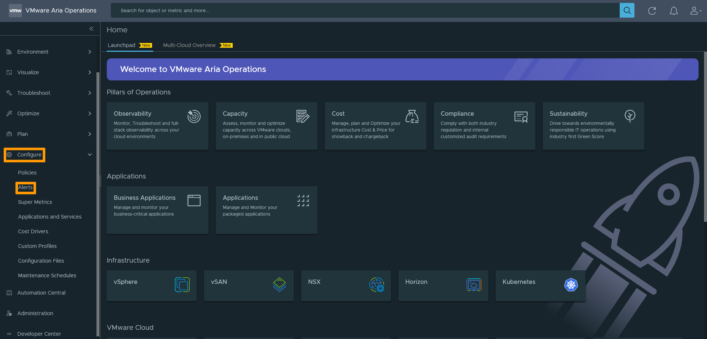
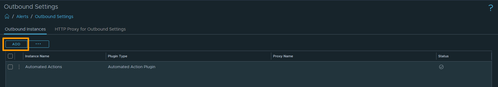
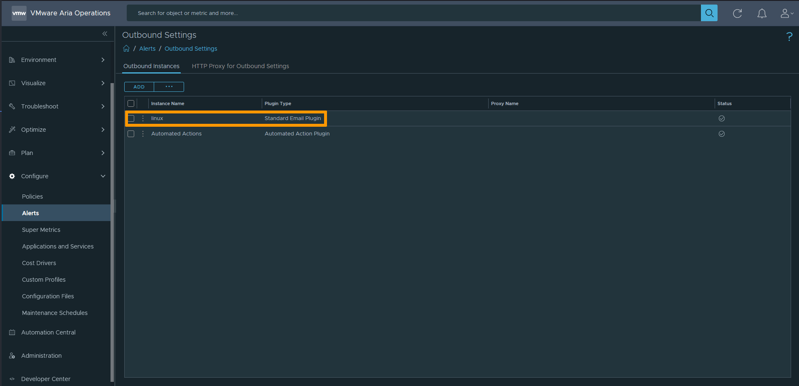

 
## Objectif
  
**Ce guide vous montre comment configurer votre serveusr SMTP afin d'automatiser l'envoi d'alertes et de rapport par mail au vRops**
  
## Prérequis
  
- Avoir un serveur SMTP fonctionnel
- Autoriser les flux STMP entre votre serveur.

## En pratique
  
### Ouverture d'un Flow

La première étape est d'ouvrir un Flow sur l'API d'Ovh pour permettre au vRops de communiquer avec votre serveur SMTP.
Pour cela il suffit de se rendre [ici](https://api.ovh.com/console/#/dedicatedCloud/%7BserviceName%7D/vrops/outgoingFlow~POST)

Il suffit de remplir les champs du call API. S'il ne fonctionne pas, n'hésitez pas à vérifier vos ouvertures de port du serveur.

| PARAMETRE | DESCRIPTION |
| :-: | :-: |
| servicename | nom de domaine du service |
| description | description du flow Outgoing (ici mettre en rapport avec smtp par exemple) |
| ip | l'adresse ip du service distant |
| servicePort | le port du service distant (de base 25,465,587 ou 2525 pour le smtp) |

{.thumbnail}

### Configuration de l'alerte au niveau du vRops
  
Une fois l'ouverture du flow effectuée. Vous devez configurer l'alerte email sur votre vRops.
Pour ce faire rendez-vous dans la section `Configure` puis l'onglet `Alerts`{.action}

Plusieurs types d'alertes s'offrent à vous, il vous faut sélectionner `Outbound Settings`{.action}.

Vous arrivez sur un récupalitif ainsi sur le récapitulatif de toutes vos Outbound Settings. Cliquez sur le bouton `ADD`{.action}.

Au niveau de l'option `Plugin Type`, veuillez sélectionner `Standard Email Plugin`{.action}.
Une série d'option va apparaitre, il vous suffit de remplir les champs indiquer.

| OPTION | DESCRIPTION |
| :-: | :-: |
| Use Secure Connection | Active le cryptage des communications sécurisées à l'aide de SSL/TLS. Si vous sélectionnez cette option, vous devez choisir une méthode dans le menu déroulant Type de connexion sécurisée. |
| Requires Authentication | Active l'authentification sur le compte utilisateur de messagerie que vous utilisez pour configurer cette instance SMTP. Si vous sélectionnez cette option, vous devez fournir un mot de passe pour le compte utilisateur. | 
| SMTP Host |  URL ou adresse IP de votre serveur de mail. |
| SMTP Port | Port par défaut utilisé par SMTP pour se connecter au serveur.  |
| Secure Connection Type | Dans le menu déroulant, sélectionnez SSL/TLS comme méthode de cryptage des communications utilisée dans votre environnement. Vous devez sélectionner un type de connexion si vous avez sélectionné "Use Secure Connection". |
| User Name | Compte d'utilisateur mail utilisé pour se connecter au serveur de mail.  |
| Password | Mot de passe du compte utilisateur de la connexion. Un mot de passe est requis si vous avez sélectionné " Requires Authentication". |
| Sender Email Address | Adresse mail qui apparaît dans le message de notification.  |
| Sender Name | Nom affiché pour l'adresse mail de l'expéditeur.  |
| Receiver Email Address | Adresse mail du destinataire. |

>[!warning]
>
>Pour le bien de la réalisation de cette documentation, le serveur SMTP n'a pas configuré d'authentification. 
>Cependant pour des questions évidentes de sécurité, il est fortement conseiller de le faire !
>

Vous avez la possibilité de tester votre configuration avec le bouton `Test`{.action} situé en bas de la page.

Une fois terminer, vous devez retrouver votre alerte dans le récapitulatif précédent.

Il ne vous reste plus qu'à tester le bon fonctionnement de votre alerte en vérifiant la bonne réception des mails.

### Modification d'une alerte existante

Il est possible de modifier une alerte existante en cliquant sur elle à partir du menu.

{.thumbnail}

## Aller plus loin
  
Échangez avec notre communauté d'utilisateurs sur <https://community.ovh.com>.