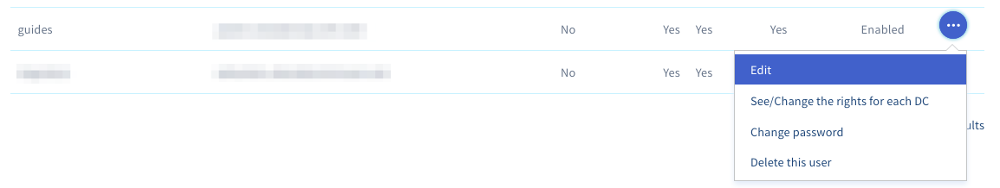
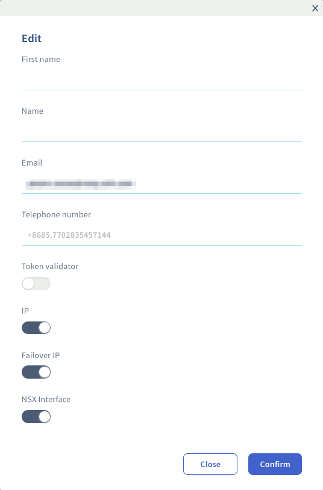

## Objective

You can associate a name, first name, phone number, and email address with a vSphere user in your Private Cloud. The email address allows validation by token.

**Learn how to associate an email address with your vSphere user.**

## Requirements

- A [Hosted Private Cloud infrastructure](https://www.ovhcloud.com/en-gb/enterprise/products/hosted-private-cloud/)

<!-- CP-NAV-START:privatecloud-vmware-vsphere -->
---

### OVHcloud Control Panel Access

- **Direct link:** [VMware vSphere](/links/control-panel/privatecloud-vmware-vsphere)
- **Navigation path:** `Hosted Private Cloud`{.action} > `Managed VMware vSphere`{.action} > Select your vSphere service

---
<!-- CP-NAV-END:privatecloud-vmware-vsphere -->

## Instructions

Go to the tab `Users`{.action}, click on `...`{.action} to the right of the user concerned and then click `Edit`{.action}.

{.thumbnail}

The following window appears:

{.thumbnail}

You can set your name, first name, phone number and email address.

This window also allows you to add editing rights to **IP**, **Additional IP**, **NSX Interface** and the **Token validator** used to approve certain sensitive actions on infrastructures that have the **Advanced Security** option enabled.

Click on `Confirm`{.action} to validate the modifications.

## Go further

Join our community of users on <https://community.ovh.com/en/>.
