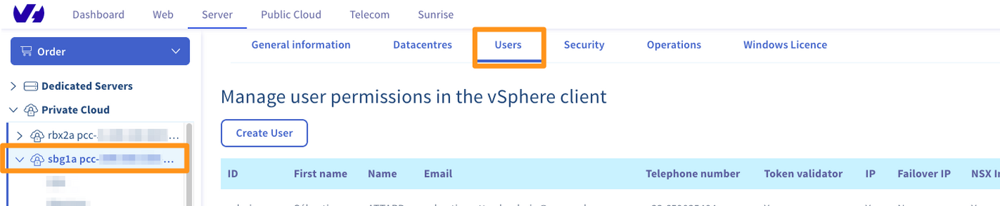

## Objetivo

Es posible asociar un nombre, un apellido, un número de teléfono y una dirección de correo electrónico a un usuario vSphere de Hosted Private Cloud. Asociar una dirección de correo electrónico permite activar la validación por token.

**Esta guía explica cómo asociar una dirección de correo electrónico a un usuario vSphere**.

## Requisitos

- Tener una solución [Hosted Private Cloud](https://www.ovhcloud.com/es/enterprise/products/hosted-private-cloud/).

<!-- CP-NAV-START:privatecloud-vmware-vsphere -->
---

### Acceso al área de cliente de OVHcloud

- **Enlace directo:** [VMware vSphere](/links/control-panel/privatecloud-vmware-vsphere)
- **Ruta de navegación:** `Hosted Private Cloud`{.action} > `Managed VMware vSphere`{.action} > Seleccione su servicio vSphere

---
<!-- CP-NAV-END:privatecloud-vmware-vsphere -->

## Procedimiento

Acceda a la pestaña `Usuarios`{.action}.

{.thumbnail}

En la pestaña `Usuarios`{.action}, haga clic en el icono con tres puntos (`...`) que aparece en la línea correspondiente al usuario y haga clic en `Editar`{.action}. 

{.thumbnail}

Será redirigido a la siguiente ventana:

{.thumbnail}

Desde ahí podrá introducir su nombre, apellido, número de teléfono y dirección de correo electrónico.

Asimismo, podrá agregar permisos de edición a la dirección **IP**, **Additional IP**, **InterfaceNSX** y el permiso **Token validator** necesario para confirmar acciones sensibles en aquellas infraestructuras con la opción de **Seguridad avanzada** activada.

Haga clic en `Aceptar`{.action} para confirmar los cambios.

## Más información

Interactúe con nuestra comunidad de usuarios en [https://community.ovh.com/en/](https://community.ovh.com/en/).
