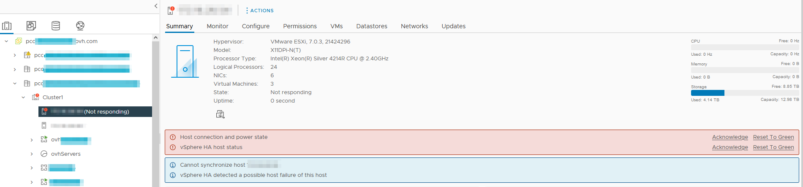

## Objective

If you would like to carry out a resilience test on your VMware on OVHcloud infrastructure, resilience mode simulates the temporary loss of a host, and validates the continuity of your production activity in the event of an incident.

**Find out how to test a temporary host loss with resilience mode on your VMware on OVHcloud infrastructure**

## Requirements

- A [VMware on OVHcloud solution](https://www.ovhcloud.com/asia/hosted-private-cloud/vmware/)
- Access to the [OVHcloud Control Panel](/links/manager)

## Instructions

This operation is carried out using the OVHcloud API, and will result in the selected host being unable to access the network, then deactivated for a defined period of time (min: 10min, max: 24h, default: 1h).

This test is independent of the monitoring system, thus avoiding automatic replacement of the host.

The VMs will be powered off, and the migration and reboot to the remaining host(s) will be carried out by vSphere HA if the feature is correctly configured on your cluster.

For more information about vSphere HA, you can read the VMware documentation [Functioning of vSphere HA](https://docs.vmware.com/en/VMware-vSphere/7.0/com.vmware.vsphere.avail.doc/GUID-33A65FF7-DA22-4DC5-8B18-5A7F97CCA536.html).

This way, you can estimate the time it takes to recover from the test launch and the incident simulation (RTO) until the VMs are rebooted.

Here are the calls to execute in order to list and obtain the credentials of your infrastructure, your data centre and the host on which you wish to carry out this test:

To retrieve the name of your infrastructure (`pcc-xx-xx-xx`):

> [!api]
>
> @api {v1} /dedicatedCloud GET /dedicatedCloud

To retrieve your `datacenterId`:

> [!api]
>
> @api {v1} /dedicatedCloud GET /dedicatedCloud/{serviceName}/datacenter

And finally, to retrieve your `hostId`:

> [!api]
>
> @api {v1} /dedicatedCloud GET /dedicatedCloud/{serviceName}/datacenter/{datacenterId}/host

Once you have this information, in order to confirm that you can launch the action, you can use the following call which will validate the test conditions and thus avoid any loss of activity:

> [!api]
>
> @api {v1} /dedicatedCloud GET /dedicatedCloud/{serviceName}/datacenter/{datacenterId}/host/{hostId}/resilience/canBeEnabled

If the test is feasible, the result is: `true`.

To start the test, you can use the following call:

> [!api]
>
> @api {v1} /dedicatedCloud POST /dedicatedCloud/{serviceName}/datacenter/{datacenterId}/host/{hostId}/resilience/enable

The host will then be disconnected and switch to "No response" mode until the test is complete:

{.thumbnail}

You can check the status of the action, using the following call:

> [!api]
>
> @api {v1} /dedicatedCloud GET /dedicatedCloud/{serviceName}/datacenter/{datacenterId}/host/{hostId}/resilience

If the test has been launched on the host, the result will be: `enabled`.

If necessary, you can also stop the test before the duration you have chosen by using this call:

> [!api]
>
> @api {v1} /dedicatedCloud POST /dedicatedCloud/{serviceName}/datacenter/{datacenterId}/host/{hostId}/resilience/disable

The information returned will include the schedule for the "updateHostResilienceOff" task.

Host connectivity will be restored once the test is complete, and your VMware on OVHcloud infrastructure will return to normal use.

## Go further

If you need training or technical assistance to implement our solutions, contact your sales representative or click on [this link](https://www.ovhcloud.com/asia/professional-services/) to get a quote and ask our Professional Services experts for a custom analysis of your project.

Join our community of users on <https://community.ovh.com/en/>.
