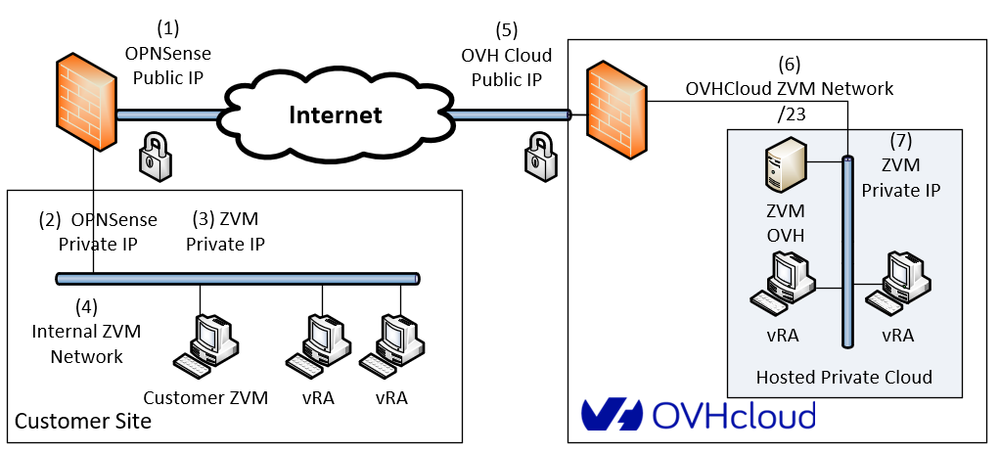
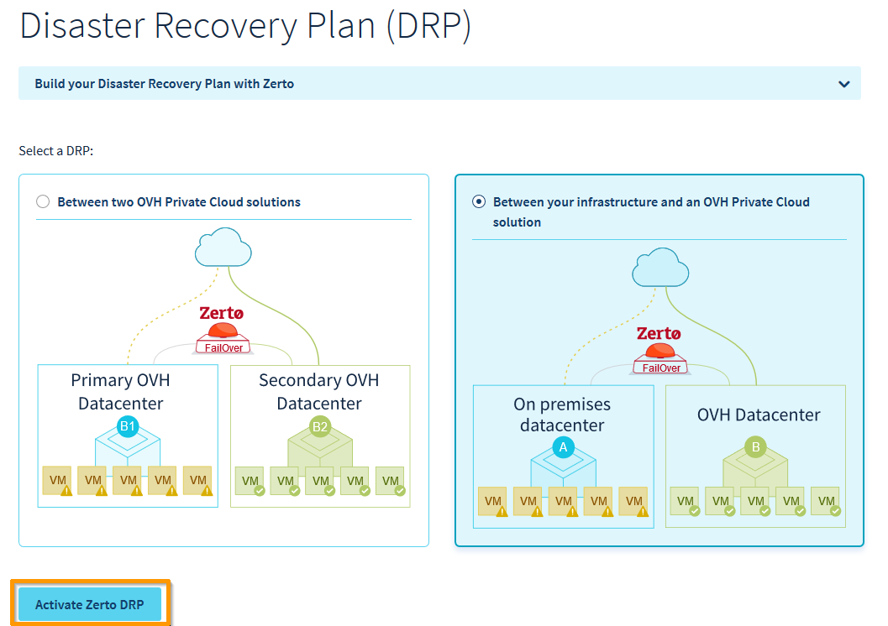
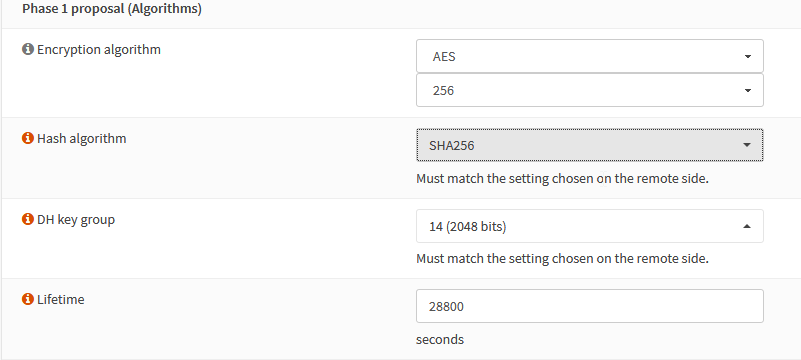
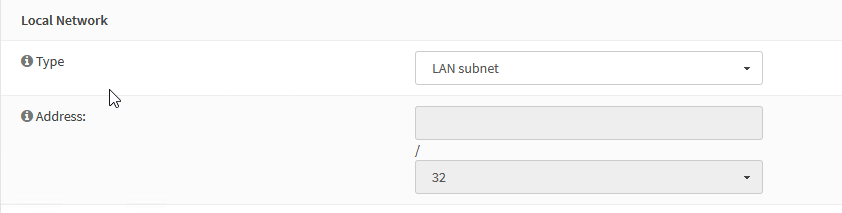
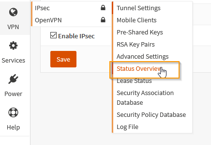
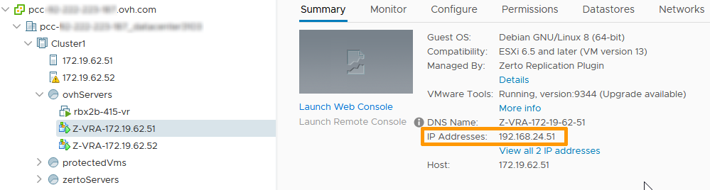
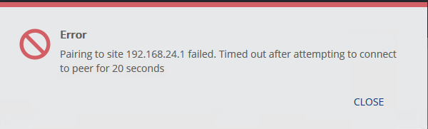

> [!primary]
> Esta tradução foi automaticamente gerada pelo nosso parceiro SYSTRAN. Em certos casos, poderão ocorrer formulações imprecisas, como por exemplo nomes de botões ou detalhes técnicos. Recomendamos que consulte a versão inglesa ou francesa do manual, caso tenha alguma dúvida. Se nos quiser ajudar a melhorar esta tradução, clique em "Contribuir" nesta página.
>

**Última atualização: 11/02/2022**

## Objetivo

Este guia tem como objetivo ajudá-lo a configurar a rede privada virtual (VPN) para ligar uma plataforma de terceiros ao seu Hosted Private Cloud da OVHcloud e implementar a solução de retoma de atividade Zerto. 
De modo a ilustrar o procedimento, vamos utilizar as funcionalidades VPN da OPNSense, que é uma plataforma firewall/VPN open source.
Para facilitar as explicações, vamos descrever a configuração mais simples de estabelecer um túnel VPN com a rede da interface Zerto Virtual Manager (ZVM). 

Para mais informações sobre a segunda opção, consulte o nosso guia "[Zerto entre dois datacenters da OVHcloud](/pages/hosted_private_cloud/hosted_private_cloud_powered_by_vmware/zerto_virtual_replication_as_a_service)"

## Requisitos

- Um endereço de IP público disponível na Private Cloud de destino, para o ponto de conexão VPN.
- Uma plataforma Zerto instalada e operacional na infraestrutura do cliente.
- As máquinas de replicação Zerto (VRA: Virtual Replication Appliance), tanto do lado do cliente quanto do lado da OVHcloud, devem poder comunicar-se pelas portas TCP 4007 e 4008.
- As máquinas de gestão Zerto (ZVM: Zerto Virtual Manager), tanto do lado do cliente quanto do lado da OVHcloud, devem poder comunicar-se pelas portas TCP 9081.

## Instruções

### Apresentação da arquitetura da solução

{.thumbnail}

**Definição dos parâmetros da arquitetura:**

Do lado do cliente:

- Endereço público do ponto de conexão VPN (1)
- Endereço interno do ponto de conexão VPN (2)
- Endereço interno da ZVM (3)
- Plano de endereçamento da rede ZVM (4)

Do lado da OVHcloud:

- Endereço público do ponto de conexão VPN (5)
- Plano de endereçamento da rede ZVM (6)
- Endereço da ZVM (7)

> [!primary]
>
>Deve escolher a rede em que deseja que a OVHcloud implemente a ZVM remota, de modo a evitar interferências com os endereços internos. 
>
>Se lhe convier, pode simplesmente aceitar aquela que lhe é sugerida de forma predefinida na interface da Área de Cliente.
>

### 1.ª etapa: Ativar a função Zerto no sentido Cliente > OVHcloud

A ativação realiza-se de forma muito simples a partir da Área de Cliente OVHcloud. Comece por selecionar o datacenter associado à Private Cloud e clique no separador `Plano de Recuperação de Desastres (DRP)`{.action}.

{.thumbnail}

Escolha a opção `Entre a sua infraestrutura e uma Private Cloud OVH`{.action} e, a seguir, clique em `Ativar Zerto DRP`{.action}.

{.thumbnail}

Selecione um endereço público disponível no intervalo sugerido.

{.thumbnail}

De seguida introduza a rede desejada para a implementação da ZVM.

{.thumbnail}

Então, clique em `Instalar`{.action}.

{.thumbnail}

### 2.ª etapa: Ativar o serviço IPSec

A partir da consola OPNSense, aceda ao menu `VPN`{.action} à esquerda. Na rubrica `IPSec`{.action}, selecione `Tunnel Setting`{.action}.

{.thumbnail}

Assinale a opção `Enable IPSec`{.action}.

{.thumbnail}

Guarde clicando em `Save`{.action}.

### 3.ª etapa: Configurar o túnel IPSec

A configuração do túnel é feita segundo dois grupos de parâmetros, chamados **Fase 1** e **Fase 2**.

#### 3.1. Adicionar a Fase 1

No menu `VPN`{.action}, na rubrica `Tunnel Setting`{.action}, clique no sinal `+`{.action} à direita do ecrã.

{.thumbnail}

##### 3.1.1. Fase 1: introdução de informações gerais

{.thumbnail}

Pode conservar os valores predefinidos:

- Método de conexão: Default
- Protocolo de troca de chaves: V2
- Protocolo Internet: IPv4
- Interface: WAN

No entanto, é indispensável que informe o IP do ponto de conexão IPSec da OVHcloud, no campo `Remote gateway`{.action}.

##### 3.1.2. Fase 1: autenticação

Mais uma vez, pode conservar os parâmetros predefinidos. Deve apenas introduzir a palavra-passe partilhada no campo `Pre-Shared Key`{.action}.

{.thumbnail}

##### 3.1.3. Fase 1: escolha dos algoritmos de encriptação

{.thumbnail}

Os valores suportados dos parâmetros são os seguintes:

- Algoritmo de encriptação: AES 256 bits
- Algoritmo de função hash: SHA256
- Grupo de chaves Diffie-Hellman: 14 (2048 bits)
- Tempo de vida: 28 800 segundos

Os parâmetros avançados podem conservar os valores predefinidos. Clique em `Save`{.action} e, a seguir, em `Aplicar as alterações`{.action}.

A Fase 1 passa a estar disponível na interface.

{.thumbnail}

#### 3.2. Adicionar a Fase 2

Clique no botão `Exibir as entradas Fase 2`{.action}.

{.thumbnail}

Como não se encontra nenhuma Fase 2 disponível, é necessário adicionar uma:

{.thumbnail}

Clique no botão `+`{.action}.

{.thumbnail}

##### 3.2.1. Fase 2: Informações gerais

{.thumbnail}

Verifique se o modo se encontra em «Túnel IPv4».

##### 3.2.2. Fase 2: Rede local

{.thumbnail}

O tipo de rede local selecionado deve ser «Sub-rede local».

##### 3.2.3. Fase 2: Rede remota

Neste ponto, é preciso introduzir o plano de endereçamento da rede em que se encontra a ZVM OVHcloud. 

A rede deverá ser /23 (512 endereços IP).

> [!warning]
>
> Tenha cuidado: se cometer algum erro neste passo, a VPN não vai funcionar. 
>

{.thumbnail}

##### 3.2.4. Fase 2: Trocas de chaves

Os parâmetros suportados são:

- Protocolo: ESP
- Algoritmo de encriptação: AES 256 bits
- Algoritmos de função hash: SHA256
- PFS: Off

{.thumbnail}

Não é necessário alterar as opções avançadas. Clique em `Save`{.action} e, a seguir, em `Aplicar as alterações`{.action}.

#### 3.3. Verificação do estado da VPN

{.thumbnail}

Clique no triângulo laranja à direita para iniciar a conexão.

{.thumbnail}

Se os parâmetros estiverem corretos, o túnel é estabelecido. Surgem então dois ícones novos:

- Desativar o túnel
- Obter informações sobre o estado do túnel

{.thumbnail}

Clique no ícone de informações.

{.thumbnail}

O túnel passa a estar operacional. Não se esqueça de adicionar, se necessário, uma rota na ZVM local para a rede da ZVM OVHcloud.

**Em caso de problemas:**

Se o túnel não se estabelecer, verifique a correção dos parâmetros seguintes:

- a chave partilhada;
- o IP do ponto de conexão remoto;
- o intervalo de IPs da rede remota.

Verifique também se o tráfego entre os dois extremos da VPN está a ser bloqueado por uma firewall.

Pode igualmente consultar o ficheiro de registo IPSec em /var/log/ipsec.log.

### 4.ª etapa: Configuração da firewall

O emparelhamento da infraestrutura do cliente com a da OVHcloud requer a autorização do tráfego entre:

- a porta 9081 e as ZVM;
- as portas 4007/4008 e as vRA.

#### 4.1. Abertura de portas em ZVM

Aceda ao menu `Firewall`{.action}, secção `Rules`{.action}, e selecione `IPSec`{.action}.

{.thumbnail}

Clique em `Add`{.action} para criar uma nova regra.

{.thumbnail}

{.thumbnail}

Esta regra comporta os parâmetros seguintes:

- Ação: «Pass» (Autorizar o tráfego)
- Interface: «IPSec» (O tráfego de entrada a autorizar provém da VPN)
- Protocolo: «TCP»

As secções Source e Destination são do tipo «Single host or Network» e fazem referência, respetivamente, aos endereços IP da ZVM OVHcloud para a ZVM do cliente.

{.thumbnail}

A porta TCP de destino autorizada é a 9081.

Guarde a regra e aplique-a.

#### 4.2. Abertura de portas em vRA 

A abertura de portas em vRA é um pouco mais complexa, visto que há tantas vRA quanto ESXi, tanto do lado do cliente quanto do lado da OVHcloud. 

Todas elas devem poder comunicar-se pelas portas TCP 4007 e 4008. 

Para simplificar este tipo de situações, a OPNSense disponibiliza os alias. Um alias é um grupo de objetos (endereços IP, redes, URL, etc.) que pode ser utilizado na definição de regras de uma firewall.

Neste caso, vamos precisar de 3 alias:

- um para os endereços IP das vRA do lado do cliente;
- um para os endereços IP das vRA do lado da OVHcloud;
- um para as portas a autorizar.

O IP das vRA do lado da OVHcloud pode ser consultado na interface vSphere da Private Cloud de destino:

{.thumbnail}

Crie o alias OVH_VRA para os vRA do lado da OVHcloud:

{.thumbnail}

Da mesma forma, é preciso criar um alias para as máquinas do lado do cliente:

{.thumbnail}

Já só resta criar o alias para as portas:

{.thumbnail}

Agora dispõe de todos os elementos para criar as regras de firewall a fim de autorizar o tráfego proveniente da OVHcloud em direção à plataforma do cliente. O procedimento é o mesmo; basta utilizar os alias na configuração:

{.thumbnail}

Neste ponto, a conexão VPN está operacional e protegida.

{.thumbnail}

### 5.ª etapa: Emparelhamento das ZVM

Depois de a ZVM se encontrar instalada na infraestrutura do cliente, já pode aceder à interface Zerto. 

Aparecerá a seguinte janela:

{.thumbnail}

Escolha a opção `Pair to a site with a licence`{.action} e introduza o endereço IP da ZVM do lado da OVHcloud; de seguida, clique em `Start`{.action}.

No painel de controlo, encontrará uma mensagem a indicar que o emparelhamento está em curso.

{.thumbnail}

Se a operação for concluída com sucesso, receberá a seguinte mensagem:

{.thumbnail}

Verifique se o nome da sua Private Cloud OVHcloud aparece no separador `Sites`{.action}.

{.thumbnail}

Neste ponto, a solução Zerto encontra-se operacional, pelo que pode criar os seus grupos de proteção virtuais (VPG).

#### **Diagnóstico:**

Se for impossível estabelecer a comunicação entre as ZVM (nomeadamente em caso de omissão ao nível das regras da firewall), receberá a seguinte mensagem:

{.thumbnail}

De seguida, será conduzido ao ecrã de conexão da ZVM através desta mensagem de erro:

{.thumbnail}

A causa mais provável é que a ZVM OVHcloud não consegue comunicar com a ZVM cliente pela porta TCP 9081. É necessário que se estabeleça a conexão.

## Quer saber mais?

Fale com a nossa comunidade de utilizadores em <https://community.ovh.com/en/>.
