> [!primary]
> Diese Übersetzung wurde durch unseren Partner SYSTRAN automatisch erstellt. In manchen Fällen können ungenaue Formulierungen verwendet worden sein, z.B. bei der Beschriftung von Schaltflächen oder technischen Details. Bitte ziehen Sie im Zweifelsfall die englische oder französische Fassung der Anleitung zu Rate. Möchten Sie mithelfen, diese Übersetzung zu verbessern? Dann nutzen Sie dazu bitte den Button "Beitragen" auf dieser Seite.
>

## Ziel

In dieser Anleitung werden die Konzepte und Details der Umsetzung von Zerto Virtual Replication zwischen zwei OVHcloud Rechenzentren erläutert.

Weitere Anwendungsbeispiele finden Sie in unserer Anleitung zu "[Zerto zwischen OVHcloud und einer Drittplattform verwenden](/pages/hosted_private_cloud/hosted_private_cloud_powered_by_vmware/zerto-virtual-replication-customer-to-ovhcloud)".

**Diese Anleitung erklärt die Funktionsweise und Schritte zur Einrichtung von Zerto Virtual Replication zwischen zwei Hosted Private Cloud Diensten.**

## Voraussetzungen

- Sie verfügen über je eine [Hosted Private Cloud](https://www.ovhcloud.com/de/enterprise/products/hosted-private-cloud/) Infrastruktur an zwei verschiedenen Standorten.
- Sie haben eine freie öffentliche IP-Adresse auf jeder dieser Hosted Private Clouds.

### Funktionsweise von Zerto Virtual Replication

Zerto Virtual Replication ist eine technische Lösung, die die Einrichtung einer Datenreplikation zwischen Virtualisierungs- oder Cloud-Infrastrukturen ermöglicht. Hierzu nutzt sie die Hypervisoren der Plattform und deployt virtuelle Maschinen (VM), Virtual Replication Appliances (VRA) genannt, die die Schreibvorgänge auf den Speichereinheiten duplizieren und an den Remote-Standort übertragen, damit sie auch dort geschrieben werden.

#### Virtual Replication Appliance (VRA)

Die Virtual Replication Appliances werden auf jedem Hypervisor deployt und verbrauchen Ressourcen, um die Replikation durchzuführen:

- vCPU: 1
- RAM: 2 GB
- Speicher: 36 GB

Hinweis: Was den Speicher betrifft, fügt OVHcloud einen dedizierten Datastore für alle VRAs hinzu.

#### Standorte

Die Datenreplikation findet zwischen zwei miteinander verbundenen Standorten statt, damit die VRAs auf jeder Seite Ihre Replikationsströme herstellen können.

Zerto Replikationsströme sind standardmäßig nicht verschlüsselt. Da Sicherheit bei OVHcloud höchste Priorität hat, richten wir zwischen den beiden Standorten mithilfe eines L2VPN einen verschlüsselten Tunnel (via IPSec) ein.

#### Virtual Protection Group (VPG)

Aktivierung und Steuerung der VM-Replikation geschieht über eine virtuelle Schutzgruppe oder Virtual Protection Group (VPG).
Diese erlaubt es, eine Gruppe von VMs, die einem geschäftlichen oder operativen Bedarf zugeordnet werden können (z. B. eine Anwendung mit ihrer Datenbank), logisch zusammenzufassen, um Recovery Point Objective (**RPO**), Neustartreihenfolge (die Datenbank vor der Anwendung) und die Netzwerkkonfigurationen für Übungen oder echte Zwischenfälle zu konfigurieren. 

Darüber hinaus ist es auch möglich, eine Priorität zwischen den VPGs festzulegen, um den Datentransfer im Falle eines Problems mit der Netzwerkbandbreite entsprechend zu priorisieren.

## Beschreibung

### Den Dienst aktivieren

#### Über das OVHcloud Kundencenter

Gehen Sie in Ihrem OVHcloud Kundencenter in den Bereich `Hosted Private Cloud` -> `Private Cloud` -> wählen Sie Ihre primäre Private Cloud Plattform aus -> wählen Sie
das gewünschte Datacenter aus -> klicken Sie auf den Tab `Disaster Recovery Plan (DRP)`{.action}.

{.thumbnail}

Wählen Sie **Between two OVH Private Cloud solutions** aus und klicken Sie anschließend auf `Activate Zerto DRP`{.action}.

{.thumbnail}

Die Auswahl für die primäre **Private Cloud** sowie das **Datacenter** geschieht automatisch auf Basis der Infrastruktur, über welche Sie auf das System zugreifen.

Wählen Sie im Drop-down-Menü eine **freie** öffentliche IP-Adresse aus, die aus dem mit der **Private Cloud** verbundenen öffentlichen IP-Block stammt. Diese wird verwendet, um die gesicherte Verbindung zwischen den Infrastrukturen herzustellen.

Klicken Sie auf `Next`{.action}.

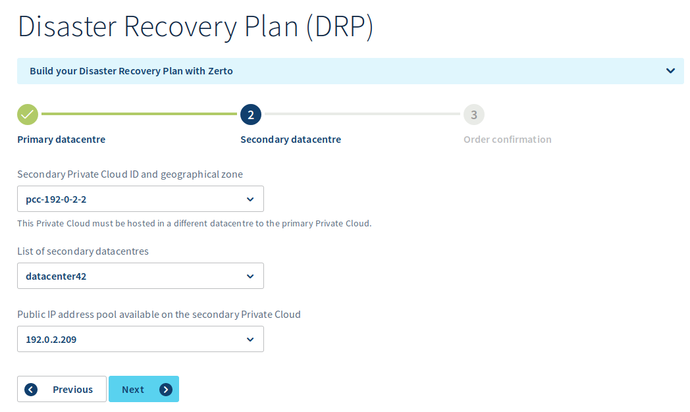{.thumbnail}

Die Auswahl der sekundären Private Cloud geschieht über Ihre **Private Cloud** im Drop-down-Menü. 

Bitte beachten Sie, dass nur passende Private Cloud Dienste angezeigt werden, die den folgenden Kriterien entsprechen:

- Sie befinden sich physisch an einem anderen Standort.
- Für sie wurde noch keine Zerto Replikation eingerichtet.

Wählen Sie anschließend das **Datacenter** der Ziel-**Private-Cloud** im Drop-down-Menü.

Wählen Sie im Drop-down-Menü eine **freie** öffentliche IP-Adresse aus, die aus dem mit der **Private Cloud** verbundenen öffentlichen IP-Block stammt. Diese wird verwendet, um die gesicherte Verbindung zwischen den Infrastrukturen herzustellen.

Klicken Sie auf `Next`{.action}.

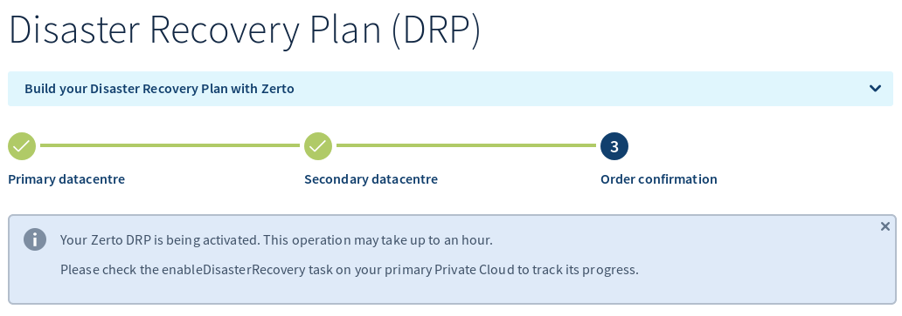{.thumbnail}

Wenn die Aktivierungsanfrage registriert wurde, kann es wie angezeigt bis zu einer Stunde dauern, vorausgesetzt, die angegebenen Information sind korrekt (vor allem sofern die IP-Adresse nicht bereits von einer Ihrer virtuellen Maschinen verwendet wird, in diesem Fall wird die Aktivierung scheitern).

{.thumbnail}

Wenn die Aktivierung ausgeführt wurde, erhalten Sie eine E-Mail mit der Installationskonfiguration sowie den Zugangslinks zum Zerto Interface für jede Infrastruktur.

> [!primary]
> Guten Tag,
> 
> Sie haben soeben die Zerto DRP Lösung zwischen 2 Ihrer Private Clouds aktiviert.
> 
> Sie können Sich über folgende Adresse mit dem Hauptstandort verbinden:
> 
>   - URL        : https://zerto.pcc-192-0-2-1.ovh.com/
> 
> Sie können Sich über folgende Adresse mit dem sekundären Standort verbinden:
> 
>   - URL        : https://zerto.pcc-192-0-2-2.ovh.com/
> 
> Sie können sich mit Ihren Administrator-Accounts auf dieselbe Weise wie bei vSphere anmelden.
> 

#### Über die OVHcloud API

### Zerto Replication Interface

Das Interface ist von beiden Infrastrukturen über folgende Adresse verfügbar:

- URL: https://zerto.pcc-x-x-x-x.ovh.com/ (entsprechend Ihrer Plattformen anzupassen)

> [!warning]
>
> Wie in der E-Mail angegeben, sind die Login-Daten für die Anmeldung dieselben wie für den Login auf dem vSphere Interface.
>

Nach dem Login wird Ihnen das Dashboard angezeigt:

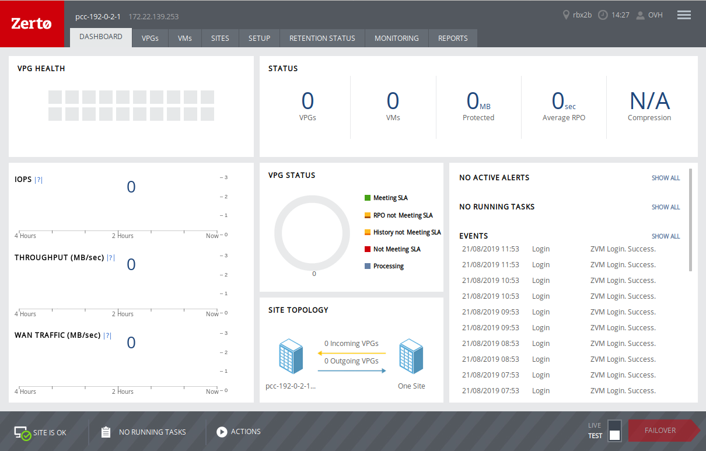{.thumbnail}

In diesem Fenster sehen Sie:

- eine Übersicht zum Gesundheitsstatus der VPGs
- den Gesamtstatus der Zerto Replikation mit vier Indikatoren
- eine Leistungstabelle für die Zerto Replikation
- eine Übersicht für den Status aller VPGs
- die Liste der letzten Warnungen, Aktionen und Ereignisse der Zerto Replikation

### Virtual Protection Group (VPG) konfigurieren

Gehen Sie zum Menüpunkt `Actions`{.action} und wählen Sie `Create VPG`{.action} aus.

{.thumbnail}

{.thumbnail}

Auf der ersten Seite:

- Geben Sie einen Namen für die VPG ein, der idealerweise im betrieblichen Kontext aussagekräftig ist.
- Sofern keine besonderen Anforderungen bestehen, kann die auf **Medium** festgelegte Priorität beibehalten werden.

Fahren Sie fort, indem Sie auf `NEXT`{.action} klicken.

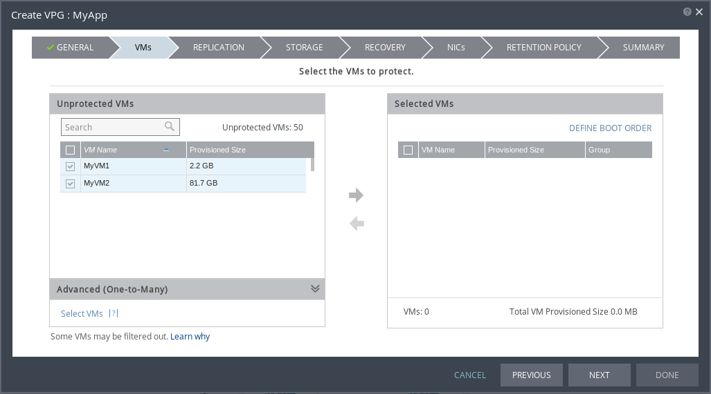{.thumbnail}

Im nächsten Schritt wählen Sie die VMs aus, die in der VPG zusammengefasst werden.

> [!warning]
>
> Eine VM kann nicht in mehreren VPGs enthalten sein.
> 

- Sie können die VMs über das Feld **Search** nach Namen filtern.
- Setzen Sie links neben den betreffenden VMs einen Haken.

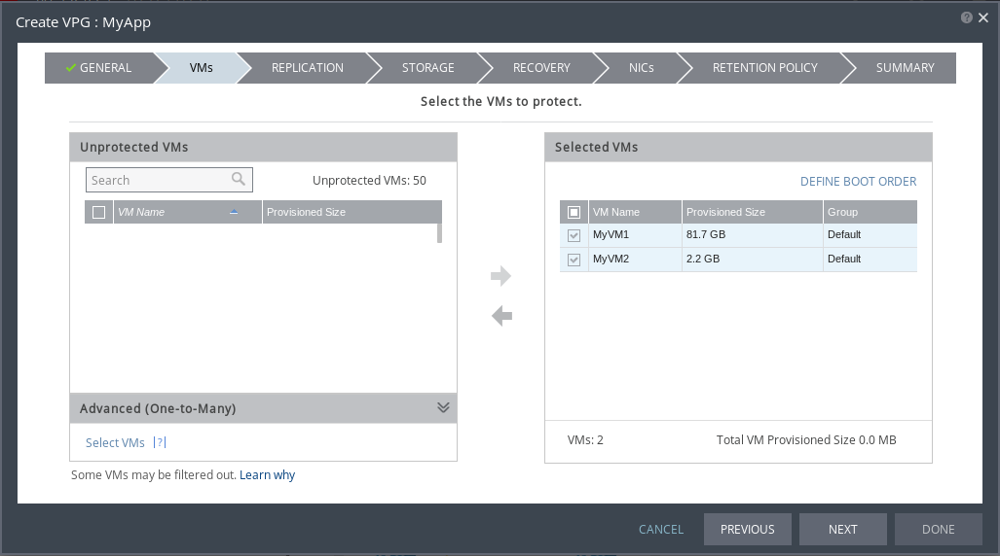{.thumbnail}

- Klicken Sie auf den nach rechts zeigenden Pfeil, um die VMs in die VPG aufzunehmen.

Fahren Sie fort, indem Sie auf `NEXT`{.action} klicken.

{.thumbnail}

Im nächsten Schritt wird der Remote-Standort ausgewählt:

- **Recovery Site**: Wählen Sie den Remote- (d. h. den nicht lokalen) Standort aus der Liste aus. 
- **ZORG**: Wählen Sie **No Organization** in der Liste aus. Jeder andere Wert führt beim Fortfahren zum nächsten Schritt zu einer Fehlermeldung.

Als nächstes werden die Remote-Ressourcen festgelegt:

- **Hosts**: Wählen Sie die Rechenressource aus. Diese kann ein **einzelner Host** (angegeben durch seine IP-Adresse mit gegebenenfalls voranstehendem Cluster-Namen in eckigen Klammern), ein **Ressource Pool** (beginnend mit RP gefolgt vom Cluster-Namen und anschließend dem Namen des Ressource Pools) oder ein **Cluster** (durch seinen Namen angegeben) sein. Es muss nur ein **Ressource Pool** oder ein **Cluster** ausgewählt werden (hier Cluster1).
- **Datastore**: Wählen Sie die Speicherressource aus. Diese kann ein **einzelner Datastore** (angegeben durch seinen Namen mit gegebenenfalls voranstehendem Namen des **Storage-Clusters** in eckigen Klammern) oder ein **Storage-Cluster** sein (durch seinen Namen angegeben).

Lassen Sie die anderen Werte unverändert, sofern keine besonderen Anforderungen bestehen.

Fahren Sie fort, indem Sie auf `NEXT`{.action} klicken.

{.thumbnail}

Im nachfolgenden Schritt können Sie die Speicherkonfiguration genauer anpassen.

Lassen Sie die anderen Werte unverändert, sofern keine besonderen Anforderungen bestehen.

Fahren Sie fort, indem Sie auf `NEXT`{.action} klicken.

{.thumbnail}

Es folgt ein besonders wichtiger Teil der Einrichtung: der erste Schritt der Netzwerkkonfiguration.

- **Failover/Move Network**: Wählen Sie die Standard-Portgruppe für das Failover.
- **Failover Test Network**: Wählen Sie die Portgruppe für Failover-Tests.
- **Recovery Folder**: Wählen Sie den Ordner (oder / für das Wurzelverzeichnis), in dem die auf den Standort übertragenen VMs hinzugefügt werden.

> [!primary]
> Die Optionen **Pre-recovery Script** und **Post-recovery Script** können nicht verwendet werden.
> 

Fahren Sie fort, indem Sie auf `NEXT`{.action} klicken.

{.thumbnail}

Sie sind beim zweiten Schritt der Netzwerkkonfiguration angelangt:

- Sie können für jede VM die Portgruppe für Tests oder Failover auswählen.
- Darüber hinaus kann die IP-Konfiguration der VMs für jede Situation geändert werden.

{.thumbnail}

> [!warning]
>
> Die IP-Änderung ist nur für VMs mit unterstütztem Betriebssystem und funktionierenden **VMware Tools** möglich.
> 

Fahren Sie fort, indem Sie auf `NEXT`{.action} klicken.

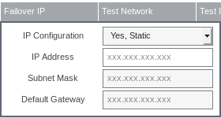{.thumbnail}

Überspringen Sie diesen Schritt, indem Sie auf `NEXT`{.action} klicken.

{.thumbnail}

Auf der letzten Seite finden Sie eine Zusammenfassung aller konfigurierten Elemente.

Nachdem Sie diese überprüft haben, bestätigen Sie die Erstellung, indem Sie auf `DONE`{.action} klicken.

{.thumbnail}

Sie finden die neu erstellte VPG sowie deren Status (zunächst **Initializing**) in der Liste.

### Disaster-Recovery-Übung starten 

Nachdem die Replikation fertig eingerichtet wurde und einige Tage Zeit hatte, die Erstreplikation abzuschließen, möchten Sie vielleicht überprüfen, dass Ihr DRP richtig funktioniert und alle Aktionen ordnungsgemäß von der Zerto Replikation verwaltet werden.

> [!warning]
>
> Der Failover-Test für Zerto Replication geschieht **ohne** Unterbrechung des Hauptstandorts. Achten Sie daher darauf, dass die Testnetzwerke korrekt konfiguriert sind, um jeglichen Konflikt in der IP-Adressierung zu vermeiden und Ihre Produktion nicht durch diese Übung zu beeinträchtigen.
>
> Die Ressourcen, die für den Test am sekundären Standort gestartet werden, dürfen nicht manuell geändert oder gelöscht werden. Der gesamte Test mit den zugehörigen Ressourcen wird am Ende der Übung durch Zerto Replication abgebaut.
>
> Die Replikation zwischen den beiden Standorten wird während eines Tests weiter fortgesetzt.
>

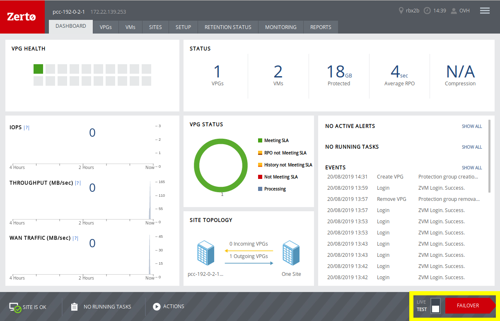{.thumbnail}

Loggen Sie sich hierzu auf Ihrem Zerto Replication Interface ein und klicken Sie auf `FAILOVER`{.action} (der Auswahlregler links daneben steht standardmäßig auf **TEST**).

Ist der Button-Text ausgegraut, so ist keine für den Test wählbare VPG vorhanden (möglicherweise ist die Initialisierung noch nicht abgeschlossen).

{.thumbnail}

Sofort erscheint ein Fenster mit den verfügbaren VPGs, der Replikationsrichtung und dem Zielstandort. Außerdem wird angezeigt, ob das Schutzniveau korrekt ist (**Meeting SLA**).

Sie haben zwei Optionen:

1. Setzen Sie einen Haken, um die gewünschte VPG und somit alle darin enthaltenen VMs für den Test auszuwählen.
2. Klicken Sie auf das Symbol rechts neben dem Namen der VPG, um eine Liste der VMs der VPG anzuzeigen. So können Sie bestimmen, welche VMs der VPG Teil des Tests sein werden.

Bestätigen Sie Ihre Auswahl und gehen Sie zum nächsten Schritt über, indem Sie auf `NEXT`{.action} klicken.

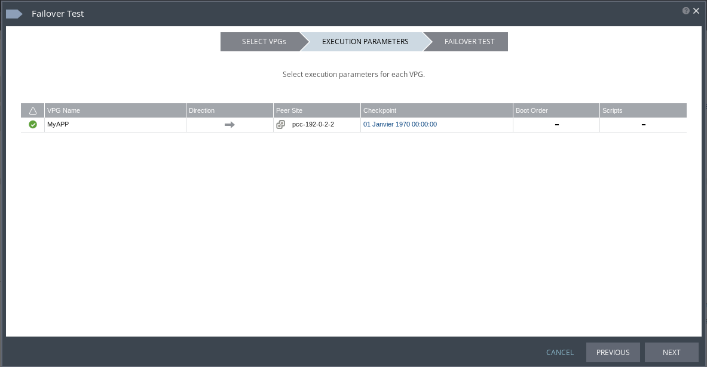{.thumbnail}

Wir haben uns hier für Option 1 entschieden, um einen Test für eine gesamte VPG durchzuführen.

In diesem Schritt wird eine Zusammenfassung der Failover-Einstellungen für die VPG angezeigt:

- Replikationsrichtung
- Remote-Standort
- ob eine Neustartreihenfolge der VMs festgelegt wurde
- ob Pre- oder Post-Failover-Skripte vorhanden sind (diese Funktion ist nicht verfügbar)

Fahren Sie fort, indem Sie auf `NEXT`{.action} klicken.

{.thumbnail}

Es wird eine letzte Zusammenfassung mit den verschiedenen Standorten und der Anzahl der für den Test ausgewählten VPGs angezeigt.

Bestätigen Sie den Start des Tests, indem Sie auf `START FAILOVER TEST`{.action} klicken.

Der Failover-Test wird sofort gestartet und Sie können die zugehörigen Aktionen im vCenter des Remote-Standorts einsehen.

Überprüfen Sie nun, ob alles korrekt auf dem Remote-Standort ausgeführt wird.

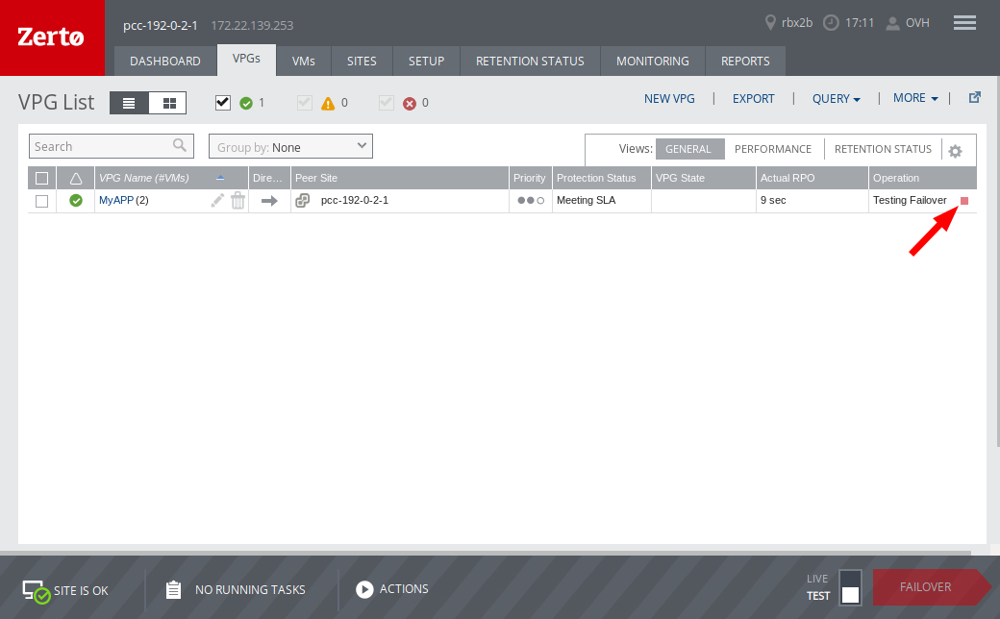{.thumbnail}

Wenn Sie mit der Überprüfung der übertragenen Maschinen fertig sind, klicken Sie rechts neben **Testing Failover** auf das kleine rote Viereck.

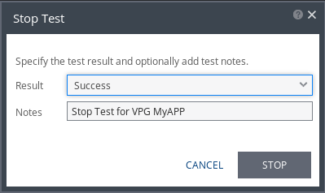{.thumbnail}

Im neuen Fenster wird Ihnen angezeigt, ob der Test erfolgreich war, und Sie können einen Kommentar hinzufügen.

Bestätigen Sie das Ende des Tests mit `STOP`{.action}.

Der Beendigungsprozess des Tests wird sofort gestartet und Sie können die zugehörigen Aktionen im vCenter des Remote-Standorts einsehen.

### Disaster Recovery starten

Im Falle einer schwerwiegenden Störung am Hauptstandort oder einer Übung unter realen Bedingungen wird das Failover über den sekundären (Disaster-Recovery-) Standort gestartet.

> [!warning]
>
> Bei einem **LIVE**-Failover mit Zerto Replication wird der Hauptstandort als nicht verfügbar eingestuft. Achten Sie daher auf die Netzwerkkonfiguration, um jeglichen Konflikt in der IP-Adressierung zu vermeiden.
>
> Alle Ressourcen, die am sekundären Standort gestartet werden, werden auf Ebene der Datenverarbeitung aktiv.
>
> Die Replikation zwischen den beiden Standorten wird während eines Live-Failovers beeinträchtigt oder unterbrochen (wie weiter unten beschrieben).
>

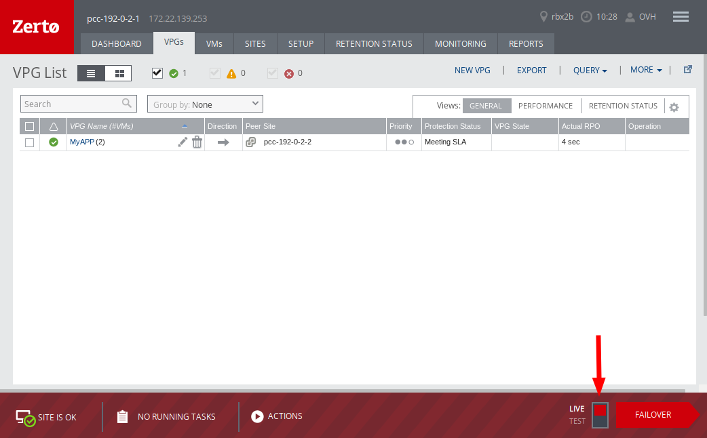{.thumbnail}

Loggen Sie sich hierzu auf Ihrem Zerto Replication Interface ein, stellen Sie den Auswahlregler rechts unten auf **LIVE** um (die Bannerfarbe wird rot, um anzuzeigen, dass Sie dabei sind, tiefgreifende Aktionen auszuführen) und klicken Sie auf **FAILOVER**.

{.thumbnail}

Sofort erscheint ein Fenster mit den verfügbaren VPGs, der Replikationsrichtung und dem Zielstandort. Außerdem wird angezeigt, ob das Schutzniveau korrekt ist (**Meeting SLA**).

Sie haben zwei Optionen:

1. Setzen Sie einen Haken, um die gewünschte VPG und somit alle darin enthaltenen VMs für das Failover auszuwählen.
2. Klicken Sie auf das Symbol rechts neben dem Namen der VPG, um eine Liste der VMs der VPG anzuzeigen. So können Sie bestimmen, welche VMs der VPG Teil des Failovers sein werden.

Bestätigen Sie Ihre Auswahl und gehen Sie zum nächsten Schritt über, indem Sie auf `NEXT`{.action} klicken.

{.thumbnail}

Wir haben uns im vorliegenden Beispiel für Option 1 entschieden, um ein Failover für eine gesamte VPG durchzuführen.

In diesem Schritt wird eine Zusammenfassung der Failover-Einstellungen für die VPG angezeigt:

- Replikationsrichtung
- Remote-Standort
- **Checkpoint**: Hierbei handelt es sich um das Datum für den Wiederherstellungspunkt der Daten. Der Zeitunterschied zwischen dem gewählten Punkt und dem aktuellen Datum bestimmt die **RPO**.
- **Commit Policy**: nachfolgend genauer erläutert.
- **VM Shutdown**: bestimmt das Verhalten für den primären Standort - keine Unterbrechung der VMs, VMs herunterfahren, Herunterfahren erzwingen.
- **Reverse Protection**: gibt an, ob die VPG-Replikation nach Abschluss des Failovers in umgekehrter Richtung konfiguriert werden soll, um später gegebenenfalls zum Failback überzugehen.
- ob eine Neustartreihenfolge der VMs festgelegt wurde
- ob Pre- oder Post-Failover-Skripte vorhanden sind (diese Funktion ist nicht verfügbar)

{.thumbnail}

Was die **Commit Policy** betrifft, haben Sie drei Optionen:

- Auto-Rollback: Das Rollback wird ohne Aktion Ihrerseits nach Ablauf der vorgesehenen Zeit gestartet.
- Auto-Commit: Der Commit der Daten auf der sekundären Plattform wird ohne Aktion Ihrerseits nach Ablauf der vorgesehenen Zeit ausgeführt (es ist nicht mehr möglich, einfach zur Hauptplattform zurückzukehren).
- None: Die **Rollback** und **Commit**-Aktionen müssen von Ihnen manuell bestätigt werden.

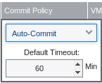{.thumbnail}

Was die automatischen (**Auto**-) Optionen betrifft, ist der Timer standardmäßig auf sechzig (60) Minuten eingestellt.

Fahren Sie fort, indem Sie auf `NEXT`{.action} klicken.

{.thumbnail}

Auf der letzten Seite wird eine Zusammenfassung mit den verschiedenen Standorten sowie der Anzahl der für das Failover ausgewählten VPGs angezeigt.

> [!warning]
>
> Es wird ausdrücklich empfohlen, die Zusammenfassung sowie alle angezeigten Warnungen genau zu lesen.
>

Starten Sie den Failover-Vorgang, indem Sie auf `START FAILOVER`{.action} klicken.

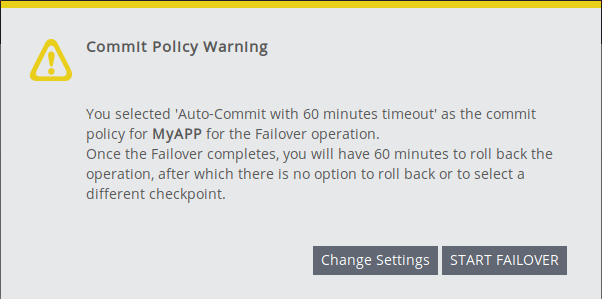{.thumbnail}

Falls Sie eine **Commit Policy** des Typs **Auto** ausgewählt haben, erinnert Sie eine Warnmeldung an deren Auswirkungen.

Bestätigen Sie den Start des Failovers, indem Sie auf `START FAILOVER`{.action} klicken.

Das Failover wird sofort gestartet und Sie können die zugehörigen Aktionen im vCenter des Remote-Standorts einsehen.

Überprüfen Sie nun, ob alles korrekt auf dem Remote-Standort ausgeführt wird.

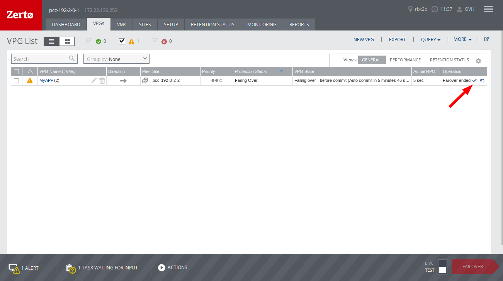{.thumbnail}

Es kann sein, dass Ihnen nach dem Start des Failovers eine Warnung im Zerto Replication Interface angezeigt wird.
Diese hängt mit der **Commit Policy** zusammen und wird angezeigt, wenn der Commit nicht bestätigt oder abgebrochen wurde.

Gegebenenfalls sind Aktionen über die Symbole rechts neben der VPG durchzuführen.

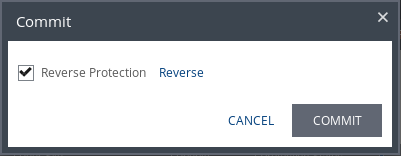{.thumbnail}

Wenn Sie den Commit bestätigen, können Sie automatisch die VPG-Replikation in umgekehrter Richtung konfigurieren (**Reverse Protection** genannt).

Bestätigen Sie den Vorgang, indem Sie auf `COMMIT`{.action} klicken.

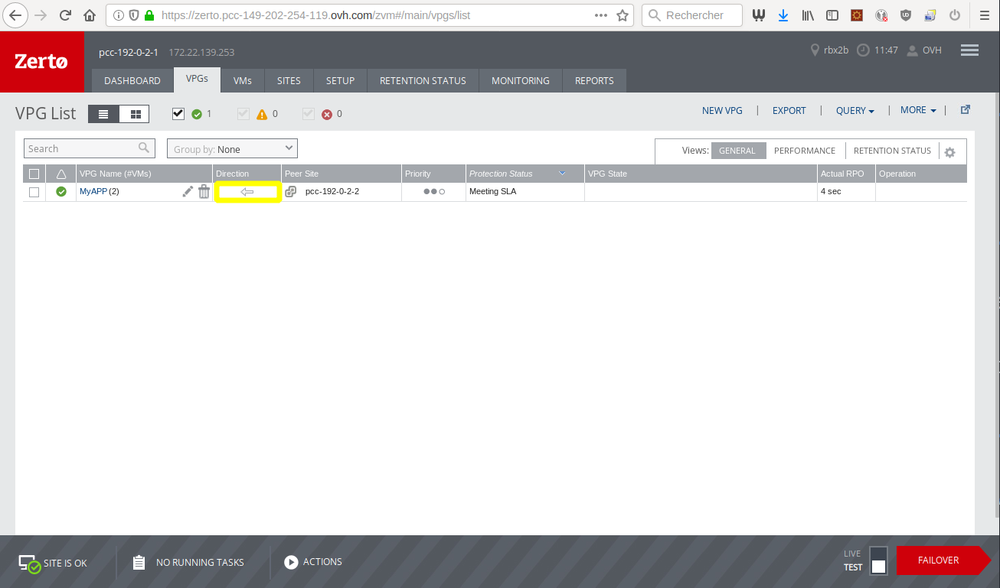{.thumbnail}

In der VPG-Anzeige können Sie jetzt sehen, dass die Replikationsrichtung (durch einen Pfeil dargestellt) geändert wurde.

### Failback vorbereiten und durchführen

Je nachdem, wie das **Failover** durchgeführt wurde, können verschiedene Aktionen für ein eventuelles Failback zum Hauptstandort (dieses ist optional) erforderlich sein.

Wenn Sie das Failover **mit Reverse Protection** durchgeführt haben, besteht das Failback darin, ein **Live-Failover** durchzuführen (Sie können die erforderlichen Aktionen im entsprechenden Abschnitt dieser Anleitung nachlesen).

Wenn Sie das Failover **ohne Reverse Protection** durchgeführt haben, muss für das Failback zunächst eine VPG erstellt und **anschließend** ein **Live-Failover** durchgeführt werden (Sie können die erforderlichen Aktionen in den entsprechenden Abschnitten dieser Anleitung nachlesen).

## Weiterführende Informationen

Für den Austausch mit unserer User Community gehen Sie auf <https://community.ovh.com/en/>.
