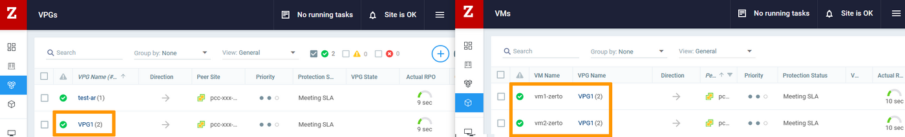
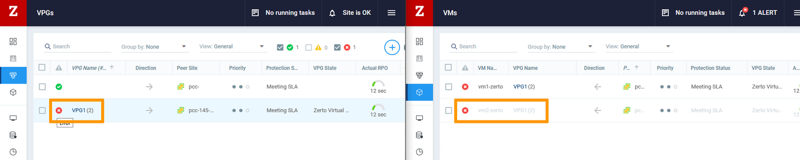
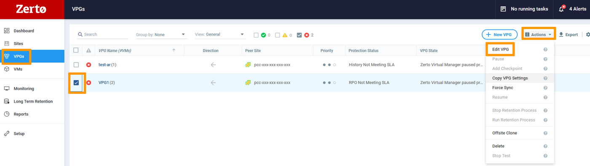
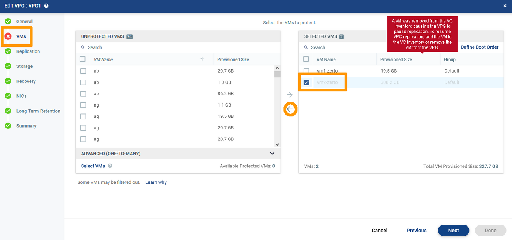

> [!primary]
> Diese Übersetzung wurde durch unseren Partner SYSTRAN automatisch erstellt. In manchen Fällen können ungenaue Formulierungen verwendet worden sein, z.B. bei der Beschriftung von Schaltflächen oder technischen Details. Bitte ziehen Sie im Zweifelsfall die englische oder französische Fassung der Anleitung zu Rate. Möchten Sie mithelfen, diese Übersetzung zu verbessern? Dann nutzen Sie dazu bitte den Button "Beitragen" auf dieser Seite.
>

**Letzte Aktualisierung am 09.12.2021**

## Ziel

Wenn eine virtuelle Maschine gezielt aus der Quelle gelöscht wird, unterbricht die Zerto VPG die Synchronisierung und geht in den Fehlerstatus. 
Die Sicherheitskopien der VM befinden sich weiterhin auf dem Ziel-Datastore. 
Sie können diese Kopien dann löschen, um die VPG wieder in den Normalbetrieb zu versetzen.

**Diese Anleitung erklärt, wie Sie das Zerto Interface verwenden, um eine Kopie einer VM zu löschen.**

## Voraussetzungen

- Sie sind Administrator-Kontakt der [Hosted Private Cloud Infrastruktur](https://www.ovhcloud.com/de/enterprise/products/hosted-private-cloud/), um Login-Daten zu erhalten.
- Sie haben eine aktive Benutzerkennung mit spezifischen Rechten für Zerto (erstellt im [OVHcloud Kundencenter](https://www.ovh.com/auth/?action=gotomanager&from=https://www.ovh.de/&ovhSubsidiary=de)).
- Sie setzen [Zerto Virtual Replication](/pages/hosted_private_cloud/hosted_private_cloud_powered_by_vmware/zerto_virtual_replication_as_a_service) ein.

## In der praktischen Anwendung

Überprüfen Sie im Zerto-Interface des Ziels die Dashboards `VPGs`{.action} und `VMs`{.action}. 
In diesem Beispiel enthält VPG1 zwei VMs, "vm1-zerto" und "vm2-zerto". Der Status der Standort-Synchronisation ist funktional.

{.thumbnail}

Im vSphere Interface des Quellsstandorts wird "vm2-zerto" absichtlich gelöscht. 
Dabei werden die VM und deren Disks gelöscht.

{.thumbnail}

Im Zerto-Interface des Ziels pausiert die VPG die Synchronisierung und geht in den Fehlerstatus. Die VM "vm2-zerto" ist ausgegraut.

{.thumbnail}

Setzen Sie im Bereich `VPGs`{.action} einen Haken bei VPG1. Öffnen Sie das Menü `Actions`{.action} und wählen Sie `Edit VPG`{.action}.

{.thumbnail}

Entfernen Sie in `VMs`{.action} die "vm2-zerto" aus dem Bereich `Selected VMS`. (Haken Sie die VM an und klicken Sie auf den nach links gerichteten Pfeil.) 
CLlquez auf `Done`{.action}.

{.thumbnail}

Klicken Sie im Warnfenster auf `No`{.action}. Die Recovery-Disk muss normalerweise nicht gespeichert werden.

{.thumbnail}

Die VPG wird sich neu synchronisieren und mit einer verbleibenden VM wieder funktionsfähig werden.

{.thumbnail}

## Weiterführende Informationen

Für den Austausch mit unserer User Community gehen Sie auf <https://community.ovh.com/en/>.
