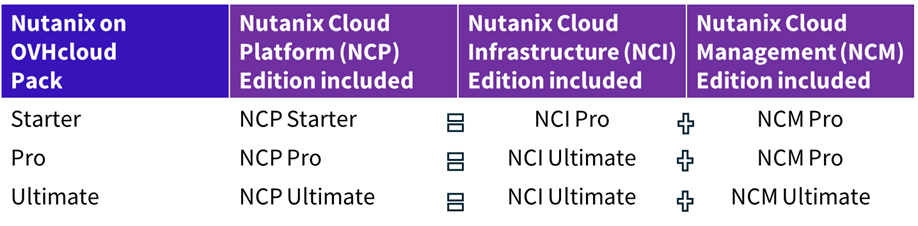

## Objective

This page lists the included Nutanix licences in the Nutanix on OVHcloud packaged service.

## Scope of included Nutanix licences in the Nutanix on OVHcloud packaged service

Only the Nutanix licences listed in this guide are available in the Nutanix on OVHcloud packaged service.

If the licence or service you are looking for is not available, please refer to the [GitHub roadmap](https://github.com/orgs/ovh/projects/16/views/1?sliceBy%5Bvalue%5D=Nutanix+on+OVHcloud) for future availability. If you have an immediate need, we recommend considering the Nutanix on OVHcloud BYOL service.

Within the packaged service, OVHcloud offers three packs (Starter, Pro and Ultimate) that contain the Nutanix Cloud Platform licence packs (NCP Starter, NCP Pro or NCP Ultimate packs), designed by Nutanix to offer a consistent feature set for the most common use cases.

Each NCP pack is the combination of licences for:

- **Nutanix Cloud Infrastructure (NCI)**, in Pro or Ultimate version: the software suite that manages the cluster’s infrastructure resources (storage, compute, virtualization, resilience, etc.)
- **Nutanix Cloud Management (NCM)**, in Pro or Ultimate version: your infrastructure management platform (cost management, automation, monitoring, security, etc.)

The three OVHcloud packs integrate these three NCP licence packs as follows:

- **Starter pack**, made up of NCP Starter (NCI Pro + NCM Pro): This pack is designed for deploying new production sites at large scale and running multiple applications. It enables also advanced management in terms of cost governance.
- **Pro pack**, made up of NCP Pro (NCI Ultimate + NCM Pro): This pack is designed for multi-site deployments requiring advanced management in terms of security requirements, application resilience and cost governance.
- **Ultimate pack**, made up of NCP Ultimate (NCI Ultimate + NCM Ultimate): This pack includes everything you need for Enterprise multi-site deployments and the most complex use cases. It supports integrated governance workflows, advanced security and resilience features, and multiserver applications deployment automation.

You can also find details on the Nutanix Cloud Platform licences [here](https://www.nutanix.com/products/cloud-platform/software-options).

### Some key features and differences between packs

Here we list some frequently searched features and the preferred licence pack:

| Feature | Available in pack(s) |
|------------------|---------|
| Asynchronous cluster replication (RPO >= 1h) | Starter, Pro and Ultimate |
| Advanced cluster replication (Metro, Sync, NearSync) | Pro and Ultimate |
| Nutanix Kubernetes Engine | Starter if < 3 Kubernetes clusters per cluster. NCI Pro and Ultimate otherwise. |
| Network micro-segmentation | Pro and Ultimate |
| Data-at-Rest encryption | Ultimate |
| Security compliance tools | Ultimate |
| Governance workflows | Ultimate |
| Catalog for deploying multi-VM application in self-service mode | Ultimate |

### Summary

Below is a summary table of the licences included in the Nutanix on OVHcloud packaged service:

{.thumbnail}

## Go further

If you need training or technical assistance to implement our solutions, contact your sales representative or click on [this link](/links/professional-services) to get a quote and ask our Professional Services experts for assisting you on your specific use case of your project.

Join our community of users on <https://community.ovh.com/en/>.
