## Objectif

Ce guide explique comment configurer le **système de gestion des clés *Key Management System* (KMS) d’OVHcloud** avec **Nutanix on OVHcloud**.

Nutanix propose deux options pour sécuriser les **données au repos** :

- Les **Disques auto-chiffrés (*Self-Encrypted Drives* (SEDs))**
- Le **chiffrement logiciel**, qui permet une gestion des clés basée sur un gestionnaire natif du cluster ou un **système de gestion des clés externe (KMS)**. 

En suivant ce guide, vous apprendrez à utiliser les fonctionnalités de **chiffrement des données au repos** de Nutanix avec **OVHcloud KMS**.

## Prérequis

- Une **clé KMS OVHcloud valide** dans votre compte OVHcloud.
    - Retrouvez plus d’informations dans notre guide « [Premiers pas avec OVHcloud Key Management Service (KMS)](/pages/manage_and_operate/kms/quick-start) »
- Un **cluster Nutanix on OVHcloud** dans votre compte OVHcloud.
    - Ce cluster doit être **compatible avec le chiffrement des données au repos** (veuillez le vérifier auprès de votre représentant commercial OVHcloud ou des [équipes support](https://help.ovhcloud.com/csm?id=csm_get_help).
    - Une **licence Nutanix** prenant en charge la fonctionnalité **Data-At-Rest Encryption**.
- Un accès au cluster Nutanix via **Prism Central** / **Prism Element**.
- Être en conformité avec les recommandations de Nutanix :
    - [Guide de sécurité Nutanix](https://portal.nutanix.com/page/documents/details?targetId=Nutanix-Security-Guide-v7_0:wc-security-data-encryption-wc-c.html)
    - [Matrice de compatibilité KMS Nutanix](https://portal.nutanix.com/page/documents/compatibility-interoperability-matrix/software?partnerName=OVHCloud&solutionType=KMS%20%28Key%20Management%20Solutions%29&componentVersion=External%20Key%20Managers&hypervisor=all&validationType=all)

## En pratique

### Étape 1 - Accéder à Prism Central et Prism Element

1\. Connectez-vous à Prism Central.

2\. Accédez à `Prism Element`{.action}.

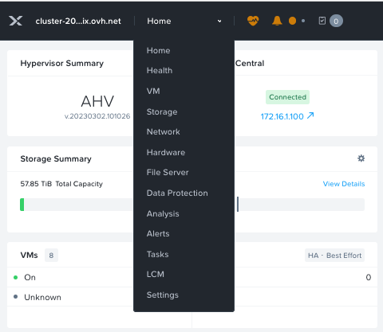{.thumbnail}

3\. Allez dans `Settings`{.action}.

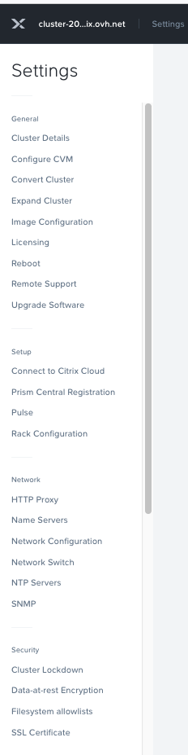{.thumbnail}

### Étape 2 - Configurer le chiffrement Data-at-Rest

1\. Dans le menu des paramètres, descendez jusqu’à `Data-at-Rest Encryption`{.action} .

2\. Cliquez sur `Edit Configuration`{.action}.

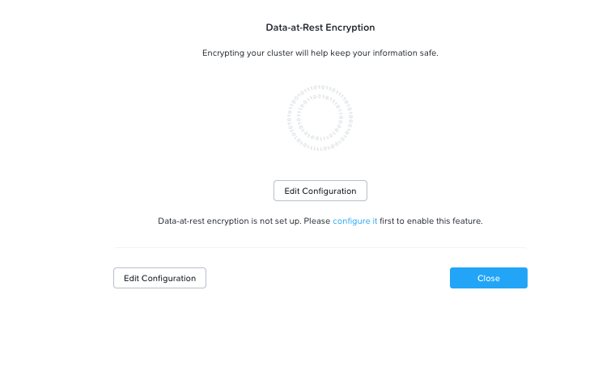{.thumbnail}

3\. Sélectionnez le type de chiffrement (`Encryption Type`{.action}) et le type de KMS ()`KMS Type`{.action}).

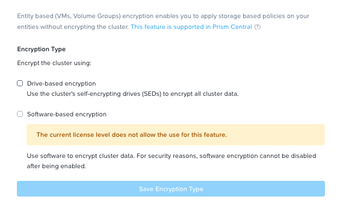{.thumbnail}

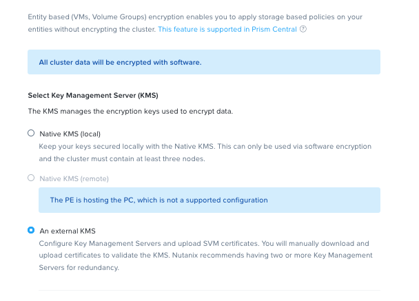{.thumbnail}

4\. Saisissez les informations de configuration pour générer la demande de signature de certificat (**Certificate Signing Request (CSR)**).

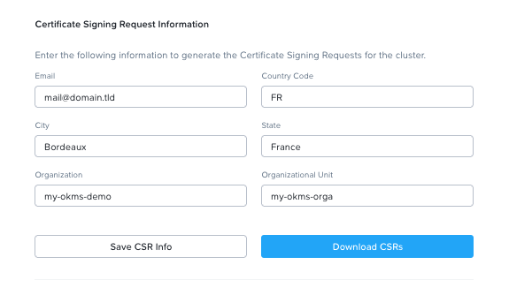{.thumbnail}

### Étape 3 : Ajouter et gérer les certificats

1\. Ajoutez votre **serveur de gestion des clés (KMS)**.

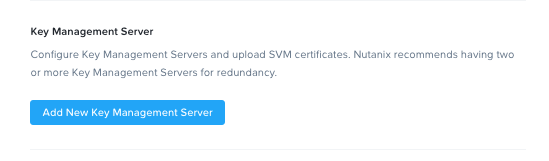{.thumbnail}

2\. Cliquez sur `Manage Certificates`{.action}.

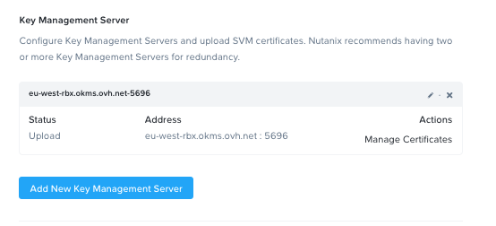{.thumbnail}

3\. Téléversez votre `Certificate Authority (CA)`.

4\. Une fois le CA téléversé, revenez au menu `Key Management Server`{.action} et cliquez sur `Manage Certificates`{.action}.

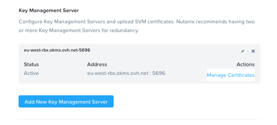{.thumbnail}
 
### Étape 4 - Tester et activer le chiffrement

1\. **Testez tous les nœuds** du cluster.

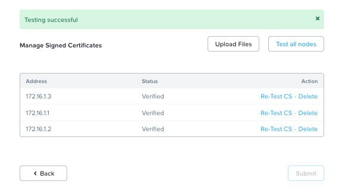{.thumbnail}

2\. Si le test est réussi, vous pouvez maintenant activer le chiffrement de votre cluster Nutanix.

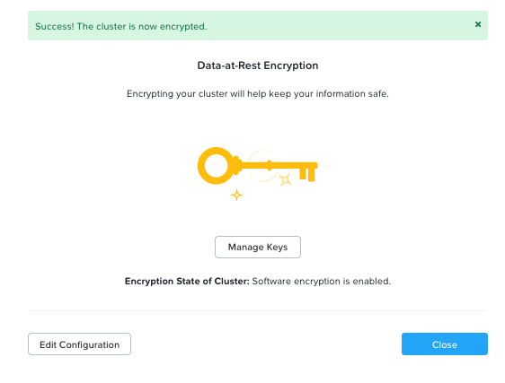{.thumbnail}

3\. Vous pouvez activer à la fois le chiffrement logiciel (**software encryption**) et les disques auto-chiffrés (**Self-Encrypting Drives (SEDs)**).

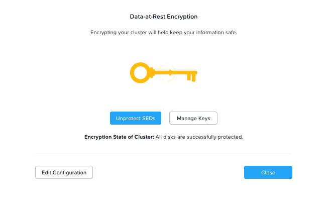{.thumbnail}

## Aller plus loin

- [Guide de sécurité Nutanix pour le chiffrement Data-at-Rest](https://portal.nutanix.com/page/documents/details?targetId=Nutanix-Security-Guide-v7_0:wc-security-data-encryption-wc-c.html)
- [Premiers pas avec OVHcloud Key Management Service (KMS)](/pages/manage_and_operate/kms/quick-start)
- [Matrice de compatibilité Nutanix](https://portal.nutanix.com/page/documents/compatibility-interoperability-matrix/software?partnerName=OVHCloud&solutionType=KMS%20%28Key%20Management%20Solutions%29&componentVersion=External%20Key%20Managers&hypervisor=all&validationType=all)

Si vous avez besoin d'une formation ou d'une assistance technique pour la mise en oeuvre de nos solutions, contactez votre commercial ou cliquez sur [ce lien](/links/professional-services) pour obtenir un devis et demander une analyse personnalisée de votre projet à nos experts de l’équipe Professional Services.

Échangez avec notre [communauté d'utilisateurs](/links/community).