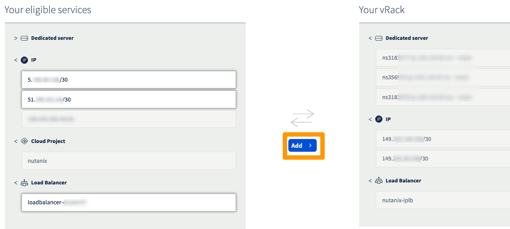

**Last updated 11th January 2022**

## Objective

A Nutanix cluster is delivered with its own vRack. In order to interconnect with other OVHcloud services, you can attach your cluster to a different vRack.

**This guide explains how to add a Nutanix cluster to another vRack.**

> [!warning]
> OVHcloud is providing you with services for which you are responsible, with regard to their configuration and management. You are therefore responsible for ensuring they function correctly.
>
> This guide is designed to assist you in common tasks as much as possible. Nevertheless, we recommend that you contact the [OVHcloud Professional Services team](https://www.ovhcloud.com/es-es/professional-services/) or a [specialist service provider](https://partner.ovhcloud.com/en/directory/) if you have difficulties or doubts concerning the administration, usage or implementation of services on a server.
>

## Requirements

- A Nutanix cluster in your OVHcloud account
- An additional [vRack](https://www.ovh.es/soluciones/vrack/) service activated in your account
- Access to the [OVHcloud Control Panel](https://www.ovh.com/auth/?action=gotomanager&from=https://www.ovh.es/&ovhSubsidiary=es)

## Instructions

### Step 1: Removing services

Log in to the [OVHcloud Control Panel](https://www.ovh.com/auth/?action=gotomanager&from=https://www.ovh.es/&ovhSubsidiary=es).

Open the Nutanix cluster vRack configuration page, select all the services (e.g. dedicated server, IP, load balancer) and click on `Remove`{.action}.

{.thumbnail}

> [!primary]
> Before removing services, make sure to save their references, especially if you have many servers, IPs, load balancers, etc.
>

> [!primary]
> Removing services from the vRack is not immediately effective. Please allow some time for the process to complete.
>

### Step 2: Adding services

Once the process is finished, go to the desired vRack and add all the previously removed services with the `Add`{.action} button.

{.thumbnail}

> [!primary]
> Adding services to the vRack is not immediately effective. Please allow some time for the process to complete.
>

> [!warning]
> Accessing Prism Central is not instantaneous: it is necessary that the VM restarts to make the access effective again.
>

### Troubleshooting

If Prism Central stays inaccessible after 30 minutes, create a front-end on the load balancer to reach a CVM with SSH.

When logged in, check if the Prism Central VM is on.

```bash
acli vm.get prism-central | grep state
```

If the answer is `state: "kOff"` then start the VM:

```bash
acli vm.on prism-central
```

You can also restart the VM with the following command:

```bash
acli vm.guest_reboot
```

Alternatively, do a hard reboot (if the previous attempts failed):

```bash
acli vm.reset
```

## Go further

If you need training or technical assistance to implement our solutions, contact your sales representative or click on [this link](https://www.ovhcloud.com/es-es/professional-services/) to get a quote and ask our Professional Services experts for assisting you on your specific use case of your project.

Join our community of users on <https://community.ovh.com/en/>.
