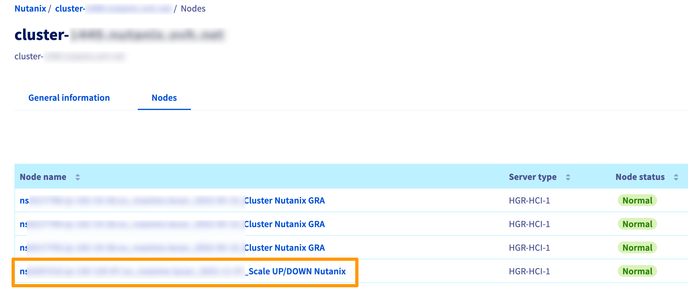
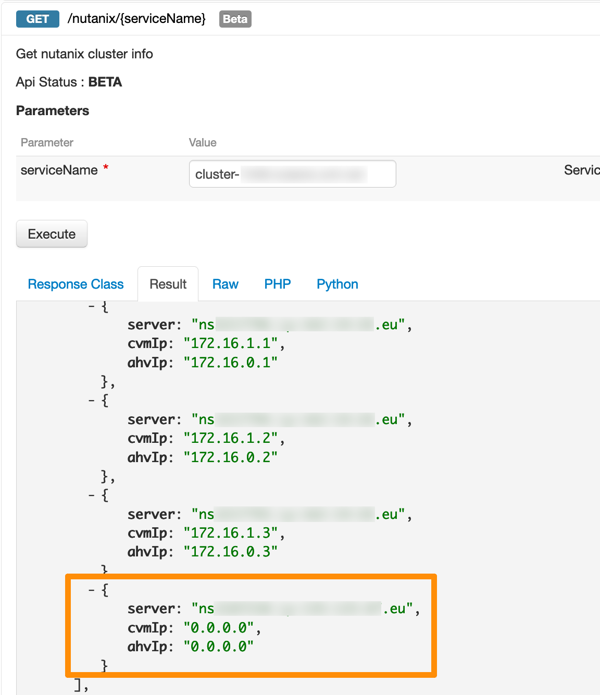
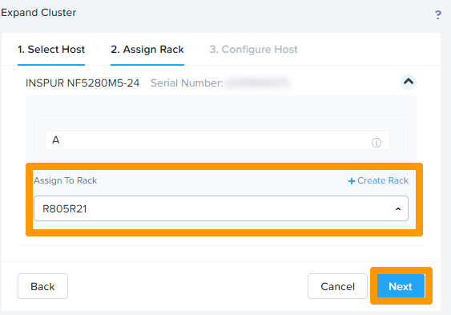
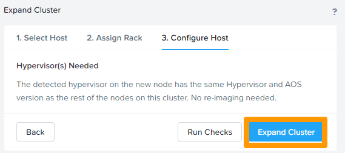
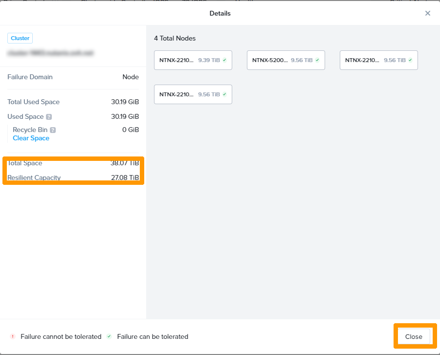

## Objective

Nutanix clusters are scalable. You can add nodes to an existing cluster.

**This guide will show you how to add a node and ensure it works properly.**

> [!warning]
> OVHcloud provides services for which you are responsible, with regard to their configuration and management. You are therefore responsible for ensuring they function correctly.
>
> This guide is designed to assist you in common tasks as much as possible. Nevertheless, we recommend that you contact the [OVHcloud Professional Services team](https://www.ovhcloud.com/es/professional-services/) or a [specialist service provider](https://partner.ovhcloud.com/es/directory/) if you have difficulties or doubts concerning the administration, usage or implementation of services on a server.

## Requirements

- A Nutanix cluster in your OVHcloud account
- Access to the [OVHcloud Control Panel](https://ca.ovh.com/auth/?action=gotomanager&from=https://www.ovh.com/world/&ovhSubsidiary=ws)
- Access to the [OVHcloud API](https://ca.api.ovh.com/).
- You must be connected to the cluster via Prism Central
- A ready-to-configure physical server added to the OVHcloud Control Panel

## Technical information

The **Hosted Private Cloud solution powered by Nutanix** enables you to have between 3 and 18 nodes on the same cluster.

It is possible to add several nodes when expanding the cluster.

The nodes to be added must have the same version of **AOS** as the existing cluster.

## Instructions

### Checking node delivery.

Log in to your [OVHcloud Control Panel](https://ca.ovh.com/auth/?action=gotomanager&from=https://www.ovh.com/world/&ovhSubsidiary=ws) and check that an additional node appears in the Nutanix cluster.

{.thumbnail}

You can also check this via the OVHcloud API.

Use the following API call:

> [!api]
>
> @api {v1} /nutanix GET /nutanix/{serviceName}
>

- `serviceName`: enter the cluster name

{.thumbnail}

The new node appears with 0.0.0.0 IPs.

### Node installation.

To install the new node, you must change the cluster properties by making a `PUT` on the cluster.

To do this, use the following API call:

> [!api]
>
> @api {v1} /nutanix PUT /nutanix/{serviceName}
>

> [!warning]
> Make sure to untick the `redeployCluster` box.

Tick the `scaleUp` box.
Enter the following information below **nodes**:

- **ahvip** : IP address of the hypervisor of the new node.
- **cvmip** : IP address of the CVM of the new node.

> [!warning]
> These IP addresses must not already be used and must match your addressing plan.

You must also complete the deployment version. It may not correspond to the current version of your cluster. This is not an issue as the node will be modified by the Nutanix installer when adding it to the cluster via Prism Element.

{.thumbnail}

Click `Execute`{.action} to send the request.

In the "Result" tab, the new node appears with the new IP address.

At the end of the installation, you will receive an email confirming that the node is ready.

<pre class="bgwhite"><code>
Dear Customer,

Your server has just been installed.

You must now add it back to your Nutanix cluster by connecting to Prism Central: https://cluster-xxxx.nutanix.ovh.net:9440

We remain at your disposal for any further information.

The OVHcloud Team
</code></pre>

### Add a node to a Nutanix cluster.

Connect to **Prism Element** through **Prism Central**.

For more information on connecting to the cluster, see the « [Go further](#gofurther) » section of this guide. 

On the dashboard, the 3 nodes are visible in the `Hardware Summary`. Click on `View Details`{.action} in the middle left to bring up more details.

{.thumbnail}

A more detailed view is displayed with information such as total space and storage resilience capacity. 
Click `Close`{.action} to close this window.

{.thumbnail}

Open the `Home`{.action} menu and choose `Health`{.action} to perform a cluster analysis before adding the node.

{.thumbnail}

Click on `Actions`{.action} in the top right-hand corner and choose `Run NCC Check`{.action}.

{.thumbnail}

Click `Run`{.action} to launch a control and wait for the operation to complete.

{.thumbnail}

After the check, click the `cogwheel`{.action} icon at the top right to change the settings.

{.thumbnail}

Click `Expand Cluster`{.action}.

{.thumbnail}

Check the box next to the discovered host to display the node details.

{.thumbnail}

Scroll to see the options.

{.thumbnail}

Scroll down to the bottom of the window and click on `Next`{.action}.

{.thumbnail}

Choose the Rack in `Assign to Rack` and click `Next`{.action}.

{.thumbnail}

Click `Expand Cluster`{.action}.

{.thumbnail}

Click `Open`{.action} to view the cluster expansion details.

{.thumbnail}

{.thumbnail}

The addition of the node is completed when the *Expanding Cluster* progress is 100%.

{.thumbnail}

Four nodes are visible in `Hardware Summary`, click `View Details`{.action} for more information.

{.thumbnail}

Click `Close`{.action} to return to the dashboard.

{.thumbnail}

## Go further 

[Nutanix Hyperconvergence](/pages/hosted_private_cloud/nutanix_on_ovhcloud/03-nutanix-hci)

[Nutanix Node Addition Guide](https://portal.nutanix.com/page/documents/details?targetId=Web-Console-Guide-Prism-v5_20:wc-cluster-expand-wc-t.html)

If you need training or technical assistance to implement our solutions, contact your sales representative or click on [this link](https://www.ovhcloud.com/es/professional-services/) to get a quote and ask our Professional Services experts for assisting you on your specific use case of your project.

Join our community of users on <https://community.ovh.com/en/>.
