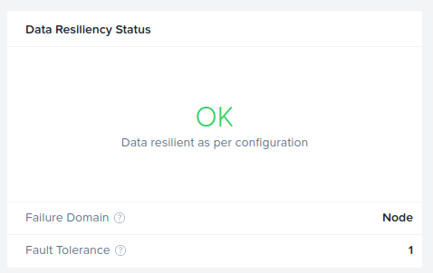
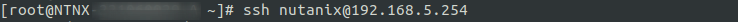
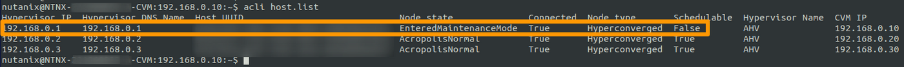
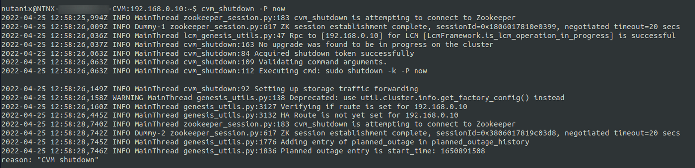
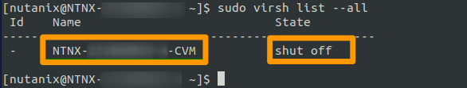
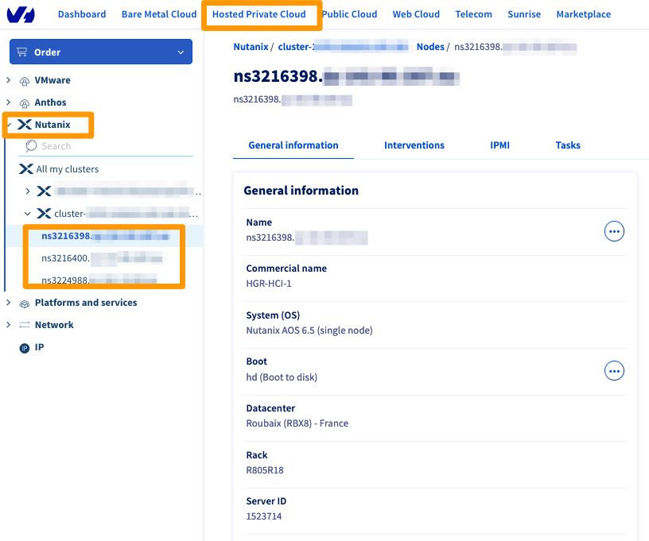
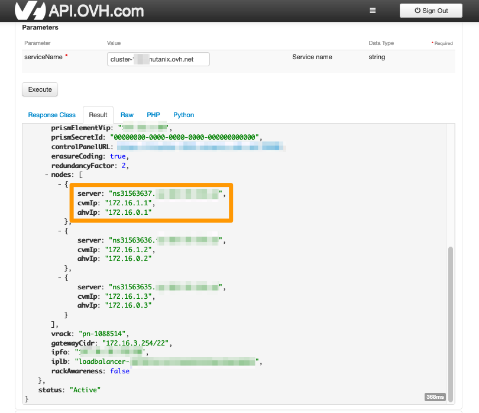
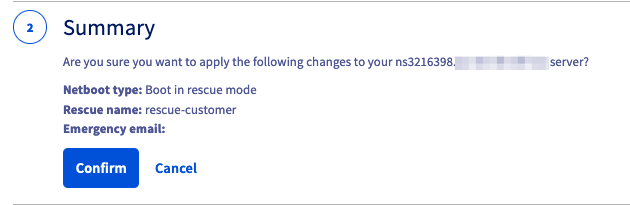
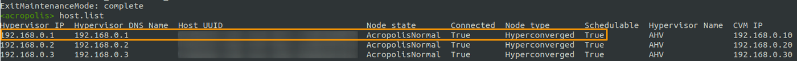

## Objectif

Ce guide vous présente les étapes de mise à jour des firmwares des clusters Nutanix en mettant à tout de rôle chaque noeud en maintenance puis en le redémarrant en mode rescue.

Nos services prendront le relais pour appliquer les mises à jour des firmwares et redémarreront le noeud une fois cela fait.

> [!warning]
> Avant d'entamer toute action, connectez-vous à votre [espace client OVHcloud](https://ca.ovh.com/auth/?action=gotomanager&from=https://www.ovh.com/ca/fr/&ovhSubsidiary=qc) et créez un ticket de demande d'assistance pour demander une mise à jour du firmware et communiquer aux équipes d'assistance OVHcloud les éléments techniques concernant votre cluster.

**Découvrez comment mettre à jour le firmware de votre cluster Nutanix.**

## Prérequis

- Disposer d'un cluster Nutanix dans votre compte OVHcloud
- Être connecté à votre [espace client OVHcloud](https://ca.ovh.com/auth/?action=gotomanager&from=https://www.ovh.com/ca/fr/&ovhSubsidiary=qc)
- Consulter le guide [Premiers pas avec les API OVHcloud](/pages/manage_and_operate/api/first-steps) pour vous familiariser avec l'utilisation des APIv6 OVHcloud.

## En pratique

Avant toute action, connectez-vous à votre interface Prism Element et effectuez les tâches suivantes :

- Vérifiez que le **Data Resiliency Status** du cluster est `OK`.

Vous pouvez le vérifier via le tableau de bord principal de votre interface Prism Element :

{.thumbnail}

- Effectuez une vérification NCC

Dans l'interface Prism Element, cliquez sur `Health`{.action} depuis le menu principal.

{.thumbnail}

Cliquez ensuite sur `Actions`{.action} à droite puis sur `Run NCC checks`{.action}.

{.thumbnail}

Sélectionnez `All Checks`{.action} et cliquez sur `Run`{.action}.

{.thumbnail}

Un fichier de logs appelé `/home/nutanix/data/logs/ncc-output-latest.log` sera généré à la fin des vérifications.

Veuillez l'analyser attentivement. Si vous trouvez des erreurs concernant l'état du cluster ou du service, ne continuez pas et la procédure et contactez le support OVHcloud.

> [!primary]
> Vous pouvez également effectuer vérification NCC sur le CVM en tapant la commande suivante depuis un terminal :

```bash
ncc health_checks run_all
```

### Activation du mode maintenance

Les noeuds seront mis à jour un par un, le cluster Nutanix continuera de fonctionner correctement.

Pour vous connecter à un CVM, vous pouvez lancer l'IPMI depuis votre espace client OVHcloud ou utiliser un terminal.

> [!primary]
> Avant de mettre l'hôte en maintenance, assurez-vous que les hôtes restants ont suffisamment de ressources pour héberger les VM migrées depuis l'hôte en maintenance (CPU, mémoire, stockage).

#### Connexion au CVM

À l'invite de connexion, connectez-vous avec les informations d'identification root pour accéder au terminal de l'hôte.<br>
Ouvrez ensuite une connexion SSH à un CVM avec les identifiants Nutanix pour accéder ensuite au terminal CVM.

{.thumbnail}

#### Vérifier l'état des noeuds

Une fois connecté, vérifiez que :

- `Node state` a la valeur `AcropolisNormal`.
- La colonne `Schedulable` a la valeur `True` pour tous les noeuds.

Exécutez ensuite la commande suivante pour vérifier :

```bash
acli host.list
```

{.thumbnail}

Si toutes les vérifications sont OK, vous devez vérifier que l'état actuel de l'hôte peut être changé en maintenance. Pour ce faire, utilisez la commande suivante :

```bash
acli host.enter_maintenance_mode_check <Hypervisor_IP>
```

{.thumbnail}

#### Mettre un noeud en mode maintenance

> [!primary]
> Les VM ayant des règles spécifiques (comme l'affinité, le passthrough CPU...) doivent être arrêtées manuellement avant l'exécution de la maintenance, car elles ne migreront pas.

Si tous les hôtes sont éligibles au mode maintenance, mettez un premier hôte en mode maintenance avec la commande suivante :

```bash
acli host.enter_maintenance_mode 192.168.0.1 wait=true
```

{.thumbnail}

> [!warning]
> Lorsque les hôtes entrent en mode maintenance, toutes les VM hébergées sont migrées sur les autres hôtes sans aucune interruption.

#### Arrêter le CVM

Une fois que l'hôte est en mode maintenance, le CVM peut être arrêté avec la commande suivante :

```bash
cvm_shutdown -P now
```

{.thumbnail}

Avec les identifiants root, ouvrez un terminal sur le noeud qui héberge le CVM et validez l'arrêt du CVM :

```bash
virsh list --all
```

{.thumbnail}

Sur le tableau de bord principal, le **Data Resiliency Status** deviendra `Critical`, le cluster fonctionne alors avec 2 noeuds.

{.thumbnail}

Le CVM est à présent arrêté.

### Redémarrer en mode rescue

Connectez-vous à l'[espace client OVHcloud](https://ca.ovh.com/auth/?action=gotomanager&from=https://www.ovh.com/ca/fr/&ovhSubsidiary=qc), accédez à l'onglet `Hosted Private Cloud`{.action}, choisissez `Nutanix`{.action} et sélectionnez votre cluster.

{.thumbnail}

Identifiez le noeud à démarrer en mode rescue en utilisant l'appel API OVHcloud suivant :

> [!api]
>
> @api {v1} /nutanix GET /nutanix/{serviceName}
>

- `serviceName` : entrez le nom du cluster

Vous pourrez alors identifier le nom du noeud :

{.thumbnail}

Après avoir récupéré le nom du noeud à redémarrer en mode rescue, sélectionnez ce noeud dans votre espace client OVHcloud.

Dans la section `Boot`, cliquez sur le bouton `...`{.action} puis sur `Modifier`{.action}.

{.thumbnail}

Changez le netboot en choisissant `Booter en mode rescue`{.action}, choisissez la version `rescue-customer`{.action} et cliquez sur `Suivant`{.action}.

{.thumbnail}

Confirmez votre choix.

{.thumbnail}

Une fois validé, un message vert vous confirmera la mise à jour du nouveau netboot.

Cliquez de nouveau sur le bouton `...`{.action} et cliquez cette fois sur `Redémarrer`{.action}.

{.thumbnail}

Le serveur va redémarrer. Si vous le souhaitez, vous pouvez ouvrir une session IPMI pour suivre le redémarrage de votre noeud.

Lorsque le noeud est démarré sur `rescue-customer`, mettez à jour votre ticket d'assistance avec ces informations pour informer les équipes d'assistance OVHcloud qu'elles peuvent procéder à la mise à jour du firmware.

Nos équipes support finaliseront les mises à jour nécessaires, c'est-à-dire qu'elles vont :

- redémarrer le noeud sur le disque local, ce qui lancera automatiquement le système Nutanix et le CVM.
- mettre à jour le ticket pour vous informer que vous pouvez sortir le noeud du mode maintenance.

À ce moment-là, le noeud est opérationnel, poursuivez la lecture de ce guide pour quitter le mode maintenance.

### Sortie du mode maintenance

Après la mise à jour du noeud, nos services redémarrent le noeud à partir du disque local. Le logiciel Nutanix chargera AOS et le CVM démarrera automatiquement.

Une fois le système de retour à la normale, connectez-vous au CVM et exécutez la commande suivante :

```bash
acli host.list
```

Comme vous pouvez le voir sur l'exemple ci-dessous, le premier noeud est toujours en mode maintenance.

{.thumbnail}

Pour sortir le noeud du mode maintenance, exécutez la commande suivante :

```bash
host.exit_maintenance_mode 192.168.0.1
```

L'hôte quitte l'état `maintenance` et revient à l'état `Normal`.

{.thumbnail}

Les machines virtuelles migrées à partir de ce noeud passent automatiquement d'autres noeuds à celui-ci.

Sur le tableau de bord principal, le **Data Resiliency Status** redeviendra à `OK`, le cluster retrouvant également son état nominal.

{.thumbnail}

Répétez les mêmes étapes pour les noeuds restants, un à la fois.

Merci de ne pas ouvrir de nouveau ticket, il suffit de rajouter des commentaires sur le même ticket pour chaque noeud, en spécifiant le nom du serveur (par exemple `ns123456.ip-169-254-10.eu`).

## Aller plus loin <a name="go further"></a>

Si vous avez besoin d'une formation ou d'une assistance technique pour la mise en oeuvre de nos solutions, contactez votre commercial ou cliquez sur [ce lien](https://www.ovhcloud.com/fr-ca/professional-services/) pour obtenir un devis et demander une analyse personnalisée de votre projet à nos experts de l’équipe Professional Services.

Échangez avec notre communauté d'utilisateurs sur <https://community.ovh.com/>.
