## Objectif

Ce guide vous présente les opérations que vous devez réaliser pour bien débuter avec votre cluster Nutanix on OVHcloud :

- [Déployer une VM de rebond](#deploy-vm)
- [Sécuriser le cluster](#secure-cluster)

> [!warning]
> OVHcloud vous met à disposition des services dont la configuration, la gestion et la responsabilité vous incombent. Il vous appartient donc de ce fait d’en assurer le bon fonctionnement.
>
> Ce guide a pour but de vous accompagner au mieux sur des tâches courantes. Néanmoins, nous vous recommandons de faire appel à l'équipe [Professional Services OVHcloud](https://www.ovhcloud.com/fr/professional-services/) ou à un [prestataire spécialisé](https://partner.ovhcloud.com/fr/directory/) si vous éprouvez des difficultés ou des doutes concernant l’administration, l’utilisation ou la mise en place d’un service sur un serveur.
>

**Découvrez les premières opérations à réaliser sur votre cluster Nutanix.**

## Prérequis

- Disposer d'un cluster Nutanix dans votre compte OVHcloud
- Être connecté à votre [espace client OVHcloud](/links/manager)
- Être connecté à Prism Central sur le cluster

> [!warning]
>
> Certains logiciels, comme les produits Microsoft, nécessitent une licence. Vous devez donc vous assurer que tous les systèmes et logiciels installés possèdent ces licences.

## En pratique

### Déployer une VM de rebond <a name="deploy-vm"></a>

La VM de rebond va vous servir de point d'entrée pour les opérations que vous aurez à effectuer pour sécuriser votre cluster.
Elle peut également vous servir de relais pour atteindre d'autres VM après la mise en production.

Continuez la lecture de ce guide selon votre OS : [Linux - Rebond via SSH](#ssh) ou [Windows - Rebond via RDP](#rdp).

#### Rebond via SSH <a name="ssh"></a>

##### Création et configuration de la VM Linux

Dans cet exemple, la configuration du réseau est la suivante :

- Réseau : 172.16.0.0/22
- Masque : 255.255.252.0
- Passerelle : 172.16.3.254

> [!warning]
> Adaptez cette configuration à votre cluster.
> Vous pouvez retrouver ces informations en interrogeant l'[API OVHcloud](https://api.ovh.com/console/#/nutanix/%7BserviceName%7D~GET).
>

Importez votre image Linux dans le cluster. Pour plus de détails, consultez notre guide sur l'[importation d'images dans Nutanix](/pages/hosted_private_cloud/nutanix_on_ovhcloud/05-image-import).

Dans le menu de gauche de **Prism Central**, dépliez `Compute & Storage`{.action} et cliquez sur `VMs`{.action}.

{.thumbnail}

Cliquez sur le bouton `Create VM`{.action}.

{.thumbnail}

Personnalisez le nom et les caractéristiques de la VM.

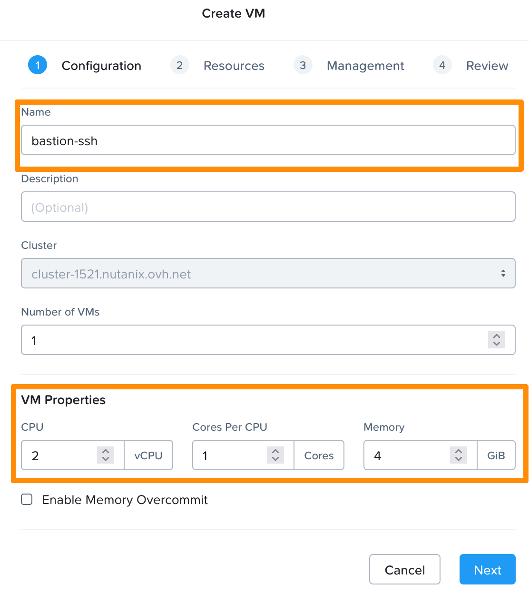{.thumbnail}

Cliquez sur `Next`{.action}.

Vous devez ensuite attacher un disque. Pour cela, vous pouvez sélectionner l'image déjà présente sur votre cluster (Alpine Linux).

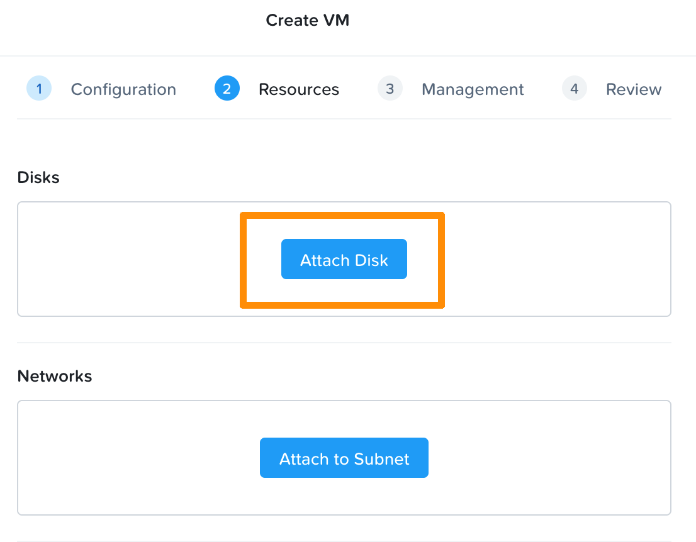{.thumbnail}

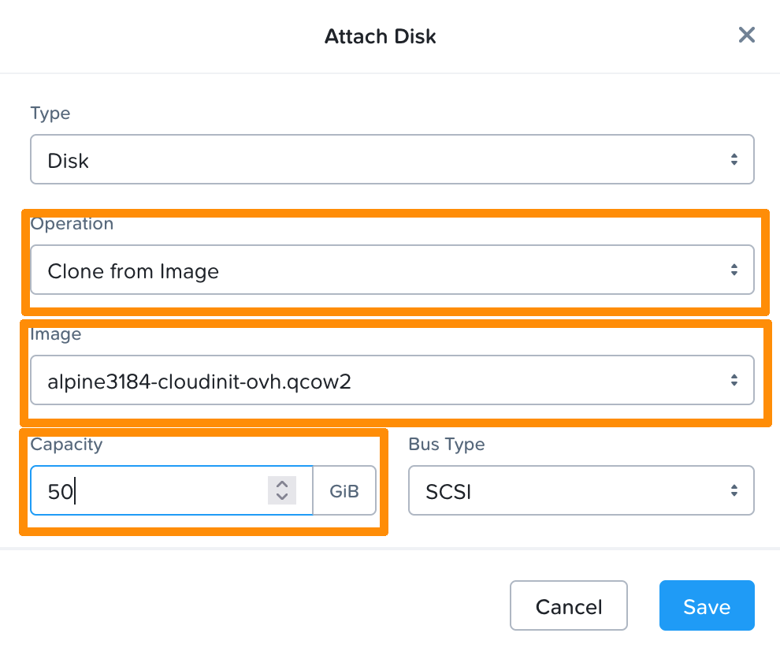{.thumbnail}

Cliquez sur `Save`{.action}.

Cliquez ensuite sur `Attach Subnet`{.action}.

Choisissez le réseau "infra" et cliquez sur `Save`{.action}.

{.thumbnail}

Cliquez sur `Next`{.action}.

Selectionnez cloud-init, copiez le script "cloud-init" puis cliquez sur `Next`{.action} et enfin sur `Create VM`{.action}.

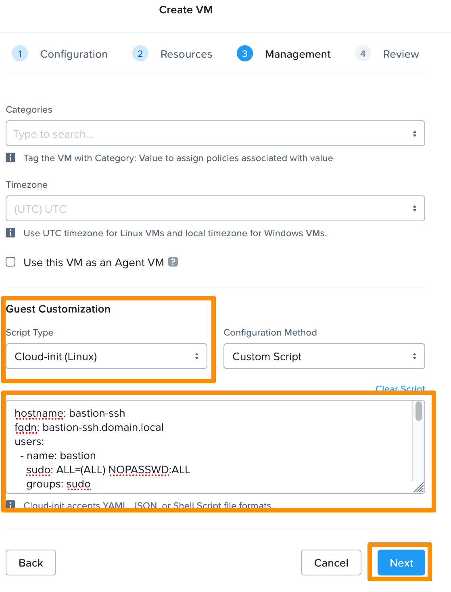{.thumbnail}

> [!warning]
> Adaptez cette configuration à votre cluster.
> Vous pouvez retrouver ces informations en interrogeant l'[API OVHcloud](https://api.ovh.com/console/#/nutanix/%7BserviceName%7D~GET).
> Adaptez en particulier le mot de passe et la configuration IP.
>

```yaml
#cloud-config
hostname: bastion-ssh
fqdn: bastion-ssh.domain.local
users:
  - name: bastion
    sudo: ALL=(ALL) NOPASSWD:ALL
    groups: sudo
    shell: /bin/ash
    ssh_pwauth: true
    lock_passwd: false
    plain_text_passwd: OVHcloudR0cks!

growpart:
  mode: growpart
  devices: ["/dev/sda2"]
  ignore_growroot_disabled: true

write_files:
   - path: /etc/network/interfaces
     content: |
        auto lo
        iface lo inet loopback

        auto eth0
        iface eth0 inet static
        address 172.16.2.200
        netmask 255.255.255.252
        gateway 172.16.3.254

runcmd:
   - echo "nameserver 213.186.33.99" > /etc/resolv.conf
   - rc-service networking restart
   - apk update
   - apk upgrade
   - apk add sudo
   - sed -i s/'PasswordAuthentication no'/'PasswordAuthentication yes'/g /etc/ssh/sshd_config
   - sed -i s/'#KbdInteractiveAuthentication yes'/'KbdInteractiveAuthentication yes'/g /etc/ssh/sshd_config
   - rc-service sshd restart
   - lvextend -l +100%FREE /dev/vg0/lv_root
   - resize2fs /dev/vg0/lv_root
   - reboot

final_message: "The system is finally up, after $UPTIME seconds"
```

Ouvrez la console après le redémarrage de la VM. Vous pouvez voir que la VM a bien pris les paramètres du fichier cloud-init.

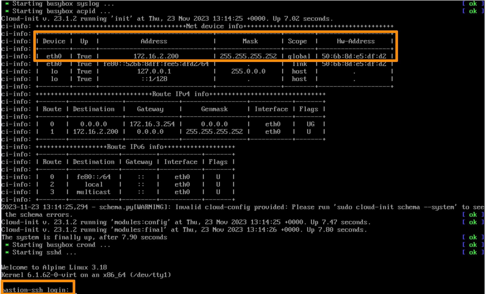{.thumbnail}

##### Configuration du Load Balancer

Connectez-vous à votre [espace client OVHcloud](/links/manager). Ouvrez la page de configuration du Nutanix Cluster. 

Dans le cadre `Réseau du cluster` en bas de page, cliquez sur le Load Balancer.

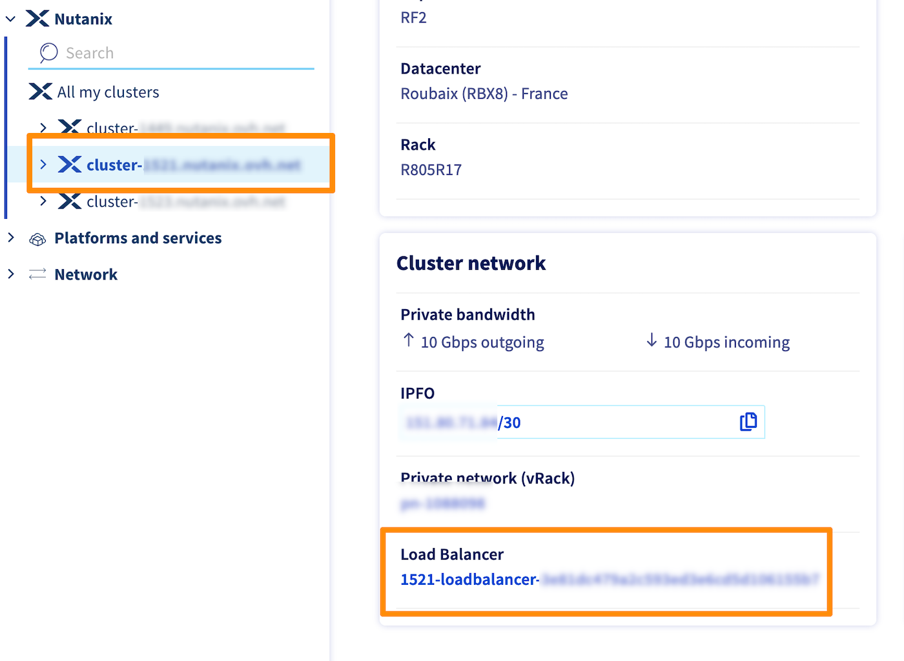{.thumbnail}

Dans l'onglet `Fermes de serveurs`{.action}, cliquez sur `Ajouter une ferme de serveurs`{.action}.

{.thumbnail}

Nommez votre ferme de serveurs puis selectionnez `TCP`{.action} et saisissez ces informations :

- Port : 22
- Datacenter : ALL
- Réseau privé : nutanix

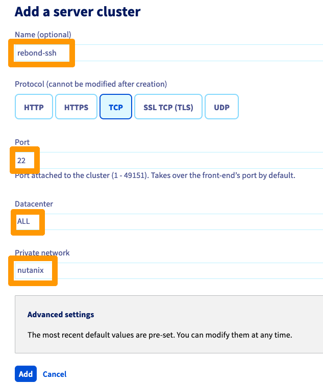{.thumbnail}

Cliquez sur `Ajouter`{.action} pour valider la création de la ferme de serveurs.

Cliquez ensuite sur `Ajouter un serveur`{.action}.

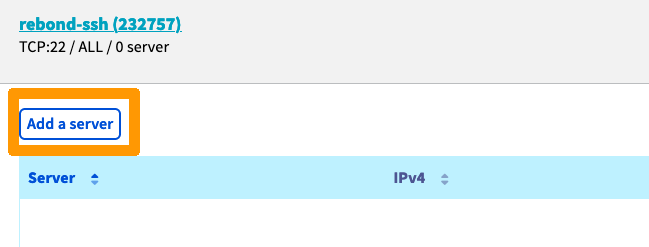{.thumbnail}

Saisissez ces valeurs :

- **Name (optional)** : `SSH`
- **Adresse IPv4** : `addresse ip de votre vm windows`
- **Port** : `22`

Cliquez sur `Ajouter`{.action} pour valider la création du serveur.

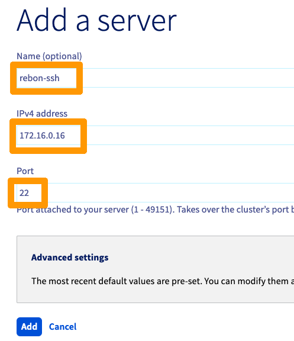{.thumbnail}

Cliquez ensuite sur l'onglet `Frontends`{.action} et sur `Ajouter un frontend`{.action}.

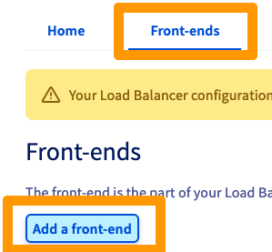{.thumbnail}

Nommez votre frontend, choisissez le protocole `TCP`{.action} et modifiez ces valeurs :

- **Port** : `22`
- **Datacenter** : `ALL`
- **Ferme par défaut** : `rebond-ssh (TCP)`

Cliquez sur `Ajouter`{.action}.

{.thumbnail}

Cliquez sur `Appliquer la configuration`{.action}.

{.thumbnail}

Sélectionnez le `Datacenter`{.action} et cliquez sur `Appliquer la configuration`{.action}.

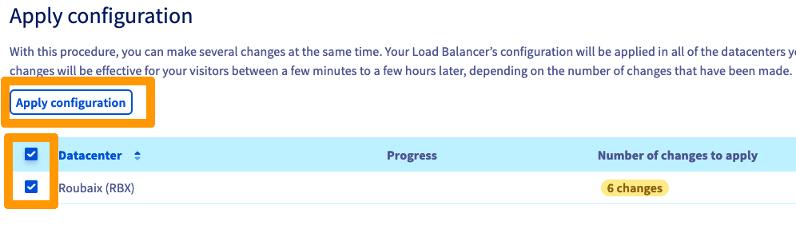{.thumbnail}

Dans l'onglet `Tâches`{.action}, vous pourrez suivre l'avancement de l'application des changements.

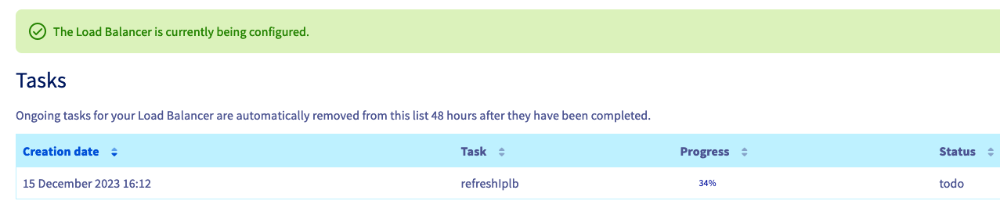{.thumbnail}

Le Load Balancer est désormais configuré. Utilisez votre terminal préféré pour vous connecter sur votre machine.
Vous pouvez saisir le nom DNS de votre cluster ou l'IP du Load Balancer :

{.thumbnail}

Vous pouvez désormais rebondir sur les différents éléments du cluster :

- CVMs
- Hôtes
- Prism Element

Par exemple, pour une cvm, saisissez dans le terminal :

```bash
ssh nutanix@ipcvm
```

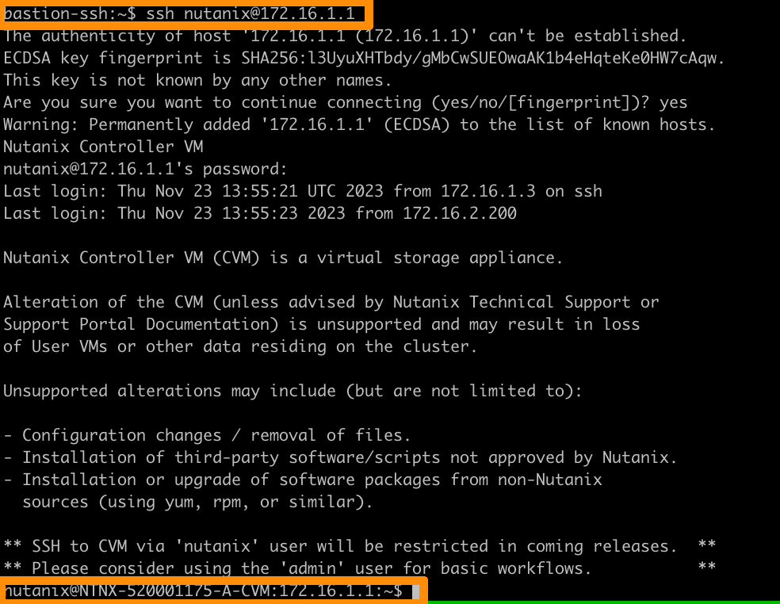{.thumbnail}

#### Rebond via RDP <a name="rdp"></a>

##### Création et configuration de la VM Windows

Importez votre image Windows dans le cluster. Consultez notre guide sur l'[importation d'images dans Nutanix](/pages/hosted_private_cloud/nutanix_on_ovhcloud/05-image-import).

Dans le menu de gauche de **Prism Central**, dépliez `Compute & Storage`{.action} et cliquez sur `VMs`{.action}.

{.thumbnail}

Cliquez sur le bouton `Create VM`{.action}.

{.thumbnail}

Saisissez un nom dans `Name`{.action}, choisissez les options dans `VM Properties`{.action} et cliquez sur `Next`{.action}.

{.thumbnail}

1\. **Ajout d'un disque système**

Cliquez sur le bouton`Attach Disk`{.action}.

{.thumbnail}

Saisissez **60** dans le champ `capacity` et cliquez sur `Save`{.action} pour créer un disque de 60 Go.

{.thumbnail}

2\. **Ajout de l'image ISO de l'installation de Windows Server 2022**

L'image doit être importée avant d'être utilisable dans une nouvelle machine virtuelle.

Pour plus de détails sur l'importation d'images, consultez notre guide sur l'[importation d'images dans Nutanix](/pages/hosted_private_cloud/nutanix_on_ovhcloud/05-image-import).

Cliquez sur `Attach Disk`{.action}.

{.thumbnail}

Modifiez les paramètres `Type`{.action} en **CD-ROM**, `Operation`{.action} en **Clone from Image** , `Image`{.action} en **WS2022EN.ISO**.

Cliquez sur `Save`{.action}.

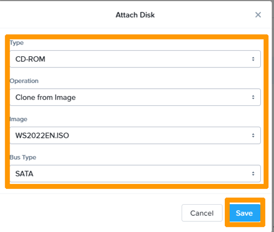{.thumbnail}

3\. **Ajout de l'image ISO contenant les pilotes spécifiques à AHV**

Cette image contient notamment le pilote du contrôleur de disques et doit aussi être importée. Elle est disponible sur le site Internet de Nutanix si vous disposez d'un compte client Nutanix.

Cliquez sur `Attach Disk`{.action}.

{.thumbnail}

Modifiez les paramètres `Type`{.action} en **CD-ROM**, `Operation`{.action} en **Clone from Image**, `Image`{.action} en **Nutanix-VirtIO-1.1.7.iso**.

Cliquez sur `Save`{.action}.

{.thumbnail}

4\. **Configuration du réseau**

Cliquez sur `Attach Subnet`{.action}.

{.thumbnail}

Choisissez le réseau "infra" et cliquez sur `Save`{.action}.

{.thumbnail}

Cliquez sur `Next`{.action}.

{.thumbnail}

Choisissez le fuseau horaire de votre pays dans le champ `Timezone`{.action} et cliquez sur `Next`{.action}.

{.thumbnail}

Cliquez sur `Create VM`{.action}.

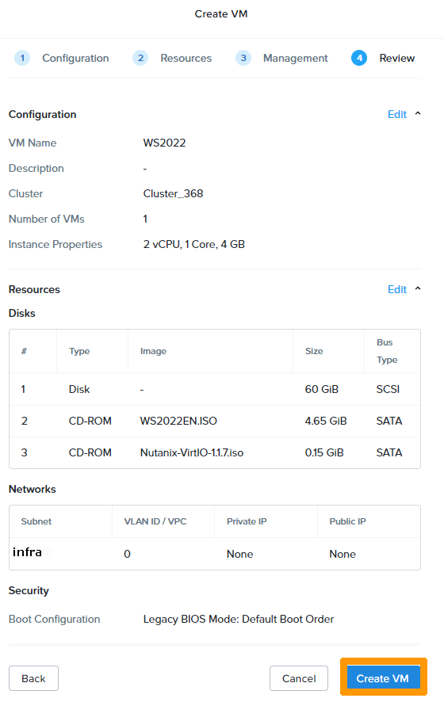{.thumbnail}

La machine virtuelle nouvellement créée apparaît alors dans le tableau de bord.

{.thumbnail}.

##### Installation de Windows Server 2022

Sélectionnez la machine virtuelle sur laquelle vous souhaitez installer Windows Server 2022, en cochant la case située à gauche de la VM.

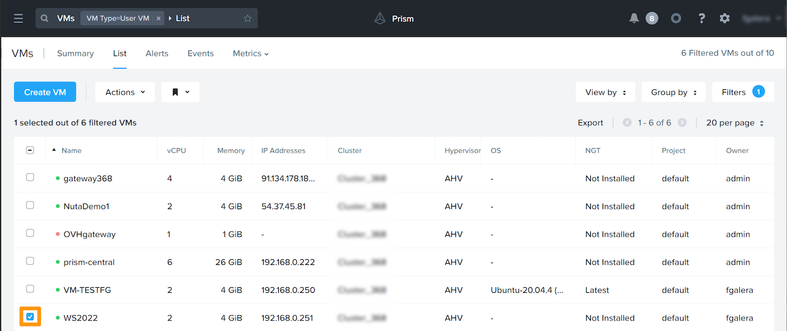{.thumbnail}

1\. **Démarrer la machine virtuelle**

Cliquez sur le menu `Actions`{.action} puis sur `Power ON`{.action}.

{.thumbnail}

2\. **Lancer la console**

Cliquez sur le menu `Actions`{.action} puis sur `Launch Console`{.action}.

{.thumbnail}

3\. **Commencer l'installation**

Choisissez vos paramètres régionaux et cliquez sur `Next`{.action}.

{.thumbnail}

Cliquez sur `Install now`{.action}.

{.thumbnail}

Sélectionnez **Windows Server 2022 Standard (Desktop Experience)** et cliquez sur `Next`{.action}.

{.thumbnail}

Prenez connaissance des termes et conditions liés à la licence logicielle Microsoft, validez leur acceptation et cliquez sur `Next`{.action}.

{.thumbnail}

Cliquez sur `Custom: Install Microsoft Server Operating System only (advanced)`{.action}.

{.thumbnail}

Cliquez sur `Load driver`{.action}.

{.thumbnail}

Cliquez sur `Browse`{.action}.

{.thumbnail}

Sélectionnez le bon dossier `e:\Windows Server 2022\amd64` et cliquez sur `OK`{.action}.

{.thumbnail}

Sélectionnez ces pilotes :

- `Nutanix VirtIO Balloon Driver`{.action}
- `Nutanix VirtIO Ethernet Adapter`{.action}
- `Nutanix VirtIO SCSI pass-through controller`{.action}
- `QEMU FWCfg Device`{.action}

Cliquez sur `Next`{.action}.

{.thumbnail}

Le disque de 60 Go apparaît, cliquez sur `Next`{.action}.

{.thumbnail}

Saisissez et confirmez le mot de passe dans les deux champs prévus à cet effet et cliquez sur `Finish`{.action}.

{.thumbnail}

L'installation de Windows Server 2022 et des pilotes spécifiques à WS2022 pour l'hyperviseur **AHV** est terminée.

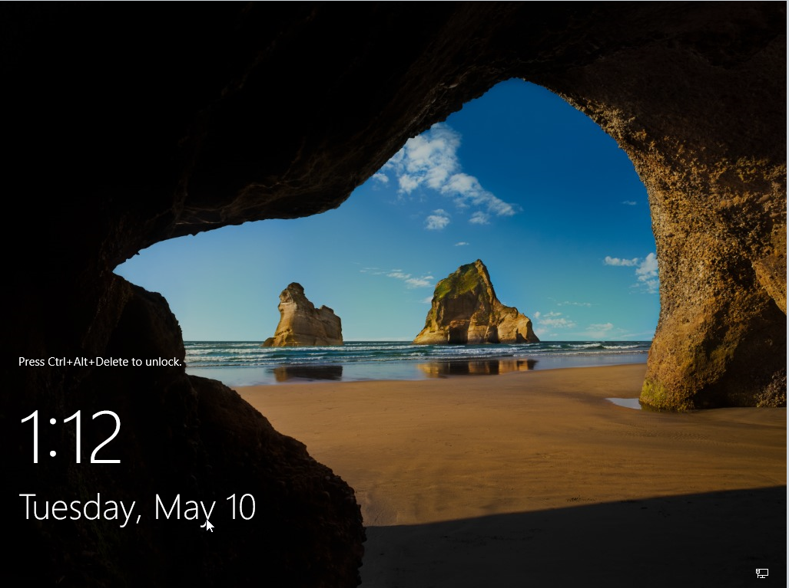{.thumbnail}

4\. **Configuration de Windows**

Connectez-vous puis attribuez une adresse IP à la machine dans le réseau "infra".
Dans cet exemple la configuration du réseau est la suivante :

- Réseau : 172.16.0.0/22
- Masque : 255.255.252.0
- Passerelle : 172.16.3.254

> [!warning]
> Adaptez cette configuration à votre cluster.
> Vous pouvez retrouver ces informations en interrogeant l'[API OVHcloud](https://api.ovh.com/console/#/nutanix/%7BserviceName%7D~GET).
>

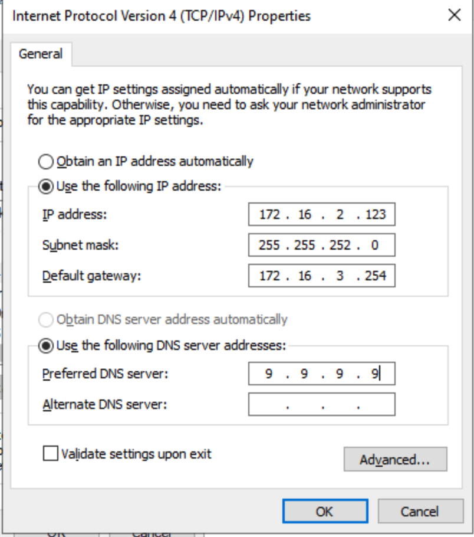{.thumbnail}

Dans les paramètres du système, activez le "bureau à distance".

{.thumbnail}

> [!warning]
> Vérifiez la configuration du pare-feu si nécessaire.
>

##### Configuration du Load Balancer

Connectez-vous à votre [espace client OVHcloud](/links/manager). Ouvrez la page de configuration du Nutanix Cluster. Dans le cadre `Réseau du cluster` en bas de page, cliquez sur le Load Balancer.

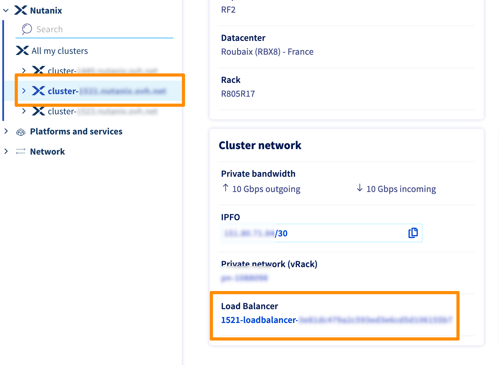{.thumbnail}

Dans l'onglet `Fermes de serveurs`{.action}, cliquez sur `Ajouter une ferme de serveurs`{.action}.

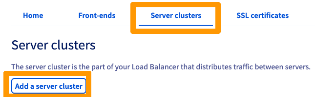{.thumbnail}

Nommez votre ferme de serveurs puis selectionnez `TCP`{.action} et saisissez ces informations :

- **Port** : `3389`
- **Datacenter** : `ALL`
- **Réseau privé** : `nutanix`

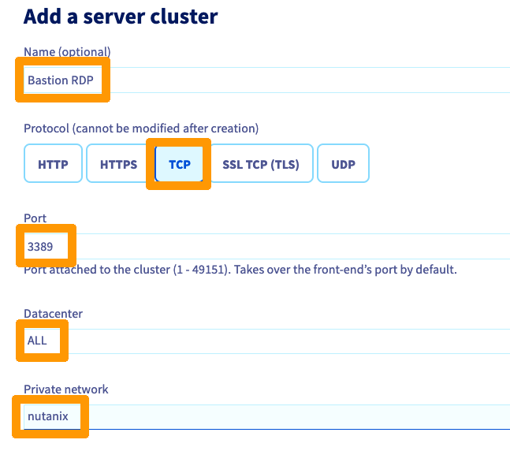{.thumbnail}

Cliquez sur `Ajouter`{.action} pour valider la création de la ferme de serveurs.

Cliquez sur `Ajouter un serveur`{.action}.

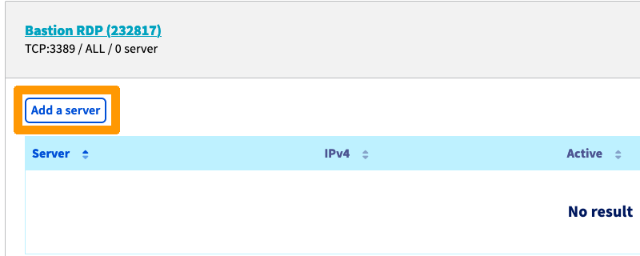{.thumbnail}

Saisissez ces valeurs :

- **Name (optional)** : `RDP`
- **Adresse IPv4** : `addresse ip de votre vm windows`
- **Port** : `3389`

Cliquez sur `Ajouter`{.action} pour valider la création du cluster.

{.thumbnail}

Cliquez ensuite sur l'onglet `Frontends`{.action} et sur `Ajouter un frontend`{.action}.

{.thumbnail}

Nommez votre frontend, choisissez le protocole `TCP`{.action} et modifiez ces valeurs :

- **Port** : `3389`
- **Datacenter** : `ALL`
- **Ferme par défaut** : `Bastion RDP (TCP)`

Cliquez sur `Ajouter`{.action}.

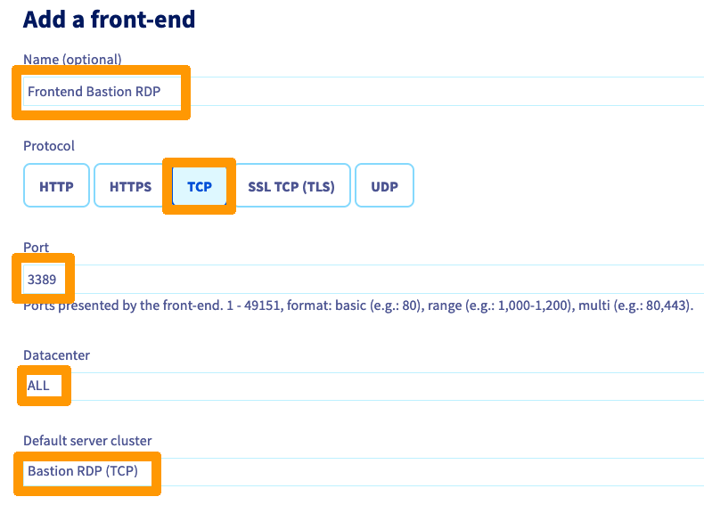{.thumbnail}

Cliquez sur `Appliquer la configuration`{.action}.

{.thumbnail}

Sélectionnez le `Datacenter`{.action} et cliquez sur `Appliquer la configuration`{.action}.

{.thumbnail}

Dans l'onglet `Tâches`{.action}, vous pourrez suivre l'avancement de l'application des changements.

{.thumbnail}

Le Load Balancer est désormais configuré. Utilisez votre client RDP préféré pour vous connecter sur votre machine.
Vous pouvez saisir le nom DNS de votre cluster ou l'IP du Load Balancer :

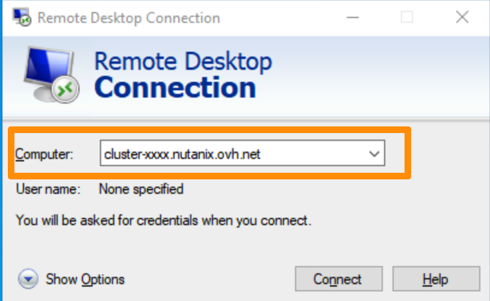{.thumbnail}

Vous pouvez désormais rebondir sur les différents éléments du cluster :

- CVMS
- HOTES
- Prism Element

Par exemple, pour une cvm, ouvrez powershell et tapez :

```bash
ssh nutanix@ipcvm
```

{.thumbnail}

### Sécuriser le cluster <a name="secure-cluster"></a>

Pour sécuriser votre cluster, il est recommandé de changer les mots de passe. Utilisez la base de connaissances de Nutanix pour effectuer ces opérations : [kb6153 - Secure your Nutanix cluster](https://portal.nutanix.com/page/documents/kbs/details?targetId=kA00e000000LKXcCAO).

Vous pouvez également [sécuriser l'accès à Prism Central](/pages/hosted_private_cloud/nutanix_on_ovhcloud/25-secure-prism-web-access).

## Aller plus loin <a name="go further"></a>

Si vous avez besoin d'une formation ou d'une assistance technique pour la mise en oeuvre de nos solutions, contactez votre commercial ou cliquez sur [ce lien](https://www.ovhcloud.com/fr/professional-services/) pour obtenir un devis et demander une analyse personnalisée de votre projet à nos experts de l’équipe Professional Services.

Échangez avec notre communauté d'utilisateurs sur <https://community.ovh.com/>.
