## Objectif

Cette documentation décrit comment **protéger, sauvegarder et restaurer une instance Prism Central** en utilisant la fonctionnalité **Point-in-Time Backup** vers un **Object Storage compatible S3 OVHcloud**.

La solution repose sur :
- Un **bucket S3 OVHcloud sécurisé** (Object Lock, versioning, lifecycle)
- Une **sauvegarde périodique automatisée** de la configuration Prism Central
- Une **restauration complète** possible en cas d’incident majeur

## Vue d’ensemble & avantages

### Fonctionnalités principales

- Sauvegarde **Point-in-Time** de Prism Central vers un bucket S3 OVHcloud
- Création automatique de **points de restauration périodiques (RPO)**
- Restauration complète depuis Prism Element
- Gestion centralisée depuis **Prism Central**

### Bénéfices

- Protection forte des données critiques de gestion Nutanix
- Externalisation des sauvegardes hors cluster
- Conformité et immutabilité des données
- Simplicité d’exploitation et d’administration

---

## Prérequis

### Versions logicielles

- **Prism Central** : pc.7.5 ou ultérieur
- **Prism Element** opérationnel

### Préparer l’environnement

#### Créer le container Object Storage (Bucket)

Pour créer le container vous devez dans un premier temps créer un projet : [Créer votre premier projet Public Cloud - OVHcloud](/pages/public_cloud/public_cloud_cross_functional/create_a_public_cloud_project).

Dans l'univers Public Cloud créez un container objet.

Indiquez un nom pour votre container : 
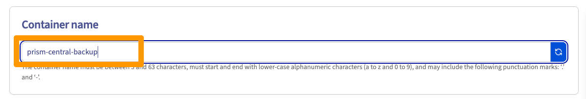{.thumbnail}

Choisissez S3-compatible API et 3AZ (pour plus de résilience) ou 1AZ
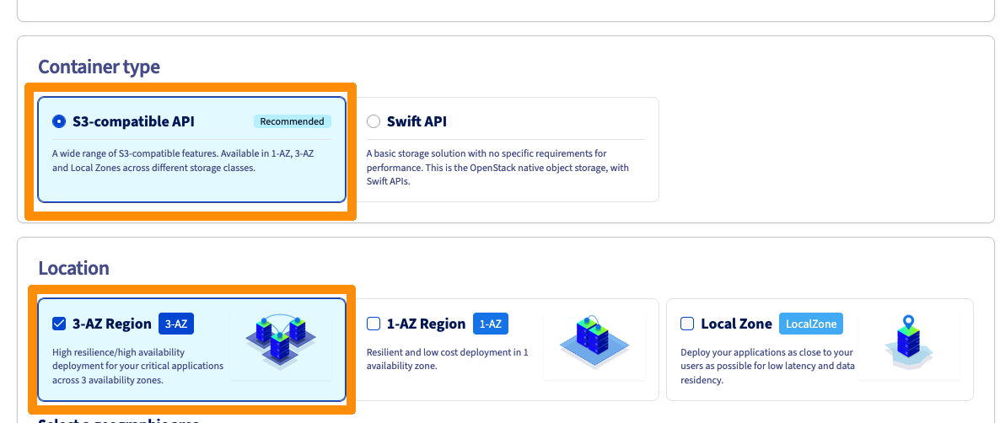{.thumbnail}

Selectionnez ensuite la région :
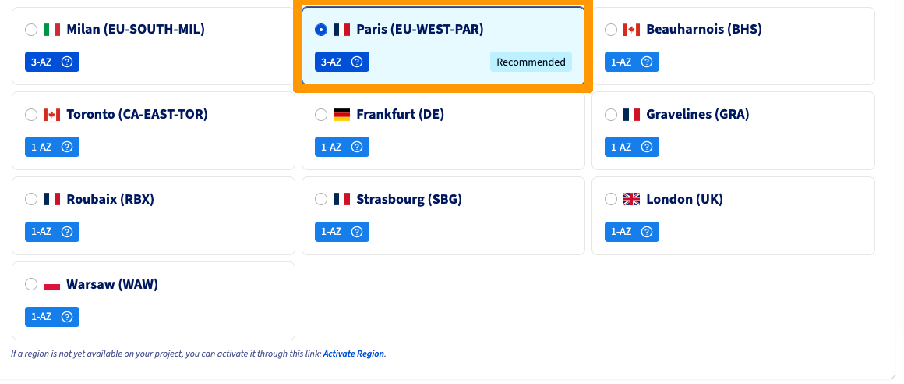{.thumbnail}

> **Warning**  
> Selectionnez une région différente de la région de votre cluster.

Activez ensuite les fonctionnalités suivantes :
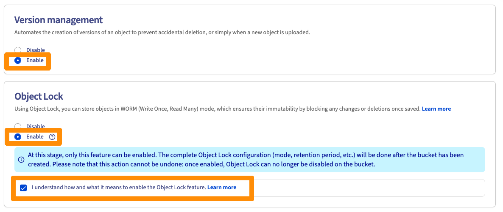{.thumbnail}

Désactivez le chiffrement :
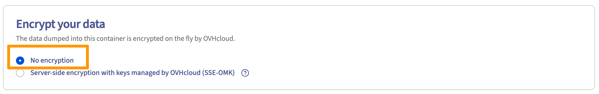{.thumbnail}

Ajoutez un utilisateur existant ou créez un utilisateur, par exemple *admin-mst-gra* :

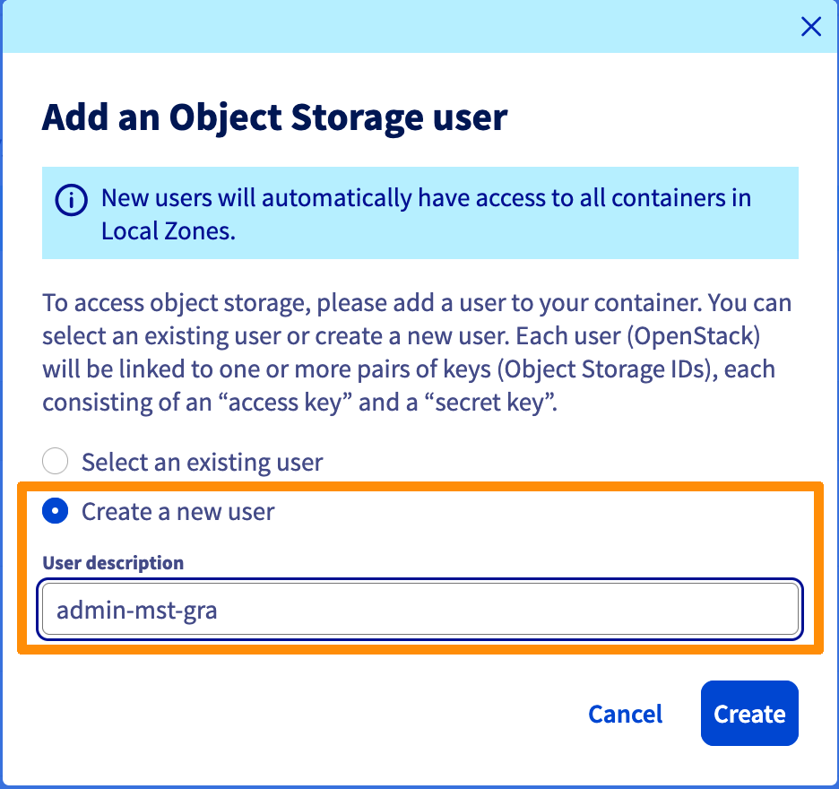{.thumbnail} 

Notez bien les informations suivantes : 

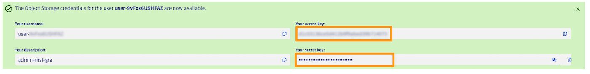{.thumbnail} 

Une fois que le container est crée rendez vous sur le tableau de bord et configurez la retention
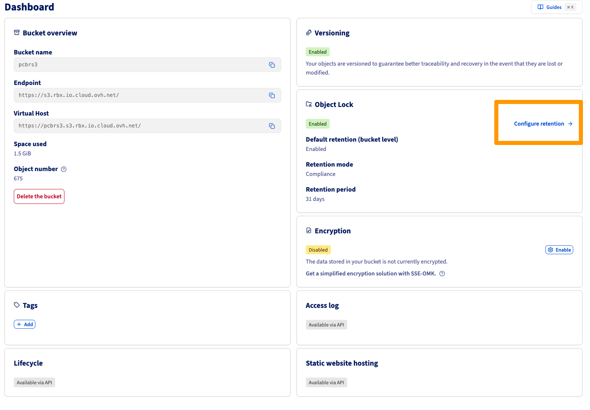{.thumbnail}
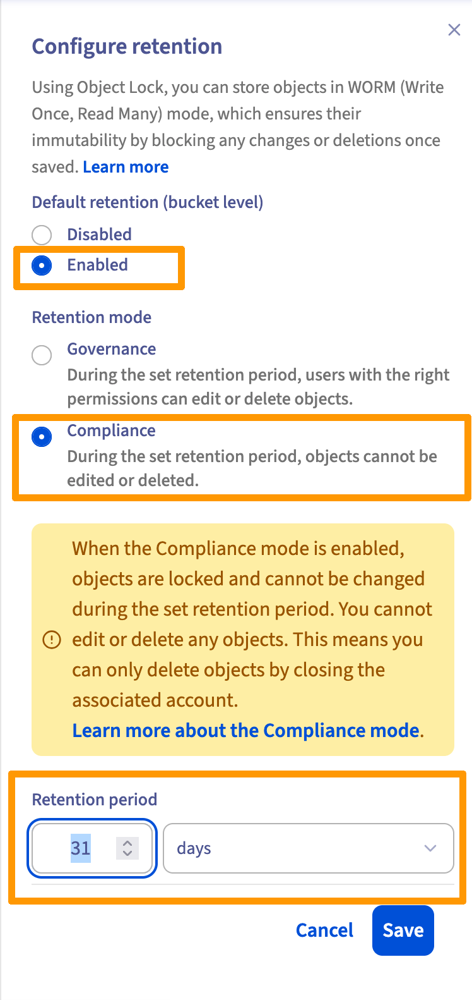{.thumbnail}

#### Configurez le le "bucket lifecycle"

- Expirer la version actuelle des objets après : 31 jours
- Expirer les versions précédentes/non actuelles des objets après : 1 jour
- Supprimer les marqueurs de suppression expirés : 1 jour
- Supprimer les téléchargements multipartites expirés/échoués/incomplets : 1 jour

Installez et configurez aws cli client [Object Storage - Premiers pas avec Object Storage - OVHcloud](https://help.ovhcloud.com/csm/fr-public-cloud-storage-s3-getting-started-object-storage?id=kb_article_view&sysparm_article=KB0047354#en-pratique)

Exécutez cette commande en personnalisant les variables 

```bash
BUCKET_NAME='prism-central-backup'
ENDPOINT_URL='https://s3.rbx.io.cloud.ovh.net/'
PROFILE='rbx'

aws s3api put-bucket-lifecycle-configuration \
  --bucket ${BUCKET_NAME} \
  --lifecycle-configuration '{
    "Rules": [
      {
        "ID": "ExpireCurrentVersions",
        "Status": "Enabled",
        "Expiration": {
          "Days": 31
        },
        "Filter": {}
      },
      {
        "ID": "ExpireNoncurrentVersions",
        "Status": "Enabled",
        "NoncurrentVersionExpiration": {
          "NoncurrentDays": 1
        },
        "Filter": {}
      },
      {
        "ID": "DeleteExpiredDeleteMarkers",
        "Status": "Enabled",
        "Expiration": {
          "ExpiredObjectDeleteMarker": true
        },
        "Filter": {}
      },
      {
        "ID": "AbortIncompleteMultipartUpload",
        "Status": "Enabled",
        "AbortIncompleteMultipartUpload": {
          "DaysAfterInitiation": 1
        },
        "Filter": {}
      }
    ]
  }' \
  --endpoint-url ${ENDPOINT_URL}
  --profile ${PROFILE}
```

## Procédure – Configuration du Point-in-Time Backup Prism Central

### Accès à la configuration

1. Connectez-vous à la console web **Prism Central**.
2. Depuis l’**Application Switcher**, sélectionnez l’application **Infrastructure**, puis cliquez sur l’icône **Settings**.
3. Cliquez sur **Prism Central Settings**, puis naviguez vers  
   **General > Prism Central Backups**.

4. Cliquez sur **Go to Point-in-Time Backup > Protect Now**.
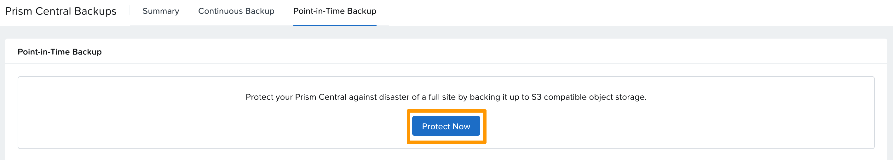{.thumbnail}

> **Note**  
> Le système ne supporte **qu’une seule cible de sauvegarde Point-in-Time à la fois**.  
> Si une sauvegarde Point-in-Time est déjà configurée, le bouton **Protect Now** n’apparaît pas.

---

### Configuration de la cible de sauvegarde

5. La fenêtre **Protect Prism Central** s’affiche et indique :
   - Les services dont les données sont sauvegardées
   - Les services non sauvegardés  

   Pour la liste détaillée, consultez :
   - *Supported Services for PCBR*
   - *Unsupported Services for PCBR – Implementation Considerations and Limitations*

6. Cliquez sur **Continue**, puis renseignez les paramètres suivants :

   - **Endpoint Type** : `Other S3-Compliant Object Store`
   - **IP Address or Host Name (HTTPS Only)** : Adresse IP ou nom d’hôte du stockage objet "Endpoint" sur le dashboard du container (sans https://)
   - **Bucket Name** : Nom du bucket
   - **Access Key** : Clé d’accès
   - **Secret Access Key** : Clé secrète
   - **Restore Point Objects (RPO)** : Fréquence de création des points de restauration (en heures)

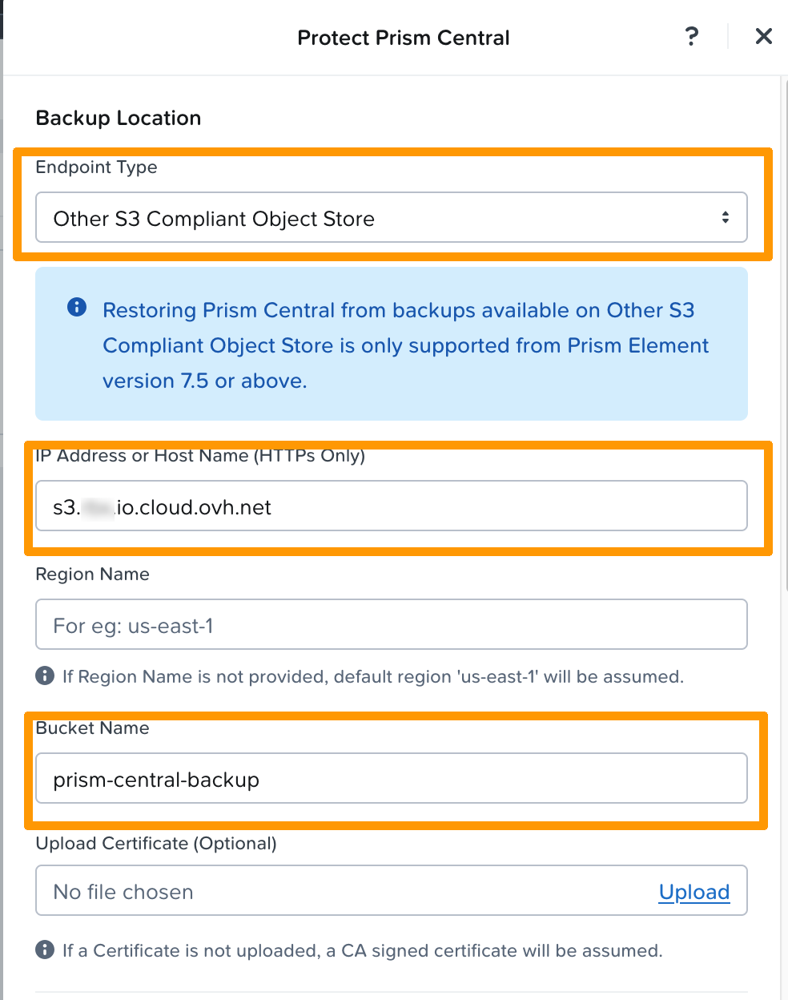{.thumbnail}
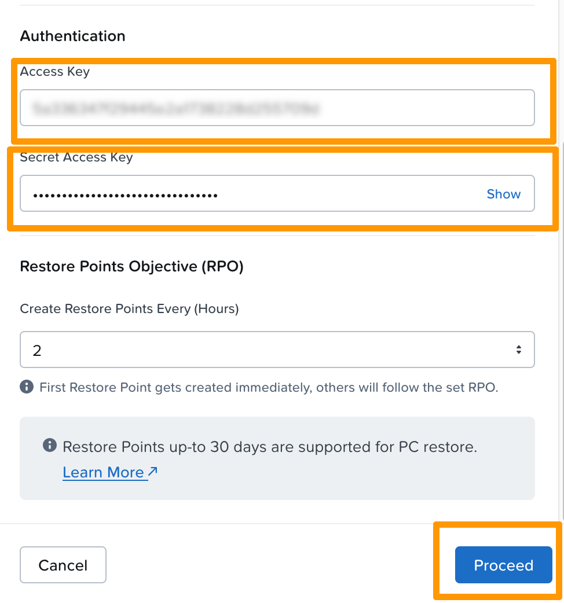{.thumbnail}
---

### Détails sur le RPO

- Le **RPO** correspond à la fréquence de création des points de restauration.
- Le **premier point de restauration est créé immédiatement**.
- Les valeurs supportées sont : `1, 2, 4, 6, 8, 12 ou 24 heures`.
- Jusqu’à **30 jours de points de restauration** sont conservés pour la restauration de Prism Central.


7. Cliquez sur **Proceed**.

---

### Synchronisation et état des sauvegardes

- Le système synchronise les données de configuration Prism Central vers le bucket S3.
- Pendant la synchronisation :
  - Le statut affiché est **Sync in Progress** dans le tableau de bord *Prism Central Backups*.
- Une fois la synchronisation terminée :
  - Le statut passe à **Synced**
  - La date et l’heure de la dernière synchronisation sont affichées

> **Note**  
> La première sauvegarde démarre immédiatement après la validation de la cible S3 et dure **au minimum 15 minutes**.

- Après la première sauvegarde :
  - Les synchronisations se poursuivent automatiquement
  - Les points de restauration sont créés selon le cycle RPO configuré

## Aller plus loin <a name="gofurther"></a>

[Prism pc.7.5 - Configuring Point-in-Time Backup to Generic S3-Compliant Object Store official documentation](https://portal.nutanix.com/page/documents/details?targetId=Prism-Central-Guide-vpc_7_5:mul-configuring-pointintime-backup-to-generic-s3-compliant-t.html)

Si vous avez besoin d'une formation ou d'une assistance technique pour la mise en oeuvre de nos solutions, contactez votre commercial ou cliquez sur [ce lien](/links/professional-services) pour obtenir un devis et demander une analyse personnalisée de votre projet à nos experts de l’équipe Professional Services.

Échangez avec notre [communauté d'utilisateurs](/links/community).

<sup>1</sup> : S3 est une marque déposée appartenant à Amazon Technologies, Inc. Les services de OVHcloud ne sont pas sponsorisés, approuvés, ou affiliés de quelque manière que ce soit.