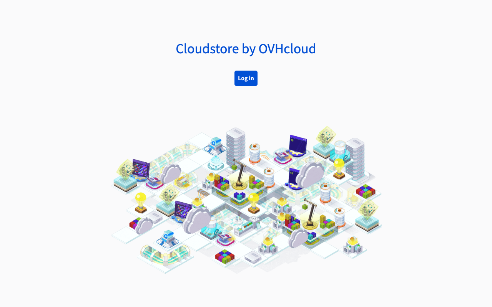
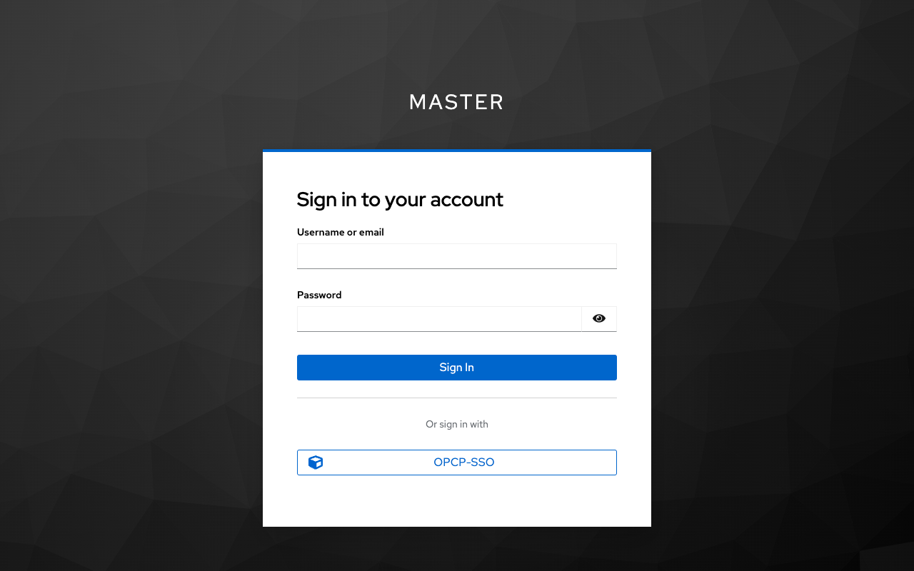
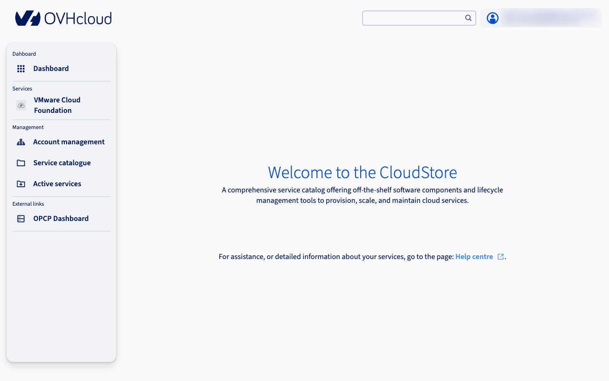
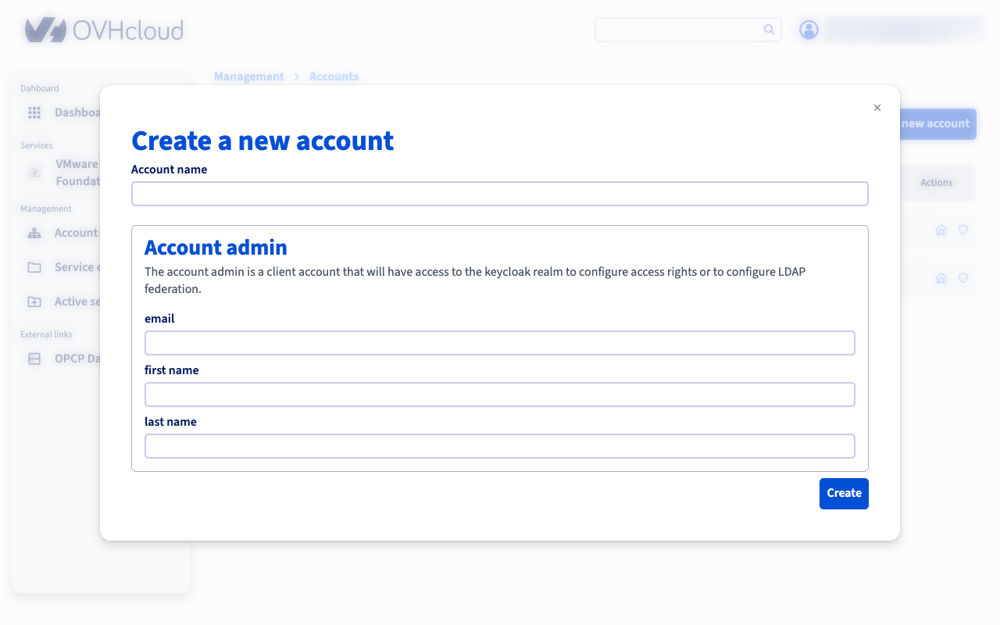
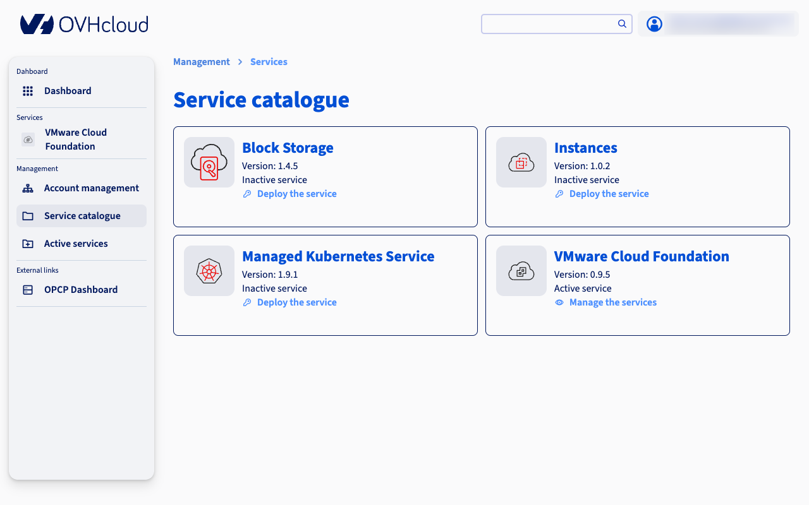
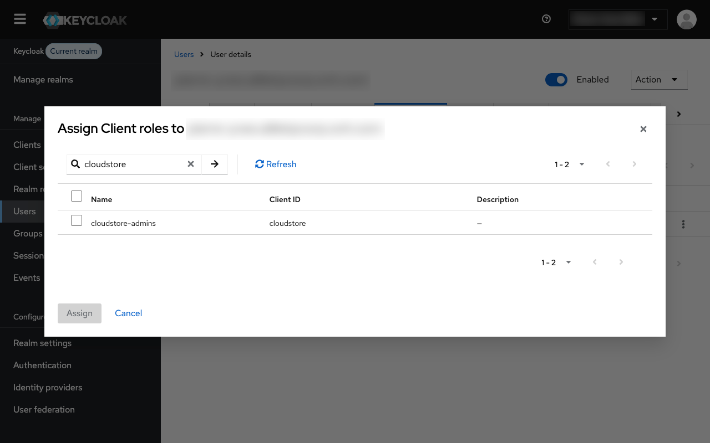

## Objectif

**Ce guide vous présente comment vous connecter à l'interface de gestion de votre CloudStore, comprendre ses concepts clés et effectuer les premières opérations : créer des comptes et déployer des services.**

Le **CloudStore** est un framework d'infrastructure de haut niveau déployé sur [On-Premise Cloud Platform (**OPCP**)](/pages/hosted_private_cloud/opcp/opcp-getting-started). Il fournit des services essentiels pour aider les fournisseurs cloud à déployer et gérer des solutions Cloud Native pour leurs clients via une plateforme basée sur un catalogue de services.

## Prérequis

- L'**URL** de l'interface de gestion de votre CloudStore, fournie lors de la livraison du service.
- Les identifiants de connexion (nom d'utilisateur et mot de passe) fournis lors de la livraison du service. Ces identifiants sont gérés par **Keycloak**, la solution de gestion des identités et des accès utilisée par la plateforme.

## En pratique

### Connexion au CloudStore

Accédez à l'**URL** fournie pour votre instance CloudStore. Une page de connexion s'affiche.

{.thumbnail}

Cliquez sur le bouton de connexion pour être redirigé vers la page d'authentification **Keycloak**. Deux options s'offrent à vous :

- Saisir vos identifiants directement dans le formulaire de connexion Keycloak.
- Utiliser le bouton `OPCP-SSO`{.action} pour vous authentifier via le Keycloak OPCP Core fédéré. Cette option permet aux utilisateurs déjà enregistrés dans OPCP Core de se connecter sans gérer un jeu d'identifiants supplémentaire.

{.thumbnail}

Une fois authentifié, l'interface obtient un jeton d'accès OIDC utilisé pour toutes les opérations suivantes.

### Tableau de bord CloudStore

Après connexion, vous êtes redirigé vers le tableau de bord du CloudStore.

{.thumbnail}

Depuis le tableau de bord, vous pouvez accéder aux sections suivantes :

- **Catalogue de services** : Parcourir et activer les services disponibles (par exemple, VCF).
- **Comptes** : Créer et gérer les comptes locataires pour vos clients ou équipes internes.
- **Contrôleurs et Apps** : Déployer et gérer les composants d'infrastructure de chaque service.
- **Gestion IAM** : Configurer les utilisateurs et les permissions dans Keycloak.

### Concepts clés

Avant d'utiliser le CloudStore, il est important de comprendre ses principaux concepts.

#### Personas

Le CloudStore distingue deux types d'utilisateurs :

- **Fournisseurs cloud** (IT admins, Service admins) : Clients OVHcloud qui exploitent la plateforme. Ils provisionnent l'infrastructure, déploient les services et gèrent les comptes.
- **Utilisateurs cloud** (End users) : Clients des fournisseurs cloud qui consomment les services déployés pour eux via la **Landing Zone**.

| Persona | Responsabilités |
|---------|-----------------|
| IT admin | Créer des comptes, activer des services, déployer des apps |
| Service admin | Gérer un service spécifique, déployer son contrôleur et ses apps |
| Account admin | Gérer la configuration de son compte |
| End user | Accéder aux apps via la Landing Zone |

#### Le modèle contrôleur/app

Chaque service dans le CloudStore suit une architecture **contrôleur/app** :

- Le **contrôleur** (controlplane) est déployé en premier. Il gère le cycle de vie des apps et orchestre les opérations multi-locataires. Un seul contrôleur peut gérer plusieurs apps réparties sur différents comptes.
- Les **apps** (dataplane) sont les charges de travail déployées pour un compte spécifique. Chaque app est isolée dans un seul compte et ne peut pas être partagée entre les comptes.

Ce modèle permet aux fournisseurs cloud d'offrir le même service à plusieurs clients, chacun disposant de sa propre instance d'app isolée tout en partageant la même infrastructure de contrôleur.

### Création d'un compte

Un **compte** représente une entreprise ou un département. Chaque compte dispose de son propre realm Keycloak, garantissant une isolation IAM complète. Les comptes doivent être créés avant de déployer des apps, car celles-ci sont toujours rattachées à un compte.

Pour créer un compte :

1. Depuis le tableau de bord du CloudStore, accédez à la section `Comptes`{.action}.
2. Cliquez sur `Créer un compte`{.action}.
3. Remplissez les champs requis : nom du compte, nom complet de l'administrateur et adresse e-mail de l'administrateur.

    {.thumbnail}

4. Validez le formulaire.

La plateforme effectue automatiquement les actions suivantes :

- Création d'un realm Keycloak dédié nommé `account-{name}`.
- Création d'un utilisateur administrateur avec le rôle `account-admin`.
- Configuration d'un mot de passe temporaire (l'administrateur du compte sera invité à le modifier lors de sa première connexion).
- Configuration d'un client `landing-zone` pour l'accès des utilisateurs finaux.

### Déploiement d'un service

Le déploiement d'un service se fait en 2 étapes : commencez par déployer le **contrôleur**, puis déployez une ou plusieurs **apps** pour des comptes spécifiques.

#### Étape 1 — Déployer un contrôleur

1. Accédez au `Catalogue de services`{.action} depuis le tableau de bord.

    {.thumbnail}

2. Sélectionnez le service que vous souhaitez activer.
3. Cliquez sur `Activer le service`{.action}.
4. Choisissez la version et configurez les propriétés requises.
5. Sélectionnez les hôtes sur lesquels le contrôleur sera déployé.
6. Validez le formulaire.

> [!primary]
>
> Le déploiement du contrôleur est **asynchrone**. L'interface confirmera que le déploiement a démarré, mais le provisionnement s'effectue en arrière-plan via Kubernetes et Terraform. Vous pouvez suivre l'état du déploiement depuis la page des contrôleurs.
>

#### Étape 2 — Déployer une app

Une fois le contrôleur actif et au moins un compte créé :

1. Accédez à la page du contrôleur.
2. Cliquez sur `Déployer une app`{.action}.
3. Sélectionnez le compte cible.
4. Choisissez la version et configurez les propriétés requises.
5. Sélectionnez les hôtes pour le déploiement de l'app.
6. Validez le formulaire.

Lors du déploiement d'une app, la plateforme crée automatiquement les ressources Keycloak nécessaires (client-id, rôles et groupes) dans le realm du compte cible, garantissant que seuls les utilisateurs autorisés de ce compte puissent accéder à l'app.

> [!primary]
>
> Comme pour le contrôleur, le déploiement d'une app est **asynchrone**. Le provisionnement de l'infrastructure est géré par Kubernetes et Terraform en arrière-plan.
>

### Mise à l'échelle de la capacité

Vous pouvez ajouter ou retirer des hôtes d'un contrôleur ou d'une app déployée pour ajuster la capacité.

1. Accédez à la page du contrôleur ou de l'app.
2. Cliquez sur `Étendre la capacité`{.action}.
3. Sélectionnez les hôtes à ajouter.
4. Validez le formulaire.

L'opération de mise à l'échelle est asynchrone. Kubernetes réconcilie la configuration et provisionne les ressources sur les hôtes mis à jour.

### Authentification et niveaux d'accès

Le CloudStore utilise un modèle de fédération Keycloak en couches qui reflète l'architecture de la plateforme :

| Niveau | Instance Keycloak | Utilisateurs | Rôle |
|--------|-------------------|--------------|------|
| L1 | OPCP Core Keycloak | DC operators, Super admins | Identité au niveau infrastructure |
| L2 | CloudStore Keycloak | IT admins, Service admins | Gestion de la plateforme |
| L3 | Realms Keycloak par compte | End users | Accès aux applications |

- **Keycloak L2** est fédéré avec **L1** (OPCP Core). Les droits accordés sur les projets OpenStack au niveau L1 sont ainsi propagés au niveau L2.
- **Keycloak L3** est une instance indépendante gérée par l'API CloudStore. Chaque compte dispose de son propre realm isolé.

#### Gestion de l'IAM sur le Keycloak CloudStore (L2)

Pour pouvoir gérer les utilisateurs, rôles et groupes sur le Keycloak CloudStore (L2), vous devez au préalable attribuer le rôle `cloudstore-admins` à votre utilisateur dans le **Keycloak OPCP Core (L1)**.

1. Connectez-vous à la console d'administration du Keycloak OPCP Core (L1).
2. Accédez à l'utilisateur auquel vous souhaitez accorder les droits de gestion IAM.
3. Dans l'onglet `Role mappings`{.action}, attribuez le rôle client `cloudstore-admins`.

{.thumbnail}

Une fois ce rôle attribué, l'utilisateur disposera des permissions nécessaires pour administrer le Keycloak CloudStore (L2), y compris la gestion des realms, clients, utilisateurs et rôles.

### La Landing Zone

La **Landing Zone** est l'interface destinée aux utilisateurs finaux (utilisateurs cloud). Elle offre une vue simplifiée des apps déployées pour leur compte.

Les utilisateurs finaux s'authentifient via le realm Keycloak spécifique à leur compte (L3) et ne peuvent accéder qu'aux apps déployées pour leur compte. La Landing Zone récupère la liste des apps accessibles et les filtre en fonction des permissions de l'utilisateur.

## Aller plus loin

Si vous avez besoin d'une formation ou d'une assistance technique pour la mise en œuvre de nos solutions, contactez votre commercial ou cliquez sur [ce lien](/links/professional-services) pour obtenir un devis et demander une analyse personnalisée de votre projet à nos experts de l'équipe Professional Services.

Échangez avec notre [communauté d'utilisateurs](/links/community).
