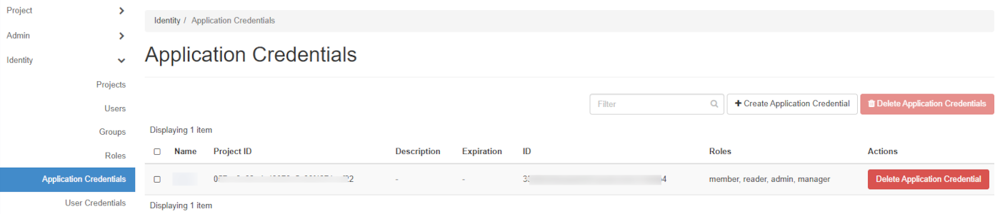
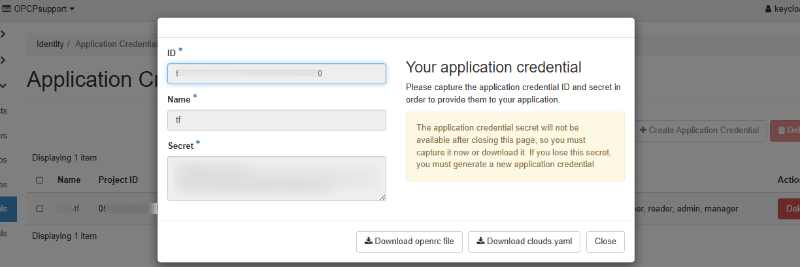

## Objectif

[Terraform](https://www.terraform.io/) est un outil open source d'**Infrastructure as Code (IaC)** développé par [HashiCorp](https://www.hashicorp.com/). Il permet de décrire et de provisionner votre infrastructure de manière déclarative à partir de fichiers de configuration, écrits en *HashiCorp Configuration Language* (HCL).

L'offre **OPCP** reposant sur **OpenStack**, vous pouvez utiliser le **provider Terraform OpenStack** afin d'automatiser le déploiement de vos ressources : instances, réseaux, volumes, paires de clés, etc.

> [!primary]
> Ce guide est également valable avec [**OpenTofu**](https://opentofu.org/), le fork open source de Terraform maintenu par la Linux Foundation. OpenTofu est compatible avec la syntaxe HCL et les providers Terraform : il vous suffit de remplacer la commande `terraform` par `tofu` dans les exemples ci-dessous.

**Ce guide détaille les étapes nécessaires pour générer une *Application Credential* depuis Horizon, configurer Terraform et déployer un premier serveur sur votre infrastructure OPCP.**

## Prérequis

- Disposer d'un service [OPCP](/links/hosted-private-cloud/onprem-cloud-platform) actif.
- Posséder un **compte utilisateur** avec les droits suffisants pour se connecter à Horizon sur l'offre OPCP.
- Avoir installé [Terraform](https://developer.hashicorp.com/terraform/install) (version >= 1.0) ou [OpenTofu](https://opentofu.org/docs/intro/install/) sur votre poste de travail.
- Disposer d'une **paire de clés SSH** sur votre poste local pour accéder à votre instance.
- Avoir préalablement créé un **réseau privé** dans votre projet OPCP (voir le guide « [Comment installer une instance depuis l'interface Horizon](/pages/hosted_private_cloud/opcp/how-to-setup-instance) »).

## Sommaire

- [1. Création d'une Application Credential depuis Horizon](#création-dune-application-credential-depuis-horizon)
- [2. Préparation de l'environnement Terraform](#préparation-de-lenvironnement-terraform)
- [3. Création d'un serveur](#création-dun-serveur)
- [4. Configurations complémentaires sur le nœud (RAID, LACP)](#configurations-complémentaires-sur-le-nœud-raid-lacp)
- [5. Suppression de l'infrastructure](#suppression-de-linfrastructure)
- [6. Dépannage](#dépannage)
- [7. Références](#références)

## En pratique

### 1. Création d'une Application Credential depuis Horizon

Pour permettre à Terraform de communiquer avec votre infrastructure OPCP, il est nécessaire de générer un couple **Application Credential** (`id` / `secret`) depuis l'interface Horizon. Ce mécanisme évite l'utilisation directe de vos identifiants Keycloak et fournit une authentification dédiée à vos automatisations, avec un périmètre de droits limité au projet courant.

> [!warning]
> Une `Application Credential` est automatiquement supprimée lorsque l'utilisateur qui l'a créée est révoqué. Pour éviter toute perte d'accès dans un workflow d'automatisation, ne générez pas d'Application Credential depuis un compte utilisateur nominatif ou facilement révocable ; privilégiez un compte dédié.

#### Connexion à Horizon

Connectez-vous à l'interface **Horizon** de votre environnement OPCP, puis sélectionnez le **projet** dans lequel vous souhaitez déployer vos ressources via Terraform. Pour plus d'informations, consultez le guide « [Mise en route de votre OPCP](/pages/hosted_private_cloud/opcp/opcp-getting-started) ».

#### Création de l'Application Credential

Dans le menu de gauche, cliquez sur `Identity`{.action}, puis sur `Application Credentials`{.action}.

{.thumbnail}

Cliquez sur `+ Create Application Credential`{.action}.

{.thumbnail}

Renseignez les champs suivants :

| Champ | Description |
|--------|--------------|
| **Name** | Saisissez un nom pour votre Application Credential (ex. : *terraform-cred*). |
| **Description** | Optionnel. Ajoutez une description si nécessaire. |
| **Secret** | Optionnel. Si non renseigné, un secret sera généré automatiquement. |
| **Expiration Date / Expiration Time** | Optionnel. Définissez une date d'expiration. |
| **Roles** | Sélectionnez les rôles à associer à la credential (ex. : *member*, *admin*). |
| **Access Rules** | Optionnel. Permet de restreindre les actions autorisées. |
| **Unrestricted** | Laissez décoché pour limiter les actions possibles. |

Cliquez sur `Create Application Credential`{.action}.

> [!warning]
> Une fois la fenêtre fermée, le **secret ne sera plus accessible**. Téléchargez le fichier `clouds.yaml` ou `openrc` proposé par Horizon, ou copiez les valeurs `id` et `secret` dans un emplacement sécurisé.

{.thumbnail}

> [!primary]
> Pour la suite de ce tutoriel, **téléchargez le fichier `openrc`** : il sera utilisé à l'étape suivante pour authentifier Terraform auprès de votre infrastructure OPCP.

### 2. Préparation de l'environnement Terraform

#### Création du dossier de travail

Créez un répertoire dédié à votre projet Terraform :

```bash
mkdir terraform-opcp && cd terraform-opcp
```

#### Définition du provider OpenStack

Dans un fichier nommé `provider.tf`, ajoutez les lignes suivantes :

```hcl
terraform {
  required_version = ">= 1.0"
  required_providers {
    openstack = {
      source  = "terraform-provider-openstack/openstack"
      version = ">= 3.0.0"
    }
  }
}

provider "openstack" {
  
}
```

Aucun paramètre n'est nécessaire dans le bloc `provider`{.action} : le provider OpenStack récupère automatiquement les informations d'authentification depuis les variables d'environnement `OS_*`.

#### Chargement des variables d'environnement OpenStack

Lors de la création de votre Application Credential, Horizon vous a proposé le téléchargement d'un fichier `clouds.yaml` ou `openrc`. Le plus simple est de charger ce fichier `openrc.sh` dans votre shell avant d'exécuter Terraform :

```bash
source openrc.sh
```

> [!primary]
> Le fichier `openrc.sh` exporte notamment `OS_AUTH_URL`, `OS_REGION_NAME`, `OS_APPLICATION_CREDENTIAL_ID` et `OS_APPLICATION_CREDENTIAL_SECRET`. Ces variables seront automatiquement utilisées par le provider OpenStack de Terraform.

#### Initialisation

Téléchargez les plugins du provider OpenStack :

```bash
terraform init
```

### 3. Création d'un serveur

Dans un fichier `main.tf`, déclarez les ressources nécessaires pour créer une instance attachée à un réseau privé existant :

```hcl
# Variables liées à l'instance
variable "instance_name" {
  description = "Nom de l'instance qui sera créée dans OPCP"
  type        = string
  default     = "instance-terraform-name"
}

variable "image_name" {
  description = "Nom de l'image à utiliser pour l'instance (ex: Debian 12 OPCP)"
  type        = string
  default     = "Debian 12 OPCP"
}

variable "flavor_name" {
  description = "Flavor baremetal définissant les ressources matérielles de l'instance (ex: scale-1, scale-2, etc.)"
  type        = string
  default     = "scale-1"
}

variable "network_name" {
  description = "Nom du réseau existant auquel l'instance sera rattachée"
  type        = string
  default     = "<your-network-name>"
}

variable "key_name" {
  description = "Nom de la paire de clés SSH à associer à l'instance"
  type        = string
  default     = "terraform-key"
}

# Création d'une instance
resource "openstack_compute_instance_v2" "terraform_instance" {
  name        = var.instance_name
  image_name  = var.image_name
  flavor_name = var.flavor_name
  key_pair    = var.key_name

  network {
    name = var.network_name
  }

  lifecycle {
    # Évite que Terraform détecte une dérive lorsque l'image de base est mise à jour
    ignore_changes = [
      image_name
    ]
  }

  # Métadonnées utiles
  metadata = {
    environment = "production"
    managed_by  = "terraform"
  }

  # Timeouts plus longs (le provisioning baremetal est lent)
  timeouts {
    create = "60m"
    delete = "30m"
  }
}

# Sorties utiles après création
output "instance_id" {
  value = openstack_compute_instance_v2.terraform_instance.id
}

output "instance_ip" {
  value = openstack_compute_instance_v2.terraform_instance.access_ip_v4
}
```

> [!primary]
> Les noms d'images, de flavors et de réseaux disponibles peuvent être listés depuis Horizon ou avec la CLI OpenStack (`openstack image list`, `openstack flavor list`, `openstack network list`). Pour configurer la CLI, consultez le guide « [Comment utiliser les API et obtenir les informations d'identification](/pages/hosted_private_cloud/opcp/how-to-use-api-and-get-credentials) ».

#### Vérification du plan

Avant tout déploiement, prévisualisez les actions qui seront effectuées :

```bash
terraform plan
```

#### Application de la configuration

Déployez l'instance avec la commande suivante :

```bash
terraform apply
```

Confirmez avec `yes` lorsque Terraform vous le demande. Une fois la création terminée, l'instance apparaît dans la section `Compute`{.action} > `Instances`{.action} de l'interface Horizon.

### 4. Configurations complémentaires sur le nœud (RAID, LACP)

Certaines configurations doivent être appliquées **sur le nœud baremetal** avant le déploiement de l'instance et ne sont pas couvertes par le provider Terraform OpenStack. Elles nécessitent des droits **admin** Ironic (ou des nœuds transférés dans votre projet) et restent à effectuer via la CLI OpenStack.

> [!primary]
> **RAID logiciel** : pour configurer un RAID logiciel sur un nœud baremetal, consultez le guide « [Comment configurer un RAID logiciel sur un nœud](/pages/hosted_private_cloud/opcp/how-to-setup-softraid-on-node) ». L'attribut `target_raid_config` n'est pas exposé par la ressource `openstack_baremetal_node_v1`. Cette opération est à réaliser **avant** le `terraform apply` qui déploie l'instance, en ciblant ensuite le nœud configuré via `availability_zone = "nova::<node-id>"`.

> [!primary]
> **LACP / bonding** : pour agréger plusieurs interfaces réseau d'un nœud, consultez le guide « [Comment configurer LACP sur un nœud](/pages/hosted_private_cloud/opcp/how-to-setup-lacp-on-node) ». La configuration des ports baremetal et du bonding n'est pas gérable de manière déclarative par le provider Terraform OpenStack. Cette opération est à réaliser **avant** le `terraform apply` qui déploie l'instance.

### 5. Suppression de l'infrastructure

Pour supprimer l'ensemble des ressources créées via Terraform :

```bash
terraform destroy
```

> [!warning]
> `terraform destroy` ne réinitialise pas les configurations RAID ou LACP appliquées sur le nœud. Pour les retirer, suivez la section dédiée du guide correspondant via la CLI OpenStack.

### 6. Dépannage

| Problème | Cause possible | Solution |
|-----------|----------------|-----------|
| `Authentication failed` | Mauvais `application_credential_id` ou `secret` | Vérifiez les identifiants dans Horizon (`Identity`{.action} > `Application Credentials`{.action}). |
| `Could not find image` | Le nom de l'image ne correspond pas | Listez les images disponibles via `openstack image list` ou depuis Horizon. |
| `No suitable endpoint could be found` | Mauvaise URL `auth_url` ou région inexistante | Vérifiez l'URL Keystone et la région dans `Project`{.action} > `API Access`{.action}. |
| `Network not found` | Réseau privé absent dans le projet | Créez un réseau privé au préalable depuis Horizon (`Network`{.action} > `Networks`{.action}). |

### 7. Références

- [Documentation officielle Terraform](https://developer.hashicorp.com/terraform)
- [Documentation officielle OpenTofu](https://opentofu.org/docs/)
- [Provider Terraform OpenStack](https://registry.terraform.io/providers/terraform-provider-openstack/openstack/latest/docs)
- [Ressource openstack_compute_instance_v2](https://registry.terraform.io/providers/terraform-provider-openstack/openstack/latest/docs/resources/compute_instance_v2)
- [OpenStack Application Credentials](https://docs.openstack.org/keystone/latest/user/application_credentials.html)

## Aller plus loin

Pour une formation ou une assistance technique sur la mise en œuvre de nos solutions, contactez votre commercial ou consultez la page [Professional Services](/links/professional-services) pour obtenir un devis et faire analyser votre projet par nos experts.

Échangez avec notre [communauté d'utilisateurs](/links/community).
