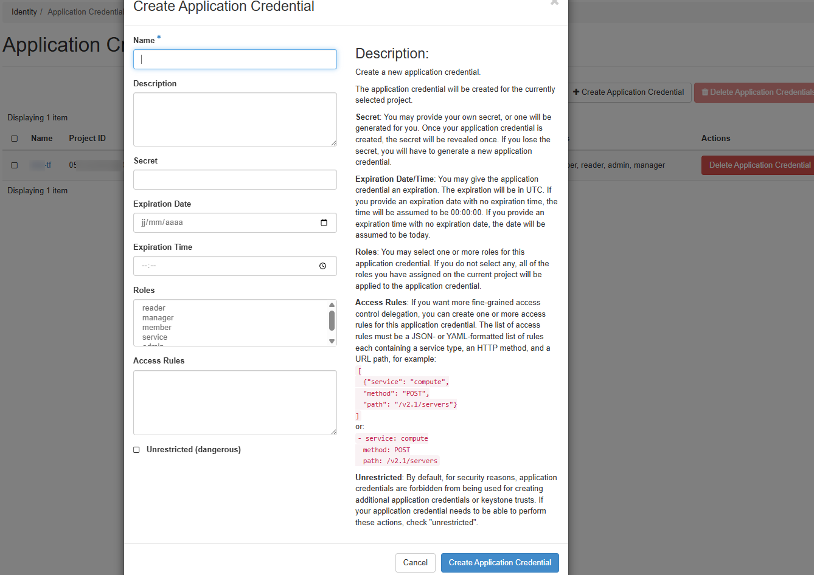

## Objective

[Terraform](https://www.terraform.io/) is an open source **Infrastructure as Code (IaC)** tool developed by [HashiCorp](https://www.hashicorp.com/). It allows you to describe and provision your infrastructure declaratively from configuration files written in *HashiCorp Configuration Language* (HCL).

Since the **OPCP** offer is based on **OpenStack**, you can use the **Terraform OpenStack provider** to automate the deployment of your resources: instances, networks, volumes, key pairs, etc.

> [!primary]
> This guide also applies to [**OpenTofu**](https://opentofu.org/), the open source fork of Terraform maintained by the Linux Foundation. OpenTofu is compatible with the HCL syntax and Terraform providers: simply replace the `terraform` command with `tofu` in the examples below.

**This guide details the steps required to generate an *Application Credential* from Horizon, configure Terraform and deploy a first server on your OPCP infrastructure.**

## Requirements

- An active [OPCP](/links/hosted-private-cloud/onprem-cloud-platform) service.
- A **user account** with sufficient rights to log in to Horizon on the OPCP offer.
- [Terraform installed](https://developer.hashicorp.com/terraform/install) (version >= 1.0) or [OpenTofu](https://opentofu.org/docs/intro/install/) on your workstation.
- An **SSH key pair** on your local workstation to access your instance.
- A **private network** previously created in your OPCP project (see the guide [How to install an instance from the Horizon interface](/pages/hosted_private_cloud/opcp/opcp-setup-instance)).

## Instructions

### 1. Creating an Application Credential from Horizon

To allow Terraform to communicate with your OPCP infrastructure, you need to generate an **Application Credential** pair (`id` / `secret`) from the Horizon interface. This mechanism avoids using your Keycloak credentials directly and provides dedicated authentication for your automation workflows, with a permissions scope limited to the current project.

#### Logging in to Horizon

Log in to the **Horizon** interface of your OPCP environment, then select the **project** in which you want to deploy your resources via Terraform. For more information, refer to the [Getting started with your OPCP](/pages/hosted_private_cloud/opcp/opcp-getting-started) guide.

#### Creating the Application Credential

In the left-hand menu, click on `Identity`{.action}, then on `Application Credentials`{.action}.<br><br>
{.thumbnail}

Click on `+ Create Application Credential`{.action}.<br><br>
{.thumbnail}

Fill in the following fields:

| Field | Description |
|--------|--------------|
| **Name** | Enter a name for your Application Credential (e.g.: *terraform-cred*). |
| **Description** | Optional. Add a description if needed. |
| **Secret** | Optional. If left blank, a secret will be generated automatically. |
| **Expiration Date / Expiration Time** | Optional. Set an expiration date. |
| **Roles** | Select the roles to associate with the credential (e.g.: *member*, *admin*). |
| **Access Rules** | Optional. Allows you to restrict the authorised actions. |
| **Unrestricted** | Leave unchecked to limit the possible actions. |

Click on `Create Application Credential`{.action}.

> [!warning]
> Once the window is closed, the **secret will no longer be accessible**. Download the `clouds.yaml` or `openrc` file offered by Horizon, or copy the `id` and `secret` values to a secure location.

{.thumbnail}

> [!primary]
> For the rest of this tutorial, **download the `openrc` file**: it will be used in the next step to authenticate Terraform against your OPCP infrastructure.

### 2. Preparing the Terraform environment

#### Creating the working directory

Create a directory dedicated to your Terraform project:

```bash
mkdir terraform-opcp && cd terraform-opcp
```

#### Defining the OpenStack provider

In a file named `provider.tf`, add the following lines:

```hcl
terraform {
  required_version = ">= 1.0"
  required_providers {
    openstack = {
      source  = "terraform-provider-openstack/openstack"
      version = ">= 3.0.0"
    }
  }
}

provider "openstack" {
  
}
```

No parameters are required in the `provider`{.action} block: the OpenStack provider automatically retrieves the authentication information from the `OS_*` environment variables.

#### Loading OpenStack environment variables

When you created your Application Credential, Horizon offered to download a `clouds.yaml` or `openrc` file. The simplest approach is to source this `openrc.sh` file in your shell before running Terraform:

```bash
source openrc.sh
```

> [!primary]
> The `openrc.sh` file exports `OS_AUTH_URL`, `OS_REGION_NAME`, `OS_APPLICATION_CREDENTIAL_ID` and `OS_APPLICATION_CREDENTIAL_SECRET`, among others. These variables will automatically be used by the Terraform OpenStack provider.

#### Initialisation

Download the OpenStack provider plugins:

```bash
terraform init
```

### 3. Creating a server

In a `main.tf` file, declare the resources required to create an instance attached to an existing private network:

```hcl
# Variables related to the instance
variable "instance_name" {
  description = "Name of the instance that will be created in OPCP"
  type        = string
  default     = "instance-terraform-name"
}

variable "image_name" {
  description = "Name of the image to use for the instance (e.g.: Debian 12 OPCP)"
  type        = string
  default     = "Debian 12 OPCP"
}

variable "flavor_name" {
  description = "Baremetal flavor defining the hardware resources of the instance (e.g.: scale-1, scale-2, etc.)"
  type        = string
  default     = "scale-1"
}

variable "network_name" {
  description = "Name of the existing network to which the instance will be attached"
  type        = string
  default     = "<your-network-name>"
}

variable "key_name" {
  description = "Name of the SSH key pair to associate with the instance"
  type        = string
  default     = "terraform-key"
}

# Creating an instance
resource "openstack_compute_instance_v2" "terraform_instance" {
  name        = var.instance_name
  image_name  = var.image_name
  flavor_name = var.flavor_name
  key_pair    = var.key_name

  network {
    name = var.network_name
  }

  lifecycle {
    # Prevents Terraform from detecting drift when the base image is updated
    ignore_changes = [
      image_name
    ]
  }

  # Useful metadata
  metadata = {
    environment = "production"
    managed_by  = "terraform"
  }

  # Longer timeouts (baremetal provisioning is slow)
  timeouts {
    create = "60m"
    delete = "30m"
  }
}

# Useful outputs after creation
output "instance_id" {
  value = openstack_compute_instance_v2.terraform_instance.id
}

output "instance_ip" {
  value = openstack_compute_instance_v2.terraform_instance.access_ip_v4
}
```

> [!primary]
> The names of available images, flavors and networks can be listed from Horizon or with the OpenStack CLI (`openstack image list`, `openstack flavor list`, `openstack network list`). To configure the CLI, refer to the guide [How to use the API and get credentials](/pages/hosted_private_cloud/opcp/opcp-use-api-get-credentials).

#### Reviewing the plan

Before any deployment, preview the actions that will be performed:

```bash
terraform plan
```

#### Applying the configuration

Deploy the instance with the following command:

```bash
terraform apply
```

Confirm with `yes` when Terraform asks you to. Once the creation is complete, the instance is visible in the Horizon interface, in the `Compute`{.action} > `Instances`{.action} section.

### 4. Additional node-level configurations (RAID, LACP)

Some configurations must be applied **on the baremetal node** before deploying the instance and are not covered by the Terraform OpenStack provider. They require **admin** Ironic rights (or nodes transferred to your project) and must be performed via the OpenStack CLI.

> [!primary]
> **Software RAID**: to configure software RAID on a baremetal node, refer to the guide [How to set up software RAID on a node](/pages/hosted_private_cloud/opcp/how-to-setup-softraid-on-node). The `target_raid_config` attribute is not exposed by the `openstack_baremetal_node_v1` resource. This operation must be performed **before** the `terraform apply` that deploys the instance, and the configured node should then be targeted via `availability_zone = "nova::<node-id>"`.

> [!primary]
> **LACP / bonding**: to aggregate several network interfaces of a node, refer to the guide [How to set up LACP on a node](/pages/hosted_private_cloud/opcp/how-to-setup-lacp-on-node). Baremetal port and bonding configuration cannot be managed declaratively by the Terraform OpenStack provider. This operation must be performed **before** the `terraform apply` that deploys the instance.

### 5. Removing the infrastructure

To delete all resources created via Terraform:

```bash
terraform destroy
```

> [!warning]
> `terraform destroy` does not reset the RAID or LACP configurations applied to the node. To remove them, follow the dedicated section of the corresponding guide using the OpenStack CLI.

### 6. Troubleshooting

| Issue | Possible cause | Solution |
|-----------|----------------|-----------|
| `Authentication failed` | Wrong `application_credential_id` or `secret` | Check the credentials in Horizon (`Identity`{.action} > `Application Credentials`{.action}). |
| `Could not find image` | The image name does not match | List the available images via `openstack image list` or from Horizon. |
| `No suitable endpoint could be found` | Wrong `auth_url` URL or non-existent region | Check the Keystone URL and the region in `Project`{.action} > `API Access`{.action}. |
| `Network not found` | Private network missing in the project | Create a private network beforehand from Horizon (`Network`{.action} > `Networks`{.action}). |

### 7. References

- [Official Terraform documentation](https://developer.hashicorp.com/terraform)
- [Official OpenTofu documentation](https://opentofu.org/docs/)
- [Terraform OpenStack provider](https://registry.terraform.io/providers/terraform-provider-openstack/openstack/latest/docs)
- [openstack_compute_instance_v2 resource](https://registry.terraform.io/providers/terraform-provider-openstack/openstack/latest/docs/resources/compute_instance_v2)
- [OpenStack Application Credentials](https://docs.openstack.org/keystone/latest/user/application_credentials.html)

## Go further

If you need training or technical assistance for the implementation of our solutions, contact your sales representative or click [this link](/links/professional-services) to request a quote and have your project analyzed by our Professional Services team experts.

Join our [community of users](/links/community).
